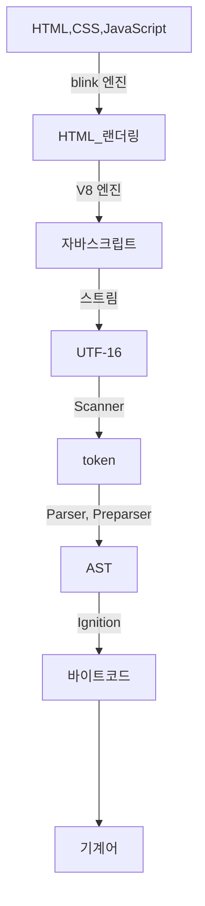

# 자바스크립트 컴파일 과정

<!-- TODO: 출간 보류 -->

:::danger 경고

기준은 V8 엔진입니다. V8 엔진을 기준으로 설명하는 이유는 프론트엔드 입장에서 가장 점유율이 높은 브라우저가 크롬이고 또 다른 브라우저를 사용하더라도 V8엔진 기반으로 활용하고 있습니다. 자바스크립트를 백엔드 엔지니어링을 위해서 사용할 때 2023년 가장 높은 점유율은 여전히 node.js입니다. 그리고 node.js의 경우 V8엔진을 활용하고 있습니다. 또 새로운 런타임인 deno의 경우 Rust로 porting한 V8엔진을 활용하고 있습니다. 참고로 bun은 WebKit으로 만들어져 있어서 상세 스펙이 다를 수 있습니다.

이 문서는 더욱더 자세한 내용으로 보완하고 추가될 예정입니다.

모든 설명에 V8 엔진 스펙을 직접 인용하기 전까지는 이 문서를 신뢰할 수 없습니다.

<!-- 자바스크립트는 다양한 자바스크립트 엔진을 활용하고 있습니다. 그래서 임의의 표준으로 V8엔진을 활용할 것입니다. -->

브라우저 랜더링 과정에 대한 설명은 생략했습니다.

:::

## `tl;dr`

- 자바스크립트 컴파일 과정에서 제일 중요한 것은 바이트코드를 확보하고 최적화하는 것입니다.

https://astexplorer.net/

AST를 볼수 있는 웹사이트입니다. 대단합니다.

## 시작

의외로 자바스크립트의 기초중 기초는 C++ 코드를 읽는 것입니다. ~~사실 아닙니다.~~

[Chromium Code Search](https://source.chromium.org/)

위에서 V8 코드의 부분을 검색할 수 있습니다. 검색이 필요할 정도로 V8 엔진의 아키텍쳐는 거대합니다. 그래서 이해하는데 꽤 노력이 많이 필요할 것입니다.

<iframe class="codepen" src="https://www.youtube.com/embed/p-iiEDtpy6I" title="Franziska Hinkelmann: JavaScript engines - how do they even? | JSConf EU" frameborder="0" allow="accelerometer; autoplay; clipboard-write; encrypted-media; gyroscope; picture-in-picture; web-share" allowfullscreen></iframe>

<iframe class="codepen" src="https://www.youtube.com/embed/r5OWCtuKiAk" title="BlinkOn 6 Day 1 Talk 2: Ignition - an interpreter for V8" frameborder="0" allow="accelerometer; autoplay; clipboard-write; encrypted-media; gyroscope; picture-in-picture; web-share" allowfullscreen></iframe>

<iframe class="codepen" src="https://www.youtube.com/embed/xckH5s3UuX4" title="Understanding the V8 JavaScript Engine" frameborder="0" allow="accelerometer; autoplay; clipboard-write; encrypted-media; gyroscope; picture-in-picture; web-share" allowfullscreen></iframe>

## 컴파일과 인터프리터의 차이

자바스크립트는 컴파일 언어인가? 인터프린터 언어인가? 이 질문에 답하기 애매한 것이 너무 많습니다. 현재 2023년 기준 컴파일 언어라고 말할 수 있습니다. 하지만 실제 프로그래밍할 때 개발경험은 인터프린터 언어와 유사합니다. 대체로 컴파일 언어는 컴파일 시점에 타입검증을 하고 실행전에 잠재적인 버그를 차단합니다. 반면 인터프린터 언어는 대체로 읽으면서 실행하는 방식으로 동작합니다. 자바스크립트는 런타임에 타입을 검증하는 부분에서 인터프린터 언어라는 느낌을 받을 것입니다.

참고로 많은 현대적인 인터프린터 언어는 JIT(Just In Time) 컴파일 방식을 많이 활용하고 있습니다. JIT 컴파일 방식은 실행 전에 컴파일을 하고 컴파일 결과로 실행하는 방식입니다. 인터프린터 언어들을 보면 진짜 인터프린터인지 아니면 JIT 컴파일 방식을 활용하는지 구분해야 합니다.

자바스크립트 컴파일 과정에서 V8 엔진 내부에서 과정과 역할을 파악해봅니다.[^1]

<!-- 자바스크립트는 JIT 컴파일러 언어입니다. JIT 방식으로 컴파일하기 때문에 인터프린터 언어 같은 느낌이 듭니다. 하지만 엄밀한 분류를 해야 한다면 컴파일 언어입니다. 물론 실용적인 분류로 인터프린터 언어로 봐도 됩니다. 컴파일 속도가 빠르기 때문에 작성한 코드를 실행하고 피드백 받기 좋습니다. -->

먼저 컴파일과 인터프리터의 차이입니다. 아주 간단하게는 다음처럼 차이를 논할 수 있습니다.

컴파일은 소스코드를 변환하는 과정입니다. Java, Golang 같은 언어는 소스코드를 컴파일하고 얻은 실행파일로 프로그램을 실행합니다(물론 컴파일 안하고 실행하는 것도 가능합니다.). 컴파일 언어를 우리가 설치하면 우리는 **변환기**를 설치했다고 봐도 됩니다.

인터프리터는 소스코드를 그대로 실행합니다. Python, Ruby 같은 언어는 컴퓨터가 소스코드를 해석하고 바로 실행하는 것입니다. 그래서 실행파일이 생기지 않습니다. 우리가 프로그래밍 언어를 설치하면 **해석기**를 설치했다고 봐도 됩니다.

<!--

실행을 위해 컴파일은 하지만 실행파일이 따로 만들어지지 않습니다.

## 참고 이미지


- 자바스크립트 소스코드부터 실행까지[^1]


- 자바스크립트 소스코드부터 바이트코드까지[^1]

이 두 이미지를 보는 것부터 시작합시다.

-->

## 컴파일 과정



이 순서는 하이레벨입니다.

<!--
브라우저는 HTML, CSS, JavaScript 같은 정적자원을 받습니다. HTML, CSS의 랜더링은 blink 엔진이 처리하지만 중간에 script 태그를 읽고 JavaScript를 읽기 시작하면 V8 엔진이 처리합니다.
-->

<!--
V8 엔진은 자바스크립트를 스트림으로 받아 UTF-16으로 변환합니다.
-->

<!--
V8 엔진에서 제일 중요한 single source of truth는 바이트코드입니다.
-->

## blink에서 V8으로

```html title="index.html"
<!doctype html>
<html lang="ko" >
  <head>
    <title>Arch-Spatula의 레시피</title>
  </head>
  <body class="navigation-with-keyboard">
    <div id="root">
    <script src="main.js"></script>
  </body>
</html>
```

여기서 CSS는 없지만 `body`최하단에 script가 있습니다. 크롬 브라우저는 script을 읽기 시작하면 V8엔진에서 처리하기 시작합니다. 참고로 Node 런타임에서는 JavaScript를 바로 읽고 처리합니다.

<!-- 브라우저가 서버에서 리소스를 받으면 처리하는 과정이 있습니다. 자바스크립트 처리시작은 자바스크립트를 읽어야 하는 시점부터입니다. 브라우저는 자바스크립트를 읽기 전까지 크롬의 경우 Blink 렌더엔진이 처리합니다. 하지만 HTML, CSS를 읽는 중간에 JavaScript로 볼 Script 태그를 읽기 시작하면 되면 V8 엔진이 처리를 시작합니다. Script 태그를 보게 되면 Blink 태그가 잠시 정지 되게 때문에 마지막에 처리하도록 합니다. 그래서 `body` 바닥 혹은 `head`에 `defer` 키워드를 넣어서 `Script` 태그를 작성하는 경우를 많이 봤을 것입니다. 이런 이유에서 그렇게 작성합니다. -->

```js title="main.js"
function getHelloWorld() {
  return 'hello world!';
}

console.log(getHelloWorld());
```

V8 엔진은 `main.js` 파일에 속한 소스코드를 읽고 변환을 시작합니다.

## 자바스크립트 소스코드란?

우리가 작성하는 일반적인 자바스크립트 코드를 보고 소스코드라고 부릅니다. 이런 소스코드는 사람의 언어입니다. 물론 이 사람의 언어를 기계가 이해할 수 있게 여러 변환과정을 거쳐야 합니다.

<!-- 소스코드는 대부분의 경우 사람이 읽기 편하도록 작성합니다. 왜냐하면 소스코드는 사람의 언어입니다. 기계와 중간에 있다고 하면 어셈블리가 중간입니다. -->

## Script에서 UTF-16으로

소스코드에서 자바스크립트를 보면 스트림처리를 시작합니다. 인터프리터 언어은 순서대로 코드를 읽고 실행합니다. 이런 특징이 여기도 비슷하게 해당합니다.

### 스트림(Stream)이란?

영어 물줄기 혹은 흐르는 물을 보고 Stream이라고 하는 이 어휘에 대응해서 생각하면 됩니다. 스트림이라는 것은 데이터의 흐름 자체를 의미합니다. 지금 자바스크립트 소스코드를 스트림처리한 다는 것은 한줄식 순서대로 전달한다는 것입니다.

<!-- 그렇다면 자바스크립트 내에서 버퍼로 어떻게 저장하는가? 저도 모릅니다. -->

### UTF-16

이 스트림은 UTF-16로 파싱 전에 전처리합니다.

참고로 브라우저가 html을 읽는 동안에는 아스키(ASCII)로 읽습니다.

<!-- 유니코드란 무엇인가? -->

## UTF-16에서 토큰으로

여기서 주인공은 Scanner입니다.

UTF-16은 Scanner에게 전달됩니다. Scanner는 UTF-16을 받아서 토큰을 생성합니다. 토큰은 Parser, Preparser에게 전달됩니다.

보통 컴파일러 이론에서 토큰 개념이 중요합니다. 자연어 처리에서도 중요한 개념이고 서로 비슷한 개념입니다.

토큰은 언어에서 의미를 기준으로 쪼갠 단어의 조각입니다. 식별자(변수명, 함수명, 클래스명), 키워드, 예약어 등 구분합니다.

<!-- 토큰화 시키는 시점에서는 정보의 순서가 사라집니다. 이런 이유로 var, function 키워드에서 호이스팅 현상이 발생할 것으로 추측됩니다. -->

## 토큰에서 AST으로

여기서 주인공은 Parser입니다.

Parser는 토큰을 받으면 AST(추상구문트리)를 만듭니다. AST를 만들어서 프로그램의 형태를 만듭니다.

가끔 에러 메시지에서 `unexpected token`이라는 피드백을 받았을 것입니다. 추측을 해본다면 여기서 AST를 만드는 과정에서 구조가 안 맞아서 돌려주는 에러라고 파악할 수 있습니다.

## AST에서 바이트 코드로

여기서 주인공은 Ignition입니다.

Ignition은 AST를 받아 바이트 코드로 컴파일합니다. AST를 컴파일한 바이트 코드로 동작이 가능한데 동작하기만 하는 것과 **잘** 동작하는 것은 다릅니다. 바이트 코드로 컴파일하고 아직 기계어로 컴파일을 하지 않습니다.

자바스크립트 컴파일 과정은 여기까지입니다. 하지만 V8 엔진은 여기서 멈추지 않습니다.

이름의 의미를 보면 점화([Ignition](https://en.dict.naver.com/#/entry/enko/f66dc8f3c78e4b8688210b12788f3a0c))입니다. 엔진을 점화한다는 의미로 볼 수 있습니다. ~~저의 CPU의 점화라고도 볼 수 있습니다.~~

## 바이트 코드 최적화

여기서 주인공은 TurboFan입니다.

크롬은 바이트 코드를 바로 실행하지만 단순하게 실행만 하는 것이 아닙니다. 여기서 진행하는 것은 Profiling입니다. 최적화를 위해 분석합니다.

이름을 잘 보면 Fan 선풍기 즉 냉각기 역할을 한다고 생각할 수 있습니다.

## 면접질문

자바스크립트 엔진과 자바스크립트 런타임은 무슨 관계인가?

지금까지 읽은 자료를 보면 아마 답변이 가능해야 합니다.

자바스크립트 엔진은 자바스크립트 소스코드를 처리하고 실행하고 자바스크립트 런타임은 실행할 작업들을 수행할 수 있는 환경입니다. 자바스크립트를 실행하면서 자바스크립트 자체만으로 시스템 콜을 직접할 수 없습니다. 그래서 브라우저 및 Node.js로 파일 및 네트워크 IO를 처리해야 합니다.

자바스크립트 런타임 내에 V8처럼 자바스크립트 엔진이 종속으로 존재합니다.

관계는 포함관계라고 봐야 합니다.

인터프리터로서 언어를 해석하고 처리하는 부분과 표준입출력, 네트워크, 디스크 IO 처럼 시스템 콜을 해줄 수 있는 대리인이 필요합니다.

자바스크립트 엔진은 자바스크립트 런타임에 감싸졌다고 볼 수 있습니다.

<!--

## 소스코드의 토큰화

자바스크립트 스트림을 읽기 시작하고

자바스크립트 소스코드를 읽고 처리하는 것(parsing)부터 시작입니다. 많은 경우 소스코드를 파싱할 때 토큰화로 보통 시작합니다. 하지만 자바스크립트는 lexer(tokenizer)가 처리합니다. 토큰화란[^토큰이란?] 소스코드를 의미단위로 쪼갠 조각으로 볼 수 있습니다. 단위는 단어단위입니다.

V8엔진의 경우 Lexer가 토큰을 생성해줍니다. V8 개발팀은 Lexer를 스케너(scanner)라고 부르고 있습니다.[^2] 스캐너는 토큰을 만들어서 스트림[^스트림이란?]을 생성합니다.

여기서 중요한 포인트는 처음부터 바로 파서가 처리하지 않습니다.

-->

<!-- 1. 엔진(브라우저라면 내장 엔진)이 스크립트를 읽습니다(파싱).
2. 읽어 들인 스크립트를 기계어로 전환합니다(컴파일).
3. 기계어로 전환된 코드가 실행됩니다. 기계어로 전환되었기 때문에 실행 속도가 빠릅니다. -->

<!-- ### AST

V8엔진의 parser는 AST를 읽고 처리합니다.

## 바이트코드에서 기계어로 변환 -->

<!-- ## 엄밀한 정의를 계속 붙이면 생기는 오류

- 하이레벨 프로그래밍 언어는 자연어와 기계어 사이에 있는 것은 편의상 정의입니다. 사람이 컴퓨터에게 어떤 명령을 할 때 인간의 자연어와 비슷한 구조와 표현이 편안하기 때문에 이렇게 표현했습니다. -->

<!-- ### 브라우저의 렌더링 과정에 자바스크립트는 어떻게 동작하나요?

크롬 브라우저를 기준으로 설명하겠습니다. 크롬의 경우 HTML과 CSS를 랜더링 처리할 때는 Blink 랜더엔진을 활용합니다. 하지만 자바스크립트의 경우 V8 엔진을 활용합니다. 브라우저는 HTML과 CSS를 처리하는 중간에 script 태그를 보면 script부터 자바스크립트 엔진이 처리하도록 하고 완료 되었을 때 다시 HTML, CSS가 처리하도록 합니다.

script 태그를 만나면 자바스크립트 소스코드를 스트리밍하면서 처리하는 것으로 시작합니다. 이 때 처리하는 주체는 scanner입니다. scanner는 토큰을 생성해줍니다. let, for 같은 키워드 부터 함수명, 값 등 의미를 기준으로 처리합니다. 생성된 토큰은 AST로 변환하는데 Parser가 이 과정을 처리합니다. AST를 만들고난 뒤에 컴파일 처리를 하는데 이 때 Ignition이 바이트 코드로 컴파일 처리를 합니다. 여기까지가 컴파일 과정입니다. 다음은 최적화입니다. 바이트 코드를 갖고 자바스크립트를 실행하지만 동시에 Profiling을 합니다. Profiling은 최적화시킬 수 있는 부분을 찾아 TurboFan으로 메모리 사용량과 속도 최적화를 처리합니다. 최적화를 할 때 AST를 그래프 자료로 생성합니다. 그래프를 기반으로 중복을 제거해서 공간복잡성을 줄입니다. 또 사용하지 않는 코드는 제거합니다. 그 후에 레지스터에 할당합니다.

V8엔진의 역할은 다양합니다.

- Ignition을 이용해서 자바스크립트 소스코드를 컴파일하고 실행합니다.
- TurboFan을 이용해서 최적화를 합니다.
- 생성한 객체를 메모리에 할당합니다.
- 더이상 참조하지 않는 객체를 가비지 컬랙팅합니다.

자바스크립트가 JIT 컴파일 방식을 이용하게 된 이유는 브라우저 특성상 새로 고침이 많고 동적으로 화면을 갱신을 자주하는데 자바스크립트의 동일한 코드를 동일하게 다시 실행하고 처리하면 비효율적입니다. 효율적이게 자바스크립트가 갱신된 부분은 컴파일하는 방법으로 구현되어 있습니다. 성능을 높이기 위해 자바스크립트는 바이트코드로 캐싱하고 다시 컴파일할 때 참조합니다.

자바스크립트 엔진이 다루는 영역입니다.

---

[[JS] 메모리 누수는 왜 발생할까?(feat. 메모리 측정법)](https://mong-blog.tistory.com/entry/JS%EC%97%90%EC%84%9C-%EB%A9%94%EB%AA%A8%EB%A6%AC-%EB%88%84%EC%88%98%EB%8A%94-%EC%99%9C-%EB%B0%9C%EC%83%9D%ED%95%A0%EA%B9%8Cfeat-%EB%A9%94%EB%AA%A8%EB%A6%AC-%EC%B8%A1%EC%A0%95%EB%B2%95#google_vignette)


[빠르게 알아보는 Javascript V8엔진](https://www.inflearn.com/course/%EB%B9%A0%EB%A5%B4%EA%B2%8C-%EC%95%8C%EC%95%84%EB%B3%B4%EB%8A%94-javascript-v8%EC%97%94%EC%A7%84#curriculum)

[(번역) 웹 개발에 대해 엔지니어들이 믿는 이상한 것들](https://velog.io/@sehyunny/weired-things-engineers-believe)

[BlinkOn 6 Day 1 Talk 2: Ignition - an interpreter for V8](https://www.youtube.com/watch?v=r5OWCtuKiAk)

[V8 에서 Javascript 코드를 실행하는 방법 정리해보기](https://pks2974.medium.com/v8-%EC%97%90%EC%84%9C-javascript-%EC%BD%94%EB%93%9C%EB%A5%BC-%EC%8B%A4%ED%96%89%ED%95%98%EB%8A%94-%EB%B0%A9%EB%B2%95-%EC%A0%95%EB%A6%AC%ED%95%B4%EB%B3%B4%EA%B8%B0-25837f61f551) -->

<!-- https://github.com/arch-spatula/Hyper-Modern-JavaScript-Cook-Book/issues/25 -->

<!-- [javascript 동작 원리](https://velog.io/@namezin/javascript-%EB%8F%99%EC%9E%91-%EC%9B%90%EB%A6%AC)

[How Does JavaScript Really Work? (Part 1) - Priyesh Patel](https://blog.bitsrc.io/how-does-javascript-really-work-part-1-7681dd54a36d)

[How Does JavaScript Really Work? (Part 2) - Priyesh Patel](https://blog.bitsrc.io/how-does-javascript-work-part-2-40cc15360bc)

[JavaScript engine - wikipedia](https://en.wikipedia.org/wiki/JavaScript_engine)

[turbofan - V8](https://v8.dev/docs/turbofan)

[ignition - V8](https://v8.dev/docs/ignition) -->

<!-- [컴파일러 이론에서 토크나이저(Tokenizer), 렉서(Lexer), 파서(Parse) 의 역할](https://velog.io/@mu1616/%EC%BB%B4%ED%8C%8C%EC%9D%BC%EB%9F%AC-%EC%9D%B4%EB%A1%A0%EC%97%90%EC%84%9C-%ED%86%A0%ED%81%AC%EB%82%98%EC%9D%B4%EC%A0%80Tokenizer-%EB%A0%89%EC%84%9CLexer-%ED%8C%8C%EC%84%9CParse-%EC%9D%98-%EC%97%AD%ED%95%A0) -->

<!-- [자바스크립트는 Compiler / Interpreter 언어다?](https://velog.io/@seungchan__y/%EC%9E%90%EB%B0%94%EC%8A%A4%ED%81%AC%EB%A6%BD%ED%8A%B8%EB%8A%94-Compiler-Interpreter-%EC%96%B8%EC%96%B4%EB%8B%A4) -->

[^1]: [V8 에서 Javascript 코드를 실행하는 방법 정리해보기](https://pks2974.medium.com/v8-%EC%97%90%EC%84%9C-javascript-%EC%BD%94%EB%93%9C%EB%A5%BC-%EC%8B%A4%ED%96%89%ED%95%98%EB%8A%94-%EB%B0%A9%EB%B2%95-%EC%A0%95%EB%A6%AC%ED%95%B4%EB%B3%B4%EA%B8%B0-25837f61f551)

<!--
[^1]: [자바스크립트 코드 실행 동작 원리: 엔진, 가상머신, 인터프리터, AST 기초 - 카레유](https://curryyou.tistory.com/237)
[^2]: [Scanner - V8 blog ](https://v8.dev/blog/scanner)
[^3]: [preparser - V8 blog ](https://v8.dev/blog/preparser) -->

<!-- [^토큰이란?]: 소프트웨어 공학에서 토큰은 어휘분석의 단위입니다. 프로그래밍 언어의 경우 인터프리터 혹은 컴파일러를 통해 기계가 이해할 수 있게 변환해줘야 합니다. 이 번환을 위해 식별자, 연산, 예약어와 키워드 등 처리와 구분을 위한 최소단위를 말합니다. 프로그래밍 언어가 아닌 경우에도 토큰 처리를 합니다. HTML의 경우 마크업 언어로 특정 태그의 열고 닫고 속성의 이름과 값을 분리하고 처리하는 것을 보고 토큰화 과정이라 합니다. 자연어 처리의 경우 특정 단어는 물론 관용적인 표현, 속담, 의성어, 의태어 등을 처리할 때도 사용하는 개념입니다. 하지만 가장 쉬운 이해는 토큰은 문자를 어떤 기준을 갖고 덩어리로 구분하는 것으로 이해할 수 있습니다. -->
<!-- [^스트림이란?]: 컴퓨터 처리 환경에서 스트림(stream)은 시간이 지남에 따라 사용할 수 있게 되는 일련의 데이터 요소를 가리키는 수많은 방식에서 쓰인다. (https://ko.wikipedia.org/wiki/%EC%8A%A4%ED%8A%B8%EB%A6%BC_(%EC%BB%B4%ED%93%A8%ED%8C%85))-->

<!-- [^2]: [](https://github.com/webosose/v8/blob/master/third_party/antlr4/runtime/Cpp/runtime/src/Lexer.h) -->
<!-- [javascript 동작 원리](https://velog.io/@namezin/javascript-%EB%8F%99%EC%9E%91-%EC%9B%90%EB%A6%AC) -->
