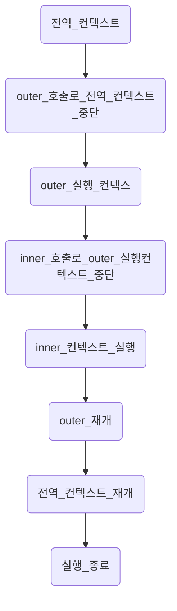

# 실행 컨텍스트

이전 시간은 자바스크립트 엔진이 데이터할당 로직을 배웠습니다.

## 1. 실행컨텍스트란

실행컨텍스트는 실행할 코드에 제공할 환경 정보를 모은 객체입니다. 여기서 객체라는 점이 중요합니다.

자바스크립트는 실행 컨텍스트가 활성화되는 시점에 3가지 현상이 발생합니다.

- 선언된 변수가 위로 끌어올라간 것처럼 로직을 처리합니다. 호이스팅 현상이라고 부릅니다.
- 외부 환경 정보를 구성합니다.
- `this` 값을 설정합니다.

이런 현상이 JS가 다른 언어랑 많이 다르게 만듭니다.

실행컨텍스트를 이해하기 위해서는 콜스택을 이해해야 합니다. 자료구조의 스택(Stack) 맞습니다. LIFO(Last In First Out)으로 함수가 들어갑니다. 최근에 들어간 순서로 처리합니다. 큐(Queue)는 반대로 순서대로 넣고 뺍니다. 나중에 포괄적으로 의미하는 테스크 큐(Task Queue)에서 다룹니다.

콜스택은 실행할 코드에 제공할 환경정보를 모은 객체입니다.

가장 위에 쌓여있는 컨텍스트와 관련된 코드를 실행하는 방법으로 코드의 환경과 순서를 보장합니다. 이 특징이 제일 중요합니다.

컨텍스트를 구성하는 방법은 4가지이지만 프로그래머는 함수에 집중하기 바랍니다.

1. 전역공간(실행환경이 자동 부여합니다)
2. `eval()` 함수
3. 함수
4. 실행컨텍스트 구성 예시입니다.

```js
var a = 1;

function outer() {
  function inner() {
    console.log(a); // undefined
    var a = 3;
  }
  inner();
  console.log(a); // 1
}

outer();
console.log(a); // 1
```



<!-- 전역 컨텍스트 -> outer 호출로 전역 컨텍스트 중단 -> outer 실행 컨텍스 -> inner 호출로 outer 실행컨텍스트 중단 -> inner 컨텍스트 실행 -> outer 재개 -> 전역 컨텍스트 재개 -> 실행 종료 -->

`console.log(a)`도 함수이지만 이해를 위해 무시하기 바랍니다.

실행 컨텍스트 객체가 활성화되는 시점은 한 실행 컨텍스트가 콜 스택의 맨 위에 쌓이는 순간이 곧 현재 실행할 코드에 관여하게 되는 시점입니다.

생성 시점 즉 활성화 시점에서 자바스크립트 엔진이 해당하는 컨텍스트와 관련된 코드를 실행할 때 필요한 환경 정보들을 수집해서 실행 컨텍스트 객체에 저장합니다.

실행컨텍스트에 담기는 정보는 3가지입니다. 잊으면 큰일납니다.

1. VariableEnvironment

- 현재 컨텍스트 내의 식별자 정보를 파악합니다.
- 외부 환경 정보도 접근합니다.
- 선언 시점의 LexicalEnvironment의 스냅샷도 갖습니다. 하지만 Variable은 선언 시점이라는 점이 중요합니다. LexicalEnvironment는 계속 변화합니다.

2. LexicalEnvironment

- VariableEnvironment랑 동일하지만 변경사항이 실시간으로 반영합니다.

3. thisBinding

- this 식별자가 바라봐야할 객체에 대한 정보입니다. 객체의 this가 어떻게 바뀌는지 봅니다.

## 2. Environment와 LexicalEnvironment 개요

편의로 VE(VariableEnvironment), LE(LexicalEnvironment)라고 부르기도 합니다.

VE랑 LE의 차이는 스냅샷과 실시간 변경 차이라고 했습니다.

데이터의 특정 시점의 이력을 보관하기 위해 데이터마다 스냅샷을 찍는 업무도 있습니다. 스냅샷은 특정 시점에 정적인 정보를 보관하는 것입니다.

실행 컨텍스트를 생성할 때 VE에 정보를 담은 다음에 LE에 복사해서 만들고 LE를 계속 활용합니다.

VE, LE 모두 구성요소는 동일합니다. 구성요소는 2가지입니다.

1. environmentRecord
   - 현재 컨텍스트와 관련된 식별자 정보들을 저장합니다.
   - 함수에 지정된 매개변수 식별자와 함수 자체 var로 선언된 변수 식별자를 저장합니다.
2. outerEnvironmentReference

environmentRecord는 레코드라고 부르겠습니다. outerEnvironmentReferenced은 아우터라고 부르겠습니다.

## 3. LexicalEnvironment, EnvironmentRecord와 호이스팅

EnvironmentRecord를 이해하면 호이스팅 현상을 알 수 있습니다.

1. 레코드는 현재 컨텍스트와 관련되 코드의 식별자 정보를 저장합니다.

2. 수집 대상은 매개변수의 식별자, 함수 자체, `var`로 선언한 변수 3가지입니다.

3. 컨택스트 내부를 처음부터 끝까지 정보만 수집합니다. 코드를 실행하지는 않습니다.

호이스팅입니다. 식별자 정보만 수집하고 실행하기 전에 수집만 합니다. 자바스크립트 엔진은 변수정보만 알고 있습니다. 호이스팅은 가상 개념입니다. 실제로 코드가 위로 끌어올려진으로 컴파일하지 않습니다. 그런 것처럼 처리한다고 가정하고 이해하기 직관적이라서 활용하는 것 뿐입니다.

```js
function a(x) {
  console.log(x); // 예상: 1 실제: 1
  var x;
  console.log(x); // 예상: undefined 실제: 1
  var x = 2;
  console.log(x); // 예상: 2 실제: 2
}
a(1);
```

호이스팅이면 아래와 같은 코드가 됩니다.

```js
function a(x) {
  var x; // 함수 매개변수 식별자 정보 저장
  var x; // var x 식별자 정보 저장
  var x; // var x = 2 식별자 정보 저장
  x = 1; // 매개변수 데이터 할당
  console.log(x); // 예상: 1 실제: 1
  console.log(x); // 예상: undefined 실제: 1
  var x = 2; // 새로운 데이터 할당
  console.log(x); // 예상: 2 실제: 2
}
a(1);
```

위처럼 식별자 정보들을 먼저 저장하고 그 후에 식별자별로 할당하고 실행합니다. 그래서 `undefined`을 출력하지 않습니다.

함수표현식입니다. 매개변수 식별자, 함수자체, var로 선언된 변수를 저장하는데 여기서 함수 자체를 수집하는 것을 보겠습니다.

함수는 선언식, 함수 표현식, 익명함수와 기명함수 정의가 있습니다.

```js
// 함수선언식
function a() {}

// 익명함수 표현식
var b = function () {};

// 기명함수 표현식
var c = function d() {};
```

기명함수 표현식의 함수명은 재귀함수로 사용할 때 이외에는 사용할 수 없습니다.

함수 선언문은 그 자체로 호이스팅 대상이 됩니다. 위 예시에서 `a`는 호이스팅 대상이 됩니다. 하지만 함수 표현식은 변수명이 호이스팅되기 때문에 함수 표현식을 전역으로 접근할 수 없습니다.

함수 선언문을 주의해야 하는 이유가 있습니다.

```js
console.log(sum(3, 4));

function sum(x, y) {
  return x + y;
}

var a = sum(1, 2);

function sum(x, y) {
  return x + ' + ' + y + ' = ' + (x + y);
}

var c = sum(1, 2);
console.log(c);
```

아래에서 작성한 선언식이 위에있는 `sum`을 덮어쓰기가 됩니다.

```js
console.log(sum(3, 4));

let sum = function (x, y) {
  return x + y;
};

var a = sum(1, 2);

let sum = function (x, y) {
  return x + ' + ' + y + ' = ' + (x + y);
};

var c = sum(1, 2);
console.log(c);
```

이렇게 작성하면 이미 정의된 식별자 이름이 에디터에서 에러를 돌려주고 덮어쓰기도 막을 수 있습니다. 식별자 정보만 저장하고 데이터로서 함수는 나중에 실행하면서 할당힉 때문에 발생하지 않습니다.

## 4. outerEnvironmentReference - 스코프, 스코프 체이닝

레코드는 식별자 정보를 담는다고 했습니다. 아우터랑 개념이 연결됩니다. 스코프라는 개념은 프로그래밍 언어의 범용적인 개념입니다. 스코프는 어떤 식별자, 변수가 유효한 범위라고 간단하게 이해할 수 있습니다.

```js
let b = 6;
const name = () => {
  let a = 3;
};
```

스코프는 다른 언어에도 존재하지만 자바스크립트에서는 조금 다릅니다.

ES6문법은 따로 다루겠습니다. 레거시 코드를 보면 `var`를 접할 때도 있을 것입니다. 참고로 `var`의 특징을 사용해서 개발하는 개발자도 존재합니다.

스코프 개념이랑 연결되는 것은 스코프 체이닝입니다.

스코프 체인은 스코프가 연결되어 있다는 의미입니다. 식별자의 유효범위를 안에서부터 바깥으로 차례대로 검색해 나가는 것입니다. 스코프 체인이 외부 환경 정보를 참조하는 것입니다.

스코프 체인은 아우터는 현재 호출된 함수가 선언될 당시 LE를 참조합니다. A함수 내부 선언된 B함수는 Linked List로 연결됩니다. 외부함수에서 내부함수로 연결된 관계입니다.

```js
var a = 1;

var outer = () => {
  var inner = () => {
    console.log(a); // undefined
    var a = 3; // a 식별자만 찾아냅니다. 할당 전 출력하기 때문에 undefined입니다.
  };
  inner();
  console.log(a); // 1 외부 LE의 레코드를 참조하기 때문에 1을 출력합니다.
  // inner 함수 내부에서 a 식별자가 바라보는 메모리 주소를 바꿔도 소용없습니다. 찾은 것은 함수 내부부터가 아니라 외부부터입니다.
};
outer();
console.log(a); // 1
```

```js
var a = 1;

var outer = () => {
  var a;
  var inner = () => {
    console.log(a); // undefined
    a = 3; // 선언에서 할당으로 변경합니다.
  };
  inner();
  console.log(a); // 3
};
outer();
console.log(a); // 1
```

## 부록: 실행컨텍스트는 토큰이다.

> 실행컨텍스트는 실행할 코드에 제공할 환경 정보를 모은 객체입니다. 여기서 객체라는 점이 중요합니다.

이 문구를 다시보기 바랍니다. 의문이 생겨야 합니다. 이 환경 정보를 모은 객체란 무엇인가? 실행 컨텍스트라고 하는데 이 실행 컨텍스트 정보를 어떻게 자바스크립트가 접근할 수 있는가?

자바스크립트로 접근이 불가능합니다.

이것을 객체라고 말하는데 이것은 자바스크립트 언어만 알고 있는 사람들 위해 이렇게 설명합니다. 이유는 생김새가 key, value 형식의 토큰이기 때문입니다.

자바스크립트 컴파일 과정에서 소스코드를 스트림 처리하고 스케너는 렉서입니다. 렉서는 구분 분석을 하고 토큰을 생성합니다. 이 토큰을 생성하는데 토큰에 소스코드를 실행하는 과정에서 키워드별(구문)로 분석합니다. 토큰을 생성하는데 이 토큰을 보고 어떻게 실행할지 결정하는 정보를 담은 객체가 아니라 정확히 토큰입니다.

호이스팅, 스코프 체이닝과 같은 현상들이 발생하는 이유는 자바스크립트가 컴파일하는 과정에서 구분분석을 처리하는 과정에서 발생합니다.
