# 이런저런 필기 자료

## React - form

옛날에 freecodecamp 리액트 튜토리얼을 봤었습니다.

!youtube[bMknfKXIFA8]

당시 form을 이해하기 상당히 어려웠습니다. 하지만 지금은 이해가 됩니다.

html에서 form을 만들면 간단했습니다.

```js
document.getElementById('my-form').addEventListener('submit', function (event) {
  event.preventDefault();
  const formElements = event.target.elements;
  const { firstName, lastName } = formElements;
  submitViaAPI({
    firstName: firstName.value,
    lastName: lastName.value,
  });
});

function submitViaAPI(data) {
  console.log(data);
  console.log('Submitted!');
}
```

현대시대에는 이런식으로 form을 처리하기도 합니다.

리액트는 현대 form에서 다른 것은 사용자의 인터랙션마다 state를 업데이트합니다. 하나하나 변화를 모두 추적합니다. 제출하는 시점에 DB로 보냅니다.

https://ko.reactjs.org/docs/forms.html

리액트가 form을 다루는 공식문서를 미리 읽기를 권장드립니다.

기본적으로 리액트에서 form은 `<input type="file"/>`만 비제어 컴포넌트로 사용합니다.

[리액트 공식문서 - 출처](https://ko.reactjs.org/docs/forms.html#the-file-input-tag)

또 묶여있는 form들은 반드시 다중 입력으로 제어 되어야 합니다.

```js
import React, { useState } from 'react';

export default function Form() {
  const [formData, setFormData] = useState({
    firstName: '',
    lastName: '',
    email: '',
  });

  console.log(formData);

  function handleChange(event) {
    setFormData((prevFormData) => {
      return {
        ...prevFormData,
        [event.target.name]: event.target.value,
      };
    });
  }

  return (
    <form>
      <input
        type="text"
        placeholder="First Name"
        onChange={handleChange}
        name="firstName"
        value={formData.firstName}
      />
      <input
        type="text"
        placeholder="Last Name"
        onChange={handleChange}
        name="lastName"
        value={formData.lastName}
      />
      <input
        type="email"
        placeholder="Email"
        onChange={handleChange}
        name="email"
        value={formData.lastName}
      />
    </form>
  );
}
```

여기까지는 input입니다.

textarea는 일반 input과 다릅니다. 보통 html에서는 무조건 짝태그로 작성해야 하지만 리액트에서는 홀태그로 작성할 수 있습니다.

```js
import React from 'react';

export default function Form() {
  const [formData, setFormData] = React.useState({
    firstName: '',
    lastName: '',
    email: '',
    comments: '',
  });

  function handleChange(event) {
    setFormData((prevFormData) => {
      return {
        ...prevFormData,
        [event.target.name]: event.target.value,
      };
    });
  }

  return (
    <form>
      <input
        type="text"
        placeholder="First Name"
        onChange={handleChange}
        name="firstName"
        value={formData.firstName}
      />
      <input
        type="text"
        placeholder="Last Name"
        onChange={handleChange}
        name="lastName"
        value={formData.lastName}
      />
      <input
        type="email"
        placeholder="Email"
        onChange={handleChange}
        name="email"
        value={formData.email}
      />
      {/* textarea를 여기 추가했습니다. */}
      <textarea
        value={formData.comments}
        placeholder="Comments"
        onChange={handleChange}
        name="comments"
      />
    </form>
  );
}
```

# checkbox

```js
import React from 'react';

export default function Form() {
  const [formData, setFormData] = React.useState({
    firstName: '',
    lastName: '',
    email: '',
    comments: '',
    isFriendly: true,
  });

  function handleChange(event) {
    // 객체 구조분해 할당합니다.
    const { name, value, type, checked } = event.target;
    setFormData((prevFormData) => {
      return {
        ...prevFormData,
        // type이 checkbox이면 checked의 프로퍼티를 할당합니다.
        [name]: type === 'checkbox' ? checked : value,
      };
    });
  }

  return (
    <form>
      <input
        type="text"
        placeholder="First Name"
        onChange={handleChange}
        name="firstName"
        value={formData.firstName}
      />
      <input
        type="text"
        placeholder="Last Name"
        onChange={handleChange}
        name="lastName"
        value={formData.lastName}
      />
      <input
        type="email"
        placeholder="Email"
        onChange={handleChange}
        name="email"
        value={formData.email}
      />
      <textarea
        value={formData.comments}
        placeholder="Comments"
        onChange={handleChange}
        name="comments"
      />
      {/* checkbox를 여기 추가했습니다. name이 key의 역할을 할 수 있도록 주의하도록 합니다. isFriendly는 key이고 name으로 일치해야 합니다. */}
      <input
        type="checkbox"
        id="isFriendly"
        checked={formData.isFriendly}
        onChange={handleChange}
        name="isFriendly"
      />
      <label htmlFor="isFriendly">Are you friendly?</label>
      <br />
    </form>
  );
}
```

라디오버튼

name은 동일해야 합니다. html도 동일합니다. state에 저장하는 것은 value로 처리합니다. value값은 문자열입니다.

checked의 값은 state의 값을 비교하는 방식으로 제어합니다.

```js
import React from 'react';

export default function Form() {
  const [formData, setFormData] = React.useState({
    firstName: '',
    lastName: '',
    email: '',
    comments: '',
    isFriendly: true,
    // 새롭게 추가한 라디오버튼은 state를 문자열로 갖습니다.
    employment: '',
  });
  console.log(formData.employment);

  function handleChange(event) {
    const { name, value, type, checked } = event.target;
    setFormData((prevFormData) => {
      return {
        ...prevFormData,
        // 라디오버튼은 checkbox가 아니기 때문에 자동무시합니다.
        [name]: type === 'checkbox' ? checked : value,
      };
    });
  }

  return (
    <form>
      <input
        type="text"
        placeholder="First Name"
        onChange={handleChange}
        name="firstName"
        value={formData.firstName}
      />
      <input
        type="text"
        placeholder="Last Name"
        onChange={handleChange}
        name="lastName"
        value={formData.lastName}
      />
      <input
        type="email"
        placeholder="Email"
        onChange={handleChange}
        name="email"
        value={formData.email}
      />
      <textarea
        value={formData.comments}
        placeholder="Comments"
        onChange={handleChange}
        name="comments"
      />
      <input
        type="checkbox"
        id="isFriendly"
        checked={formData.isFriendly}
        onChange={handleChange}
        name="isFriendly"
      />
      <label htmlFor="isFriendly">Are you friendly?</label>
      <br />
      <br />

      <fieldset>
        <legend>Current employment status</legend>

        {/* checked를 확인해보면 value랑 현재 state값과 비교합니다. 일치하면 true로 선택되게 만드는 방식으로 제어합니다. */}
        {/* html이랑 동일하게 name는 여러 선택지가 무엇인지 서로 묶어줘야 합니다. */}
        <input
          type="radio"
          id="unemployed"
          name="employment"
          value="unemployed"
          checked={formData.employment === 'unemployed'}
          onChange={handleChange}
        />
        <label htmlFor="unemployed">Unemployed</label>
        <br />

        <input
          type="radio"
          id="part-time"
          name="employment"
          value="part-time"
          checked={formData.employment === 'part-time'}
          onChange={handleChange}
        />
        <label htmlFor="part-time">Part-time</label>
        <br />

        <input
          type="radio"
          id="full-time"
          name="employment"
          value="full-time"
          checked={formData.employment === 'full-time'}
          onChange={handleChange}
        />
        <label htmlFor="full-time">Full-time</label>
        <br />
      </fieldset>
    </form>
  );
}
```

# select & option

라디오버튼과 유사하지만 더 직관적입니다.

```js
import React from 'react';

export default function Form() {
  const [formData, setFormData] = React.useState({
    firstName: '',
    lastName: '',
    email: '',
    comments: '',
    isFriendly: true,
    employment: '',
    // select & option을 추가합니다.
    favColor: '',
  });
  console.log(formData.favColor);

  function handleChange(event) {
    console.log(event);
    const { name, value, type, checked } = event.target;
    setFormData((prevFormData) => {
      return {
        ...prevFormData,
        [name]: type === 'checkbox' ? checked : value,
      };
    });
  }

  return (
    <form>
      <input
        type="text"
        placeholder="First Name"
        onChange={handleChange}
        name="firstName"
        value={formData.firstName}
      />
      <input
        type="text"
        placeholder="Last Name"
        onChange={handleChange}
        name="lastName"
        value={formData.lastName}
      />
      <input
        type="email"
        placeholder="Email"
        onChange={handleChange}
        name="email"
        value={formData.email}
      />
      <textarea
        value={formData.comments}
        placeholder="Comments"
        onChange={handleChange}
        name="comments"
      />
      <input
        type="checkbox"
        id="isFriendly"
        checked={formData.isFriendly}
        onChange={handleChange}
        name="isFriendly"
      />
      <label htmlFor="isFriendly">Are you friendly?</label>
      <br />
      <br />

      <fieldset>
        <legend>Current employment status</legend>
        <input
          type="radio"
          id="unemployed"
          name="employment"
          value="unemployed"
          checked={formData.employment === 'unemployed'}
          onChange={handleChange}
        />
        <label htmlFor="unemployed">Unemployed</label>
        <br />

        <input
          type="radio"
          id="part-time"
          name="employment"
          value="part-time"
          checked={formData.employment === 'part-time'}
          onChange={handleChange}
        />
        <label htmlFor="part-time">Part-time</label>
        <br />

        <input
          type="radio"
          id="full-time"
          name="employment"
          value="full-time"
          checked={formData.employment === 'full-time'}
          onChange={handleChange}
        />
        <label htmlFor="full-time">Full-time</label>
        <br />
      </fieldset>
      <br />

      <label htmlFor="favColor">What is your favorite color?</label>
      <br />
      {/* select에서 제어합니다. */}
      <select
        id="favColor"
        value={formData.favColor}
        onChange={handleChange}
        name="favColor"
      >
        {/* state 초기값과 동일하게 설정합니다. */}
        <option value="">-- Choose --</option>
        {/* option을 선택할 때 state가 해당하는 값으로 업데이트됩니다. */}
        <option value="red">Red</option>
        <option value="orange">Orange</option>
        <option value="yellow">Yellow</option>
        <option value="green">Green</option>
        <option value="blue">Blue</option>
        <option value="indigo">Indigo</option>
        <option value="violet">Violet</option>
      </select>
    </form>
  );
}
```

```js
import React from 'react';

export default function Form() {
  const [formData, setFormData] = React.useState({
    firstName: '',
    lastName: '',
    email: '',
    comments: '',
    isFriendly: true,
    employment: '',
    favColor: '',
  });

  function handleChange(event) {
    const { name, value, type, checked } = event.target;
    setFormData((prevFormData) => {
      return {
        ...prevFormData,
        [name]: type === 'checkbox' ? checked : value,
      };
    });
  }

  function handleSubmit(event) {
    // 새로고침 즉 리랜더링을 막습니다.
    event.preventDefault();
    console.log(formData);
  }

  return (
    // onSubmit 이벤트 핸들러로 제출을 처리합니다.
    <form onSubmit={handleSubmit}>
      <input
        type="text"
        placeholder="First Name"
        onChange={handleChange}
        name="firstName"
        value={formData.firstName}
      />
      <input
        type="text"
        placeholder="Last Name"
        onChange={handleChange}
        name="lastName"
        value={formData.lastName}
      />
      <input
        type="email"
        placeholder="Email"
        onChange={handleChange}
        name="email"
        value={formData.email}
      />
      <textarea
        value={formData.comments}
        placeholder="Comments"
        onChange={handleChange}
        name="comments"
      />
      <input
        type="checkbox"
        id="isFriendly"
        checked={formData.isFriendly}
        onChange={handleChange}
        name="isFriendly"
      />
      <label htmlFor="isFriendly">Are you friendly?</label>
      <br />
      <br />

      <fieldset>
        <legend>Current employment status</legend>
        <input
          type="radio"
          id="unemployed"
          name="employment"
          value="unemployed"
          checked={formData.employment === 'unemployed'}
          onChange={handleChange}
        />
        <label htmlFor="unemployed">Unemployed</label>
        <br />

        <input
          type="radio"
          id="part-time"
          name="employment"
          value="part-time"
          checked={formData.employment === 'part-time'}
          onChange={handleChange}
        />
        <label htmlFor="part-time">Part-time</label>
        <br />

        <input
          type="radio"
          id="full-time"
          name="employment"
          value="full-time"
          checked={formData.employment === 'full-time'}
          onChange={handleChange}
        />
        <label htmlFor="full-time">Full-time</label>
        <br />
      </fieldset>
      <br />

      <label htmlFor="favColor">What is your favorite color?</label>
      <br />
      <select
        id="favColor"
        value={formData.favColor}
        onChange={handleChange}
        name="favColor"
      >
        <option value="red">Red</option>
        <option value="orange">Orange</option>
        <option value="yellow">Yellow</option>
        <option value="green">Green</option>
        <option value="blue">Blue</option>
        <option value="indigo">Indigo</option>
        <option value="violet">Violet</option>
      </select>
      <br />
      <br />
      {/* html5부터 버튼이 form 속에 홀로 존재하면 <input type="submit">제출하기<input>으로 취급합니다. */}
      <button>Submit</button>
    </form>
  );
}
```

# 끝

지금 글은 다중입력 제어 컴포넌트입니다. 각자 독립적으로 사용하는 경우도 또 정리하겠습니다. 미래의 제가 읽을 때 시간 낭비를 덜하기 위해서 정리하겠습니다.


## React 입문

## 면접질문: useLayoutEffect는 무엇인가요? 🔥

useEffect랑 동일하지만 브라우저 랜더링 과정에서 Layout과 Paint 이전에 동기적으로 실행합니다.

여기서 말하는 렌더링은 리액트 렌더링이고 Layout과 Paint는 브라우저에서 처리하는 단계입니다.

보통 DOM조작과 animation과 과련된 작업에 활용할 hook에 사용합니다. 일반적인 라이프 사이클별로 처리하고자 하는 것은 useEffect를 사용할 것을 권장합니다.

fiber가 requestAnimationFrame으로 해당하는 함수를 실행하는 것으로 추측됩니다.

## base64 vs Blob vs File

모두 각각 다른 객체입니다.

https://stackoverflow.com/questions/35940290/how-to-convert-base64-string-to-javascript-file-object-like-as-from-file-input-f

```ts
const handleProfileImage = (e: ChangeEvent<HTMLInputElement>) => {
  const [file] = e.target.files as FileList;
  if (!file) return;
  const reader = new FileReader();
  reader.readAsDataURL(file);
  reader.onload = async (uploadedBlob) => {
    // base64 -> blob -> file
    const imgDataUrl = uploadedBlob.target?.result; // data:image/jpeg;base64,/
    const base64 = await fetch(`${imgDataUrl}`);
    const blob = await base64.blob();
    const blobFile = new File([blob], 'name');
    const publicImageURL = await uploadImage(blobFile);
    if (!publicImageURL) return;
    setProfileImage(publicImageURL);
  };
};
```

내일은 2번 컨버션하지말고 1번에 컨버션하는 코드로 수정합니다.

base64 -> Blob
https://ionic.io/blog/converting-a-base64-string-to-a-blob-in-javascript

Blob -> File
https://stackoverflow.com/questions/27159179/how-to-convert-blob-to-file-in-javascript

이런 이상한 글 그만 읽으세요

## State

State랑 props만 알아도 리액트의 상당부분을 알게되는 것입니다.

state를 사용할 때는 useState 훅을 사용합니다. state를 통해 데이터를 변형하는 이유입니다. 컴포넌트에는 라이프 사이클이 있습니다. 화면의 변화된 값을 업데이트하기 위해서 이렇게 합니다. state에 따라 랜더링 여부를 반영하고 판단합니다. 리액트라 변화를 감지하고 즉시 랜더링하게 만들기 위해서 state를 활용합니다.

state는 리액트에서만 제공하고 존재합니다. 이것은 hook이라고 부릅니다.

```js
import React, { useState } from 'react';

function GrandFather() {
  const [name, setName] = useState('김할아'); // 이것이 state!
  return <Mother grandFatherName={name} />;
}

// .. 중략
```

`name`은 state값입니다. `setName`은 Setter함수입니다. 이 함수로 `name`값을 업데이트할 수 있습니다.

```js
// src/App.js

import React, { useState } from 'react';

function Child(props) {
  return (
    <div>
      <button
        onClick={() => {
          props.setName('박할아');
        }}
      >
        할아버지 이름 바꾸기
      </button>
      <div>{props.grandFatherName}</div>
    </div>
  );
}

function Mother(props) {
  return (
    <Child grandFatherName={props.grandFatherName} setName={props.setName} />
  );
}

function GrandFather() {
  const [name, setName] = useState('김할아');
  return <Mother grandFatherName={name} setName={setName} />;
}

function App() {
  return <GrandFather />;
}

export default App;
```

화면에서 바뀐 값만 반영합니다. 서버랑 통신해야 바뀐 값을 저장할 수 있습니다.

위 코드는 `setter`함수도 `props`로 같이 전달합니다.

컴포넌트의 라이프 사이클과 리랜더링 조건을 알아내도록 합니다.

웹사이트에서 사용자가 상호작용해서 데이터를 변형하는 경우입니다.

```js
import React, { useState } from 'react';

function App() {
  const [name, setName] = useState('춉춉이');
  const onClickHandler = () => {
    setName('루랑이');
  };
  return (
    <div>
      <button onClick={onClickHandler}>{name}</button>
    </div>
  );
}

export default App;
```

버튼을 클릭하면 state가 업데이트 됩니다.

```js
import React, { useState } from 'react';

function App() {
  const [text, setText] = useState('');
  const handleTyping = (event) => {
    setText(event.target.value);
  };
  return (
    <div>
      <input type="text" onChange={handleTyping} value={text} />
    </div>
  );
}

export default App;
```

input에 state를 설정하는 방법입니다.

이벤트 객체는 DOM의 개념입니다.

리액트를 사용할 때는 불변성을 주의해야 합니다. 자바스크립트 데이터 중에 원시형은 불변성이 있고 참조형은 불변성이 없습니다. 메모리의 동작 방식의 문제입니다. 원시형을 비교할 때 엄밀비교하고 동일하면 true를 반환하는 이유는 주소가 동일하기 때문입니다.

참조형은 불변성이 없습니다.

```js
let obj1 = { name: 'kim' };
let obj2 = { name: 'kim' };
console.log(obj1 === obj2); // false
```

각다 다른 주소를 갖고 있기 때문에 동일하게 보여도 주소가 다릅니다.

리액트에서는 데이터의 불변성을 지켜주는 것이 중요합니다. 리랜더링 기준은 state가 변하고 안 변하고가 기준입니다. state 변화 전후를 비교합니다. state의 변화를 알아내기 위해서는 메모리 주소를 비교하는 전략을 활용합니다. 리액트에서 state value만 새로 할당하는 것은 리랜더링이 발생하지 않습니다(`state = "valeu"`). setter함수를 통해 변경해야지만 리랜더링이 발생합니다. setter함수를 통해 변경해야 이전 이후 메모리 차이가 나게 말들 수 있기 때문입니다(`setState("new value")`). 리액트는 내부에서 참조형비교의 `false`가 발생하는지 확인하고 변경여부를 판단하는 방식으로 동작합니다.

직접 수정하지 않습니다. 기존의 값을 복사하고 그 이후의 값을 추가하고 삭제하는 방식으로 구현합니다.

## 컴포넌트와 랜더링

이번에는 이론입니다.

리액트의 모든 UI들은 컴포넌트로 만듭니다. 컴포넌트 기반 라이브러리의 장점을 배웁니다.

컴포넌트는 UI의 최소 단위 선언체입니다. 리액트 컴포넌트가 선언체라는 것은 중요한 개념입니다. 이전까지는 직업 DOM을 조작하는 명령형 프로그래밍이었습니다.

명령형: 어떻게(How)를 중요시여겨서 프로그램의 제어의 흐름과 같은 방법을 제시하고 목표를 명시하지 않는 형태입니다.
선언형: 무엇(What)을 중요시 여겨서 제어의 흐름보다는 원하는 목적을 중요시 여기는 형태입니다.

```js
// Hello, World! 화면에 출력하기
// 순수 javaScript 명령형 코드
const root = document.getElementById('root');
const header = document.createElement('h1');
const headerContent = document.createTextNode('Hello, World!');

header.appendChild(headerContent);
root.appendChild(header);
```

위 코드는 명령형입니다. 처음 작게 프로토타입 정도 만들 때는 적당합니다. 하지만 대규모 앱을 만들면 관리하고 변경하기 상당히 어렵습니다.

```js
// React 코드 (선언적인)
const header = <h1>Hello World</h1>; // jsx
ReactDOM.render(header, document.getElementById('root'));
```

위 코드는 선언형입니다. 번들사이즈가 크기 때문에 바로 사용하지 않습니다. 하지만 어느정도 규모가 있으면 비교적 변경하기 쉬운습니다. 관리하기도 용이합니다.

트리거링(triggering): 랜더링이 발생하게 만드는 것

렌더링(rendering): UI 컴포넌트를 html로 변환시키는 것

커밋(commit): 실제 DOM에 UI를 반형하는 것

1. 렌더링 트리거

   - 첫 리액트 앱을 실행했을 때
   - 래액트 내부의 state가 변경되었을 때
     - 컴포넌트 내부 state가 변경되었을 때
     - 컴포넌트에 새로운 props가 변경되었을 때
     - 부모 컴포넌트가 state, props변경으로 랜더링이 발생할 때

2. 리랜더링

   - 리랜더링 트리거는 state를 변경하면 됩니다. 리랜더링을 유발하는 트리거는 더 많이 있습니다. 하지만 지금은 생략합니다.
   - state변화가 발생하면 리랜더링이 됩니다. 여러 state가 바뀌면 큐 자료구조로 처리합니다. 변경이 가해진 순서대로 처리합니다.

3. 브라우저 렌더링

   - 브라우저의 랜더링과 리액트의 랜더링은 당연히 다른 것입니다. 혼동을 피하기 위해서 브라우저 랜더링을 페인팅이라고 부르기도 합니다. 리액트는 렌더링을 완료하면 DOM에 업데이트 하고 브라우저에 화면을 그립니다.

[브라우저는 어떻게 동작하는가?](https://d2.naver.com/helloworld/59361)

## Counter App

```js
import React, { useState } from 'react';

function App() {
  const [count, setCount] = useState(0);
  const handleCountUp = () => {
    setCount((count) => ++count);
  };
  const handleCountDown = () => {
    setCount((count) => --count);
  };
  return (
    <div>
      <h1>{count}</h1>
      <button onClick={handleCountUp}>+ 1</button>
      <button onClick={handleCountDown}>- 1</button>
    </div>
  );
}

export default App;
```

이렇게 작성해도 괜찮지만 1번 쓸거면 익명함수가 좋은 해결책이 됩니다.

## 컴포넌트 꾸미기

```js
import './App.css';

const Card = ({ props }) => {
  const style = {
    width: `120px`,
    height: `120px`,
    border: `solid 1px springgreen`,
    borderRadius: `8px`,
    display: `flex`,
    justifyContent: `center`,
    alignItems: `center`,
  };
  const card = props.map((food, idx) => {
    return (
      <div style={style} key={idx}>
        {food}
      </div>
    );
  });
  return <div style={{ display: `flex`, gap: `24px` }}>{card}</div>;
};

function App() {
  const food = ['감자', '고구마', '오이', '가지', '옥수수'];
  return (
    <div
      className="App"
      style={{
        display: `flex`,
        justifyContent: `center`,
        alignItems: `center`,
        height: `100vh`,
      }}
    >
      <Card props={food}></Card>
    </div>
  );
}

export default App;
```

## 반복되는 컴포넌트 처리하기

`map` 고차함수로 동적으로 UI를 만들 수 있습니다.

```js
import './App.css';
import React, { useState } from 'react';

const CustomButton = ({ children, onClick }) => {
  return <button onClick={onClick}>{children}</button>;
};

const User = ({ props, deleteUserHandler }) => {
  const { id, age, name } = props;
  return (
    <div>
      {age}살 - {name}
      <CustomButton onClick={() => deleteUserHandler(id)}>삭제</CustomButton>
    </div>
  );
};

function App() {
  const [users, setUsers] = useState([
    { id: 1, age: 30, name: '송중기' },
    { id: 2, age: 24, name: '송강' },
    { id: 3, age: 21, name: '김유정' },
    { id: 4, age: 29, name: '구교환' },
  ]);
  const [name, setName] = useState('');
  const [age, setAge] = useState('');
  const addUserHandler = () => {
    const newUser = { id: users.length + 1, age, name };
    setUsers((users) => [...users, newUser]);
  };
  const deleteUserHandler = (id) => {
    // const newUserList = users.filter((user) => user.id !== id);
    setUsers((users) => users.filter((user) => user.id !== id));
  };
  return (
    <div className="App">
      {users.map((user, idx) => (
        <User deleteUserHandler={deleteUserHandler} props={user} key={idx} />
      ))}
      <input
        type="text"
        placeholder="이름을 입력해주세요"
        onChange={(event) => {
          setName(event.target.value);
        }}
        value={name}
      />
      <input
        type="text"
        placeholder="나이를 입력해주세요"
        onChange={(event) => {
          setAge(event.target.value);
        }}
        value={age}
      />
      <CustomButton onClick={addUserHandler}>추가</CustomButton>
    </div>
  );
}

export default App;
```

컴포넌트를 분리하는 것으로 스타일링도 디커플링할 수 있습니다. props를 넣고 선언할 때 컬러 같은 스타일 설정하면 됩니다.

key값이 있어야 리액트는 컴포넌트의 차이를 참조할 수 있습니다. key는 props처럼 보이지만 고차함수의 2번째 인자인 idx를 활용하는 것은 자제해야 합니다. 공식 문서에서 제외하도로록 합니다.

하지만 key는 형제관계에서만 고유하면 괜찮습니다. 전체에 모두 고유할 필요은 없습니다.

[리스트와 Key](https://ko.reactjs.org/docs/lists-and-keys.html)

TL;DR

```js
import { nanoid } from 'nanoid';
const createNewTodo = (text) => ({
  completed: false,
  id: nanoid(),
  text
}
```

나노 아이디를 활용합니다.

```js
const User = ({ props, deleteUserHandler }) => {
  const { id, age, name } = props;
  return (
    <div>
      {age < 25 ? (
        <div>
          {age}살 - {name}{' '}
          <CustomButton onClick={() => deleteUserHandler(id)}>
            삭제
          </CustomButton>{' '}
        </div>
      ) : null}
    </div>
  );
};
```

25세 미만만 출력하게 만든 조건부 렌더링입니다. `filter`를 사용해도 큰 문제는 아니지만 배열 메서드를 체이닝하면 시간복잡도를 증가시킵니다. 고차함수 배열 메소드가 하나의 반복문이고 이것을 체이닝(반복문 중첩)하기 때문입니다.

## 컴포넌트 분리하기

재사용성이 높은 컴포넌트는 파일 분리를 권장합니다. 컴포넌트는 파일단위로 연관성 기준으로 분류하기를 권장합니다.

특정한 관심사에 따라 기능을 나누고, 각 기능을 독립적으로 개발한 뒤 이를 조합하는 방식으로 복잡한 소프트웨어를 구성해보자는 아이디어를 관심사의 분리(Separation of concerns, SoC)

```js
// App.js
import './App.css';
import React, { useState } from 'react';
import CustomButton from './components/CustomButton';
import User from './components/User';

function App() {
  const [users, setUsers] = useState([
    { id: 1, age: 30, name: '송중기' },
    { id: 2, age: 24, name: '송강' },
    { id: 3, age: 21, name: '김유정' },
    { id: 4, age: 29, name: '구교환' },
  ]);
  const [name, setName] = useState('');
  const [age, setAge] = useState('');
  const addUserHandler = () => {
    const newUser = { id: users.length + 1, age, name };
    setUsers((users) => [...users, newUser]);
  };
  const deleteUserHandler = (id) => {
    // const newUserList = users.filter((user) => user.id !== id);
    setUsers((users) => users.filter((user) => user.id !== id));
  };
  return (
    <div className="App">
      {users.map((user, idx) => (
        <User deleteUserHandler={deleteUserHandler} props={user} key={idx} />
      ))}
      <input
        type="text"
        placeholder="이름을 입력해주세요"
        onChange={(event) => {
          setName(event.target.value);
        }}
        value={name}
      />
      <input
        type="text"
        placeholder="나이를 입력해주세요"
        onChange={(event) => {
          setAge(event.target.value);
        }}
        value={age}
      />
      <CustomButton onClick={addUserHandler}>추가</CustomButton>
    </div>
  );
}

export default App;
```

```js
// User.js
import CustomButton from './CustomButton';

const User = ({ props, deleteUserHandler }) => {
  const { id, age, name } = props;
  return (
    <div>
      {age < 25 ? (
        <div>
          {age}살 - {name}{' '}
          <CustomButton onClick={() => deleteUserHandler(id)}>
            삭제
          </CustomButton>{' '}
        </div>
      ) : null}
    </div>
  );
};

export default User;
```

```js
// CustomButton.js
const CustomButton = ({ children, onClick }) => {
  return <button onClick={onClick}>{children}</button>;
};

export default CustomButton;
```

## 리액트 배포하기 (vercel)

배포하는 방법은 2가지입니다.

배포를 도와주는 서비스
웹 서버를 직접 구축하고 서버를 통해 배포하는 방법

Vercel를 통해 배포할 수 있습니다. 많은 회사는 Vercel은 거의 사용할 가능성이 없습니다.

Vercel을 활용하면 `git push`로 배포한 사이트를 업데이트할 수 있습니다.

Styled-Component, ReactHook, Redux를 예습하도록 합니다.

[How do I add environment variables to my Vercel project?](https://vercel.com/guides/how-to-add-vercel-environment-variables)

위 아티클은 환경 변수를 설정하는 법을 알려줍니다.

---

# 숙련 주차

[react-homework](react-homework-bk6tik4no-arch-spatula.vercel.app)

배포까지 끝났습니다. 숙련주차 강의 수강 시작했습니다.

리덕스는 다른 자료를 활용해서 추가 공부를 할 것입니다. 강의자료만으로는 당연히 부족합니다. 간단한 체험에 가깝습니다.

https://react-homework-bk6tik4no-arch-spatula.vercel.app/

---

## 리액트 라우터

react-router-dom입니다. 버전별로 문법차이가 큽니다.

여러 페이지를 만들 수 있습니다.

```sh
yarn add react-router-dom
```

위처럼 리액트 설치이후 추가하면 됩니다.

```txt
├── src/
│   ├── pages/
│   │   ├── Home.jsx
│   │   ├── About.jsx
│   │   ├── Contact.jsx
│   │   └── Works.jsx
│   ├── shared/
│   │   └── Router.js
│   ├── App.js
│   └── index.js
```

url을 입력하면 페이지 컴포넌트를 접근할 수 있게 해줍니다.

라우터 파일은 주로 따로 분리해서 작성합니다.

```js
// shared/Router.js
import React from 'react';
// 1. react-router-dom을 사용하기 위해서 아래 API들을 import 합니다.
import { BrowserRouter, Route, Routes } from 'react-router-dom';

// 2. Router 라는 함수를 만들고 아래와 같이 작성합니다.
//BrowserRouter를 Router로 감싸는 이유는,
//SPA의 장점인 브라우저가 깜빡이지 않고 다른 페이지로 이동할 수 있게 만들어줍니다!
const Router = () => {
  return (
    <BrowserRouter>
      <Routes></Routes>
    </BrowserRouter>
  );
};

export default Router;
```

위 코드로 작성하는 것이 출발입니다.

```js
import React from 'react';
// 1. react-router-dom을 사용하기 위해서 아래 API들을 import 합니다.
import { BrowserRouter, Route, Routes } from 'react-router-dom';
import Home from '../pages/Home';
import Contact from '../pages/Contact';
import About from '../pages/About';
import Works from '../pages/Works';

// 2. Router 라는 함수를 만들고 아래와 같이 작성합니다.
//BrowserRouter를 Router로 감싸는 이유는,
//SPA의 장점인 브라우저가 깜빡이지 않고 다른 페이지로 이동할 수 있게 만들어줍니다!
const Router = () => {
  return (
    <BrowserRouter>
      <Routes>
        <Route path="/" element={<Home />} />
        <Route path="about" element={<About />} />
        <Route path="contact" element={<Contact />} />
        <Route path="works" element={<Works />} />
      </Routes>
    </BrowserRouter>
  );
};

export default Router;
```

라우팅할 때마다 접근할 페이지를 이렇게 맵핑할 수 있습니다.

```js
import './App.css';
import Router from './shared/Router';

function App() {
  return <Router />;
}

export default App;
```

모든 라우트는 App을 통해 거처가야 합니다. 개념적으로 라우트는 앱에 포함된 개념입니다.

react-router-dom가 제공하는 hook들이 존재합니다.

`useNavigate`는 어떤 페이지로 이동시킬 때 사용합니다.

[https://reactrouter.com/en/6.4.4/hooks/use-navigate](useNavigate - 공식 문서링크)

```js
// src/pages/home.js
import React from 'react';
import { useNavigate } from 'react-router-dom';

const Home = () => {
  const navigate = useNavigate();

  return (
    <button
      onClick={() => {
        navigate('/works');
      }}
    >
      works로 이동
    </button>
  );
};

export default Home;
```

`useLocation`현재 url 정보를 얻을 수 있습니다. 조건부 랜더링에 활용할 수 있습니다.

[https://reactrouter.com/en/6.4.4/hooks/use-location](useLocation - 공식 문서링크)

```js
// src/pages/works.js
import React from 'react';
import { useLocation } from 'react-router-dom';

const Works = () => {
  const location = useLocation();
  console.log('location :>> ', location);
  return (
    <div>
      <div>{`현재 페이지 : ${location.pathname.slice(1)}`}</div>
    </div>
  );
};

export default Works;
```

`<Link></Link>`는 JSX에서 a태그랑 동일한 기능을 지원해줍니다.

[Link 태그 - 공식 문서링크](https://reactrouter.com/en/6.4.4/components/link)

```js
import { Link, useLocation } from 'react-router-dom';

const Works = () => {
  const location = useLocation();
  console.log('location :>> ', location);
  return (
    <div>
      <div>{`현재 페이지 : ${location.pathname.slice(1)}`}</div>
      <Link to="/contact">contact 페이지로 이동하기</Link>
    </div>
  );
};

export default Works;
```

`useParams`은 URL의 query를 접근할 수 있습니다.

[useParams - 공식 문서링크](https://reactrouter.com/en/6.4.4/hooks/use-params)

```js
import * as React from 'react';
import { Routes, Route, useParams } from 'react-router-dom';

function ProfilePage() {
  // Get the userId param from the URL.
  let { userId } = useParams();
  // ...
}

function App() {
  return (
    <Routes>
      <Route path="users">
        <Route path=":userId" element={<ProfilePage />} />
        <Route path="me" element={...} />
      </Route>
    </Routes>
  );
}
```

어떤 컴포넌트들은 어떤 자식 엘리먼트가 들어올지 미리 예상할 수 없는 경우가 있습니다. 범용적으로 사용하는 컴포넌트들이 있습니다. Sidebar, Header, Footer, Dialog같은 컴포넌트들이 존재합니다. 이런 컴포넌트들을 라우팅과 무관하게 접근할 수 있게 해줍니다.

컴포지션은 합성이라는 의미를 가졌습니다.

```js
// src/shared/Layout.js

import React from 'react';

const HeaderStyles = {
  width: '100%',
  background: 'black',
  height: '50px',
  display: 'flex',
  alignItems: 'center',
  paddingLeft: '20px',
  color: 'white',
  fontWeight: '600',
};
const FooterStyles = {
  width: '100%',
  height: '50px',
  display: 'flex',
  background: 'black',
  color: 'white',
  alignItems: 'center',
  justifyContent: 'center',
  fontSize: '12px',
};

const layoutStyles = {
  display: 'flex',
  flexDirection: 'column',
  justifyContent: 'center',
  alignItems: 'center',
  minHeight: '90vh',
};

function Header() {
  return (
    <div style={{ ...HeaderStyles }}>
      <span>Sparta Coding Club - Let's learn React</span>
    </div>
  );
}

function Footer() {
  return (
    <div style={{ ...FooterStyles }}>
      <span>copyright @SCC</span>
    </div>
  );
}

function Layout({ children }) {
  return (
    <div>
      <Header />
      <div style={{ ...layoutStyles }}>{children}</div>
      <Footer />
    </div>
  );
}

export default Layout;
```

`children props`를 활용해서 적용하는 개념입니다. 어떤 자식 태그가 들어와도 범용적으로 적용할 수 있게 됩니다.

```js
import React from 'react';
// 1. react-router-dom을 사용하기 위해서 아래 API들을 import 합니다.
import { BrowserRouter, Route, Routes } from 'react-router-dom';
import Home from '../pages/Home';
import Contact from '../pages/Contact';
import About from '../pages/About';
import Works from '../pages/Works';
import Layout from './Layout';

// 2. Router 라는 함수를 만들고 아래와 같이 작성합니다.
//BrowserRouter를 Router로 감싸는 이유는,
//SPA의 장점인 브라우저가 깜빡이지 않고 다른 페이지로 이동할 수 있게 만들어줍니다!
const Router = () => {
  return (
    <BrowserRouter>
      <Layout>
        <Routes>
          <Route path="/" element={<Home />} />
          <Route path="about" element={<About />} />
          <Route path="contact" element={<Contact />} />
          <Route path="works" element={<Works />} />
        </Routes>
      </Layout>
    </BrowserRouter>
  );
};

export default Router;
```

`Layout`컴포넌트가 감싸야 공통 컴포넌트를 적용할 수 있습니다.

이제 동적 라우팅입니다. url에 특정 데이터를 넣어 동적으로 이동하는 것입니다. 주로 커머스에서 레이아웃은 동일합니다. 같은 컴포넌트의 같은 레이아웃을 활용합니다. 하지만 Content만 다릅니다. url에 따라 동적으로 데이터를 연결하고 제공합니다.

```js
import React from 'react';
import { BrowserRouter, Route, Routes } from 'react-router-dom';
import Home from '../pages/Home';
import Contact from '../pages/Contact';
import About from '../pages/About';
import Works from '../pages/Works';
import Layout from './Layout';

const Router = () => {
  return (
    <BrowserRouter>
      <Layout>
        <Routes>
          <Route path="/" element={<Home />} />
          <Route path="about" element={<About />} />
          <Route path="contact" element={<Contact />} />
          <Route path="works" element={<Works />} />
          <Route path="works/:id" element={<Works />} />
        </Routes>
      </Layout>
    </BrowserRouter>
  );
};

export default Router;
```

여기서 id가 동적인 부분에 해당합니다. `useParams` hook으로 접근할 수 있습니다.

```url
http://localhost:3000/works/100
```

이렇게 입력해도 정상작동하는 것을 확인할 수 있습니다.

동적 라우팅의 url path의 데이터를 가져오는 방법입니다. 동적 라우팅을 하면 페이지에 동일하게 랜더링합니다. 컴포넌트는 모두 같지 content만 달라야 합니다.

```js
// src/pages/Works.js

import React from 'react';
import { Link, useParams } from 'react-router-dom';

const data = [
  { id: 1, todo: '리액트 배우기' },
  { id: 2, todo: '노드 배우기' },
  { id: 3, todo: '자바스크립트 배우기' },
  { id: 4, todo: '파이어 베이스 배우기' },
  { id: 5, todo: '넥스트 배우기' },
  { id: 6, todo: 'HTTP 프로토콜 배우기' },
];

function Works() {
  return (
    <div>
      {data.map((work) => {
        return (
          <div key={work.id}>
            <div>할일: {work.id}</div>
            <Link to={`/works/${work.id}`}>
              <span style={{ cursor: 'pointer' }}>➡️ Go to: {work.todo}</span>
            </Link>
          </div>
        );
      })}
    </div>
  );
}

export default Works;
```

커머스가 홈에서 상세페이지 접근하기 전에 중간 상품 목록페이지랑 유사합니다. `<Link>`태그를 활용해서 상세페이지를 접근하게 해줍니다.

```js
// src/pages/Work.js

import React from 'react';
import { useParams } from 'react-router-dom';

const data = [
  { id: 1, todo: '리액트 배우기' },
  { id: 2, todo: '노드 배우기' },
  { id: 3, todo: '자바스크립트 배우기' },
  { id: 4, todo: '파이어 베이스 배우기' },
  { id: 5, todo: '넥스트 배우기' },
  { id: 6, todo: 'HTTP 프로토콜 배우기' },
];

function Work() {
  const param = useParams();

  const work = data.find((work) => work.id === parseInt(param.id));

  return <div>{work.todo}</div>;
}

export default Work;
```

접근하게 될 상세 페이지입니다.

고유한 id를 활용하는 것이 전략입니다. 각 url의 고유한 id를 활용하는 전략입니다.

리액트 라우터 DOM으로 동적 라우팅 설정이 가능합니다. id는 각 컴포넌트에서 조회할 수 있습니다.

```js
import React from 'react';
import { BrowserRouter, Route, Routes } from 'react-router-dom';
import Home from '../pages/Home';
import Contact from '../pages/Contact';
import About from '../pages/About';
import Works from '../pages/Works';
import Work from '../pages/Work';
import Layout from './Layout';

const Router = () => {
  return (
    <BrowserRouter>
      <Layout>
        <Routes>
          <Route path="/" element={<Home />} />
          <Route path="about" element={<About />} />
          <Route path="contact" element={<Contact />} />
          <Route path="works" element={<Works />} />
          <Route path="works/:id" element={<Work />} />
        </Routes>
      </Layout>
    </BrowserRouter>
  );
};

export default Router;
```

이렇게 접근가능하도록 Route 설정을 하면 끝납니다.

## 예습 키워드

redux-toolkit, JSON server, axios, thunk, optimizing custom hook

## React Redux Full Course for Beginners | Redux Toolkit Complete Tutorial

[React Redux Full Course for Beginners | Redux Toolkit Complete Tutorial](https://www.youtube.com/watch?v=NqzdVN2tyvQ)

리덕스 제작자는 RTK를 사용하기를 권장합니다. 불필요한 복잡성이 늘어난다고 합니다.

```sh
npm install redux react-redux @reduxjs/toolkit
```

리덕스랑 리덕스 store는 혼용해서 사용하는 용어입니다. 자바스크립트의 불변 객체 트리 컨테이너입니다. 복수의 store는 가능하지만 권장하지 않습니다.

```js
// store.js 설정
import { configureStore } from '@reduxjs/toolkit';

export const store = configureStore({
  reducer: {},
});
```

```jsx
import React from 'react';
import ReactDOM from 'react-dom/client';
import App from './App';
import './index.css';
import { store } from './app/store';
import { Provider } from 'react-redux';

ReactDOM.createRoot(document.getElementById('root')).render(
  <React.StrictMode>
    <Provider store={store}>
      <App />
    </Provider>
  </React.StrictMode>
);
```

index.jsx를 이렇게 작성하면 전역으로 state를 주고 받을 수 있습니다. useContext랑 유사합니다.

슬라이스는 리덕스 state 객체를 여러 객체로 쪼갠다는 개념에서 부릅니다. 이런 로직은 각자 다르게 처리하기 때문에 각자 슬라이스를 갖습니다.

```js
// features/counter/counterSlice.js
import { createSlice } from '@reduxjs/toolkit';

const initialState = {
  count: 0,
};

export const counterSlice = createSlice({
  name: 'counter',
  initialState,
  reducers: {
    increment: (state) => (state.count += 1),
    decrement: (state) => (state.count -= 1),
  },
});

export const { increment, decrement } = counterSlice.actions;

export default counterSlice.reducer;
```

```js
import { configureStore } from '@reduxjs/toolkit';

import counterReducer from '../features/counter/counterSlice';

export const store = configureStore({
  reducer: {
    counter: counterReducer,
  },
});
```

store에 이렇게 연결합니다.

컴포넌트와 기능 단위로 폴더를 정리합니다.

```jsx
import { useState } from 'react';
import { useSelector, useDispatch } from 'react-redux';
import {
  increment,
  decrement,
  reset,
  incrementByAmount,
} from './counter/counterSlice';

const Counter = () => {
  const count = useSelector((state) => state.counter.count);
  const dispatch = useDispatch();
  const [incrementAmount, setIncrementAmount] = useState(0);
  const addValue = Number(incrementAmount) || 0;
  const resetAll = () => {
    dispatch(reset());
    setIncrementAmount(0);
  };

  return (
    <div>
      <p>{count}</p>
      <button onClick={() => dispatch(increment())}>-</button>
      <button onClick={() => dispatch(decrement())}>+</button>
      <input
        type="number"
        value={incrementAmount}
        onChange={(event) => setIncrementAmount(event.target.value)}
      />
      <button onClick={() => resetAll()}>Reset</button>
      <button onClick={() => dispatch(incrementByAmount(addValue))}>
        Add Amount
      </button>
    </div>
  );
};

export default Counter;
```

```js
import { createSlice } from '@reduxjs/toolkit';

const initialState = {
  count: 0,
};

export const counterSlice = createSlice({
  name: 'counter',
  initialState,
  reducers: {
    increment: (state) => {
      state.count += 1;
    },
    decrement: (state) => {
      state.count -= 1;
    },
    reset: (state) => {
      state.count = 0;
    },
    incrementByAmount: (state, action) => {
      state.count += action.payload;
    },
  },
});

export const { increment, decrement, incrementByAmount, reset } =
  counterSlice.actions;

export default counterSlice.reducer;
```

[react_redux_toolkit / 01_lesson/](https://github.com/gitdagray/react_redux_toolkit/tree/main/01_lesson)

# useCallBack

useCallBack은 함수를 메모리제이션 하기 위한 hook입니다. 다이나믹 프로그래밍의 메모리제이션 개념과 상통합니다. 이미 한번 계산한 것을 다시 계산할 필요없게 저장합니다.

재랜더링할 때마다 모든 값이 바뀌는 것은 아닙니다. 리액트 컴포넌트가 동작하는 원리의 문제인데 모든 함수를 꼭 저장한 것은 아닙니다. 리액트 앱이 어떤 이벤트가 발생해서 리렌더링할 때 이미 있던 함수를 재사용하는 것이 아니라 처음부터 다시 정의하고 다시 사용하는 함수들이 존재합니다. 그래서 다시 정의할 필요없이 메모리에 저장시키고 접근하게 만는 hook입니다.

useCallBack은 의존성배열을 통해서 값의 변화에 따라 다시 실행할지 말지 결정합니다.

보통 단독컴포넌트보단 자식 컴포넌트로 전달할 때 많이 사용합니다.

```jsx
import React, { useState, useCallback } from 'react';

export const One = () => {
  const [value, setValue] = useState('123456');
  const logger = useCallback(() => {
    console.log('업데이트');
  }, []);
  return (
    <div>
      <p>{value}</p>
      <button onClick={() => setValue('789')}>업데이트</button>
      <Two logger={logger} />
    </div>
  );
};

export const Two = ({ logger }) => {
  return <button onClick={logger}>콜솔 보기</button>;
};
```

부모 컴포넌트에서 자식컴포넌트로 함수를 넘깁니다.

성능개선을 위해 사용하지만 작은 프로젝트에서는 성능을 체감하기 어렵습니다. 보통 규모가 큰 프로젝트에서 체감하기 쉽습니다.

useMemo hook과 함께 많이 사용합니다. 하지만 무분별한 사용이 무조건 좋은 것은 아닙니다. 무조건 사용한다고 랜더링이 줄어드는 것은 아닙니다.

# DIY React

```js
// webpack.config.js
const path = require('path');
const MiniCssExtractPlugin = require('mini-css-extract-plugin');
const HtmlWebpackPlugin = require('html-webpack-plugin');
const { CleanWebpackPlugin } = require('clean-webpack-plugin');
const webpack = require('webpack');

module.exports = {
  mode: 'development',
  entry: {
    main: './src/index.js',
  },
  output: {
    filename: '[name].bundle.js',
    path: path.resolve(__dirname, 'build'),
  },
  resolve: { extensions: ['*', '.js', '.jsx'] },
  stats: { children: true },
  module: {
    rules: [
      {
        test: /\.(sa|sc|c)ss$/,
        use: [
          {
            loader: MiniCssExtractPlugin.loader,
            options: {
              hmr: true,
              reloadAll: true,
            },
          },
          'css-loader',
          'sass-loader',
        ],
      },
      {
        test: /\.(png|jpg|svg|gif)/,
        use: ['file-loader'],
      },
      {
        test: /\.(js|jsx)$/,
        exclude: /node_modules/,
        use: {
          loader: 'babel-loader',
        },
      },
    ],
  },
  plugins: [
    new CleanWebpackPlugin(),
    new HtmlWebpackPlugin({
      title: 'webpack-react-start-kit',
      template: './public/index.html',
    }),
    new MiniCssExtractPlugin({
      filename: '[name].css',
      chunkFilename: '[id].css',
    }),
    new webpack.HotModuleReplacementPlugin(),
  ],
  devtool: 'inline-source-map',
  devServer: {
    static: {
      directory: path.join(__dirname, 'public'),
    },
    compress: true,
    port: 9000,
  },
};
```

```js
{
  "name": "webpack-n-babel",
  "version": "1.0.0",
  "main": "index.js",
  "license": "MIT",
  "scripts": {
    "build": "webpack --mode production",
    "start": "webpack-dev-server"
  },
  "devDependencies": {
    "@babel/core": "^7.20.5",
    "@babel/preset-env": "^7.20.2",
    "@babel/preset-react": "^7.18.6",
    "babel-loader": "^9.1.0",
    "clean-webpack-plugin": "^4.0.0",
    "css-loader": "^6.7.2",
    "file-loader": "^6.2.0",
    "html-webpack-plugin": "^5.5.0",
    "mini-css-extract-plugin": "^2.7.2",
    "sass-loader": "^13.2.0",
    "webpack": "^5.75.0",
    "webpack-cli": "^5.0.1"
  },
  "dependencies": {
    "react": "^18.2.0",
    "react-dom": "^18.2.0",
    "webpack-dev-server": "^4.11.1"
  }
}
```

```js
import React from 'react';
import ReactDOM from 'react-dom';

const root = ReactDOM.createRoot(document.getElementById('root'));

root.render(<div>안녕 여러분! :)</div>);
```

```html
<!DOCTYPE html>
<html lang="en">
  <head>
    <meta charset="utf-8" />
    <meta name="viewport" content="width=device-width, initial-scale=1" />
    <meta name="theme-color" content="#000000" />
    <meta
      name="description"
      content="Web site created using create-react-app"
    />

    <title>React App</title>
  </head>
  <body>
    <noscript>You need to enable JavaScript to run this app.</noscript>
    <div id="root"></div>
  </body>
</html>
```

DIY로 리액트를 설치하는 방법입니다. CRA, Vite를 애용합시다.

webpack 자체를 하나의 큰 주제로 공부를 해야겠습니다.

# 아주 간단하게 리액트를 셋팅하는 방법

```zsh
touch index.html style.css app.js
```

```HTML
<!DOCTYPE html>
<html lang="ko">
<head>
    <meta charset="UTF-8">
    <meta http-equiv="X-UA-Compatible" content="IE=edge">
    <meta name="viewport" content="width=device-width, initial-scale=1.0">
    <title>Document</title>
    <script crossorigin src="https://unpkg.com/react@18/umd/react.development.js"></script>
    <script crossorigin src="https://unpkg.com/react-dom@18/umd/react-dom.development.js"></script>
    <script src="https://unpkg.com/babel-standalone@6/babel.min.js"></script>
    <link rel="stylesheet" href="style.css">
</head>
<body>
    <div id="root"></div>
    <script src="app.js" type="text/babel"></script>
    <!-- index.html입니다. -->
</body>
</html>
```

```JavaScript
// app.js
ReactDOM.render(
    <p>Hello, every one!</p>,
    document.getElementById("root")
);
```

## 간단한 설명

`<script crossorigin src="https://unpkg.com/react@18/umd/react.development.js"></script>`과 `<script crossorigin src="https://unpkg.com/react-dom@18/umd/react-dom.development.js"></script>`은 CDN 링크로 얻었습니다.

https://ko.reactjs.org/docs/cdn-links.html

`<script src="https://unpkg.com/babel-standalone@6/babel.min.js"></script>`과 `<script src="app.js" type="text/babel"></script>`에서 어트리뷰트로 `type="text/babel"`을 넣은 것도 아래 링크에서 얻었습니다.

https://reactjs.org/docs/add-react-to-a-website.html

```mermaid
flowchart LR
id1([작업폴더])
id2([index.html])
id3([style.css])
id4([app.js])
id1 --> id2
id1 --> id3
id1 --> id4
```



# 왜 리액트를 사용해야 하나요?

> react is composable!
> 리액트는 작은 요소들을 합쳐서 하나의 거대한 앱들을 만들 수 있습니다. 라떼이야기를 하면 부스트랩으로 html파일 하나로 해결했던 시절 코드량이 엄청났습니다.

> react is declarative!
> 리액트는 선언형입니다. 자바스크립트는 암시형이었습니다. 모든 절차를 작성해주었어야 했습니다.

## 암시형으로 똑같은 일하기

```JavaScript
// 암시형 프로그래밍으로 DOM을 조작하는 방법입니다.
// innerHTML은 사용금지입니다. 실무적으로 보안문제를 만들지것입니다.
let root = document.getElementById("root");
const h1 = document.createElement("h1");
h1.textContent = "Hello, React!";
root.appendChild(h1);
```

```JavaScript
// 선언형
ReactDOM.render(
    <p>Hello, every one!</p>,
    document.getElementById("root")
);
```

코드를 보면 리액트를 쓰는게 더 편리합니다.

# React의 JSX

리액트는 JavaScript파일 속에서 HTML을 작성하는 개념입니다.

아주 약간 로우 레벨로 접근해보겠습니다.

```JavaScript
const element = <h1 className="header">This is JSX</h1>;
console.log(element);
ReactDOM.render(element, document.getElementById("root"));
```

```JavaScript
// console.log(element);의 결과
{
    $$typeof: Symbol(react.element)
    key: null
    props:{className: 'header', children: 'This is JSX'}
    ref:null,
    type: "h1"
    _owner:null,
    _store:{validated: false}
}
```

JSX는 결국 자바스크립트입니다. JSX를 넣어서 바닐라 JavaScript로 표시합니다.

리액트를 전에 공부해봤다면 최상위 부모 태그(시조태그)는 한짝만 존재할 수 있습니다.

```JavaScript
ReactDOM.render(
  <div>
    {/* 여기서 부터는 자매태그가 마음대로 난립해도 됩니다. */}
  </div>
);
```

JSX 자체를 변수처럼 저장하고 붙여넣는 것도 리액트의 편리한 점입니다.

```JavaScript
const element = <h1 className="header">This is JSX</h1>;
```

리액트는 자바스크립트 Object를 활용합니다. RenderDOM의 인자로 JSX가 Object로 들어가 화면에 표시해주는 방식입니다.

```JavaScript
const page = (
    <nav>
        <h1>hello</h1>
        <ul>
            <li>HTML</li>
            <li>CSS</li>
            <li>JavaScript</li>
        </ul>
    </nav>
);

document.getElementById("root").append(page);
```

그래서 이런 코드는 화면에 표시되지 않을 것입니다.

```JavaScript
import { React } from "react"
import { ReactDOM } from "react-dom"
```

로컬 환경에서 실무적으로는 이런 코드를 상단에 작성해야 합니다. 이런 코드가 필요한 이유는 JSX는 `JavaScript import { React } from "react"`에서 `React`로 정의하기 때문입니다.

``처럼 HTML 내에 CSS작성하는 방식을 잊지 말도록 하세요.

리액트에서 `<></>`은 fragment라고 합니다.

선언형(declarative) vs 명령형(imperative)이 존재합니다. React는 선언형으로 코드를 작성합니다. 명령형은 일일이 절차를 작성해주어야 합니다. 하지만 리액트는 선언형은 명령형의 절차적인 부분을 덜 작성할 수 있게 해줍니다.

# 자체 컴포넌트

프로그래밍에서 함수라는 개념은 함수를 호출하는 것으로 같은 실행을 원하느대로 여러번 할 수 있다.

```JavaScript
const TemporaryName = () => {
    return(
    <div>
        
        <h1>Fun facts about react</h1>
        <ul>
            <li>Was first released in 2013</li>
            <li>Was originally created by Jordan Walker</li>
            <li>Has well over 100k stars on GitHub</li>
            <li>Is maintained by facebook</li>
            <li>Powers thousands of enterprise apps, including mobile apps</li>
        </ul>
    </div>
    )
};


ReactDOM.render(
    <TemporaryName></TemporaryName>,
    document.getElementById("root")
);
```

본래 함수명은 캐멀케이스로 작성해야 합니다. 하지만 리액트에서 컴포넌트를 정의하는 함수는 파스칼 케이스로 작성해야 합니다.

참고로 홀태그는 `<Page />`처럼 작성합니다. 중간에 spacing 잊지마세요.

리액트에서 컴포넌트란 엔지니어가 커스텀으로 만든 태그입니다. React component는 React Element를 반환하는 함수입니다. 즉 정의한 것은 Component이고 호출한 것은 Element 또 다른 말로 instance 입니다.

```JavaScript
const ComponentName = () => {} // React Component

<ComponentName /> // React Element instance
```

# 코드 쪼개기

일부 거대해진 컴포넌트는 ES6 문법인 export, import 문법을 활용합니다.

```JavaScript
// app.js
import { Header } from "./Header";

```

```JavaScript
// Header.js
import { React } from "react"

export default Header = () => {
    return (
        <header>
            <nav className="nav">
                
                <ul className="nav-items">
                    <li className="item">Pricing</li>
                    <li className="item">About</li>
                    <li className="item">Contact</li>
                </ul>
            </nav>
        </header>
    )
};
```

외부 모듈에 Header.js를 app.js로 가져오는 방식입니다.

```JavaScript
// app.js
import { React } from "react";
import { ReactDOM } from "react-dom";
import { Header } from "./Header.js";
import { Footer } from "./Footer.js";
import { MainContent } from "./MainContent.js";


ReactDOM.render(
    <div>
        <Header />
        <MainContent></MainContent>
        <Footer />
    </div>,
    document.getElementById("root")
);
```

코드를 쪼개는 것으로 코드의 줄수를 엄청 줄일 수 있습니다.

# React 설치

번들러 시스템을 구축하는 것이 실무적으로 당연히 해야합니다. Babel, Webpack을 실무적으로 그리고 수동으로 설치해야 합니다. 참고로 래거시를 위해서 Babel, Webpack, Rollup, esbuild, Parcel을 사용할 줄 알야합니다. 사이드 프로젝트는 편하게 Vite를 사용하면 됩니다.
하지만 리액트팀이 교육을 위해 설치를 간단하게 만들어주었습니다. Create-React-app으로 진행합니다.

`node -v`, `npm -v`로 node.js, npm 버전을 확인하는 명령입니다.

`npx create-react-app (폴더 이름)`으로 만드는 방법이 있습니다. 이미 폴더 이름을 정해 안에 있다면 `npx create-react-app .`이 좋습니다.

설치를 편하고 빠르고 개인 사이드 혹은 토이 프로젝트로는 Vite을 통한 설치입니다.

```bash
npm create vite@latest
```

y -> react -> JavaScript -> npm build -> npm run dev

순서로 명령하면 됩니다. 설치속도가 상당히 빠릅니다.

# image 가져오기

```JavaScript
import Logo from './React-icon.svg';  // image 가져오기

export function Header() {
    return (
        <nav className="nav">
            
        </nav>
    )
};
```

리액트에서 이미지를 가져오는 방법입니다.

관례적으로 소스는 src에서 이미지를 하나로 모읍니다. 상대적인 디렉토리를 표시하기보단 항상 통일하는 것이 좋습니다.

공식 문서는 public 폴더를 권장하지만 무조건 public에만 넣을 필요는 없습니다.

`export default`에서 `default` 없이 `export`만 쓰는 것도 동작했습니다.

Webpack은 하나의 파일로 모두 묶어낼 것입니다.

# 리액트랑 무관한 CSS 부분

padding-block은 상하만 padding을 적용할 수 있습니다.

::marker로 li의 불릿들을 제어할 수 있습니다.
https://developer.mozilla.org/en-US/docs/Web/CSS/::marker
https://web.dev/i18n/en/css-marker-pseudo-element/

불릿 포인트 padding 꼼수로 제어하는 법입니다.
https://stackoverflow.com/questions/4373046/css-control-space-between-bullet-and-li

https://youtu.be/bMknfKXIFA8?t=8200

# backgroundPosition

`background-position-x`, `background-position-y`를 각각 먼저 입력하고 `background-position` 하나로 합치는 방법이 처음에는 더 직관적일 수 있습니다. 커밋하지 말고 바로 리팩토링하도록 합니다.

리액트에서 배경이미지를 활용하는 법은 조금 특이합니다.
https://www.freecodecamp.org/news/react-background-image-tutorial-how-to-set-backgroundimage-with-inline-css-style/

# 데이터 기반 UI

리액트에 하드코딩하는 방법은 상당히 비효율적입니다.

현실은 DB에서 데이터를 가져와 UI가 업데이트 됩니다. 상핟이 효율적입니다.

## Props

2가지를 개념적으로 이해해야 합니다. HTML은 속성값을 전달하는 것으로 추가 기능을 실행할 수 있습니다. JavaScript는 인자로 받아 함수를 동적으로 활용할 수 있습니다.

```HTML
<input type="button" />
```

```JS
function add(a, b) {
    return a + b
}
```

React는 {} 꺽새를 넣는 것으로 HTML 중간에 자바스크립트 코드를 넣어줄 수 있게 해줍니다.

```JS
function App() {
  const firstName = "Sanghyun";
  const lastName = "Kim";
  return (
    <div className="App">
    hello {firstName} {lastName}
    </div>
  )
};
```

```JS
function App() {
  const date = new Date();
  const hours = date.getHours() % 12;
  return (
    <div className="App">
    It's {hours} o'clock!
    </div>
  )
};
```

이 코드를 UI로 보여주는 코드랑 처리하는 코드로 분할할 수 있다는 것을 알 수 있습니다.

```JS
function App() {
    const date = new Date()
    const hours = date.getHours()
    let timeOfDay

    if (hours < 12) {
        timeOfDay = "morning"
    } else if (hours >= 12 && hours < 17) {
        timeOfDay = "afternoon"
    } else {
        timeOfDay = "night"
    }

    return (
        <h1>Good {timeOfDay}!</h1>
    )
}
```

더 복잡한 로직도 이렇게 처리할 수 있습니다.

컴포넌트의 같은 부분과 매번 다른 부분이 있다는 것은 자각하고 있을 것입니다.

HTML에서는 attribute이지만 JSX에서는 property이고 관례적으로 여러 값들이 존재해서 props라고 부릅니다. 서로 메서드를 연결하는 것으로 코드 재사용성을 높이는 것이 전략입니다.

```JS
// App.jsx
<Contact
    img="./assets/mr-whiskerson.png"
    name="Mr. Whiskerson"
    phone="(212) 555-1234"
    email="mr.whiskaz@catnap.meow"
/>
```

```JS
// Contact.jsx
export function Contact(props) {
    console.log(props)
    return (
        <div>hello</div>
    )
}

// {
//     email : "mr.whiskaz@catnap.meow",
//     img : "./assets/mr-whiskerson.png",
//     name : "Mr. Whiskerson",
//     phone : "(212) 555-1234"
// }
```

props는 object 자료형을 반환합니다.

### React에 이미지 추가하기

기본적으로 `public` 디렉토리에 있으면 간단하게 ``방식으로 가져올 수 있습니다. 하지만 `asset` 디렉토리에 있으면 `import` 방식으로 가져와야 합니다.

### Prop Quiz

1. What do props help us accomplish?
   함수가 인자를 넣는 것처럼 코드의 재사용성을 높여줍니다.

2. How do you pass a prop into a component?

```JS
// App.jsx
import Component from "./Component"
<Component propertyName="value" />
```

```JS
// Component.jsx
export function Component(props) {
    return (<div>{props.propertyName}</div>)
}
```

3. Can I pass a custom prop (e.g. `blahblahblah={true}`) to a native
   DOM element? (e.g. `<div blahblahblah={true}>`) Why or why not?

전달할 수 없습니다. props는 JSX로 object로 전달하는 것뿐입니다. 네이티브 DOM은 JSX로 조작하는 것입니다. 중간과정을 건너뛰려는 개념적 논리적 오류입니다.

4. How do I receive props in a component?

```jsx
function Navbar(props) {
  return <header>{props.propsMethod}</header>;
}
```

5. What data type is `props` when the component receives it?
   오브젝트(Object) 자료입니다.

### prop 다루기 Destructuring

Destructuring은 props를 다루는 방법 중 하나입니다.

```JS
const person = {
    img: "./images/mr-whiskerson.png",
    name: "Mr. Whiskerson",
    phone: "(800) 555-1234",
    email: "mr.whiskaz@catnap.meow"
}
```

위와 같은 Object가 있습니다. 그대로 사용해도 괜찮지만 더 직관적이게 변수로 할당할 수 있습니다.

```JS
const {name, phone} = person.name, person.phone
```

이개념을 활용하면 파라미터부터 destructure할 수 있을 것 같습니다.

```JS
function component(img, name, phone, email){}
```

참고로 이름이 일치해야 합니다. 하지만 `prop.method` 방식이 더 관례적입니다. 어느쪽을 선택해도 중요한 것은 일관성입니다.

### 조건부 랜더링

```JS
// App.jsx

// 일반적인 컴포넌트
<Joke
    setups="존재하는 내용"
    punchline="존재하는 내용"
/>

// 조건부 랜더링 시킬 컴포넌트
<Joke
    {/* setups="존재하는 내용" // 주석 처리된 영역 */}
    punchline="존재하는 내용"
/>
```

```JS
// Joke.jsx
export function Joke(props) {
    return (
        <div>
            {props.setups && <h3>{props.setups}</h3>} {/* 조건부 랜더링할 영역 props.setups의 값이 존재하면(truthy) 뒤에 있는 JSX를 랜더링합니다. 비어있으면(falsy) 뒤에 있는 JSX를 랜더링하지 않습니다. */}
            <h3>{props.punchline}</h3>
            <hr/>
        </div>
    )
}
```

자바스크립트의 `truthy`와 `falsy` 개념을 활용하는 순간입니다. 또 약간의 리액트 예습이기도 합니다.

```JS
// Joke.jsx
export function Joke(props) {
    return (
        <div>
            <h3 style={{display: props.setups ? "block" : "none"}} >{props.setups}</h3>
            <h3>{props.punchline}</h3>
            <hr/>
        </div>
    )
}
```

실무적으로 활용 논란이 있는 삼항연산자도 활용할 수 있습니다. 면접을 위해서는 삼항연산자를 외워두도록 합니다.

https://developer.mozilla.org/en-US/docs/Web/JavaScript/Reference/Operators/Conditional_Operator

```JS
<Joke punchline={typeof [1, 2, 3, 4]} />
<Joke punchline={typeof 5} />
<Joke punchline={typeof true}/>
```

자바스크립트 자료형을 props로 전달할 수 있습니다.

참고로 저런 방식으로 데이터를 넣는 경우는 거의 없습니다. 그리고 넣으면 안 좋은 코드입니다.

## Array를 활용해 UI를 만들기

목록을 활용해 반복적인 UI를 만듭니다.

Array를 활용하는 고차함수를 기본적으로 이해하고 있다는 가정하에 다룹니다.

```JS
const nums = [1, 2, 3, 4, 5].map((val) => {
  return val * val;
});

console.log(nums); // [1, 4, 9, 16, 25]

const names = ["alice", "bob", "charlie", "danielle"].map((val) => {
  return val.charAt(0).toUpperCase() + val.slice(1);
});

console.log(names); // ["Alice", "Bob", "Charlie", "Danielle"]

const pokemon = ["Bulbasaur", "Charmander", "Squirtle"].map(val => { `<p>${val}</p>` });

console.log(pokemon); // ["<p>Bulbasaur</p>", "<p>Charmander</p>", "<p>Squirtle</p>"]
```

모두 고차함수 map으로 간단하게 풀 수 있는 문제입니다.

현실의 프로그래밍 중에는 Array 안에 Object를 넣은 형식이 많습니다. 현실의 데이터는 복잡성이 높기 때문입니다.

이번에는 MV를 디커플링하는 것을 보겠습니다.

```JS
// App.js
import Joke from "./Joke"
import jokesData from "./jokesData"

export default function App() {
    const jokeElements = jokesData.map(joke => {
        return <Joke setup={joke.setup} punchline={joke.punchline} />
    })
    return (
        <div>
            {jokeElements}
        </div>
    )
}
```

```JS
// jokesData.js
export default [
    {
        setup: "I got my daughter a fridge for her birthday.",
        punchline: "I can't wait to see her face light up when she opens it."
    },
    {
        setup: "How did the hacker escape the police?",
        punchline: "He just ransomware!"
    },
    {
        setup: "Why don't pirates travel on mountain roads?",
        punchline: "Scurvy."
    },
    {
        setup: "Why do bees stay in the hive in the winter?",
        punchline: "Swarm."
    },
    {
        setup: "What's the best thing about Switzerland?",
        punchline: "I don't know, but the flag is a big plus!"
    }
]
```

```JS
// Joke.js
export default function Joke(props) {
    return (
        <div>
            {props.setup && <h3>Setup: {props.setup}</h3>}
            <p>Punchline: {props.punchline}</p>
            <hr />
        </div>
    )
}
```

App.js를 중심으로 jokesData.js의 데이터를 Joke로 흘려보넵니다.

## Map 정리

1. What does the `.map()` array method do?
   자바스크립트 일반적으로 배열의 각 원소마다 원하는 방식으로 변형해서 업데이트합니다.

2. What do we usually use `.map()` for in React?
   리액트에서는 데이터를 받아 JSX로 변형해 화면에 표시하기 위해 사용합니다.

3. Why is using `.map()` better than just creating the components
   manually by typing them out?
   효율적이라서 활용합니다. 바뀌는 부분만 따로 업데이트하면 됩니다. 이런점에서 유지보수하기 효율적이라고 할 수 있습니다.

# 조건부 랜더링

리액트의 장점은 랜더링을 유연하게 원하는데로 할 수 있기 때문입니다.

```JS
// Card.jsx
{props.available === 0 && <div className='caption'>SOLD OUT</div>}
```

이러식으로 조건부랜더링을 합니다. 여기서 더 효율적인 코딩도 가능합니다.

```JS
let badgeText;
if (props.available === 0) {
    badgeText = "SOLD OUT"
} else if (props.country === "Online") {
    badgeText = "ONLINE"
}
{badgeText && <div className='caption'>{badgeText}</div>}
```

상태를 유지보수하기 좋고 더 동적이게 badge 컴포넌트를 추가할 수 있습니다.

이렇게 props를 입력하면 코드가 난잡합니다.

```JS
// App.js
<Card
    key={item.id}
    img={item.coverImg}
    available={item.openSpots} // 데이터에서 가져오는 구매할 수 있는 티켓 수입니다.
    rating={item.stats.rating}
    reviewCount={item.stats.reviewCount}
    country={item.location}
    title={item.title}
    price={item.price}
/>
```

위와 같은 코드는 아래처럼 리팩토링할 수 있습니다.

```JS
// App.js
<Card
    key={item.id}
    item={item}
/>
```

이런 코드면 `item`을 객체로 활용하면 됩니다. 이런 상황에 `console.log()`가 많이 도움됩니다.
기존 `props`는 `props.item`로 변형해 입력하면 됩니다. 그리고 호출한 컴포넌트의 props에 의존하지 않고 Data에서 직접 접근합니다.

```JS
<div>({props.reviewCount}) · {props.country}</div>
```

App.js에서 `reviewCount={item.stats.reviewCount}`, `country={item.location}` 으로 선언해서 위같은 코드가 됩니다.

```JS
<div>({props.item.stats.reviewCount}) · {props.item.location}</div>
```

하지만 `item={item}`으로 선언하면서 data.js의 key를 참조해서 위처럼 변경해야 합니다.

```JS
// data.js
{
    id: 1,
    stats: {
        rating: 5.0,
        reviewCount: 6
    },
    location: "Online",
}
```

### 객체 스프레드 연산자

```JS
// App.js
<Card
    key={item.id}
    item={item}
/>
```

기존의 props 전달하는 방식입니다.

```JS
// App.js
<Card
    key={item.id}
    {...item}
/>
```

객체 스프레드 연산자를 활용해서 넣는 방법입니다.

참고할 MDN입니다.
https://developer.mozilla.org/en-US/docs/Web/JavaScript/Reference/Operators/Spread_syntax#spread_in_object_literals

물론 무조건 이런식으로 할 필요는 없습니다. 이런 것은 코드 취향과 컨벤션 문제이기는 합니다.

# 동적인 리액트

Static 웹사이트는 Read-only입니다.

동적인 웹사이트는 CRUD 모두가능합니다. 사용자의 데이터를 보관하고 표현해주는 사이트가 동적인 웹사이트입니다.

이번 시간에는 eventListener를 다룹니다. State, 조건부랜더링, from, 사이드이펙트를 모두 다룹니다.

# React로 React하기

React는 addEventListener같은 방식은 안 사용합니다. onclick같은 방식을 주로 활용합니다.

인터랙션은 CRUD를 하기 때문에 React Form을 공부하도록 합니다. 또 Form에 대한 스타일링의 특수한 점도 다시 복습할 기회로 활용하도록 합니다.

https://ko.reactjs.org/docs/forms.html

```JS
<button onClick={()=>{alert("Hello JavaScript")}} />
```

위와 같은 방식으로 이벤트를 추가합니다. 이벤트를 element 위에 그대로 추가하는 방법입니다.

```JS
<엘리먼트 캐멀케이스로 작성한 이벤트={(실행할 익명함수 파라미터)=>{실행할 익명함수 내용}} />
```

이런 형식으로 이벤트를 처리합니다.

하지만 마크업과 이벤트를 디커플랑하는 스타일로 코드를 작성할 때가 많습니다.

```JS
const installGolang = () => {
    alert("u got Golang")
};

<button onClick={installGolang} />
```

이런식으로 작성합니다. `onClick={installGolang}`을 보면 함수의 인자를 사용하지 않고 있습니다. 함수를 값으로 전달하면 리액트는 이벤트가 발생했을 때 추가할 수 있게 해줄 수 있습니다.

https://reactjs.org/docs/events.html

리액트에서 이벤트 처리방식을 확인하기 위해 참고해야할 공식 문서입니다.

```JS
import './App.css'
import { Header } from './component/Header'
import { Meme } from './component/Meme'
import data from './memeData'
```

`import './App.css'`은 연결된 CSS 파일입니다. `import { Header } from './component/Header'`, `import { Meme } from './component/Meme'`은 리액트에서 활용할 컴포넌트입니다. `import data from './memeData'`은 서버랑 통신하는 것처럼 가져올 데이터를 선언할 때 작성해야 하는 방식입니다.

## 리액트 데이터 다루기

```JS
function App() {
    const thingsArray = ["Thing 1", "Thing 2"]
    const thingsElements = thingsArray.map(thing => <p key={thing}>{thing}</p>)
    function addItems() {
        console.log(thingsArray)
        thingsArray.push(`Thing ${thingsArray.length + 1}`)
    };

    return (
        <div>
            <button onClick={addItems}>Add Item</button>
            {thingsElements}
        </div>
    )
}
```

이런 코드에서 버튼을 누르면 `console.log`에 업데이트를 확인할 수 있습니다. 하지만 UI가 업데이트 되지 않았습니다. 리액트는 thingsArray를 처음 한번 실행하고 다시 업데이트를 하지 않습니다. 하지만 업데이트를 하려면 리액트만의 방법으로 해야합니다. 참고로 바닐라로 처리할 수 있지만 리액트의 특성인 선언형으로 작성한다는 점만 기억하면 됩니다. 즉 State를 선언형으로 변형하면 됩니다.

```JS
function App() {
    const [things, setThings] = React.useState(["Thing 1", "Thing 2"])

    function addItem() {
        const newThingText = `Thing ${things.length + 1}`
        setThings(prevState => [...prevState, newThingText])
    }

    const thingsElements = things.map(thing => <p key={thing}>{thing}</p>)

    return (
        <div>
            <button onClick={addItem}>Add Item</button>
            {thingsElements}
        </div>
    )
}
```

이 코드는 React의 State를 활용합니다. 훨씬 더 직관적으로 작성할 수 있습니다.

## State vs Props

리액트를 처음배울 때 State와 Props를 헷갈려하는 사람이 많습니다. Props는 컴포넌트에 정보를 전달하는 방법입니다. Props는 immutable입니다. 리액트가 의도적으로 데이터 mutation을 막는 것입니다.

```JS
function Navbar(props) {
    props.coverImage = "something else" // 여기는 immutable 영역입니다.
}

<Navbar coverImage="some-image2" /> // 전달하는 데이터는 mutation이 발생해도 무관합니다.
```

Sate는 컴포넌트 내부에서 변형해야 하는 데이터들입니다.

## state

1. How would you describe the concept of "state"?

고차원적으로 state는 국가를 의미하는 것이 아니라 상태를 의미합니다. 현재 어떠한가(the way things that they are)를 의미합니다.

조금 엄밀한 정의는 다음과 같습니다. 리액트에서 State는 컴포넌트가 랜더 사이클 사이 유지하는 유지하는 값입니다.

A way for React to remember saved values from within a component. This is similar to declaring variables from within a component, with a few added bonuses (which we'll get to later)

2. When would you want to use props instead of state?

props는 자바스크립트 함수처럼 다루는 것처럼 생각하면 편합니다.

Anytime you want to pass data into a component so that component can determine what will get displayed on the screen.

3. When would you want to use state instead of props?

State는 값을 유지하고자 할 때 사용합니다.

Anytime you want a component to maintain some values from within the component. (And "remember" those values even when React re-renders the component)

4. What does "immutable" mean? Are props immutable? Is state immutable?

immutable은 변경할 수 없다는 것(값)을 의미합니다. 실제로 props를 변형할 수 있습니다. 하지만 권장하지 않습니다.

Unchanging. Props are immutable. State is mutable.

## useState()

`useState()`는 `React` 라이브러리에서 가져옵니다.

```JS
import { useState } from 'react'

function App() {
    const [val, setVal] = useSate('some value');
    return <div>{val}</div>
}
```

이련 형식으로 React에서 useSate를 사용합니다. `setVal`를 `setVal()`함수로 변형합니다. 함수 인자로 `val`값을 업데이트하는 방식으로 State를 변형합니다.
여기서 알 수 있는 것은 `useState()`함수는 `Array`를 돌려준다는 것을 알 수 있습니다. 그리고 `useState()`함수의 인자가 `val`을 처음으로 정의합니다.

이 개념은 array destructuring이라고 부릅니다. [식별자, 식별자] = [값, 함수]

관례적으로 `set식별자`로 명명합니다.

```JS
export default function App() {
    const [count, setCount] = React.useState(0);
    const up = () => {
        setCount(count + 1)
    }
    const down = () => {
        setCount(count - 1)
    }
    return (
        <div className="counter">
            <button onClick={down} className="counter--minus">–</button>
            <div className="counter--count">
                <h1>{count}</h1>
            </div>
            <button onClick={up} className="counter--plus">+</button>
        </div>
    )
}
```

처음 리액트를 설치할 때 이런 예시를 줍니다.  
참고로 실행할 이벤트 관련된 함수는 컴포넌트 내부에서 정의하는 것을 권장합니다.

`count++`은 `count = count + 1`랑 동일한 표현입니다. 그래서 사용하면 오류가 발생할 것입니다. 그래서 단순하게 `count + 1`로만 작성해야 합니다.

```JS
const up = () => {
    setCount(count + 1)
}
const down = () => {
    setCount(count - 1)
}
```

지금 위와 같은 코드는 좋은 리액트 작성 관례은 아닙니다.

```JS
const up = () => {
    return setCount((oldVal) => {return oldVal + 1})
}
const down = () => {
    return setCount((oldVal) => {return oldVal - 1})
}
```

setter 함수의 인자로 콜백함수를 넣어 동작하는 것이 더 좋은 관례입니다. 가능하면 화살표함수로 표현하도록 합니다. 일반함수로 표현하면 이해하기 더 어렵습니다.

## 잠깐 퀴즈

1. You have 2 options for what you can pass in to a state setter function (e.g. `setCount`). What are they?
   콜백함수, 새로운 값 2가지를 넣을 수 있습니다.

a. New value of state (setCount(42))
b. Callback function - whatever the callback function returns === new value of state

2. When would you want to pass the first option (from answer above) to the state setter function?
   새로운 값은 이전 값을 알필요 없을 때 활용합니다.

Whenever you don't need the previous value of state to determine
what the new value of state should be.

3. When would you want to pass the second option (from answer above) to the state setter function?
   콜백함수는 이전 값을 알필요 있을 때 활용합니다.

Whenever you DO need the previous value to determine the new value

프로그래밍 관례 중 하나는 변수명 혹은 함수명 중에 is, has 같은 동사가 접두어로 붙으면 부울리안 값을 돌려주는 기능입니다.

## Array State

리액트에서 Array의 State를 변형하는 방법은 다릅니다.

```JS
function App() {

    const [thingsArray, setThingsArray] = React.useState(["Thing 1", "Thing 2"]);
    function addItem() {
        setThingsArray((oldVal) =>{ return [...oldVal, `Thing ${oldVal.length + 1}`] }); // 기존자료를 복사하고 뒤에 추가
    }

    const thingsElements = thingsArray.map(thing => <p key={thing}>{thing}</p>)

    return (
        <div>
            <button onClick={addItem}>Add Item</button>
            {thingsElements}
        </div>
    )
}
```

이 코드에서는 `push` 메서드를 사용할 수 없습니다. 원본 자료를 변형하는 것이기 때문입니다. 원 자료를 보존하기 위해 스프레드 연산자(`...`)를 활용하고 뒤에 템플릿 리터럴(\`\`)로 추가하는 방식을 사용했습니다. 리액트의 참조형 자료를 변형할 때는 더 신경쓸 부분이 많습니다.

리액트는 다양한 방식으로 일처리를 할 수 있어서 다른 방식으로 해결할 수 있습니다. 단지 이방법이 간략하기 때문에 활용합니다.

## Object Array

```JS
function toggleFavorite() {
    setContact((oldVal) => {
        return { ...oldVal, isFavorite: !oldVal.isFavorite}
    });
}
```

객체도 스프레드 연산자(`...`)로 배열(`[]`)과 동일하게 복사하고 업데이트할 `key`에 맞는 `value`를 작성하면 됩니다. 여기서는 `isFavorite`이 업데이트할 `key`입니다.

화살표 함수를 한줄로 작성해서 객체를 반환하게 만들고 싶으면 괄호(`()`)를 또 둘러싸면 됩니다.

```JS
() => ({})
```

## 랜더링

랜더링은 JSX로 작성한 마크업을 표현하는 작업입니다. 변경이 될 때마다 다시 랜더링을 할 것입니다. 상위컴포넌트부터 랜더링하고 하위컴포넌트를 랜더링합니다.

## 하위 컴포넌트에서 State 변경하기

상위컴포넌트의 State를 하위컴포넌트로 보내는 방법입니다. `<하위컴포넌트 onClick={함수}>`같은 방식으로 State를 업데이트할 수 없습니다. 리액트는 최종적으로 네이티브 DOM Element인 것을 실행할 수 있습니다. 하지만 onClick은 네이티브로 함수를 전달할 수 없습니다. 그저 실행합니다. 그래서 해야 하는 것은 props로 함수 자체를 전달해야 합니다. 그리고 전달받은 함수로 State변경을 실행해야 합니다.

```JS
<SubComponent onClick={otherFunction} /> // 안 먹히는 방법
```

```JS
<SubComponent handleClick={otherFunction} /> // 함수자체를 props로 전달하는 방법
```

함수를 props로 전달해야 하기 때문에 함수는 상위 컴포넌트에서 정의되어야 합니다.

```JS
// 하위 컴포넌트 정의
const Star = (props) => {
    let starIcon = props.isFavorite ? "star-filled.png" : "star-empty.png"
    return(
        <div>
            
        </div>
    )
}

<Star isFavorite={contact.isFavorite} handleClick={toggleFavorite} />  // 상위 컴포넌트
```

리액트의 문제 중 하나는 자매 컴포넌트에게 State 데이터를 전달할 수 없습니다.

```JS
<부모컴포넌트>
    <자식컴포넌트/>
    <자매컴포넌트/>
</부모컴포넌트>
```

`<자식컴포넌트/>`에서 `<자매컴포넌트/>`로 직접전달할 수 없습니다. 부모를 통해 전달해야 합니다.

컴포넌트의 복잡성이 높아지면서 이런 이유로 리덕스를 배워야 합니다. 리덕스 지옥은 나중에 다루고 ContextAPI 같은 방법도 있습니다.

State는 가능하면 해당 컴포넌트 가까이 local로 작성하기를 권장합니다.

# style prop

네이티브에서도 style 어트리뷰트를 접근할 수 있습니다.

```JS
function App() {
  return (
    <div className="App" style={{
      display: `flex`,
      justifyContent: `center`,
    }}>
    </div>
  )
}
```

이런식으로 JSX에 CSS를 입력할 수 있습니다. 이렇게 되면 장점은 동적인 스타일링이 가능하다는 것입니다.  
`style={{}}`은 2개의 중괄호를 활용한다는 것을 알 수 있습니다. 밖의 중괄호는 JSX에서 자바스크립트로 전환을 의미합니다. 안의 중괄호는 object 자료형을 입력한다는 의미입니다.  
참고로 object 내부의 자료형은 케멀케이스로 입력해야 합니다.

```JS
function App() {
  const styles = {
    display: `flex`,
    justifyContent: `center`,
  }
  return (
    <div className="App" style={styles}>
    </div>
  )
}
```

스타일링 자체는 디커플링하는 패턴을 권장합니다.

```JS
// index.js
ReactDOM.render(<App darkMode={false} />, document.getElementById("root"))
```

```JS
// App.js
const styles = {
        backgroundColor: props.darkMode ? "#222222" : "#cccccc", // You code here
    };
```

삼항연산자를 활용해서 다크모드 전환을 간단하게 할 수 있습니다.

# State

여기는 초보랑 중급 중간 내용입니다. 부모컴포넌트에서 데이터를 자식컴포넌트에서 전달하고 자식컴포넌트에서 State를 업데이트하는 것입니다.

이런 방식은 처음에는 직관적일 수 있지만 SOT가 2개가 됩니다.

State를 자식컴포넌트가 아니라 `App` 컴포넌트에 넣어서 해결하는 것이 좋습니다. 물론 복잡성이 높습니다. 자식컴포넌트에게는 메서드만 전달하고 State은 부모컴포넌트에서 관리합니다.

이런 방식으로 접근하면 문제는 몇번째 컴포넌트를 클린한 것인지 알아내기 어려울 수 있습니다. 물론 알아낼 수 있습니다. `key`가 필요한 컴포넌트면 `props`로 값을 조회할 수 있습니다.

`props`에서 `key`에 넣은 동일한 값을 `id`에 넣어서 확인하는 것입니다. 참고로 `key`는 지금 상황과 전혀 다르게 이용합니다.

```JS
function Box(props) {
    return (
        <div
            style={styles}
            className="box"
            onClick={()=>props.toggle(props.id)} // onClick에 콜백함수를 넣고 콜백함수는 props로 가져온 메서드를 반환하도록 합니다. 여기서 괄호를 추가해서 인자를 받을 수 있게 합니다.
        >
        </div>
    )
}

function App() {
    const [squares, setSquares] = React.useState(boxes)

    function toggle(id) { // 가장 가독성이 높은 [Object]를 순회해서 State를 업데이트하는 방식
        setSquares(oldVal => {  // 배열을 업데이트
            return oldVal.map((val)=>{  // 객체를 업데이트
                return val.id === id ? { ...val, on: !val.on} :  val;  // 조건이 해당하면 업데이트
            })
        })
    }

    const squareElements = squares.map(square => (
        <Box
            key={square.id}
            id={square.id}
            on={square.on}
            toggle={toggle}
        />
    ))

    return (
        <main>
            {squareElements}
        </main>
    )
}
```

위 코드에서 toggle을 클로저로 더 간략한 코드 작성을 할 수 있습니다.

```JS
function Box(props) {
    return (
        <div
            style={styles}
            className="box"
            onClick={props.toggle}
        >
        </div>
    )
}

function App() {
    const [squares, setSquares] = React.useState(boxes)

    const toggle = (id) => {
        setSquares((oldArray) => {
            return oldArray.map((oldObj)=>{
                return oldObj.id === id ? {...oldObj, on: !oldObj.on} : oldObj;
            })
        })
    }

    const squareElements = squares.map(square => (
        <Box
            key={square.id}
            on={square.on}
            toggle={() => toggle(square.id)} // 클로저로 Id 전달하기
        />
    ))

    return (
        <main>
            {squareElements}
        </main>
    )
}
```

# 조건부 랜더링

```JS
<div>
    {props.setup && <h3>{props.setup}</h3>}
    <button onClick={showPunchline}>show me the punchline</button>
    {isShown && <p>{props.punchline}</p>}
    <hr />
</div>
```

조건부랜더링으로 && 논리 연산자를 활용하면 랜더링 처리가 상당히 쉬워집니다.

놀랍게도 비어있는 배열(`[]`)은 truthy입니다.

```JS
export default function App() {
    const [messages, setMessages] = React.useState(["a", "b"])
    return (
        <div>
            {messages.length > 0 && <h1>You have {messages.length} unread messages!</h1>}
        </div>
    )
}
```

`messages.length > 0`으로 비어있는 경우로 판별합니다. 자바스크립트에서 전용 메서드를 제공하지 않습니다.

당연하지만 2가지 이상 상태를 가질 수 있으면 전통적인 조건문을 사용하기를 권장합니다. 2가지만 표시하면 삼항연산자는 가독성에 좋을 것입니다.

가능하면 중첩삼항연산자는 작성을 자제합니다.

# 조건부 랜더링 퀴즈

1. What is "conditional rendering"?
   조건부 랜더링은 논리연산을 활용해 화면에 랜더링을 명령하는 것입니다.

When we want to only sometimes display something on the page
based on a condition of some sort

2. When would you use &&?
   true에 해당하면 보여주고 false에 해당하면 가리기 위해 사용합니다.

When you want to either display something or NOT display it

3. When would you use a ternary?
   삼항연산자는 2가지 조건만 있을 때 사용합니다.

When you need to decide which thing among 2 options to display

4. What if you need to decide between > 2 options on
   what to display?
   전통적인 if 조건문을 활용합니다.

Use an `if...else if... else` conditional or a `switch` statement

```tsx
function App() {
  let someVar
  if (/* 로직 */) {
    someVar = <SomeJSX />
  } else if(/* 로직 */) {
    // 로직
  } else {
    // 로직
  }
  return (
      <div>{someV}</div>
  )
}
```

JSX내부에서 if 조건문을 바로 작성할 수 없습니다.

# Form

리액트의 최대 약점은 Form입니다. 당연히 아주 중요하게 학습해야 하는 것입니다.

```HTML
<input method="POST" type="text" name="firstName" />
```

웹 원시시대부터 Form으로 서버랑 통신했습니다. 물론 지금도 합니다.

리액트가 가지는 특수성은 Form의 사용자가 입력할 때마다 State를 업데이트합니다.

https://ko.reactjs.org/docs/forms.html

리액트 Form에 대해서 미리 읽고 참여하는 것을 권합니다.

최소한 Skimming을 할 것을 권합니다. perusing은 나중에 실천해도 됩니다.

Skimming is reading rapidly in order to get a general overview of the material.

Perusing is read (something), typically in a thorough or careful way.

input의 업데이트에 따라 이벤트가 실행되어야 합니다. 이때는 네이티브인 onChange={}를 props로 넣으면 됩니다.

```JS
<form>
    <input
    type="text"
    placeholder="First Name"
    onChange={handleChange}
    />
</form>
```

```JS
function Form() {
    const [firstName, setFirstName] = React.useState("")
    function handleChange(event) {
        setFirstName(event.target.value);
    }
    return (
        <form>
            <input
                type="text"
                placeholder="First Name"
                onChange={handleChange}
            />
        </form>
    )
}
```

`setFirstName` 속에 콜백 화살표함수를 넣을 필요가 없습니다. 이전 값을 참조할 필요가 없기 때문입니다.

여기까지는 꽤 직관적입니다. 어려운 것은 여러가지 form을 입력해야 할 때입니다.

```JS
function Form() {
    const [firstName, setFirstName] = React.useState("")
    const [lastName, setLastName] = React.useState("")
    function handleFirstNameChange(event) {
        setFirstName(event.target.value)
    }
    function handleLastNameChange(event) {
        setLastName(event.target.value)
    }
    return (
        <form>
            <input
                type="text"
                placeholder="First Name"
                onChange={handleFirstNameChange}
            />
            <input
                type="text"
                placeholder="Last Name"
                onChange={handleLastNameChange}
            />
        </form>
    )
}
```

이렇게 무식한 방법도 존재합니다. 당연히 좋지 않습니다. form이 2개일 때 코드량도 2배가 되었습니다. 3~4개까지는 괜찮을지 몰라도 그 이상은 더 효율적인 방법을 찾아야 합니다.

props로 네이티브인 name을 추가하고 State은 object자료형으로 디커플링하고 object의 key별로 개별 업데이트하는 방식으로 해결할 수 있습니다.

```JS
function Form() {
    const [formData, setFormData] = React.useState(
        {firstName: "", lastName: ""}
    )
    function handleChange(event) {
        setFormData(oldObj => ({
            ... oldObj,
            [event.target.name]: event.target.value
        }))
    }
    return (
        <form>
            <input
                type="text"
                placeholder="First Name"
                onChange={handleChange}
                name="firstName"
            />
            <input
                type="text"
                placeholder="Last Name"
                onChange={handleChange}
                name="lastName"
            />
        </form>
    )
}
```

위 코드를 이해하려면 ES6 문법인 computed property를 알아야 합니다. computed는 계산된 property는 속성값이라고 직역할 수 있습니다. object자료형을 key값을 계산되게 즉 동적으로 넣을 수 있는 방법입니다. `[event.target.name]`도 동적으로 key를 넣은 경우 입니다. 이렇게 되면 input에 name을 계속 정의해주면서 복잡성은 낮출 수 있습니다.

여기까지는 비제어 컴포넌트입니다. 이제부터는 비제어 컴포넌트를 다루겠습니다.

컴포넌트 속에서 State를 다룰 때는 데이터가 SOT여야 합니다. 예전에 컴포넌트 내부에서 데이터를 변형하고 부모에게 전달하는 방식은 안티패턴이라고 했던 것의 연장선이라고 보면 됩니다.

제어된 컴포넌트 패턴은 `value`랑 `name`을 attribute를 넣는 방식입니다. 이렇게 하면 제어는 React가 합니다.

```JS
function Form() {
    const [formData, setFormData] = React.useState(
        {firstName: "", lastName: "", email: ""}
    )
    function handleChange(event) {
        setFormData(prevFormData => {
            return {
                ...prevFormData,
                [event.target.name]: event.target.value
            }
        })
    }
    return (
        <form>
            <input
                type="text"
                placeholder="First Name"
                onChange={handleChange}
                name="firstName"
                value={formData.firstName}  // name의 속성 값을 object의 key로 연결하고 value에 넣습니다.
            />
            <input
                type="text"
                placeholder="Last Name"
                onChange={handleChange}
                name="lastName"
                value={formData.lastName}
            />
            <input
                type="email"
                placeholder="Email"
                onChange={handleChange}
                name="email"
                value={formData.email}
            />
        </form>
    )
}
```

위와 같은 패턴이 제어된 컴포넌트 패턴입니다.

## textarea

현실의 `form`은 다양합니다. 단순히 `<input type=text />`만 입력하지 않습니다. 네이티브 `textarea`는 본래 짝태그입니다. 하지만 react에서는 홀태그로 지원해줍니다. 그래서 input처럼 동일하게 다룰 수 있습니다.

## checkbox

체크박스는 `input`에서 `type="checkbox"`로 표시합니다.

```JS
<input type="checkbox" id="linkLabel" />
<label htmlFor="linkLabel"></label>
```

JSX에서는 `htmlFor=""`로 작성합니다. 네이티브 html에서는 `for=""`로 작성합니다. 또 `label`을 디커플링할지 말지는 컨벤션으로 정해야 합니다.

```JS
<input
    type="checkbox"
    id="linkLabel"
    checked={formData.linkLabel} // formData.linkLabel은 true입니다.
/>
<label htmlFor="linkLabel"></label>
```

체크박스는 `checked={}`로 데이터를 입력합니다. 그리고 이 데이터는 부울리안 값을 갖습니다.

```JS
function handleChange(event) {
    setFormData(prevFormData => {
        return {
            ...prevFormData,
            [event.target.name]: event.target.value
        }
    })
}
```

`event.target`하고 `value` 혹은 `name`을 통으로 넣는 것은 안티패턴입니다. 안티패턴인 이유는 나중에 알게 될 것입니다.object destructuring을 통해 처리하는 것이 해결책입니다.

```JS
function handleChange(event) {
    const { name, value } = event.target
    setFormData(prevFormData => {
        return {
            ...prevFormData,
            [name]: value
        }
    })
}
```

위와 같은 방식으로 destructuring할 수 있습니다. type의 종류가 다양해지면서 object destructuring을 해야합니다.

아래 코드는 input, textarea, checkbox처럼 다양한 form element가 들어온 경우 입니다. checked같은 속성도 필요합니다. checked는 부울리안값이 들어가야 합니다.

```JS
function Form() {
    const [formData, setFormData] = React.useState(
        {
            firstName: "",
            lastName: "",
            email: "",
            comments: "",
            isFriendly: true
        }
    )
    function handleChange(event) {
        const {name, value, type, checked} = event.target
        setFormData(prevFormData => {
            return {
                ...prevFormData,
                [name]: type === "checkbox" ? checked : value
            }
        })
    }
    return (
        <form>
            <input
                type="text"
                placeholder="First Name"
                onChange={handleChange}
                name="firstName"
                value={formData.firstName}
            />
            <input
                type="text"
                placeholder="Last Name"
                onChange={handleChange}
                name="lastName"
                value={formData.lastName}
            />
            <input
                type="email"
                placeholder="Email"
                onChange={handleChange}
                name="email"
                value={formData.email}
            />
            <textarea
                value={formData.comments}
                placeholder="Comments"
                onChange={handleChange}
                name="comments"
            />
            <input
                type="checkbox"
                name="isFriendly"
                checked={formData.isFriendly}
                onChange={handleChange}
                id="isFriendly"
            />
            <label htmlFor="isFriendly">Are you friendly?</label>
            <br />
        </form>
    )
}
```

## Radio button

라디오버튼은 <fieldset></fieldset>태그를 활용합니다.
라디오버튼은 체크박스랑 다르게 제어된 컴포넌트 방식을 활용하기 어렵습니다. 물론 아래 `checked={formData.employment === "unemployed"}` 처럼 제어된 컴포넌트처럼 처리하게 만들 수 있습니다.

라디오버튼의 state는 다중일택입니다. `value={}` 중괄 동적이게 넣지 않고 `value=""`으로 정적인 정보를 전달합니다.

리액트 form에서 가장 혼란스러운 부분이기 때문에 복습할 것을 권합니다.

```JS
<fieldset>
<legend>Current employment status</legend>

<input
    type="radio"
    id="unemployed"
    name="employment"
    value="unemployed"
    checked={formData.employment === "unemployed"}
    onChange={handleChange}
/>
<label htmlFor="unemployed">Unemployed</label>
<br />

<input
    type="radio"
    id="part-time"
    name="employment"
    value="part-time"
    checked={formData.employment === "part-time"}
    onChange={handleChange}
/>
<label htmlFor="part-time">Part-time</label>
<br />

<input
    type="radio"
    id="full-time"
    name="employment"
    value="full-time"
    checked={formData.employment === "full-time"}
    onChange={handleChange}
/>
<label htmlFor="full-time">Full-time</label>
<br />

</fieldset>
```

## select box

```JS
<label htmlFor="favColor">What is your favorite color?</label>
<br />
<select
    id="favColor"
    value={formData.favColor}
    onChange={handleChange}
    name="favColor"
>
    <option value="">-- Choose --</option>
    <option value="red">Red</option>
    <option value="orange">Orange</option>
    <option value="yellow">Yellow</option>
    <option value="green">Green</option>
    <option value="blue">Blue</option>
    <option value="indigo">Indigo</option>
    <option value="violet">Violet</option>
</select>
```

`-- Choose --`가 초깃값이 됩니다.

## submit

```JS
<input type="submit" value=""/>
```

위와 같은 방식은 조금 원시적입니다.

```JS
const handleSubmit = (event) => {
    event.preventDefault() // 초기화 정지
    postAPI(formData)
}
<form onSubmit={handleSubmit}>
<button>제출</button>
</form>
```

html5부터 `button`이 `form` 속에 있으면 기본값으로 `type=submit`으로 취급합니다.

`onSubmit`에서 실행할 메서드가 서버로 데이터를 보내게 만들 수 있습니다.

`event.preventDefault()`는 바닐라 자바스크립트에서 DOM 조작하는 것처럼 초기화를 막는 것은 똑같습니다.

## form 퀴즈

1. In a vanilla JS app, at what point in the form submission
   process do you gather all the data from the filled-out form?

   제출 직전에 데이터를 모읍니다.

   Right before the form is submitted.

2. In a React app, when do you gather all the data from the filled-out form?

   사용자가 입력하고 상호작용할 때마다 `State`에 저장합니다. `form` 속 `input`같은 `element`에서 데이터를 저장하지 않고 담고있는 컴포넌트에서 저장합니다.

   As the form is being filled out. The data is all held in local state.

3. Which attribute in the form elements (value, name, onChange, etc.)
   should match the property name being held in state for that input?

   name 속성이 필요합니다.

4. What's different about saving the data from a checkbox element
   vs. other form elements?

   A checkbox uses the `checked` property to determine what should
   be saved in state. Other form elements use the `value` property instead.

5. How do you watch for a form submit? How can you trigger
   a form submit?

   - Can watch for the submit with an onSubmit handler on the `form` element.
   - Can trigger the form submit with a button click.

# useEffect

리액트에서 자주하는 행동 중 하나는 App외부의 API랑 상호작용하는 것입니다. 데이터를 요청하거나 받는 경우입니다.

API는 2단계입니다. 가져오기(Fetch), State로 저장하기(Save)입니다.

```JS
function App() {
  const [starWarsData, setStarWarsData] = useState({});
  console.log("see render")
  fetch("https://swapi.dev/api/people/1")
        .then(res => res.json())
        .then(data => setStarWarsData(data))

  return (
    <div className="App">
    </div>
  )
}
```

이렇게 코드를 작성하면 순환참조가 발생합니다. `fetch` -> `setStarWarsData()` -> 다시랜더링 -> `fetch` 무한 루프입니다.

## 사이드 이펙트 관리하기

리액트의 책임

- 리액트의 책임은 DOM을 활용해서 클라이언트가 볼 UI를 그려주는 것입니다.
- 랜더 사이클동안 State 관리하기
- State가 변화할 때마다 UI를 업데이트하기

리액트가 책임질 수 없는 것(=처리할 수 없는 것)

- 사이드이펙트
- local Storage
- API/DB 상호작용
- webSockets(구독)
- 2개의 개별 State 싱크맞추기

사이드 이펙트를 관리하기 위해 등장한 것이 `useEffect`입니다.

https://ko.reactjs.org/docs/hooks-effect.html

위는 공식 문서입니다.

```JS
import { useState, useEffect } from 'react'
import './App.css'

function App() {
  const [starWarsData, setStarWarsData] = useState({});
  console.log("see render")
  useEffect(()=>{
      console.log("see render")
    // fetch("https://swapi.dev/api/people/1")
    //       .then(res => res.json())
    //       .then(data => setStarWarsData(data))
  }, []);
  return (
    <div className="App">
      {starWarsData}
    </div>
  )
}
```

useEffect는 콜백함수를 넣는 것으로 사용합니다. 두번째 인자는 의존성 배열을 넣습니다.

```JS
const [count, setCount] = React.useState(0);

useEffect(() => {
console.log("Effect function ran")
}, [count]);
```

useEffect의 두번째 인자는 배열을 넣습니다. 기존 배열과 set함수로 업데이트된 값을 비교하고 다르면 다시 랜더링하고 같으면 다시 랜더링하지 않습니다. 이런 방식으로 컴포넌트 전체를 랜더링 혹은 코드블럭을 실행하고 말고를 제어할 수 있습니다.

의존성 배열을 State의 값을 넣는 것도 의도적으로 실행할 때마다 업데이트하도록 하기 위해서입니다.

1. What is a "side effect" in React? What are some examples?

   의도하지 않은 State 변경입니다. 리액트에서는 리액트가 책임지지 않은 App외부의 활동입니다. 또 2개의 State를 통일하는 문제입니다.

- Any code that affects an outside system.
- local storage, API, websockets, two states to keep in sync

2. What is NOT a "side effect" in React? Examples?

   의도한 State 변경입니다.

- Anything that React is in charge of.
- Maintaining state, keeping the UI in sync with the data, render DOM elements

3. When does React run your useEffect function? When does it NOT run the effect function?

   의존성 배열이 setter함수로 변경되었는지 저장하고 일치하면 다시 랜더링을 하지 않습니다.

- As soon as the component loads (first render)
- On every re-render of the component (assuming no dependencies array)
- Will NOT run the effect when the values of the dependencies in the
  array stay the same between renders

4. How would you explain what the "dependecies array" is?

   의존성 배열은 useEffect의 두번째 인자입니다. 다시 랜더링할지 말지 결정 기준입니다.

- Second paramter to the useEffect function
- A way for React to know whether it should re-run the effect function

```JS
function App() {
  const [starWarsData, setStarWarsData] = useState({});
  const [count, setCount] = React.useState(0);

  useEffect(() => {
    fetch("https://swapi.dev/api/people/1")
            .then(res => res.json())
            .then(data => setStarWarsData(data))
  }, [count]);

  return (
    <div>
        <pre>{JSON.stringify(starWarsData, null, 2)}</pre>
        <h2>The count is {count}</h2>
        <button onClick={() => setCount(prevCount => prevCount + 1)}>Add</button>
    </div>
  )
}
```

이런 방식으로 `useEffect()`를 활용해서 무한 루프를 막을 수 있습니다. 만약 useEffect()의 두번째 인자 `[count]` 대신 `[starWarsData]`이면 무한 루프가 발생할 것입니다. 또 `[count]` 대신 `[]`처럼 비어있으면 처음 한번만 실행학 말 것입니다.

```JS
const [starWarsData, setStarWarsData] = useState({});
const [count, setCount] = React.useState(0);

useEffect(() => {
    fetch(`https://swapi.dev/api/people/${count}`)
        .then(res => res.json())
        .then(data => setStarWarsData(data))
}, [count])
```

이렇게 작성하면 N장의 페이지를 API로 요청해서 가져오는 것이랑 유사합니다. count가 업데이트될 때마다 다른 페이지를 계속 가져올 수 있게 합니다.

unmount, remount는 DOM으로 부터 값을 참조되어 화면에 표시되고 안 되고 컴포넌트 상태를 말합니다.

unmount 컴포넌트는 (화면에 없을 때) 업데이트(setter 함수 실행)할 수 없습니다. 이런 방식으로 시도하는 것은 메모리 누수입니다.

## clean up function

```JS
useEffect(() => {
    return () => {

    }
}, [count])
```

useEffect가 반환하는 값이 clean up function입니다. 값은 함수입니다. 정리(clean up) 함수로 메모리 누수를 막을 코드를 작성합니다.

컴포넌트가 mount 상태에서는 useEffect 함수를 실행합니다. 하지만 unmount가 된 컴포넌트가 실행하는 useEffect의 반환 값을 실행합니다. 리액트는 DOM으로 mount 여부만 압니다. 사이드이팩트를 처리하는 것은 개발자의 몫입니다.

모든 useEffect가 clean up 함수가 필요한 것은 아닙니다.

# 리액트 연습

여기까지만 알면 리액트 기초입니다.

보통 취업이 되면 이미 작성된 코드베이스를 보고 익숙해져야 합니다. 바닥부터 작성하는 경우는 많지 않습니다. 코드베이스를 읽고 수정하는 작업이 당연히 많습니다.

https://developer.mozilla.org/en-US/docs/Web/API/Window/localStorage

이 링크는 MDN 로컬 스토리지입니다.

```JS
localStorage.setItem('myCat', 'Tom');  // 자료를 저장하는 법
localStorage.getItem('myCat'); // 자료를 찾는 법 'Tom'을 돌려줍니다.
```

첫번째 인자는 ID에 해당합니다. 두번째 인자는 저장하는 자료에 해당합니다. 자료를 저장할 때 자료형은 무조건 문자열(string)이여야 합니다.

```JS
JSON.stringify();
```

`stringify`메서드는 JSON 자료를 문자열로 변환합니다.

## lazy state initialization

`localStorage`의 메서드(`getItem`, `setItem`)는 API로 호출하는 것보다 브라우저에게 작업이 더 많습니다.

State 초기화는 생각보다 복잡합니다.

```JS
const [state, setState] = useState(
    () => // codeToRun
);
```

`useState`의 인자로 콜백함수의 반환값을 넣습니다. 그러면 setter함수가 호출되기 전까지 재런더할 때마다 다시 실행하지 않습니다.

`nanoid()` 패키지로 연속된 컴포넌트의 key값 지정 문제를 해결할 수 있습니다.
https://www.npmjs.com/package/nanoid#other-programming-languages

```JS
import React from "react"

export default function Form() {
    const [formData, setFormData] = React.useState(
        {employment: ""}
    )
    console.log(formData.employment)
    function handleChange(event) {
        const {name, value, type} = event.target
        setFormData(prevFormData => {
            return {
                ...prevFormData,
                [name]: value
            }
        })
    }

    return (
        <form>
            <fieldset>
                <legend>Current employment status</legend>

                <input
                    type="radio"
                    id="unemployed"
                    name="employment"
                    value="unemployed"
                    onChange={handleChange}
                />
                <label htmlFor="unemployed">Unemployed</label>
                <br />

                <input
                    type="radio"
                    id="part-time"
                    name="employment"
                    value="part-time"
                    onChange={handleChange}
                />
                <label htmlFor="part-time">Part-time</label>
                <br />

                <input
                    type="radio"
                    id="full-time"
                    name="employment"
                    value="full-time"
                    onChange={handleChange}
                />
                <label htmlFor="full-time">Full-time</label>
                <br />

            </fieldset>
        </form>
    )
}

```

https://dirask.com/posts/Simple-way-to-use-multiple-radio-buttons-in-React-1xVY4p

여러 줄 Radio 버튼 참고하기

```JS
/**
 * 정답지
 * @see https://www.youtube.com/watch?v=QDdUG6gNyJg
 * @see https://github.com/minhvy828/Quizzical/tree/main/src
 */
```

---

# React State Management – Intermediate JavaScript Course

!youtube[-bEzt5ISACA]

[React State Management – Intermediate JavaScript Course](https://www.youtube.com/watch?v=-bEzt5ISACA)

상태관리란 무엇인가? 리액트의 절반입니다. 반은 스타일링이고 다른 반은 데이터고 그 데이터의 상태입니다. 리액트는 state가 바뀔 때만 리랜더링이 발생합니다. 웹개발 영역에서 리액트의 역할은 state를 UI로 바뀝니다.

리액트 hook들을 깊게 이해하고 상태관리하는 법을 배웁니다.

2부에서는 간접 state 관리법을 배웁니다. 리액트 쿼리로 서버 클라언트 state같은 것을 다룹니다.

3부는 직접 state관리하는 법입니다. 리덕스, jotai같은 라이브러리를 배웁니다.

모든 출발은 네이브 hook들을 잘 이해하는 것부터 시작합니다.

## useState

컴포넌트랑 관련된 데이터는 useState 속에 넣는 것으로 시작합니다.

```jsx
import { useState } from 'react';
import './App.css';

function App() {
  const [count, setCount] = useState(10);
  const addOne = () => {
    count++;
  };
  return (
    <div className="App">
      <button onClick={addOne}>Count = {count}</button>
    </div>
  );
}

export default App;
```

이렇게 작성하면 state 업데이트가 당연히 정상동작할리가 없습니다. 이 부분은 거의 대부분 리액트 state 관리를 이해하기 위해 알아야 하는 부분입니다.

```js
const getState = () => {
  let value = 42;
  return value;
};

let myValue = getState(); // 42
myValue; // 42
myValue = 22;
myValue; // 22

let myValueAgain = getState();
myValueAgain; // 42
```

동작원리는 위 코드랑 유사합니다. 컴포넌트에 식별자에 로컬 value만 할당한 것 뿐입니다. state를 업데이트

scalars(원시형 중 Number, Boolean, String)은 value를 통해 값을 변형합니다. 하지만 참조형은 참조하고 있는 대상들을 통해 변형합니다. 그 대상과 그 복사본은 다릅니다.

당연히 setter함수를 통해 state를 업데이트하면 정상동작합니다.

```jsx
import { useState } from 'react';
import './App.css';

function App() {
  const [count, setCount] = useState(10);
  const addOne = () => {
    setCount(count + 1);
  };
  return (
    <div className="App">
      <button onClick={addOne}>Count = {count}</button>
    </div>
  );
}

export default App;
```

state는 근본적으로 컴포넌트(인스턴스)별로 독립적입니다.

```jsx
import { useState } from 'react';
import './App.css';

function Counter() {
  const [count, setCount] = useState(10);

  function addOne() {
    setCount(count + 1);
  }

  return (
    <div className="App">
      <button onClick={addOne}>Count = {count}</button>
    </div>
  );
}

function App() {
  return (
    <div className="App">
      <Counter />
    </div>
  );
}

export default App;
```

각각의 버튼은 각각의 state값을 갖습니다. 각각의 데이터는 독립적입니다.

참조형 예시입니다.

```jsx
function NameList() {
  const [list, setList] = useState(['Jack', 'Jill', 'John']);
  const [name, setName] = useState(() => 'Jack');
  const onAddName = () => {
    setList([...list, name]);
    setName('');
  };

  return (
    <div>
      <ul>
        {list.map((name) => (
          <li key={name}>{name}</li>
        ))}
      </ul>
      <input
        type="text"
        value={name}
        onChange={(e) => setName(e.target.value)}
      />
      <button onClick={onAddName}>Add Name</button>
    </div>
  );
}
```

`setList([...list, name])`대신 `list.push(name)`으로 해결할 수 있기는 합니다.

자바스크립트 참조형은 참조대상으로 관리합니다. 그래서 돌아가기는 하지만 리액트는 state가 업데이트 되었다는 것을 모릅니다. setter함수의 다른 역할 중 하나는 리렌더링을 요청합니다.

리액트는 기존값과 현재값을 참조하고 다르면 리랜더링을 실행합니다. 동일하면 리랜더링을 하지 않습니다.

리액트 17, 18버전부터는 setter함수가 bach처럼 동작합니다. 큐자료구조로 동작을 setter함수 enqueue 순서로 동작합니다.

`const [name, setName] = useState(() => "Jack");`이런 식으로 콜백함수로 초깃값을 설정하는 것도 가능합니다. 이렇게 했을 때 생기는 장점은 복잡한 계산이 필요할 때 이 콜백함수에 작성하면 컴포넌트가 생성되었을 때 1번만 실행될 것이라고 보장받을 수 있습니다.

## useReducer

useReducer hook을 이해할 때는 배열의 reduce 메서드를 이해하는 것으로 출발하는게 좋습니다.

```js
const numbers = [10, 20, 30];

let total = 0;
for (const n of numbers) {
  total += n;
}

console.log(total); // 60
```

합을 구하는 원시적인 방법입니다.

```js
const numbers = [10, 20, 30];
console.log(numbers.reduce((cv, n) => cv + n, 0)); //60
```

정상적으로 합을 구하는 방법입니다. `cv`는 현재값을 의미합니다. `n`은 순회하는 값입니다. `n`을 `cv`에 계속 더하는 방식으로 합을 구하게 됩니다.

`reduce` 메서드에서 `(cv, n) => cv + n`은 reducer함수에 해당합니다. reducer함수는 매개변수를 갖습니다. 하나는 현재의 값과 새로운 값을 받습니다. `n`은 순회하면서 얻는 새로운 값입니다. `cv`는 기존에 존재하는 값입니다. 이런 패턴은 놀랍게도 리액트 2번 등장할 것입니다. `useReducer`인 네이티브 hook과 redux에서 등장합니다.

reduce 동작을 이해하는 것은 상당히 좋습니다.

useReducer는 아래처럼 시작합니다.

```jsx
import './App.css';
import { useReducer } from 'react';

function App() {
  const [state, dispatch] = useReducer((state, action) => {}, []);

  return <div className="App"></div>;
}

export default App;
```

useReducer를 보면 2번째 인자의 state를 대입합니다. useReducer는 원소 2개를 갖은 배열을 반환합니다. 첫번째는 현재 state입니다. 두번째는 dispatch입니다. dispatch는 변형할 수 있게 부르는(Invoke) 함수입니다.

useReducer함수의 첫번째는 인자는 콜백함수를 넣습니다. 콜백함수는 첫번째 매개변수로 state를 두번째 매개변수로 action을 넣습니다. action의 type에 따라 실행하는 로직이 달라집니다.

```jsx
import { useState } from 'react';
import reactLogo from './assets/react.svg';
import './App.css';
import { useReducer } from 'react';

function App() {
  const [state, dispatch] = useReducer(
    (state, action) => {
      switch (action.type) {
        case 'SET_NAME':
          // 리액트는 참조형의 주소를 비교하고 동일한지 다른지 비교합니다.
          // 안 동일하게 복사하고 복사본에 새롭게 변형합니다.
          // state 업데이트는 reducer 함수 내에서 발생합니다.
          return { ...state, name: action.payload };
        case 'ADD_NAME':
          return { ...state, name: [...state.names, action.payload], name: '' };
      }
    },
    { names: [], name: '' }
  );

  return (
    <div className="App">
      <input
        type="text"
        value={state.name}
        onChange={(e) =>
          // payload는 컨벤션상 자주 부르는 이름입니다.
          // dispatch를 통해 state를 업데이트를 요청 합니다.
          dispatch({ type: 'SET_NAME', payload: e.target.value })
        }
      />
      <div>{state.name}</div>
    </div>
  );
}

export default App;
```

컨벤션상 action은 대부분의 경우 Object입니다. 그리고 type 속성값을 갖고 있습니다. type에 따라 다르게 처리하도록 합니다.

payload는 관례상 사용하는 명명입니다. 함수에 전달할 데이터를 담습니다.

type과 payload는 자주 보는 이름이 될 것입니다.

`return { ...state, name: action.payload }`을 보면 복제된 데이터를 반환한다는 것을 알 수 있습니다. 새로운 객체를 만들어 변형을 가해야 다른 객체라는 것을 자바스크립트가 알 수 있습니다.

useReducer는 더욱더 복잡한 state 변형을 관리하는 방법입니다. 또 컴포넌트에 동속되지 말고 독립적으로 test도 가능합니다.

```jsx
import { useState } from 'react';
import reactLogo from './assets/react.svg';
import './App.css';
import { useReducer } from 'react';

function App() {
  const [state, dispatch] = useReducer(
    (state, action) => {
      switch (action.type) {
        case 'SET_NAME':
          // 리액트는 참조형의 주소를 비교하고 동일한지 다른지 비교합니다.
          // 안 동일하게 복사하고 복사본에 새롭게 변형합니다.
          return { ...state, name: action.payload };
        case 'ADD_NAME':
          return {
            ...state,
            names: [...state.names, state.name],
            name: '',
          };
      }
    },
    { names: [], name: '' }
  );

  return (
    <div className="App">
      <ul>
        {state.names.map((name, index) => (
          <li key={index}>{name}</li>
        ))}
      </ul>
      <input
        type="text"
        value={state.name}
        onChange={(e) =>
          dispatch({ type: 'SET_NAME', payload: e.target.value })
        }
      />
      <div>{state.name}</div>
      <button
        onClick={() => {
          dispatch({ type: 'ADD_NAME' });
        }}
      >
        ADD Name
      </button>
    </div>
  );
}

export default App;
```

```jsx
function UserForm() {
  const [state, dispatch] = useReducer(
    (state, action) => ({ ...state, ...action }),
    {
      firstName: '',
      lastName: '',
    }
  );
  return (
    <div>
      <input
        type="text"
        value={state.firstName}
        onChange={(e) => dispatch({ firstName: e.target.value })}
      />
      <input
        type="text"
        value={state.lastName}
        onChange={(e) => dispatch({ lastName: e.target.value })}
      />
    </div>
  );
}
```

이런 방식으로 useReducer를 훨씬더 단순하게 사용할 수 있습니다. 객체가 많고 무거운 경우 사용할 수 있는 하나의 패턴입니다.

## useMemo & useCallback

useMemo & useCallback은 state를 관찰할 수 있는 hook입니다. 사실 state를 관찰할 수 있는 hook은 모두 3가지 입니다. useMemo, useCallback, useEffect입니다. 하지만 이번 강에서는 useMemo, useCallback만 다룹니다. useMemo는 계산된 값이라고 생각하면 이해하기 쉽습니다.

```jsx
import { useState } from 'react';
import './App.css';

function App() {
  const [numbers] = useState([10, 20, 30]);
  return <div className="App"></div>;
}

export default App;
```

여기서 합을 구하고 싶습니다.

```jsx
import { useState } from 'react';
import './App.css';

function App() {
  const [numbers] = useState([10, 20, 30]);
  const total = numbers.reduce((acc, number) => acc + number, 0);
  return <div className="App">{total}</div>;
}

export default App;
```

이렇게하면 일단 합을 구할 수 있습니다. 하지만 여기서 문제가 있습니다. 현실에서 데이터 사이즈는 항상 천문학적으로 거대합니다. 1000개 정도 되는 숫자를 매번 계산하는 것은 너무 비효율적입니다.

리액트의 컴포넌트가 리랜더링 되면 모든 함수를 다 실행합니다. 이미 계산된 값을 또 계산하는 것은 너무 비효율적입니다.

```jsx
import { useMemo, useState } from 'react';
import './App.css';

function App() {
  const [numbers] = useState([10, 20, 30]);
  const total = useMemo(() => {
    // numbers state값을 계산합니다.
    return numbers.reduce((acc, number) => acc + number, 0);
    // numbers 값이 이전 이후가 다른지 의존하고 확인합니다.
  }, [numbers]);
  return <div className="App">{total}</div>;
}

export default App;
```

useMemo가 동작하는 방식입니다. 첫번째 인자로 함수를 받습니다. 두번째 인자로 의존성 배열을 받습니다. 구독중인 state를 삽입해야 합니다.

useMemo는 2가지 상황에 사용하기를 권장합니다.

useMemo는 대부분의 경우 복잡한 계산이 필요한 경우 사용하는 것을 권장합니다. 매번 렌더링할 때마다 복잡한 계산할 때 사용하도록 합니다.

다른 하나는 객체 혹은 배열을 만들 때 사용하기를 권장합니다. 리액트는 state에서 참조를 통해 비교하기 때문에 권장합니다.

```jsx
import { useMemo, useState } from 'react';
import './App.css';

function App() {
  const [numbers] = useState([10, 20, 30]);
  const total = useMemo(() => {
    return numbers.reduce((acc, number) => acc + number, 0);
  }, [numbers]);

  const [names] = useState(['John', 'Paul', 'George', 'Ringo']);
  const sortedNames = [...names].sort();

  return (
    <div className="App">
      <div>total: {total}</div> {/* 60 */}
      <div>names: {names}</div> {/* JohnPaulGeorgeRingo */}
      <div>sortedNames: {sortedNames}</div> {/* GeorgeJohnPaulRingo */}
    </div>
  );
}

export default App;
```

일단 이렇게 하면 동작하기는 합니다. 하지만 랜더링할 때마다 sort를 실행하게 됩니다.

```jsx
import { useMemo, useState } from 'react';
import './App.css';

function App() {
  const [numbers] = useState([10, 20, 30]);
  const total = useMemo(() => {
    return numbers.reduce((acc, number) => acc + number, 0);
  }, [numbers]);

  const [names] = useState(['John', 'Paul', 'George', 'Ringo']);
  const sortedNames = useMemo(() => [...names].sort(), [names]);

  return (
    <div className="App">
      <div>total: {total}</div>
      <div>names: {names}</div>
      <div>sortedNames: {sortedNames}</div>
    </div>
  );
}

export default App;
```

이렇게 하면 2가지 사용해야 할 경우 모두 해당합니다. sort이고 배열이 어마어마하게 길어질 수 있습니다. 계산비용이 커질 수 있기 때문에 사용하는 게 좋을 것입니다. 또 참조형 자료형이기 때문에 적절합니다.

```jsx
import { useMemo, useState } from 'react';
import './App.css';

function App() {
  const [numbers] = useState([10, 20, 30]);
  const total = useMemo(() => {
    return numbers.reduce((acc, number) => acc + number, 0);
  }, [numbers]);

  const [names] = useState(['John', 'Paul', 'George', 'Ringo']);
  const sortedNames = useMemo(() => [...names].sort(), [names]);
  const [count1, setCount1] = useState(0);
  const [count2, setCount2] = useState(0);

  const countTotal = useMemo(() => count1 + count2, [count1, count2]);
  return (
    <div className="App">
      <div>total: {total}</div>
      <div>names: {names}</div>
      <div>sortedNames: {sortedNames}</div>

      <button onClick={() => setCount1(count1 + 1)}>Count1: {count1}</button>
      <button onClick={() => setCount2(count2 + 1)}>Count2: {count2}</button>
      <div>Total: {countTotal}</div>
    </div>
  );
}

export default App;
```

하지만 안티패턴도 있습니다. 이런 경우 useMemo를 사용할 때 안티패턴입니다. 계산은 단순합니다. 그리고 원시형 자료형에 사용합니다. 이럴 경우 오히려 계산비용이 더 커집니다.

useMemo에 대한 허구들이 존재합니다. React Memo랑은 관련이 없습니다. 이름이 비슷해서 생각한 것일 수 있겠는데 각각 독립적인 것입니다. React Memo는 컴포넌트를 기록합니다.

useMemo는 성능 저하를 야기한다고 합니다. 클래식한 DP에서 메모리제이션은 케시로 역할합니다. DP에서 이 메모리제이션이 케시역을 하면서 야기하는 문제는 케시 사이즈가 거대해질 수 있어서 공간복잡성 문제가 극단적으로 커질 수 있어서 그렇습니다. useMemo는 1단계 메모리제이션입니다. 이게 부슨뜻이냐 하면 의존성 배열로 값이 동일한지 안 동일한지 비교하고 동일하면 동일한 계산 없이 이전 계산 결과를 돌려주기만 하고 다르면 새롭게 계산을 처리하는 것 뿐입니다. 그리고 그 결과를 저장만 하는 것입니다.

이런 이유로 성능저하가 있는 것은 아닙니다.

useCallback의 허구도 깨보겠습니다. 정말 많은 사람들이 써야 할 때 안 쓰고 안 써도 괜찮을 때 꼭 쓰는 hook입니다.

```jsx
import { useMemo, useState } from 'react';
import './App.css';

function SortedList({ list }) {
  //   console.log("랜더링마다 실행");
  const sortedList = useMemo(() => {
    // console.log("업데이트와 최초 랜더링에만 실행");
    return [...list].sort();
  }, [list]);
  return <div>names: {sortedList.join(', ')}</div>;
}

function App() {
  const [numbers] = useState([10, 20, 30]);
  const total = useMemo(() => {
    return numbers.reduce((acc, number) => acc + number, 0);
  }, [numbers]);

  const [names] = useState(['John', 'Paul', 'George', 'Ringo']);
  const [count1, setCount1] = useState(0);
  const [count2, setCount2] = useState(0);

  const countTotal = useMemo(() => count1 + count2, [count1, count2]);
  return (
    <div className="App">
      <div>total: {total}</div>
      <div>names: {names.join(', ')}</div>
      <SortedList list={names} />

      <button onClick={() => setCount1(count1 + 1)}>Count1: {count1}</button>
      <button onClick={() => setCount2(count2 + 1)}>Count2: {count2}</button>
      <div>Total: {countTotal}</div>
    </div>
  );
}

export default App;
```

먼저 개별 컴포넌트로 분리입니다.

참고로 `console.log`를 보면 실행여부를 직접 관찰할 수 있습니다.

하지만 한계가 있습니다.

```jsx
import { useMemo, useState } from 'react';
import './App.css';

function SortedList({ list, sortFunc }) {
  console.log('여러번 실행');
  const sortedList = useMemo(() => {
    console.log('한번만 실행'); // 재 랜더링마다 실행여부를 확인할 수 있습니다.
    return [...list].sort(sortFunc);
  }, [list, sortFunc]);
  return <div>names: {sortedList.join(', ')}</div>;
}

function App() {
  const [numbers] = useState([10, 20, 30]);
  const total = useMemo(() => {
    return numbers.reduce((acc, number) => acc + number, 0);
  }, [numbers]);

  const [names] = useState(['John', 'Paul', 'George', 'Ringo']);
  const [count1, setCount1] = useState(0);
  const [count2, setCount2] = useState(0);

  const countTotal = useMemo(() => count1 + count2, [count1, count2]);

  // 상속할 함수를 정의했습니다.
  const sortFunc = (a, b) => a.localeCompare(b);
  return (
    <div className="App">
      <div>total: {total}</div>
      <div>names: {names.join(', ')}</div>
      {/* sortFunc={sortFunc}으로 새로운 함수를 전달합니다. */}
      <SortedList list={names} sortFunc={sortFunc} />

      <button onClick={() => setCount1(count1 + 1)}>Count1: {count1}</button>
      <button onClick={() => setCount2(count2 + 1)}>Count2: {count2}</button>
      <div>Total: {countTotal}</div>
    </div>
  );
}

export default App;
```

이럴 때 사용할 것이 useCallback입니다. 리액트는 최초 랜더링 이후 useState를 실행할 때마다 리렌더링됩니다. 리렌더링을 하게 되면 컴포넌트 내 모든 코드를 실행하게 됩니다. 여기서 함수 정의도 다시 정의하고 사용하게 되는 것입니다.

참고로 상속할 함수를 컴포넌트 밖에 선언하는 것도 방법이지만 코드베이스를 유지보수 할 수 없게 됩니다.

```jsx
import { useMemo, useState, useCallback } from 'react';
import './App.css';

function SortedList({ list, sortFunc }) {
  console.log('여러번 실행');
  const sortedList = useMemo(() => {
    console.log('한번만 실행');
    return [...list].sort(sortFunc);
  }, [list, sortFunc]);
  return <div>names: {sortedList.join(', ')}</div>;
}

function App() {
  const [numbers] = useState([10, 20, 30]);
  const total = useMemo(() => {
    return numbers.reduce((acc, number) => acc + number, 0);
  }, [numbers]);

  const [names] = useState(['John', 'Paul', 'George', 'Ringo']);
  const [count1, setCount1] = useState(0);
  const [count2, setCount2] = useState(0);

  const countTotal = useMemo(() => count1 + count2, [count1, count2]);

  // useCallback의 의존성 배열은 비어있습니다.
  const sortFunc = useCallback((a, b) => a.localeCompare(b), []);
  return (
    <div className="App">
      <div>total: {total}</div>
      <div>names: {names.join(', ')}</div>
      <SortedList list={names} sortFunc={sortFunc} />

      <button onClick={() => setCount1(count1 + 1)}>Count1: {count1}</button>
      <button onClick={() => setCount2(count2 + 1)}>Count2: {count2}</button>
      <div>Total: {countTotal}</div>
    </div>
  );
}

export default App;
```

이렇게 하면 됩니다.

useCallback은 onClick, onChange에 함수를 자식 컴포넌트에 상속할 때 많이 사용합니다.

하지만 제어된 input처럼 현재 컴포넌트 내에서 onChange에 사용하는 것은 오히려 비효율적입니다.

useCallback은 CustomHook을 만들 때 사용하기를 권장합니다. 어디에 어떻게 사용될지 잘 모르기 때문에 사용합니다.

## useEffect

사실 개념적으로 복잡하기 보단 치명적인 실수(foot gun)할 가능성이 가장 큰 hook입니다. 리액트의 무한 루프의 주 범인입니다.

useEffect는 API요청할 때 아주 많이 사용하는 hook입니다.

```jsx
import { useState, useEffect } from 'react';
import './App.css';

function App() {
  const [names, setNames] = useState([]);

  fetch('/names.json')
    .then((res) => res.json())
    .then((data) => setNames(data));

  return <div className="App">Names: {names.join(', ')}</div>;
}

export default App;
```

일단 이렇게 하면 동작합니다. 하지만 앱을 폭파됩니다. 결론은 무한 루프입니다. 최초 랜더링을 하고 state를 정의하고 나면 바로 fetch를 실행합니다. 비동기적으로 통신 결과를 받으면 setName으로 state를 업데이트 합니다. 하지만 이렇게 되면 App 컴포넌트를 다시 실행해서 랜더링하고 랜더링하면서 다시 fetch를 실행하고 무한 루프가 발생합니다.

useEffect는 DOM이 랜더링이 된 이후까지 기다린 다음에 실행합니다. 실행을 지연시키고 의존성 배열의 값에 따라 실행합니다.

```jsx
import { useState, useEffect } from 'react';
import './App.css';

function App() {
  const [names, setNames] = useState([]);

  useEffect(() => {
    fetch('/names.json')
      .then((res) => res.json())
      .then((data) => setNames(data));
  }, []);

  return <div className="App">Names: {names.join(', ')}</div>;
}

export default App;
```

이렇게 하면 정상 동작합니다. 참고로 리액트를 보면 2번 실행하는 경우를 많이 볼 것입니다. 사실 개발하는 동안에는 큰 문제가 아닙니다. 먼저 React.StrictMode가 동작하는 원리를 이해해야 합니다. 개발하는 동안 마운트되면 렌더링합니다. 언마운트되면 클린업 함수를 실행합니다. 참고로 이 예시에서는 없습니다. 하지만 리마운트를 잠시합니다. 리마운트가 useEffect를 다시 호출합니다. 이래서 2번 호출하게 된 것입니다.

```jsx
import { useState, useEffect } from 'react';
import './App.css';

function App() {
  const [names, setNames] = useState([]);

  useEffect(() => {
    fetch('/names.json')
      .then((res) => res.json())
      .then((data) => setNames(data));
  }, []);

  const [selectedName, setSelectedName] = useState(null);

  const [selectedNameDetails, setSelectedNameDetails] = useState(null);

  useEffect(() => {
    fetch(`/${selectedName}.json`)
      .then((res) => res.json())
      .then((data) => setSelectedNameDetails(data));
  }, [selectedName]);

  return (
    <div className="App">
      {names.map((name, index) => (
        <button key={index} onClick={() => setSelectedName(name)}>
          {name}
        </button>
      ))}
      <div>{JSON.stringify(selectedNameDetails)}</div>
    </div>
  );
}

export default App;
```

현재 이렇게 있습니다. 여기서 서버랑 동기적으로 통신하는 전략입니다. 하지만 문제가 있습니다. 존재하지 않는 요청인 `null`을 보내게 되는 것입니다.

```jsx
useEffect(() => {
  if (selectedName) {
    fetch(`/${selectedName}.json`)
      .then((res) => res.json())
      .then((data) => setSelectedNameDetails(data));
  }
}, [selectedName]);
```

이럴 때는 그냥 if로 감싸면 됩니다. 단순하게 생각해서 해결하면 됩니다.

하지만 이것은 올바르지 않은 방법입니다. 사용자의 이벤트에 따라 대응만하고 있습니다. 프로그래머가 할 일은 콜백 속에서 처리해야 합니다.

```jsx
import { useState, useEffect } from 'react';
import './App.css';

function App() {
  const [names, setNames] = useState([]);

  useEffect(() => {
    fetch('/names.json')
      .then((res) => res.json())
      .then((data) => setNames(data));
  }, []);

  const [selectedNameDetails, setSelectedNameDetails] = useState(null);

  const onSelectedNameChange = (name) => {
    fetch(`${name}.json`)
      .then((res) => res.json())
      .then((data) => setSelectedNameDetails(data));
  };

  return (
    <div className="App">
      {names.map((name, index) => (
        <button key={index} onClick={() => onSelectedNameChange(name)}>
          {name}
        </button>
      ))}
      <div>{JSON.stringify(selectedNameDetails)}</div>
    </div>
  );
}

export default App;
```

서버랑 통신할 때 `onClick` 콜백함수로 처리하는게 올바릅니다.

useState랑 useEffect를 억지로 섞는 경우가 많습니다. 이벤트 단순한 대응하는 것은 단순하게 이벤트를 최대한 간단하게 대응하면 됩니다. 서버랑 통신하는 것처럼 몇가지 정말 필요한 경우만 사용하고 그 이외에는 최대한 자제하기를 권장합니다.

useEffect를 사용하기 어려운 경우가 있습니다. 데이터가 업데이트 되는 것에 useEffect를 사용해야 하는 경우가 있습니다.

```jsx
import { useState, useEffect } from 'react';
import './App.css';

const Stopwatch = () => {
  const [time, setTime] = useState(0);
  useEffect(() => {
    setInterval(() => {
      setTime(time + 1);
    }, 1000);
  }, []);

  return <div>Time: {time}</div>;
};

function App() {
  return (
    <div className="App">
      <Stopwatch />
    </div>
  );
}

export default App;
```

예를 들면 이런 경우입니다. 하지만 이렇게 되면 1보다 더 커지지 않습니다.

```jsx
import { useState, useEffect } from 'react';
import './App.css';

const Stopwatch = () => {
  const [time, setTime] = useState(0);
  useEffect(() => {
    setInterval(() => {
      console.log(time);
      // 기존에는 time + 1에서 (time) => time + 1으로 바꿨습니다.
      setTime((time) => time + 1);
    }, 1000);
  }, []);

  return <div>Time: {time}</div>;
};

function App() {
  return (
    <div className="App">
      <Stopwatch />
    </div>
  );
}

export default App;
```

이렇게 작성하면 정상동작합니다. 원래 값에서 콜백함수로 변형한 것이 문제를 해결합니다. 당연히 기존값을 참조하고 그값을 기준으로 업데이트하기 때문입니다.

클린업 함수를 통해서 언마운트 된 컴포넌트에서 불필요한 메모리 낭비를 없애도록 사용합니다.

useEffect는 Custom hook에 반드시 활용할 수 밖에 없기 때문에 반드시 익혀야 합니다.

setter함수에 단순히 값을 넣는 것과 콜백을 대입하는 것과 원시형을 대입하는 것의 차이는 일반적인 면접 질문입니다. 잘 익히도록 합니다.

## useRef

useRef도 state를 제어할 수 있는 도구입니다. useRef는 데이터에 변형이 가해져도 리렌더링을 초리하지 않습니다.

useRef는 2가지 용법으로 사용합니다. 하나는 DOM요소를 선택하는 것입니다.

```jsx
import { useRef } from 'react';
import './App.css';

function App() {
  const inputRef = useRef(null);
  return (
    <div className="App">
      <input type="text" ref={inputRef} />
    </div>
  );
}

export default App;
```

이렇게 하면 DOM요소를 선택할 수 있습니다. 하지만 여기서 처음 페이지를 접했을 때 focus를 하고 싶습니다.

```jsx
import { useRef, useEffect } from 'react';
import './App.css';

function App() {
  const inputRef = useRef(null);
  useEffect(() => {
    inputRef.current.focus();
  }, []);
  return (
    <div className="App">
      <input type="text" ref={inputRef} />
    </div>
  );
}

export default App;
```

이렇게 하면 됩니다. 꽤 많은 사람들이 이런 용도로 사용하고 있습니다. 최초 접근에 useEffect로 1번만 실행되도록 하면 됩니다.

하지만 state 업데이트 없이 데이터를 저장하는 용도로도 사용할 수 있습니다.

```jsx
import { useState, useRef, useEffect } from 'react';
import './App.css';

function App() {
  const inputRef = useRef(null);
  useEffect(() => {
    inputRef.current.focus();
  }, []);

  const [names, setNames] = useState([]);

  onAddName = () => {
    setNames([...names, inputRef.current.value]);
  };
  return (
    <div className="App">
      <div>
        {names.map((name) => (
          <div key={name}>name</div>
        ))}
      </div>
      <input type="text" ref={inputRef} />
      <button>Add Name</button>
    </div>
  );
}

export default App;
```

이것은 비제어 input입니다. 아주 빠르고 간단하게 제어할 수 있습니다.

```jsx
import { useState, useRef, useEffect } from 'react';
import './App.css';

function App() {
  const inputRef = useRef(null);
  useEffect(() => {
    inputRef.current.focus();
  }, []);

  const [names, setNames] = useState([
    { id: 1, name: 'John' },
    { id: 2, name: 'Jane' },
  ]);

  const onAddName = () => {
    setNames([
      ...names,
      {
        // id를 동적으로 업데이트 해줘야 합니다.
        id: 10,
        name: inputRef.current.value,
      },
    ]);
  };
  return (
    <div className="App">
      <div>
        {names.map((name) => (
          <div key={name.id}>{name.name}</div>
        ))}
      </div>
      <input type="text" ref={inputRef} />
      <button onClick={onAddName}>Add Name</button>
    </div>
  );
}

export default App;
```

여기가 useRef가 유용한 경우입니다. 이미 저정되어 있고 서버에서 가져올 사용자는 동적으로 다양할 것입니다. 하지만 굳이 useState로 제어하기에는 불필요한 리렌더링을 초래하게 됩니다. 또 권장하지 않는 방식이지만 key도 동일한 값이 여러번 입력될 것입니다.

```jsx
import { useState, useRef, useEffect } from 'react';
import './App.css';

function App() {
  const inputRef = useRef(null);
  useEffect(() => {
    inputRef.current.focus();
  }, []);

  const inRef = useRef(1);
  const [names, setNames] = useState([
    { id: inRef.current++, name: 'John' },
    { id: inRef.current++, name: 'Jane' },
  ]);

  const onAddName = () => {
    setNames([
      ...names,
      {
        id: inRef.current++,
        name: inputRef.current.value,
      },
    ]);
  };
  return (
    <div className="App">
      <div>
        {names.map((name) => (
          <div key={name.id}>{name.name}</div>
        ))}
      </div>
      <input type="text" ref={inputRef} />
      <button onClick={onAddName}>Add Name</button>
    </div>
  );
}

export default App;
```

이런 방법으로 제어할 수 있습니다. 불필요한 랜더링 비용을 초래하지 않습니다.

# Redux Toolkit

!youtube[bbkBuqC1rU4]

[Redux Toolkit Tutorial – JavaScript State Management Library](https://www.youtube.com/watch?v=bbkBuqC1rU4)

리덕스 툴킷은 베터리 포함 프레임워크입니다. 리덕스의 유용한 패키지를 포함합니다. 보일러 플레이트 셋업이 덜합니다.

store, slice, 비동기 thunk, 액션 생성자 등을 다룹니다.

[레포](https://github.com/john-smilga/redux-toolkit-tutorial)

CRA를 먼저 설치하고 `@reduxjs/toolkit`, `react-redux`, `axios`을 각각 추가하는 방식으로 설치합니다.

```sh
yarn create react-app
```

```sh
yarn add @reduxjs/toolkit react-redux axios
```

리덕스 툴킷을 설치하면 함께 설치되는 것들이 있습니다.

- redux (core library, state management)
- immer (allows to mutate state)
- redux-thunk (handles async actions)
- reselect (simplifies reducer functions)

지금 몰라도 괜찮습니다. 나중에 이해하게 됩니다.

- redux devtools
- combine reducers

위 2가지는 RTK를 설치하면서 생기는 혜택입니다.

리덕스는 다양한 프론트엔드 프레임워크를 사용할 수 있습니다. 하지만 리액트랑 사용하려면 `react-redux`를 설치해야 합니다.

Store까지 설정하는게 설치의 범위입니다. Store는 글로벌 state를 관리하는 곳입니다.

```js
// store.js
import { configureStore } from '@reduxjs/toolkit';

export const store = configureStore({
  reducer: {},
});
```

configureStore에는 객체를 대입합니다. 대입하는 객체의 reducer에 설정합니다.

```js
// index.js
import React from 'react';
import ReactDOM from 'react-dom';
import './index.css';
import App from './App';
// import store and provider
import { store } from './store';
import { Provider } from 'react-redux';

ReactDOM.render(
  <React.StrictMode>
    <Provider store={store}>
      <App />
    </Provider>
  </React.StrictMode>,
  document.getElementById('root')
);
```

`store`를 보면 src에서 접근하는 것을 알 수 있습니다.

slice는 작명이 이상합니다. 일반 리덕스는 기능단위로 설정합니다. RTK도 똑같이 파일링을 합니다. 기능명slice로 작명하는 경우가 많을 것입니다.

- application feature
- create features folder/cart
- create cartSlice.js

```js
// features/cart/cartSlice.js
import { createSlice } from '@reduxjs/toolkit';

const initialState = {
  cartItems: [],
  amount: 0,
  total: 0,
  isLoading: true,
};

const cartSlice = createSlice({
  name: 'cart',
  initialState,
});

console.log(cartSlice);

// 이름이 가변적이에 reducer 메서드만 유출합니다.
export default cartSlice.reducer;
```

이렇게 slice를 만듭니다. 그리고 store에 연결해주면 됩니다.

```js
import { configureStore } from '@reduxjs/toolkit';
import cartReducer from './features/cart/cartSlice'; // 가변적인 이름으로 reducer만 가져왔습니다.

export const store = configureStore({
  reducer: {
    cart: cartReducer,
  },
});
```

이전에 reducer의 값은 비어있는 객체였습니다. 이제는 reducer메서드를 갖은 객체가 되었습니다.

액션을 디스패치할 때마다 devtool에서 관찰하기 쉬워집니다.

useSelector는 store의 모든 state를 접근할 수 있습니다.

```js
import { CartIcon } from '../icons';
import { useSelector } from 'react-redux';

const Navbar = () => {
  const { amount } = useSelector((state) => state.cart);
  return (
    <nav>
      <div className="nav-center">
        <h3>redux toolkit</h3>
        <div className="nav-container">
          <CartIcon />
          <div className="amount-container">
            <p className="total-amount">{amount}</p>
          </div>
        </div>
      </div>
    </nav>
  );
};

export default Navbar;
```

`useSelector` hook을 사용하고 `store`의 `reducer` 객체의 key로 접근합니다. store는 모든 글로벌 state를 접근할 수 있습니다. 하지만 key로 구체적인 slice만 결정하는 것입니다.

```js
export const store = configureStore({
  reducer: {
    cart: cartReducer,
  },
});
```

```js
import { useSelector } from 'react-redux';
import CartItem from './CartItem';

const CartContainer = () => {
  const { amount, total, cartItems } = useSelector((state) => state.cart);
  // 비어있는 경우
  if (amount < 1) {
    return (
      <section className="cart">
        <h2>your bag</h2>
        <h4 className="empty-cart">is currently empty</h4>
      </section>
    );
  }
  //
  return (
    <section className="cart">
      <header>
        <h2>your bag</h2>
      </header>
      <div>
        {cartItems.map((item) => {
          return <CartItem key={item.id} {...item} />;
        })}
      </div>
      <footer>
        <hr />
        <div className="cart-total">
          <h4>
            total <span>${total}</span>
          </h4>
          <button className="btn clear-btn">clear cart</button>
        </div>
      </footer>
    </section>
  );
};

export default CartContainer;
```

Immer 라이브러리는 state 뮤테이션을 할 수 있습니다.

```js
const cartSlice = createSlice({
  name: 'cart',
  initialState,
  // 아래는 앞으로 리듀서를 작성하는 패턴
  reducers: {
    clearCart: (state) => {
      state.cartItems = [];
    },
  },
});

export const { clearCart } = cartSlice.actions;
```

액션 creator 함수도 필요없어집니다.

```js
// 더이상 필요없는 패턴
const ACTION_TYPE = 'ACTION_TYPE';

const actionCreator = (payload) => {
  return { type: ACTION_TYPE, payload: payload };
};
```

```js
import { createSlice } from '@reduxjs/toolkit';
import cartItems from '../../cartItems';

const initialState = {
  cartItems: cartItems,
  amount: 1,
  total: 0,
  isLoading: true,
};

const cartSlice = createSlice({
  name: 'cart',
  initialState,
  reducers: {
    clearCart: (state) => {
      state.cartItems = [];
    },
  },
});

// 사용할 리듀서만 유출합니다.
export const { clearCart } = cartSlice.actions;

export default cartSlice.reducer;
```

```js
import { useSelector, useDispatch } from 'react-redux';
import CartItem from './CartItem';
import { clearCart } from '../features/cart/cartSlice';

const CartContainer = () => {
  const { amount, total, cartItems } = useSelector((state) => state.cart);
  const dispatch = useDispatch();
  // 비어있는 경우
  if (amount < 1) {
    return (
      <section className="cart">
        <h2>your bag</h2>
        <h4 className="empty-cart">is currently empty</h4>
      </section>
    );
  }
  //
  return (
    <section className="cart">
      <header>
        <h2>your bag</h2>
      </header>
      <div>
        {cartItems.map((item) => {
          return <CartItem key={item.id} {...item} />;
        })}
      </div>
      <footer>
        <hr />
        <div className="cart-total">
          <h4>
            total <span>${total}</span>
          </h4>
          <button
            className="btn clear-btn"
            // dispatch에는 리듀서함수를 불러와 대입합니다.
            onClick={() => dispatch(clearCart())}
          >
            clear cart
          </button>
        </div>
      </footer>
    </section>
  );
};

export default CartContainer;
```

```js
const cartSlice = createSlice({
  name: 'cart',
  initialState,
  reducers: {
    clearCart: (state) => {
      state.cartItems = [];
    },
    removeItem: (state, actions) => {},
  },
});
```

payload를 전달하는 방법입니다. 기존 리덕스랑 동일하게 action의 프로퍼티로 제공하면 됩니다.

여러개의 리듀서를 아래처럼 담을 수 있습니다.

```js
import { createSlice } from '@reduxjs/toolkit';
import cartItems from '../../cartItems';

const initialState = {
  cartItems: cartItems,
  amount: 1,
  total: 0,
  isLoading: true,
};

const cartSlice = createSlice({
  name: 'cart',
  initialState,
  reducers: {
    clearCart: (state) => {
      state.cartItems = [];
    },
    removeItem: (state, actions) => {
      const itemId = actions.payload;
      state.cartItems = state.cartItems.filter((item) => item.id !== itemId);
    },
    // action도 객체이기 때문에 구조분해할당이 가능합니다.
    increase: (state, { payload }) => {
      const cartItem = state.cartItems.find((item) => item.id === payload.id);
      cartItem.amount = cartItem.amount + 1;
    },
    decrease: (state, { payload }) => {
      const cartItem = state.cartItems.find((item) => item.id === payload.id);
      cartItem.amount = cartItem.amount - 1;
    },
  },
});

export const { clearCart, removeItem, increase, decrease } = cartSlice.actions;

export default cartSlice.reducer;
```

어떤 기능의 유효성은 로컬에서 먼저 제어하는 것이 좋습니다.

```js
import { ChevronUp, ChevronDown } from '../icons';
import { useDispatch } from 'react-redux';
import { removeItem, increase, decrease } from '../features/cart/cartSlice';

const CartItem = ({ id, img, title, price, amount }) => {
  const dispatch = useDispatch();
  return (
    <article className="cart-item">
      
      <div>
        <h4>{title}</h4>
        <h4 className="item-price">${price}</h4>
        <button className="remove-btn" onClick={() => dispatch(removeItem(id))}>
          remove
        </button>
      </div>
      <div>
        <button
          className="amount-btn"
          onClick={() => dispatch(increase({ id }))}
        >
          <ChevronUp />
        </button>
        <p className="amount">{amount}</p>
        <button
          className="amount-btn"
          onClick={() => {
            // 1미만의 수량을 보유한다는 것은 논리적으로 불가능합니다.
            if (amount === 1) {
              dispatch(removeItem(id));
              return;
            }
            dispatch(decrease({ id }));
          }}
        >
          <ChevronDown />
        </button>
      </div>
    </article>
  );
};

export default CartItem;
```

```js
import { createSlice } from '@reduxjs/toolkit';
import cartItems from '../../cartItems';

const initialState = {
  cartItems: cartItems,
  amount: 0,
  total: 0,
  isLoading: true,
};

const cartSlice = createSlice({
  name: 'cart',
  initialState,
  reducers: {
    clearCart: (state) => {
      state.cartItems = [];
    },
    removeItem: (state, actions) => {
      const itemId = actions.payload;
      state.cartItems = state.cartItems.filter((item) => item.id !== itemId);
    },
    increase: (state, { payload }) => {
      const cartItem = state.cartItems.find((item) => item.id === payload.id);
      cartItem.amount = cartItem.amount + 1;
    },
    decrease: (state, { payload }) => {
      const cartItem = state.cartItems.find((item) => item.id === payload.id);
      cartItem.amount = cartItem.amount - 1;
    },
    // 전체를 반영하는 리듀서입니다.
    calculateTotals: (state) => {
      let amount = 0;
      let total = 0;
      state.cartItems.forEach((item) => {
        amount += item.amount;
        total += item.amount * item.price;
      });
      state.amount = amount;
      state.total = total;
    },
  },
});

export const { clearCart, removeItem, increase, decrease, calculateTotals } =
  cartSlice.actions;

export default cartSlice.reducer;
```

```js
// App.js
import Navbar from './components/Navbar';
import CartContainer from './components/CartContainer';
import { useDispatch, useSelector } from 'react-redux';
import { useEffect } from 'react';
import { calculateTotals } from './features/cart/cartSlice';

function App() {
  const { cartItems } = useSelector((state) => state.cart);
  const dispatch = useDispatch();
  useEffect(() => {
    dispatch(calculateTotals());
  }, [cartItems]);
  return (
    <main>
      <Navbar />
      <CartContainer />
    </main>
  );
}
export default App;
```

```js
import { useDispatch } from 'react-redux';
import { closeModal } from '../features/modal/modalSlice';
import { clearCart } from '../features/cart/cartSlice';

const Modal = () => {
  const dispatch = useDispatch();
  return (
    <aside className="modal-container">
      <div className="modal">
        <h4>Remove all items from your shopping cart?</h4>
        <div className="btn-container">
          <button
            type="button"
            className="btn confirm-btn"
            onClick={() => {
              dispatch(clearCart());
              dispatch(closeModal());
            }}
          >
            confirm
          </button>
          <button
            type="button"
            className="btn clear-btn"
            onClick={() => dispatch(closeModal())}
          >
            cancel
          </button>
        </div>
      </div>
    </aside>
  );
};

export default Modal;
```

dispatch는 1개만 사용해야 하는 것은 아닙니다. 하나의 동작에 2가지 이상 dispatch를 해도 됩니다.

```js
import { createSlice } from '@reduxjs/toolkit';

const initialState = {
  isOpen: false,
};

const modalState = createSlice({
  name: 'modal',
  initialState,
  reducers: {
    openModal: (state) => {
      state.isOpen = true;
    },
    closeModal: (state) => {
      state.isOpen = false;
    },
  },
});

export const { openModal, closeModal } = modalState.actions;

export default modalState.reducer;
```

모달를 VM(view-model)방식으로 제어할 수 있습니다.

https://course-api.com/react-useReducer-cart-project

강의용 API입니다. 그냥사용하면 사용이 불가능합니다. 그래서 redux thunk가 필요합니다.

```js
import { createSlice, createAsyncThunk } from '@reduxjs/toolkit';

const url = 'https://course-api.com/react-useReducer-cart-project';

export const getCartItems = createAsyncThunk('cart/getCartItems', () => {
  // 이 콜백함수는 Promise를 반환해야 합니다.
  return fetch(url)
    .then((resp) => resp.json())
    .catch((err) => console.log(error));
});

// 라이프사이클 액션을 활용합니다.
const cartSlice = createSlice({
  name: 'cart',
  initialState,
  extraReducers: {
    [getCartItems.pending]: (state) => {
      state.isLoading = true;
    },
    [getCartItems.fulfilled]: (state, action) => {
      console.log(action);
      state.isLoading = false;
      state.cartItems = action.payload;
    },
    [getCartItems.rejected]: (state) => {
      state.isLoading = false;
    },
  },
});
```

```js
import { calculateTotals, getCartItems } from './features/cart/cartSlice';

function App() {
  const { cartItems, isLoading } = useSelector((state) => state.cart);

  useEffect(() => {
    dispatch(getCartItems());
  }, []);

  if (isLoading) {
    return (
      <div className="loading">
        <h1>Loading...</h1>
      </div>
    );
  }

  return (
    <main>
      {isOpen && <Modal />}
      <Navbar />
      <CartContainer />
    </main>
  );
}

export default App;
```

```js
import { createSlice, createAsyncThunk } from '@reduxjs/toolkit';

const initialState = {
  cartItems: [],
  amount: 0,
  total: 0,
  isLoading: true,
};

const url = 'https://course-api.com/react-useReducer-cart-project';

const getCartItems = createAsyncThunk('cart/getCartItems', () => {
  return (
    fetch(url)
      // 통신에 성공하면 json()형식으로 저장합니다.
      .then((res) => res.json())
      .catch((err) => console.log(err))
  );
});

const cartSlice = createSlice({
  name: 'cart',
  initialState,
  reducers: {
    clearCart: (state) => {
      state.cartItems = [];
    },
    removeItem: (state, actions) => {
      const itemId = actions.payload;
      state.cartItems = state.cartItems.filter((item) => item.id !== itemId);
    },
    increase: (state, { payload }) => {
      const cartItem = state.cartItems.find((item) => item.id === payload.id);
      cartItem.amount = cartItem.amount + 1;
    },
    decrease: (state, { payload }) => {
      const cartItem = state.cartItems.find((item) => item.id === payload.id);
      cartItem.amount = cartItem.amount - 1;
    },
    calculateTotals: (state) => {
      let amount = 0;
      let total = 0;
      state.cartItems.forEach((item) => {
        amount += item.amount;
        total += item.amount * item.price;
      });
      state.amount = amount;
      state.total = total;
    },
  },
  extraReducers: {
    [getCartItems.pending]: (state) => {
      state.isLoading = true;
    },
    [getCartItems.fulfilled]: (state, action) => {
      state.isLoading = false;
      //cartItems에 서버데이터를 할당합니다.
      state.cartItems = action.payload;
    },
    [getCartItems.rejected]: (state) => {
      state.isLoading = false;
    },
  },
});

export { getCartItems };

export const { clearCart, removeItem, increase, decrease, calculateTotals } =
  cartSlice.actions;

export default cartSlice.reducer;
```

redux로 이렇게 비동기 통신이 가능합니다.

```js
import Navbar from './components/Navbar';
import Modal from './components/Modal';
import CartContainer from './components/CartContainer';
import { useDispatch, useSelector } from 'react-redux';
import { useEffect } from 'react';
import { calculateTotals, getCartItems } from './features/cart/cartSlice';

function App() {
  const { cartItems, isLoading } = useSelector((state) => state.cart);
  const { isOpen } = useSelector((state) => state.modal);
  const dispatch = useDispatch();
  useEffect(() => {
    dispatch(calculateTotals());
  }, [cartItems]);
  useEffect(() => {
    dispatch(getCartItems());
  }, []);
  if (isLoading) {
    return (
      <div className="loading">
        <h1>Loading...</h1>
      </div>
    );
  }

  return (
    <main>
      {isOpen && <Modal />}
      <Navbar />
      <CartContainer />
    </main>
  );
}
export default App;
```

액션 dispatch로 서버에서 데이터를 가져오는 방식입니다.

fetch의 한계는 404 대응이 안됩니다. 하지만 axios는 대응하기 쉽습니다.

```js
export const getCartItems = createAsyncThunk(
  'cart/getCartItems',
  async (name, thunkAPI) => {
    try {
      // console.log(name);
      // console.log(thunkAPI);
      // console.log(thunkAPI.getState());
      // thunkAPI.dispatch(openModal());
      const resp = await axios(url);

      return resp.data;
    } catch (error) {
      return thunkAPI.rejectWithValue('something went wrong');
    }
  }
);
```

thunkAPI로 다양한 기능을 만들 수 있습니다. 또 액션함수에 payload를 name으로 가져올 수 있습니다.

thunkAPI는 다른 slice에 있는 액션도 접근할 수 있습니다.

<!-- TODO: 나중에 thunkAPI 자세히 다루기 -->

# draft

## TIL.22.12.19. - 정규 RTK

### Redux Toolkit

리덕스 툴킷을 학습합니다. 당연히 다른 프레임워킁입니다. 하지만 리덕스의 불편한점을 개선한 리덕스 프레임워크입니다.

리덕스를 잘 배우면 어려울 것이 없습니다. 리덕스를 잘 모르면 큰 고통이 올 것입니다.

리덕스를 작성할 때 형식적으로 설정해야 하는 것이 많았습니다. 리덕스는 이런 설정 코드가 많았습니다. 코드량이 많아진 만큼 불만도 많아졌습니다. 물론 영어권 개발 커뮤니티 한정입니다. 그래서 리덕스 개발팀은 이런 불편한 점을 수용하고 개선하기 위해 리덕스 툴킷을 만들었습니다. RTK가 약어입니다. ducks 패턴은 유지됩니다.

글로벌 state 데이터를 접근하고 보내는 패턴은 동일합니다. 사용하는 hook도 동일합니다. 바뀌는 부분은 모듈입니다.

설치하는 법입니다.

```sh
yarn add react-redux @reduxjs/toolkit
```

`package.json`을 잘 확인하면 `react-redux`도 자동 설치된다는 것을 알 수 있습니다.

파일링입니다.

```txt
├── src/
│   ├── redux/
│   │   ├── config/
│   │   │   └── configStore.js
│   │   └── modules/
│   │       ├── counterSlice.js
│   │       └── (... 이런저런 다양한 Slice)
│   ├── App.js
│   └── index.js
```

action 객체, action 생성자 함수를 의존할 필요가 없어졌습니다. 리듀서 함수 내에서 데이터를 직접 뮤테이션을 가할 수 있게 됩니다.

```js
// src/redux/modules/counterSlice.js

import { createSlice } from '@reduxjs/toolkit';

const initialState = {
  number: 0,
};

const counterSlice = createSlice({
  name: 'counter',
  initialState,
  reducers: {
    addNumber: (state, action) => {
      state.number = state.number + action.payload;
    },

    minusNumber: (state, action) => {
      state.number = state.number - action.payload;
    },
  },
});

// 액션크리에이터는 컴포넌트에서 사용하기 위해 export 하고
export const { addNumber, minusNumber } = counterSlice.actions;
// reducer 는 configStore에 등록하기 위해 export default 합니다.
export default counterSlice.reducer;
```

리듀서는 로직이자 액션 생성자의 역할으 합니다. 메서드 이름이 액션함수가 됩니다. 모듈 명명 컨벤션으로 (모둘명+Slice)로 작성합니다. 안 하는 사람도 많지만 하는 것을 권장합니다.

```js
// src/redux/modules/config/configStore.js

import { configureStore } from '@reduxjs/toolkit';
/**
 * import 해온 것은 slice.reducer 입니다.
 */
import counter from '../modules/counterSlice';
import todos from '../modules/todosSlice';

/**
 * 모듈(Slice)이 여러개인 경우
 * 추가할때마다 reducer 안에 각 모듈의 slice.reducer를 추가해줘야 합니다.
 *
 * 아래 예시는 하나의 프로젝트 안에서 counter 기능과 todos 기능이 모두 있고,
 * 이것을 각각 모듈로 구현한 다음에 아래 코드로 2개의 모듈을 스토어에 연결해준 것 입니다.
 */
const store = configureStore({
  reducer: { counter, todos },
});

export default store;
```

```js
// index.js

import React from 'react';
import ReactDOM from 'react-dom/client';
import App from './App';
import { Provider } from 'react-redux';
import store from './redux/config/configStore';

const root = ReactDOM.createRoot(document.getElementById('root'));
root.render(
  <React.StrictMode>
    <Provider store={store}>
      <App />
    </Provider>
  </React.StrictMode>
);
```

리덕스 dev tools 사용법입니다.

툴킷에서 리덕스 dev tools는 기본설정이 되어 있습니다. 일반 리덕스에서는 따로 설정해줘야 합니다. 리덕스 dev tools를 잘 사용해야 사람 취급받는 개발자가 될 수 있습니다.

slice를 이용하면, Reducer, Action Value, Action Creator를 한번에 구현할 수 있습니다. 또 다양한 내장된 패키지들이 같이 설치됩니다. 주요 패키지는 thunk, devtools, immer입니다. 여기서 immer에 대해서 추가학습을 권장합니다.

리덕스가 취하는 로직이 flux패턴입니다. 사람취급받고 싶으면 flux 패턴은 암기하도록 합니다. 암기가 되려면 이해가 먼저 필요할 것입니다.

# Axios

서버에서 데이터를 받아야 진정한 UI를 만들 수 있게 됩니다. 프론트엔드 엔지이어가 되려면 통신은 기본입니다. api랑 통신하는 방법입니다. Axios로 통신하는 방법입니다.

Axios는 스스로 node.js와 브라우저를 위한 Promise 기반 http 클라이언트 라고 소개하고 있습니다. http를 이용해서 서버와 통신하기 위해 사용하는 패키지라고 보면됩니다. 서버랑 통신하기 위한 패키지입니다.

axios를 json서버랑 연결해서 사용하는 법을 다룹니다.

```sh
yarn add axios
```

설치는 간단합니다.

axios 메서드 4가자입니다. 최소한의 연습은 CRUD라고 합니다. CRUD랑 대응하는 메서드입니다. GET, POST, PATCH, DELETE입니다.

GET은 값을 조회할 때 사용합니다. READ에 해당합니다.

설정은 [요청 Config](https://axios-http.com/kr/docs/req_config)에서 공부하기 바랍니다. 무엇이 들어갈 수 있는지 공식문서를 계속 찾아볼 수 있어야 합니다.

[JSON Server](https://www.npmjs.com/package/json-server)도 당연히 공부하도록 합니다.

Axios는 GET 요청을 할 수 있도록 도와주는 패키지일뿐입니다. 요청방식은 API 명세서를 확인하고 결정해야 합니다. path variable, query로 요청을 보낼 때는 API 만든 사람의 기준에 맞춥니다.

path variable은 아래 이미지처럼 생겼습니다.


query는 이렇게 생겼습니다.


물음표(?)뒤에 오는 것이 쿼리에 해당합니다. 정해진 id로 접근할 때는 path variable로 작성합니다. 검색 혹은 특정값 조회는 쿼리를 사용합니다.

```js
// src/App.js

import React, { useEffect, useState } from 'react';
import axios from 'axios'; // axios import 합니다.

const App = () => {
  const [todos, setTodos] = useState(null);

  // axios를 통해서 get 요청을 하는 함수를 생성합니다.
  // 비동기처리를 해야하므로 async/await 구문을 통해서 처리합니다.
  const fetchTodos = async () => {
    const { data } = await axios.get('http://localhost:3001/todos');
    setTodos(data); // 서버로부터 fetching한 데이터를 useState의 state로 set 합니다.
  };

  // 생성한 함수를 컴포넌트가 mount 됐을 떄 실행하기 위해 useEffect를 사용합니다.
  useEffect(() => {
    // effect 구문에 생성한 함수를 넣어 실행합니다.
    fetchTodos();
  }, []);

  // data fetching이 정상적으로 되었는지 콘솔을 통해 확인합니다.
  console.log(todos); // App.js:16
  return <div>App</div>;
};

export default App;
```

POST입니다. 정석은 DB에 데이터를 추가할 때 사용합니다. 서버데이터 추가 이외 용도로도 사용할 수 있습니다. 클라이언트 데이터를 body에 넣어서 보낼때 많이 사용합니다.

```js
// src/App.jsx

import React, { useEffect, useState } from 'react';
import axios from 'axios'; // axios import 합니다.

const App = () => {
  // 새롭게 생성하는 todo를 관리하는 state
  const [todo, setTodo] = useState({
    title: '',
  });

  const [todos, setTodos] = useState(null);

  const fetchTodos = async () => {
    const { data } = await axios.get('http://localhost:3001/todos');
    setTodos(data);
  };

  const onSubmitHandler = async (todo) => {
    //1.  이때 todos는 [{투두하나}]임
    await axios.post('http://localhost:3001/todos', todo); // 이때 서버에 있는 todos도 [{투두하나}]임

    // 근데 여기서 서버 요청이 끝나고 서버는 [{투두가},{두개임}]

    setTodos([...todos, todo]); // 2. <-- 만약 이게 없다면, go to useEffect
    //4. 새로고침해서 진짜 현재 서버 데이터를 받아오기전에 상태를 똑같이 동기시켜줌
    //5. 어떻게보면 유저한테 서버에서 새로 받아온것처럼 속이는거지
  };

  useEffect(() => {
    fetchTodos(); //3. 새로고침해서 여기를 다시 실행해줘야 서버값이 새로 들어옴 e.g) [{투두가},{두개임}]
  }, []);

  return (
    <>
      <form
        onSubmit={(e) => {
          // 👇 submit했을 때 브라우저의 새로고침을 방지합니다.
          e.preventDefault();
          onSubmitHandler(todo);
        }}
      >
        <input
          type="text"
          onChange={(ev) => {
            const { value } = ev.target;
            setTodo({
              ...todo,
              title: value,
            });
          }}
        />
        <button>추가하기</button>
      </form>
      <div>
        {todos?.map((todo) => (
          <div key={todo.id}>{todo.title}</div>
        ))}
      </div>
    </>
  );
};

export default App;
```

이렇게 작성하면 됩니다.

프론트엔드 개발할 때 항상 네트워크 탭을 활용하기 바랍니다.

payload에 서버로 보낸 body에 데이터를 볼 수 있습니다. response는 api명세서에 따라 다릅니다.

```js
// src/App.jsx

import React, { useEffect, useState } from 'react';
import axios from 'axios';

const App = () => {
  const [todo, setTodo] = useState({
    title: '',
  });

  const [todos, setTodos] = useState(null);

  const fetchTodos = async () => {
    const { data } = await axios.get('http://localhost:3001/todos');
    setTodos(data);
  };

  const onSubmitHandler = (todo) => {
    axios.post('http://localhost:3001/todos', todo);
  };

  // 새롭게 추가한 삭제 버튼 이벤트 핸들러
  const onClickDeleteButtonHandler = (todoId) => {
    axios.delete(`http://localhost:3001/todos/${todoId}`);
  };

  useEffect(() => {
    fetchTodos();
  }, []);

  return (
    <>
      <form
        onSubmit={(e) => {
          e.preventDefault();
          onSubmitHandler(todo);
        }}
      >
        <input
          type="text"
          onChange={(ev) => {
            const { value } = ev.target;
            setTodo({
              ...todo,
              title: value,
            });
          }}
        />
        <button>추가하기</button>
      </form>
      <div>
        {todos?.map((todo) => (
          <div key={todo.id}>
            {todo.title}
            {/*  디자인이 요상하긴 하지만..! 삭제 버튼 추가 */}
            <button
              type="button"
              onClick={() => onClickDeleteButtonHandler(todo.id)}
            >
              삭제하기
            </button>
          </div>
        ))}
      </div>
    </>
  );
};

export default App;
```

삭제 구현입니다. 역시 업데이트보다 삭제가 더 쉽습니다.

업데이트입니다. 업데이트는 2가지가 존재합니다. 하나는 PUT과 PATCH입니다. PATCH는 리소스 일부를 합니다. PUT은 전체를 합니다. 그래서 대부분의 경우 PATCH가 더 효율적입니다. api 명세에 따라 다른 이름을 사용할 수 있지만 당연히 컨벤션이라 유지하도록 합니다.

```js
// src/App.jsx

import React, { useEffect, useState } from 'react';
import axios from 'axios';

const App = () => {
  const [todo, setTodo] = useState({
    title: '',
  });
  const [todos, setTodos] = useState(null);

  // patch에서 사용할 id, 수정값의 state를 추가
  const [targetId, setTargetId] = useState(null);
  const [editTodo, setEditTodo] = useState({
    title: '',
  });

  const fetchTodos = async () => {
    const { data } = await axios.get('http://localhost:3001/todos');
    setTodos(data);
  };

  const onSubmitHandler = (todo) => {
    axios.post('http://localhost:3001/todos', todo);
  };

  const onClickDeleteButtonHandler = (todoId) => {
    axios.delete(`http://localhost:3001/todos/${todoId}`);
  };

  // 수정버튼 이벤트 핸들러 추가 👇
  const onClickEditButtonHandler = (todoId, edit) => {
    axios.patch(`http://localhost:3001/todos/${todoId}`, edit);
  };

  useEffect(() => {
    fetchTodos();
  }, []);

  return (
    <>
      <form
        onSubmit={(e) => {
          e.preventDefault();
          onSubmitHandler(todo);
        }}
      >
        {/* 👇 수정기능에 필요한 id, 수정값 input2개와 수정하기 버튼을 추가 */}
        <div>
          <input
            type="text"
            placeholder="수정하고싶은 Todo ID"
            onChange={(ev) => {
              setTargetId(ev.target.value);
            }}
          />
          <input
            type="text"
            placeholder="수정값 입력"
            onChange={(ev) => {
              setEditTodo({
                ...editTodo,
                title: ev.target.value,
              });
            }}
          />
          <button
            // type='button' 을 추가해야 form의 영향에서 벗어남
            type="button"
            onClick={() => onClickEditButtonHandler(targetId, editTodo)}
          >
            수정하기
          </button>
        </div>
        <input
          type="text"
          onChange={(ev) => {
            const { value } = ev.target;
            setTodo({
              ...todo,
              title: value,
            });
          }}
        />
        <button>추가하기</button>
      </form>
      <div>
        {todos?.map((todo) => (
          <div key={todo.id}>
            {/* todo의 아이디를 화면에 표시 */}
            {todo.id} :{todo.title}
            <button
              type="button"
              onClick={() => onClickDeleteButtonHandler(todo.id)}
            >
              삭제하기
            </button>
          </div>
        ))}
      </div>
    </>
  );
};

export default App;
```

http 메소드로 api 통신을 어떻게할지 항상 명세를 잘 확인해야 합니다. 그리고 브라우저탭은 항상 기본으로 확인하면서 작업을 진행합니다.

http method, staus code와 같은 정보들은 대부분 BE개발자가 구현해주는 부분입니다. 컨벤션에 맞게 BE와 FE간의 커뮤니케이션이 잘 되어야 한다.

## Thunk

RTK에는 Thunk가 있습니다. Thunk를 이해하기 위해서는 그 전에 미들웨어를 이해해야 합니다. 디스패치를 하면 리듀서에서 액션의 유형에 따라 새로운 state로 업데이트합니다. 미들웨어는 액션 후 리듀서 실행 전에 중간 작업을 진행할 수 있습니다.


리듀서 로직은 그대로인데 실행하는 맥락에 따라 조금 다른 부분이 필요하면 리듀서 함수를 바꾸기 전에 미들웨어로 실행하고 처리하도록 하는게 더 좋을 수 있습니다. 예를 들어 똑같은 1을 더하는 액션이지만 어떤 것은 그냥 바로 1을 더하고 어떤 것은 3초 대기 후 1초를 더해야 하는 상황이 올 수 있습니다. 3초 대기시키는 로직은 미들웨어로 처리합니다. 여기서 대기는 사실 비동기처리입니다. 서버 통신에서 비동기처리에 많이 사용합니다. 미들웨어는 리덕스 thunk로 처리하는 경우가 가장 많습니다.

thunk의 원리는 생각해보면 직관적입니다. `dispatch(middlewareFunc())`로 보냅니다. 즉 dispatch할 때 함수를 대입해서 보내버립니다. 그리고 보낸 함수를 실행하고 실행한 미들웨어 함수를 실행시킵니다. 그리고 그 함수 속에서 `dispatch(actionObj())`으로 액션 객체를 실행시키면 됩니다.이것을 보고 thunk함수라고 부릅니다.

```js
// src/redux/modules/counterSlice.js

import { createSlice, createAsyncThunk } from '@reduxjs/toolkit';

export const addNumberThunk = createAsyncThunk(
  // 첫번째 인자 : action value
  'addNumber',
  // 두번째 인자 : 콜백함수
  (payload, thunkAPI) => {
    setTimeout(() => {
      thunkAPI.dispatch(addNumber(payload));
    }, 3000);
  }
);

const initialState = {
  number: 0,
};

const counterSlice = createSlice({
  name: 'counter',
  initialState,
  reducers: {
    addNumber: (state, action) => {
      state.number = state.number + action.payload;
    },

    minusNumber: (state, action) => {
      state.number = state.number - action.payload;
    },
  },
});

export const { addNumber, minusNumber } = counterSlice.actions;
export default counterSlice.reducer;
```

여기서 `createAsyncThunk`의 두번째 인자가 thunk 함수에 해당합니다. thunk함수의 매개변수를 자세히 봐야 합니다. 하나는 payload로 전달할 데이터입니다. 두번째 매개변수는 `thunkAPI`로 `dispatch`를 실행합니다. 이때 첫번째인자가 중요합니다. `createSlice`의 `reducers`의 addNumber 메서드 이름인 식별자와 `createAsyncThunk`의 첫번째인 문자열(`"addNumber"`)이 일치해야 합니다.

```js
// src/App.jsx

import React from 'react';
import { useState } from 'react';
import { useDispatch, useSelector } from 'react-redux';
import { minusNumber, addNumberThunk } from './redux/modules/counterSlice';

const App = () => {
  const dispatch = useDispatch();
  const [number, setNumber] = useState(0);
  const globalNumber = useSelector((state) => state.counter.number);

  const onChangeHandler = (evnet) => {
    const { value } = evnet.target;
    setNumber(+value);
  };

  // thunk 함수를 디스패치한다. payload는 thunk함수에 넣어주면,
  // 리덕스 모듈에서 payload로 받을 수 있다.
  const onClickAddNumberHandler = () => {
    dispatch(addNumberThunk(number));
  };

  const onClickMinusNumberHandler = () => {
    dispatch(minusNumber(number));
  };

  return (
    <div>
      <div>{globalNumber}</div>
      <input type="number" onChange={onChangeHandler} />
      <button onClick={onClickAddNumberHandler}>더하기</button>
      <button onClick={onClickMinusNumberHandler}>빼기</button>
    </div>
  );
};

export default App;
```

로직을 확인해보면 `addNumberThunk`을 유출해서 thunk함수를 실행하고 다음에 리듀서함수를 동작시킨 것입니다.

이제는 json-server를 띄우고 Thunk 함수를 통해서 API를 호출하고 서버로부터 가져온 값을 Store에 dispatch 하는 기능입니다.

api 명칭이 복잡하면 곤랍합니다.

Thunk 함수를 리듀서 로직을 구현할 때 주의할 것들이 있니다. 기타 reducer 로직을 구현할 때 원래 사용하는 method가 아니라 extraReducer를 통해 만들어야 합니다. 또 중요한 점은 통신중일 때, 통신에 성공했을 때, 통신에 실패했을 때 로직과 state를 구현해야 합니다. 사람들이 자주 착각하는게 통신이 자주 성공한다고 착각합니다. 통신은 늘 실패합니다. 네트워크 동작원리를 이해하면 대기 시간도 늘 깁니다. 이런 상태별로 시스템은 피드백을 제공해야 합니다. 이 피드백을 제공하기 위해 통신 상태를 추적해야 합니다.

```js
// src/redux/modules/todosSlice.js

import { createSlice } from '@reduxjs/toolkit';

const initialState = {
  todos: [],
  // 통신 시작 전, 통신 종료에 false가 됩니다.
  isLoading: false,
  // error는 서버에서 어떤 이유로 통신에 실패했는지 피드백을 제공할 것인데
  // 이 통신에 실패한 이유를 데이터로 담아놓을 프로퍼티입니다.
  error: null,
};

export const todosSlice = createSlice({
  name: 'todos',
  initialState,
  reducers: {},
});

export const {} = todosSlice.actions;
export default todosSlice.reducer;
```

많은 경우 서버랑 통신을 관리할 때는 date, loading, error 3가지로 관리합니다. 성공, 대기, 실패랑 서로 대응됩니다.

```sh
yarn json-server --watch db.json --port 3001
```

이 서버로 요청을 보낼 것입니다.

```js
// src/redux/modules/todosSlice.js

import { createSlice, createAsyncThunk } from '@reduxjs/toolkit';
import axios from 'axios';

const initialState = {
  todos: [],
};

export const getTodosThunk = createAsyncThunk(
  'getTodos',
  async (payload, thunkAPI) => {
    const data = await axios.get('');
  }
);

export const todosSlice = createSlice({
  name: 'todos',
  initialState,
  reducers: {},
});

export const {} = todosSlice.actions;
export default todosSlice.reducer;
```

`axios.get()`은 Promise를 반환합니다. 성공하면 fulfilled 실패하면 rejected 된 것을 처리합니다. 서버가 다운되는 경우도 있고 요청하는 url을 백엔드가 말없이 바꾸는 경우는 꽤 흔합니다. 에러는 `try`, `catch`로 처리합니다.

```js
// src/redux/modules/todosSlice.js

import { createSlice, createAsyncThunk } from '@reduxjs/toolkit';
import axios from 'axios';

const initialState = {
  todos: [],
};

export const getTodosThunk = createAsyncThunk(
  'getTodos',
  async (payload, thunkAPI) => {
    try {
      const data = await axios.get(' http://localhost:3001/todos');
      console.log(data);
    } catch (error) {
      console.log(error);
    }
  }
);

export const todosSlice = createSlice({
  name: 'todos',
  initialState,
  reducers: {},
});

export const {} = todosSlice.actions;
export default todosSlice.reducer;
```

이렇게 작성해두면 됩니다.

```js
import React from 'react';
import ReactDOM from 'react-dom/client';
import './index.css';
import App from './App';
import reportWebVitals from './reportWebVitals';
import { Provider } from 'react-redux';
import store from './redux/config/configStore';

const root = ReactDOM.createRoot(document.getElementById('root'));
root.render(
  <React.StrictMode>
    <Provider store={store}>
      <App />
    </Provider>
  </React.StrictMode>
);

// If you want to start measuring performance in your app, pass a function
// to log results (for example: reportWebVitals(console.log))
// or send to an analytics endpoint. Learn more: https://bit.ly/CRA-vitals
reportWebVitals();
```

`Provider`도 구현하는 것을 잊지 않도록 합니다.

```js
// src/App.jsx

import React, { useEffect } from 'react';
import { useDispatch } from 'react-redux';
import { getTodosThunk } from './redux/modules/todosSlice';

const App = () => {
  const dispatch = useDispatch();
  useEffect(() => {
    dispatch(getTodosThunk());
    // fetchTodos();
  }, [dispatch]);

  return <div>App</div>;
};

export default App;
```

`fulfillWithValue`와 `rejectWithValue`는 RTK에서 제공하는 API 입니다.

Promise의 성공 혹은 실패에 따라 dispatch 해주는 기능을 가진 API 입니다. 모두 인자를 payload로 넣습니다.

```js
// src/redux/modules/todosSlice.js

import { createSlice, createAsyncThunk } from '@reduxjs/toolkit';
import axios from 'axios';

const initialState = {
  todos: [],
};

export const getTodosThunk = createAsyncThunk(
  'getTodos',
  async (payload, thunkAPI) => {
    try {
      const data = await axios.get('http://localhost:3001/todos');
      // 통신에 성공해서 얻은 데이터를 payload로 대입합니다.
      return thunkAPI.fulfillWithValue(data.data);
    } catch (error) {
      // 통신에 실패해서 실패한 이유를 알려주는 error객체를 payload로 전달합니다.
      return thunkAPI.rejectWithValue(error);
    }
  }
);

export const todosSlice = createSlice({
  name: 'todos',
  initialState,
  reducers: {},
});

export const {} = todosSlice.actions;
export default todosSlice.reducer;
```

여기까지는 리듀서함수를 작성한적이 없습니다. `dispatch`에 대입할 함수만 작성하고 결과에 따라 처리할 리듀서함수를 작성하지 않았습니다. 결과에 따라 처리할 리듀서는 `extraReducers`에 작성합니다.

thunk 함수는 리듀서에 직접 넣는 것이 아닙니다. 그래서 `extraReducers`를 작성해야 합니다. 통신 상태에 맞게 각각 state를 반환하도록 구현해줘야 합니다.

```js
// src/redux/modules/todosSlice.js

import { createSlice, createAsyncThunk } from '@reduxjs/toolkit';
import axios from 'axios';

const initialState = {
  todos: [],
};

export const getTodosThunk = createAsyncThunk(
  'getTodos',
  async (payload, thunkAPI) => {
    try {
      const data = await axios.get('http://localhost:3001/todos');
      return thunkAPI.fulfillWithValue(data.data);
    } catch (error) {
      console.log(error);
      return thunkAPI.rejectWithValue(error);
    }
  }
);

export const todosSlice = createSlice({
  name: 'todos',
  initialState,
  reducers: {},
  extraReducers: {
    [getTodosThunk.pending]: (state) => {
      // 네트워크 요청이 시작되면 로딩상태를 true로 변경합니다.
      state.isLoading = true;
    },
    [getTodosThunk.fulfilled]: (state, action) => {
      // 네트워크 요청이 끝났으니, false로 변경합니다.
      state.isLoading = false;
      // Store에 있는 todos에 서버에서 가져온 todos를 넣습니다.
      state.todos = action.payload;
    },
    [getTodosThunk.rejected]: (state, action) => {
      // 에러가 발생했지만, 네트워크 요청이 끝났으니, false로 변경합니다.
      state.isLoading = false;
      // catch 된 error 객체를 state.error에 넣습니다.
      state.error = action.payload;
    },
  },
});

export const {} = todosSlice.actions;
export default todosSlice.reducer;
```

이것은 `Map Object 표기법`으로 구현한 것입니다. 지금 배운 것은 오래된 것입니다. 아래 `builder` 표기법으로 작성하는 것을 권장합니다.

```js
// src/redux/modules/todosSlice.js

import { createSlice, createAsyncThunk } from '@reduxjs/toolkit';
import axios from 'axios';

const initialState = {
  todos: [],
};

export const getTodosThunk = createAsyncThunk(
  'getTodos',
  async (payload, thunkAPI) => {
    try {
      const data = await axios.get('http://localhost:3001/todos');
      return thunkAPI.fulfillWithValue(data.data);
    } catch (error) {
      console.log(error);
      return thunkAPI.rejectWithValue(error);
    }
  }
);

export const todosSlice = createSlice({
  name: 'todos',
  initialState,
  reducers: {},
  extraReducers: (builder) => {
    builder.addCase(getTodosThunk.pending, (state) => {
      state.isLoading = true;
    });
    builder.addCase(getTodosThunk.fulfilled, (state, action) => {
      state.isLoading = false;
      state.todos = action.payload;
    });
    builder.addCase(getTodosThunk.rejected, (state, action) => {
      state.isLoading = false;
      state.error = action.payload;
    });
  },
});

export const {} = todosSlice.actions;
export default todosSlice.reducer;
```

```js
// src/App.jsx

import React, { useEffect } from 'react';
import { useDispatch, useSelector } from 'react-redux';
import { getTodosThunk } from './redux/modules/todosSlice';

const App = () => {
  const dispatch = useDispatch();
  const { isLoading, todos, error } = useSelector((state) => state.todos);
  useEffect(() => {
    dispatch(getTodosThunk());
    // fetchTodos();
  }, [dispatch]);

  if (isLoading) {
    return <div>로딩 중....</div>;
  }

  if (error) {
    return <div>{error.message}</div>;
  }

  return (
    <div>
      {todos.map((todo) => (
        <div key={todo.id}>{todo.title}</div>
      ))}
    </div>
  );
};

export default App;
```

이런 방식으로 통신상태과 결과별로 피드백을 제공할 수 있습니다.

## Hooks

memo, useCallback, useMemo 3가지로 성능 최적화를 할 수 있습니다. memo는 hook이 아닙니다. memo는 불필요한 리렌더링을 막는 함수입니다. 불필요한 리렌더링은 화면에 변경되는 부분이 없는데도 다시 렌더링되는 것입니다.

부모컴포넌트, state, 상속받은 props가 변경되면 컴포넌트는 리렌더링됩니다.

최적화는 프로젝트 기본입니다.

```js
//App.jsx

import React, { useState } from 'react';
import Button from './components/Button';

const App = () => {
  const [value, setValue] = useState('');

  const onChangeHandler = (e) => {
    setValue(e.target.value);
  };

  return (
    <div>
      <input type="text" value={value} onChange={onChangeHandler} />
      <Button />
    </div>
  );
};

export default App;
```

```js
// components/Button.js

import React from 'react';

const Button = () => {
  console.log('리렌더링되고 있어요.');
  return <button>버튼</button>;
};

export default Button;
```

`console.log`를 확인하도록 합니다. input을 입력할 때마다 리렌더링이 여러번 되는 것을 볼 수 있습니다. 이것은 메모리 낭비입니다.

```js
// components/Button.js

import React, { memo } from 'react';

const Button = () => {
  console.log('리렌더링되고 있어요.');
  return <button>버튼</button>;
};
0;

export default memo(Button);
```

이렇게 하면 간단하게 리렌더링 문제를 해결할 수 있습니다.

```js
// src/App.jsx

import React, { useState } from 'react';
import Button from './components/Button';

const App = () => {
  // App.js가 리렌더링 될때마다 재생성됨
  const [value, setValue] = useState('');

  // App.js가 리렌더링 될때마다 재생성됨
  const onChangeHandler = (e) => {
    setValue(e.target.value);
  };

  // App.js가 리렌더링 될때마다 재생성됨
  const onClickHandler = () => {
    console.log('hello button!');
  };

  return (
    <div>
      <input type="text" value={value} onChange={onChangeHandler} />
      {/* 매번 재생성되는 함수를 props로 넘겨줌 -> Button.js 리렌더링 유발 */}
      <Button onClick={onClickHandler} />
    </div>
  );
};

export default App;
```

```js
// src/components/Button.js

import React, { memo } from 'react';

const Button = ({ onClick }) => {
  console.log('리렌더링되고 있어요.');
  return <button onClick={onClick}>버튼</button>;
};

export default memo(Button);
```

이렇게 함수를 props로 상속시키면 리렌더링이 발생합니다. 이런 현상이 발생하는 이유는 간단합니다. state가 업데이트 될 때마다 함수들도 새롭게 재선언됩니다. 재선언된 함수를 새로운 props로 바라봅니다. 당연히 동일하게 작성되어 있지만 메모리 주소가 다르기 때문이라고 추론할 수 있을 것입니다. 이런 메모리 주소가 동일하게 유지하는 방법은 `useCallback`을 사용하면 유지할 수 있습니다. 보통 함수를 상속하게 되면 `useCallback`을 사용하기를 권장합니다.

useEffect처럼 첫번째 매개변수는 고정시킬 콜백함수를 넣습니다. 두번째 매개변수는 의존성 배열을 대입합니다.

`useMemo`는 배열, 객체처럼 데이터에 사용하는 `useCallback`입니다.

```js
// src/App.jsx

import React, { useState } from 'react';
import List from './components/List';

const App = () => {
  const [value, setValue] = useState('');

  const onChangeHandler = (e) => {
    setValue(e.target.value);
  };

  const data = [
    {
      id: 1,
      title: 'react',
    },
  ];

  return (
    <div>
      <input type="text" value={value} onChange={onChangeHandler} />
      <List data={data} />
    </div>
  );
};

export default App;
```

```js
// src/components/List.jsx

import React, { memo } from 'react';

const List = ({ data }) => {
  console.log('리렌더링되고 있어요.');
  return (
    <div>
      {data.map((todo) => (
        <div key={todo.id}>{todo.title}</div>
      ))}
    </div>
  );
};

export default memo(List);
```

`console.log`를 확인하면 리렌더링일 발생한다는 것을 알 수 있습니다.

```js
import React, { useState } from 'react';
import { useMemo } from 'react';
import List from './components/List';

const App = () => {
  const [value, setValue] = useState('');

  const onChangeHandler = (e) => {
    setValue(e.target.value);
  };

  const data = useMemo(() => {
    return [
      {
        id: 1,
        title: 'react',
      },
    ];
  }, []);

  return (
    <div>
      <input type="text" value={value} onChange={onChangeHandler} />
      <List data={data} />
    </div>
  );
};

export default App;
```

이렇게 하면 간단하게 해결할 수 있습니다.

이렇게 최적화를 hook들과 함수를 배웠지만 당연히 무분별한 사용이 꼭 성능을 높이는 것은 아닙니다. 비교연산을 추가하는 것입니다.

불필요한 렌더링이 많은지랑 최적화 hook으로 성능개선이 가능한지 검증한 뒤에 사용하도록 합니다.

참고로 원시형 데이터는 굳이 useMemo로 최적화할 필요가 없습니다.

```js
// src/App.jsx

import React from 'react';
import { useState } from 'react';

const App = () => {
  // input의 갯수가 늘어날때마다 state와 handler가 같이 증가한다.
  const [title, setTitle] = useState('');
  const onChangeTitleHandler = (e) => {
    setTitle(e.target.value);
  };

  // input의 갯수가 늘어날때마다 state와 handler가 같이 증가한다.
  const [body, setBody] = useState('');
  const onChangeBodyHandler = (e) => {
    setBody(e.target.value);
  };

  return (
    <div>
      <input
        type="text"
        name="title"
        value={title}
        onChange={onChangeTitleHandler}
      />
      <input
        type="text"
        name="title"
        value={body}
        onChange={onChangeBodyHandler}
      />
    </div>
  );
};

export default App;
```

custom hook입니다. input에 대해서 중복이 발생하고 있습니다. 이런 중복은 custom hook으로 줄일 수 있습니다. 네이티브 hook으로 custom hook을 만들 수 있습니다.

custom hook은 컨벤션상 개별 폴더(hooks) 속에 use를 접두어로 붙여 개발합니다.

```js
import React, { useState, useDebugValue } from 'react';

const useInput = () => {
  const [value, setValue] = useState('');
  const handler = (e) => {
    setValue(e.target.value);
  };
  useDebugValue();
  return [value, handler];
};

export default useInput;
```

```js
// src/App.jsx

import React from 'react';
import useInput from './hooks/useInput';

const App = () => {
  // 우리가 만든 훅을 마치 원래 있던 훅인것마냥 사용해봅니다.
  const [title, onChangeTitleHandler] = useInput();
  const [body, onChangeBodyHandler] = useInput();

  return (
    <div>
      <input
        type="text"
        name="title"
        value={title}
        onChange={onChangeTitleHandler}
      />

      <input
        type="text"
        name="title"
        value={body}
        onChange={onChangeBodyHandler}
      />
    </div>
  );
};

export default App;
```

이렇게 중복을 제거할 수 있습니다.

## TIL.22.12.20. - error log

### tailwind

리액트 설치부터합니다.

```sh
yarn create react-app .
```

```sh
yarn add -D tailwindcss postcss autoprefixer
```

```sh
yarn tailwindcss init -p
```

`tailwind.config.js`에 아래처럼 작성합니다.

```js
/** @type {import('tailwindcss').Config} */
module.exports = {
  content: ['./src/**/*.{js,jsx,ts,tsx}'],
  theme: {
    extend: {},
  },
  plugins: [],
};
```

`index.css`으로 설치하면 됩니다.

```css
@tailwind base;
@tailwind components;
@tailwind utilities;
```

생각보다 번거로워 보이지만 간단합니다.

### error log

#### WebSocket connection to '(url)' failed

##### 발생 경위

리덕스 실습하는 도중에 통신 실패의 경우가 정상 동작하는지 확인하기 위해 의도적으로 에러를 발생시켰습니다.

```url
http://localhost:3001/todos
```

위 url이 올바른 요청인데 에러처리가 정상동작하는 의도적으로

```url
http://localhost:3001/asdf
```

로 바꾸었습니다.

##### 대응

[WebSocket 발생 에러 확인 및 조치 방법](https://hyeon-jinhyeok.tistory.com/38)

Java Spring 예제에서 사용했기 때문에 도움이 안 되었습니다.

[react websocket connection to ws failed](https://beta.sayhello.so/search?q=react+websocket+connection+to+ws+failed)

검색 방법을 바꿨습니다.

[WebSocketClient.js:16 WebSocket connection to 'ws://localhost:3000/ws' failed: React, Docker, NGINX](https://stackoverflow.com/questions/70585472/websocketclient-js16-websocket-connection-to-ws-localhost3000-ws-failed-r)

그냥 프로젝트 루트경로에 `.env` 만들고 `WDS_SOCKET_PORT=0`이라 작성하면 해결되는 문제였습니다. 하지만 발생하게 된 정확한 네트워크 지식은 모릅니다.

### Reducer와 Reducers는 다릅니다.

```js
import { createSlice } from '@reduxjs/toolkit';

const initialState = [
  {
    id: '1',
    title: 'Learning Redux Toolkit',
    content: "I've heard bad things.",
  },
  {
    id: '2',
    title: 'Slice...',
    content: 'The more I say slice, the more I want pizza',
  },
];

const postSlice = createSlice({
  name: 'posts',
  initialState,
  reducers: {
    addNumber: (state, action) => {
      state.number = state.number + action.payload;
    },

    minusNumber: (state, action) => {
      state.number = state.number - action.payload;
    },
  },
});

export default postSlice.reducer;
```

이런 코드에서 마지막 `postSlice.reducer`를 `postSlice.reducers`로 잘못 작성했습니다. 디버깅에 브라우저 정지까지 꽤 많은 에러가 발생했었습니다. 아프로 자동완성에 의존하도록 합니다. `createSlice`인자로 대입한 객체의 프로퍼티와 반환값 프로퍼티는 당연히 다른 것인데 동일하다고 착각했습니다.

## TIL.22.12.21. - Redux Toolkit 과제 시작

### React Redux Toolkit Tutorials

`react_redux_toolkit`는 github에서 다운받은 파일입니다. 연습은 `react_redux_toolkit_prac`에 복붙하고 진행합니다.

[React Redux Full Course for Beginners | Redux Toolkit Complete Tutorial](https://www.youtube.com/watch?v=NqzdVN2tyvQ)

리덕스 제작자는 RTK를 사용하기를 권장합니다. 불필요한 복잡성이 늘어난다고 합니다.

### 01_lesson: React Redux Toolkit Tutorial for Beginners | Learn Modern Redux

리덕스는 글로벌 state 관리 라이브러리의 고전입니다. 이제는 RTK를 제공합니다. 그리고 리덕스를 사용하는 표준방법이고 모던한 리덕스 사용법이라고 제작자가 설명했습니다.

이 튜토리얼은 리덕스 초보자를 위한 강의이지 리액트 초보자를 위한 강의가 아닙니다. 리액트에 대한 학습의존성을 갖고 있습니다. useReducer hook은 잘 이해하고 있는 상태에서 수강하기 바랍니다.

RTK는 불필요한 패키지, 불필요하게 많은 코드, 너무 많은 설정 등이 문제였습니다.

RTK는 요약하면 베터리포함 리덕스입니다.

RTK의 로직에 집중하도록 합니다.

```sh
npm install react-redux @reduxjs/toolkit
```

리덕스랑 리덕스 store는 혼용해서 사용하는 용어입니다. 자바스크립트의 불변 객체 트리 컨테이너입니다. 복수의 store는 가능하지만 권장하지 않습니다.

```js
// src/app/store.js 설정
import { configureStore } from '@reduxjs/toolkit';

export const store = configureStore({
  reducer: {},
});
```

지금 리듀서는 비어있지만 나중에 추가할 것입니다.

```js
import React from 'react';
import ReactDOM from 'react-dom/client';
import App from './App';
import './index.css';
import { store } from './app/store';
import { Provider } from 'react-redux';

ReactDOM.createRoot(document.getElementById('root')).render(
  <React.StrictMode>
    <Provider store={store}>
      <App />
    </Provider>
  </React.StrictMode>
);
```

`index.jsx`를 이렇게 작성하면 전역으로 state를 주고 받을 수 있습니다. `useContext`랑 유사합니다.

슬라이스는 리덕스 state 객체를 여러 객체로 쪼갠다는 개념에서 부릅니다. 이런 로직은 각자 다르게 처리하기 때문에 각자 슬라이스를 갖습니다.

```js
// features/counter/counterSlice.js
import { createSlice } from '@reduxjs/toolkit';

const initialState = {
  count: 0,
};

export const counterSlice = createSlice({
  name: 'counter',
  initialState,
  reducers: {
    increment: (state) => (state.count += 1),
    decrement: (state) => (state.count -= 1),
  },
});

export const { increment, decrement } = counterSlice.actions;

export default counterSlice.reducer;
```

위의 코드를 보면 이미 reducer처럼 생겼습니다. 자세히 보면 state를 직접 변형합니다.

features는 모든 기능을 담습니다. 그리고 기능별로 counter처럼 각 기능 단위로 폴더를 정리합니다. 규모가 거대하면 이런 방식을 권장합니다. 연결된 컴포넌트랑 slice를 같이 모아두도록 합니다.

```txt
├── features/
│   ├── counter/
│   │   ├── Counter.js
│   │   └── counterSlice.js
```

```js
import { configureStore } from '@reduxjs/toolkit';

import counterReducer from '../features/counter/counterSlice';

export const store = configureStore({
  reducer: {
    counter: counterReducer,
  },
});
```

store에 이렇게 연결합니다.

컴포넌트와 기능 단위로 폴더를 정리합니다.

```jsx
// features/counter/Counter.js
import { useState } from 'react';
import { useSelector, useDispatch } from 'react-redux';
import {
  increment,
  decrement,
  reset,
  incrementByAmount,
} from './counter/counterSlice';

const Counter = () => {
  const count = useSelector((state) => state.counter.count);
  const dispatch = useDispatch();
  const [incrementAmount, setIncrementAmount] = useState(0);
  const addValue = Number(incrementAmount) || 0;
  const resetAll = () => {
    dispatch(reset());
    setIncrementAmount(0);
  };

  return (
    <div>
      <p>{count}</p>
      <button onClick={() => dispatch(increment())}>-</button>
      <button onClick={() => dispatch(decrement())}>+</button>
      <input
        type="number"
        value={incrementAmount}
        onChange={(event) => setIncrementAmount(event.target.value)}
      />
      <button onClick={() => resetAll()}>Reset</button>
      <button onClick={() => dispatch(incrementByAmount(addValue))}>
        Add Amount
      </button>
    </div>
  );
};

export default Counter;
```

로컬 컴포넌트에서 state를 제어하고 있습니다. `addValue`는 숫자 자료형으로 변형해서 payload로 전달하고 있습니다.

```js
// features/counter/counterSlice.js
import { createSlice } from '@reduxjs/toolkit';

const initialState = {
  count: 0,
};

export const counterSlice = createSlice({
  name: 'counter',
  initialState,
  reducers: {
    increment: (state) => {
      state.count += 1;
    },
    decrement: (state) => {
      state.count -= 1;
    },
    reset: (state) => {
      state.count = 0;
    },
    incrementByAmount: (state, action) => {
      state.count += action.payload;
    },
  },
});

export const { increment, decrement, incrementByAmount, reset } =
  counterSlice.actions;

export default counterSlice.reducer;
```

`Counter` 컴포넌트에서 `payload`로 `addValue`를 받아 `addValue` 단위로 숫자를 늘리고 줄입니다.

`increment`, `decrement`, `incrementByAmount`, `reset`은 액션에 해당합니다. 액션을 `export`하는 것을 잊지말도록 합니다. 이런 액션을 `dispatch`에 대입하는 것은 동일한 로직을 갖습니다.

여기까지는 간단한 state 설정입니다.

[react_redux_toolkit / 01_lesson/](https://github.com/gitdagray/react_redux_toolkit/tree/main/01_lesson)

### 02_lesson: React Redux Example Project with Redux Toolkit

[React Redux Example Project with Redux Toolkit](https://www.youtube.com/watch?v=hI-VgEaCMyQ)

리덕스 앱 구조와 데이터 흐름을 더 잘 이해해보려는 튜토리얼입니다. RTK 예제를 응요한 강의자료입니다.

```js
// src/features/posts/postSlice.js
import { createSlice } from '@reduxjs/toolkit';

const initialState = [
  {
    id: '1',
    title: 'Learning Redux Toolkit',
    content: "I've heard bad things.",
  },
  {
    id: '2',
    title: 'Slice...',
    content: 'The more I say slice, the more I want pizza',
  },
];

const postSlice = createSlice({
  name: 'posts',
  initialState,
  reducers: {},
});

export default postSlice.reducer;
```

리듀서함수를 만듭니다. `postSlice.reducer`를 사용할 때 조심합니다. createSlice에 대입한 객체의 프로퍼티 reducers랑 함수가 반환하고 그 값이 할당 된 식별자 postSlice의 reducer랑은 당연히 다른 프로퍼티입니다.

```js
import { configureStore } from '@reduxjs/toolkit';
import postReducer from '../features/posts/postSlice';

export const store = configureStore({
  reducer: {
    posts: postReducer,
  },
});
```

store에 연결합니다.

```js
// features/posts/PostsList.js
import { useSelector } from 'react-redux';

const PostsList = () => {
  const posts = useSelector((state) => state.posts);
  const renderedPosts = posts.map((post) => (
    <article key={post.id}>
      <h3>{post.title}</h3>
      <p>{post.content.substring(0, 100)}</p>
    </article>
  ));
  return (
    <section>
      <h2>Posts</h2>
      {renderedPosts}
    </section>
  );
};

export default PostList;
```

`useSelector`는 `store`의 키값으로 `state`에 접근한다는 것으로 알 수 있습니다.

```js
import PostList from './features/posts/PostsList';

function App() {
  return (
    <main className="App">
      <PostList />
    </main>
  );
}

export default App;
```

설계방식은 아주 깊은 의존성을 갖고 있습니다. slice랑 slice를 사용하는 컴포넌트는 높은 결합도를 갖게 설계하는 것도 전략입니다.

```js
// src/features/posts/postSlice.js
import { createSlice } from '@reduxjs/toolkit';

const initialState = [
  {
    id: '1',
    title: 'Learning Redux Toolkit',
    content: "I've heard bad things.",
  },
  {
    id: '2',
    title: 'Slice...',
    content: 'The more I say slice, the more I want pizza',
  },
];

const postSlice = createSlice({
  name: 'posts',
  initialState,
  reducers: {},
});

// 사용할 콜백함수를 추가합니다.
export const selectAllPost = (state) => state.posts;

export default postSlice.reducer;
```

```js
// src/features/posts/PostsList.js
import { useSelector } from 'react-redux';
import { selectAllPost } from './postSlice'; // 사용할 함수를 불러옵니다.

const PostsList = () => {
  const posts = useSelector(selectAllPost);
  const renderedPosts = posts.map((post) => (
    <article key={post.id}>
      <h3>{post.title}</h3>
      <p>{post.content.substring(0, 100)}</p>
    </article>
  ));
  return (
    <section>
      <h2>Posts</h2>
      {renderedPosts}
    </section>
  );
};

export default PostsList;
```

튜토리얼은 한번에 구현여부를 확인했습니다. 저는 한번에 확인하지 말고 미리 구현을 점진적으로 확인할 것을 권장합니다.

```js
// src/features/posts/postSlice.js
import { createSlice } from '@reduxjs/toolkit';

const initialState = [
  {
    id: '1',
    title: 'Learning Redux Toolkit',
    content: "I've heard bad things.",
  },
  {
    id: '2',
    title: 'Slice...',
    content: 'The more I say slice, the more I want pizza',
  },
];

const postSlice = createSlice({
  name: 'posts',
  initialState,
  reducers: {
    // 이렇게 액션을 추가합니다.
    postAdded: (state, action) => {
      // 직접 뮤테이션을 가할 수 있습니다.
      state.push(action.payload);
    },
  },
});

export const selectAllPost = (state) => state.posts;

// 액션 객체 함수를 같이 자동생성해줍니다.
export const { postAdded } = postSlice.actions;

export default postSlice.reducer;
```

RTK는 reducers의 메서드로 액션을 추가할 수 있습니다. 또 state를 직접 뮤테이션을 가할 수 있습니다(immer.js 덕분에 가능합니다. slice 내에서만 가능합니다.). 하지만 뮤테이션을 가하는 것처럼 보이기만 할 뿐 정말로 뮤테이션을 가하는 것은 아닙니다. 이렇게 메서드를 정의하면서 액션객체도 자동적으로 만들어집니다.

액션함수를 만들면 export를 할 때 아랫줄에 객체구조분해할당으로 내보냅니다.

```js
import { useState } from 'react';
// import { useDispatch } from "react-redux";
// import { nanoid } from "@reduxjs/toolkit";
// import { postAdded } from "./postSlice";

const AddPostForm = () => {
  const [title, setTitle] = useState('');
  const [content, setContent] = useState('');

  const onTitleChanged = (e) => setTitle(e.target.value);
  const onContentChanged = (e) => setContent(e.target.value);

  return (
    <section>
      <h2>Add a New Post</h2>
      <form>
        <label htmlFor="postTitle">Post Title:</label>
        <input
          type="text"
          id="postTitle"
          name="postTitle"
          value={title}
          onChange={onTitleChanged}
        />
        <label htmlFor="postContent">Content:</label>
        <textarea
          id="postContent"
          name="postContent"
          value={content}
          onChange={onContentChanged}
        />
      </form>
      <button type="button">Save Post</button>
    </section>
  );
};
```

form을 이렇게 만들 수 있습니다.

```js
import { useState } from 'react';
import { useDispatch } from 'react-redux';
import { nanoid } from '@reduxjs/toolkit';
import { postAdded } from './postSlice';

const AddPostForm = () => {
  const dispatch = useDispatch();
  const [title, setTitle] = useState('');
  const [content, setContent] = useState('');

  const onTitleChanged = (e) => setTitle(e.target.value);
  const onContentChanged = (e) => setContent(e.target.value);

  const onSavePostClicked = () => {
    if (title && content) {
      dispatch(
        postAdded({
          id: nanoid(),
          title,
          content,
        })
      );
      setTitle('');
      setContent('');
    }
  };

  return (
    <section>
      <h2>Add a New Post</h2>
      <form>
        <label htmlFor="postTitle">Post Title:</label>
        <input
          type="text"
          id="postTitle"
          name="postTitle"
          value={title}
          onChange={onTitleChanged}
        />
        <label htmlFor="postContent">Content:</label>
        <textarea
          id="postContent"
          name="postContent"
          value={content}
          onChange={onContentChanged}
        />
      </form>
      <button type="button" onClick={onSavePostClicked}>
        Save Post
      </button>
    </section>
  );
};

export default AddPostForm;
```

이렇게 추가(Add)를 처리합니다. 컨벤션상 hook은 컴포넌트 시작하는 최상단에 작성하기를 권장합니다.

이제 유효성을 검증하고 재사용성을 위해 추상화하겠습니다. 이런 로직들을 slice에서 처리하겠습니다.

```js
// src/features/posts/postSlice.js
import { createSlice, nanoid } from '@reduxjs/toolkit';

const initialState = [
  {
    id: '1',
    title: 'Learning Redux Toolkit',
    content: "I've heard bad things.",
  },
  {
    id: '2',
    title: 'Slice...',
    content: 'The more I say slice, the more I want pizza',
  },
];

const postSlice = createSlice({
  name: 'posts',
  initialState,
  reducers: {
    // 기존 reducer의 postAdded 액션을 리팩토링
    postAdded: {
      reducer(state, action) {
        state.push(action.payload);
      },
      // prepare callback
      prepare(title, content) {
        return {
          payload: {
            id: nanoid(),
            title,
            content,
          },
        };
      },
    },
  },
});

export const selectAllPost = (state) => state.posts;

export const { postAdded } = postSlice.actions;

export default postSlice.reducer;
```

기존 reducer의 postAdded 액션을 리팩토링합니다. prepare callback으로 추가하는 로직들을 처리합니다.

```js
// features/posts/AddPostFrom
import { useState } from 'react';
import { useDispatch } from 'react-redux';
import { postAdded } from './postSlice';

const AddPostForm = () => {
  const dispatch = useDispatch();
  const [title, setTitle] = useState('');
  const [content, setContent] = useState('');

  const onTitleChanged = (e) => setTitle(e.target.value);
  const onContentChanged = (e) => setContent(e.target.value);

  const onSavePostClicked = () => {
    if (title && content) {
      // payload를 객체로 전달할 필요가 없습니다.
      dispatch(postAdded(title, content));
      setTitle('');
      setContent('');
    }
  };

  return (
    <section>
      <h2>Add a New Post</h2>
      <form>
        <label htmlFor="postTitle">Post Title:</label>
        <input
          type="text"
          id="postTitle"
          name="postTitle"
          value={title}
          onChange={onTitleChanged}
        />
        <label htmlFor="postContent">Content:</label>
        <textarea
          id="postContent"
          name="postContent"
          value={content}
          onChange={onContentChanged}
        />
      </form>
      <button type="button" onClick={onSavePostClicked}>
        Save Post
      </button>
    </section>
  );
};

export default AddPostForm;
```

payload를 객체로 전달할 필요가 없습니다. 리듀서에서 처리하기 때문에 괜찮습니다.

```js
// features/users/usersSlice.js
import { createSlice } from '@reduxjs/toolkit';

const initialState = [
  { id: '0', name: 'Dude Lebowski' },
  { id: '1', name: 'Neil Young' },
  { id: '2', name: 'Dave Gray' },
];
const usersSlice = createSlice({
  name: 'users',
  initialState,
  reducers: {},
});
export const selectAllUsers = (state) => state.users;
export default usersSlice.reducer;
```

이제 사용자를 추가하겠습니다.

```js
// features/posts/AddPostFrom
import { useState } from 'react';
import { useDispatch, useSelector } from 'react-redux';
import { postAdded } from './postSlice';
import { selectAllUsers } from '../users/usersSlice';

const AddPostForm = () => {
  const dispatch = useDispatch();
  const [title, setTitle] = useState('');
  const [content, setContent] = useState('');
  // 로컬에서 관리할 state추가
  const [userId, setUserId] = useState('');

  // users 데이터 구독
  const users = useSelector(selectAllUsers);

  const onTitleChanged = (e) => setTitle(e.target.value);
  const onContentChanged = (e) => setContent(e.target.value);
  // 작성자 추가
  const onAuthorChanged = (e) => setUserId(e.target.value);

  const onSavePostClicked = () => {
    if (title && content) {
      // userId 추가
      dispatch(postAdded(title, content, userId));
      setTitle('');
      setContent('');
    }
  };

  return (
    <section>
      <h2>Add a New Post</h2>
      <form>
        <label htmlFor="postTitle">Post Title:</label>
        <input
          type="text"
          id="postTitle"
          name="postTitle"
          value={title}
          onChange={onTitleChanged}
        />
        <label htmlFor="postContent">Content:</label>
        <textarea
          id="postContent"
          name="postContent"
          value={content}
          onChange={onContentChanged}
        />
      </form>
      <button type="button" onClick={onSavePostClicked}>
        Save Post
      </button>
    </section>
  );
};

export default AddPostForm;
```

유효성 검증을 추가합니다.

```js
// features/posts/AddPostFrom
import { useState } from 'react';
import { useDispatch, useSelector } from 'react-redux';
import { postAdded } from './postSlice';
import { selectAllUsers } from '../users/usersSlice';

const AddPostForm = () => {
  const dispatch = useDispatch();
  const [title, setTitle] = useState('');
  const [content, setContent] = useState('');
  const [userId, setUserId] = useState('');

  const users = useSelector(selectAllUsers);

  const onTitleChanged = (e) => setTitle(e.target.value);
  const onContentChanged = (e) => setContent(e.target.value);
  const onAuthorChanged = (e) => setUserId(e.target.value);

  const onSavePostClicked = () => {
    if (title && content) {
      dispatch(postAdded(title, content, userId));
      setTitle('');
      setContent('');
    }
  };

  // 유효성 검증
  const canSave = Boolean(title) && Boolean(content) && Boolean(userId);

  // 사용자 목록 보기
  const usersOptions = users.map((user) => (
    <option key={user.id} value={user.id}>
      {user.name}
    </option>
  ));

  return (
    <section>
      <h2>Add a New Post</h2>
      <form>
        <label htmlFor="postTitle">Post Title:</label>
        <input
          type="text"
          id="postTitle"
          name="postTitle"
          value={title}
          onChange={onTitleChanged}
        />
        {/* 사용자 목록 선택 */}
        <label htmlFor="postAuthor">Author:</label>
        <select id="postAuthor" value={userId} onChange={onAuthorChanged}>
          <option value=""></option>
          {usersOptions}
        </select>
        <label htmlFor="postContent">Content:</label>
        <textarea
          id="postContent"
          name="postContent"
          value={content}
          onChange={onContentChanged}
        />
      </form>
      {/* disabled로 유효성 검증 */}
      <button type="button" onClick={onSavePostClicked} disabled={!canSave}>
        Save Post
      </button>
    </section>
  );
};

export default AddPostForm;
```

이제 작성자를 보여줍니다.

```js
// features/posts/PostAuthor
import { useSelector } from 'react-redux';
import { selectAllUsers } from '../users/usersSlice';

const PostAuthor = ({ userId }) => {
  const users = useSelector(selectAllUsers);
  const author = users.find((user) => user.id === userId);
  return <span>by {author ? author.name : 'Unknown author'}</span>;
};

export default PostAuthor;
```

```js
// src/features/posts/PostsList.js
import { useSelector } from 'react-redux';
import { selectAllPost } from './postSlice';
import PostAuthor from './PostAuthor';

const PostsList = () => {
  const posts = useSelector(selectAllPost);
  const renderedPosts = posts.map((post) => (
    <article key={post.id}>
      <h3>{post.title}</h3>
      <p>{post.content.substring(0, 100)}</p>
      <p className="postCredit">
        <PostAuthor userId={post.userId} />
      </p>
    </article>
  ));
  return (
    <section>
      <h2>Posts</h2>
      {renderedPosts}
    </section>
  );
};

export default PostsList;
```

이제는 작성 시간을 추가하겠습니다.

```sh
npm i date-fns
```

`date-fns` 라이브러리를 설치하겠습니다.

```js
// features/posts/TimeAgo
import { parseISO, formatDistanceToNow } from 'date-fns';

const TimeAgo = ({ timestamp }) => {
  let timeAgo = '';
  if (timestamp) {
    const date = parseISO(timestamp);
    const timePeriod = formatDistanceToNow(date);
    timeAgo = `${timePeriod} ago`;
  }
  return (
    <span title={timestamp}>
      &nbsp; <i>{timeAgo}</i>
    </span>
  );
};

export default TimeAgo;
```

새로운 컴포넌트를 만듭니다.

```js
// src/features/posts/postSlice.js
import { createSlice, nanoid } from '@reduxjs/toolkit';
import { sub } from 'date-fns';

const initialState = [
  {
    id: '1',
    title: 'Learning Redux Toolkit',
    content: "I've heard bad things.",
    date: sub(new Date(), { minutes: 10 }).toISOString(),
  },
  {
    id: '2',
    title: 'Slice...',
    content: 'The more I say slice, the more I want pizza',
    date: sub(new Date(), { minutes: 5 }).toISOString(),
  },
];

const postSlice = createSlice({
  name: 'posts',
  initialState,
  reducers: {
    postAdded: {
      reducer(state, action) {
        state.push(action.payload);
      },
      prepare(title, content, userId) {
        return {
          payload: {
            id: nanoid(),
            title,
            content,
            date: new Date().toISOString(),
            userId,
          },
        };
      },
    },
  },
});

export const selectAllPost = (state) => state.posts;

export const { postAdded } = postSlice.actions;

export default postSlice.reducer;
```

`date` 프로퍼티를 추가합니다.

```js
// src/features/posts/PostsList.js
import { useSelector } from 'react-redux';
import { selectAllPost } from './postSlice';
import PostAuthor from './PostAuthor';
import TimeAgo from './TimeAgo';

const PostsList = () => {
  const posts = useSelector(selectAllPost);
  const renderedPosts = posts.map((post) => (
    <article key={post.id}>
      <h3>{post.title}</h3>
      <p>{post.content.substring(0, 100)}</p>
      <p className="postCredit">
        <PostAuthor userId={post.userId} />
        <TimeAgo timestamp={post.date} />
      </p>
    </article>
  ));
  return (
    <section>
      <h2>Posts</h2>
      {renderedPosts}
    </section>
  );
};

export default PostsList;
```

이렇게 작성하면 작성 시간을 볼 수 있습니다. 하지만 단점이 있습니다. 새로운 것은 최상단에 보는 것이 좋습니다.

```js
// src/features/posts/PostsList.js
import { useSelector } from 'react-redux';
import { selectAllPost } from './postSlice';
import PostAuthor from './PostAuthor';
import TimeAgo from './TimeAgo';

const PostsList = () => {
  const posts = useSelector(selectAllPost);

  // 최근이 앞으로 오게 순서를 변경합니다.
  const orderedPosts = posts
    .slice()
    .sort((a, b) => b.date.localeCompare(a.date));

  // 최근순 부터오는 배열에 map을 사용합니다.
  const renderedPosts = orderedPosts.map((post) => (
    <article key={post.id}>
      <h3>{post.title}</h3>
      <p>{post.content.substring(0, 100)}</p>
      <p className="postCredit">
        <PostAuthor userId={post.userId} />
        <TimeAgo timestamp={post.date} />
      </p>
    </article>
  ));
  return (
    <section>
      <h2>Posts</h2>
      {renderedPosts}
    </section>
  );
};

export default PostsList;
```

이렇게하면 시간을 볼수 있게 됩니다.

```js
// src/features/posts/postSlice.js
import { createSlice, nanoid } from '@reduxjs/toolkit';
import { sub } from 'date-fns';

const initialState = [
  {
    id: '1',
    title: 'Learning Redux Toolkit',
    content: "I've heard bad things.",
    date: sub(new Date(), { minutes: 10 }).toISOString(),
    reactions: { thumbsUp: 0, wow: 0, heart: 0, rocket: 0, coffee: 0 },
  },
  {
    id: '2',
    title: 'Slice...',
    content: 'The more I say slice, the more I want pizza',
    date: sub(new Date(), { minutes: 5 }).toISOString(),
    reactions: { thumbsUp: 0, wow: 0, heart: 0, rocket: 0, coffee: 0 },
  },
];

const postSlice = createSlice({
  name: 'posts',
  initialState,
  reducers: {
    postAdded: {
      reducer(state, action) {
        state.push(action.payload);
      },
      prepare(title, content, userId) {
        return {
          payload: {
            id: nanoid(),
            title,
            content,
            date: new Date().toISOString(),
            userId,
            reactions: { thumbsUp: 0, wow: 0, heart: 0, rocket: 0, coffee: 0 },
          },
        };
      },
    },
    reactionAdded(state, action) {
      const { postId, reaction } = action.payload;
      const existingPost = state.find((post) => post.id === postId);
      if (existingPost) {
        existingPost.reactions[reaction]++;
      }
    },
  },
});

export const selectAllPost = (state) => state.posts;

export const { postAdded } = postSlice.actions;

export default postSlice.reducer;
```

이렇게 리액션을 추가할 수 있습니다. 데이터 조작은 slice 내에서 처리하기를 권장합니다.

```js
// features/posts/ReactionButtons
import { useDispatch } from 'react-redux';
import { reactionAdded } from './postSlice';

const reactionEmoji = {
  thumbsUp: '👍',
  wow: '😮',
  heart: '❤️',
  rocket: '🚀',
  coffee: '☕',
};
```

이모지로 매핑할 객체를 만듭니다.

```js
// features/posts/ReactionButtons
import { useDispatch } from 'react-redux';
import { reactionAdded } from './postSlice';

const reactionEmoji = {
  thumbsUp: '👍',
  wow: '😮',
  heart: '❤️',
  rocket: '🚀',
  coffee: '☕',
};

const ReactionButtons = ({ post }) => {
  const dispatch = useDispatch();

  // 스코프 밖에 있는 reactionEmoji를 맵핑합니다.
  const reactionButtons = Object.entries(reactionEmoji).map(([name, emoji]) => {
    return (
      <button
        key={name}
        type="button"
        className="reactionButton"
        onClick={() =>
          dispatch(reactionAdded({ postId: post.id, reaction: name }))
        }
      >
        {emoji} {post.reactions[name]}
      </button>
    );
  });
  return <div>{reactionButtons}</div>;
};

export default ReactionButtons;
```

컴포넌트를 이렇게 만듭니다.

```js
// src/features/posts/PostsList.js
import { useSelector } from 'react-redux';
import { selectAllPost } from './postSlice';
import PostAuthor from './PostAuthor';
import TimeAgo from './TimeAgo';
import ReactionButtons from './ReactionButtons';

const PostsList = () => {
  const posts = useSelector(selectAllPost);

  // 최근이 앞으로 오게 순서를 변경합니다.
  const orderedPosts = posts
    .slice()
    .sort((a, b) => b.date.localeCompare(a.date));

  // 최근순 부터오는 배열에 map을 사용합니다.
  const renderedPosts = orderedPosts.map((post) => (
    <article key={post.id}>
      <h3>{post.title}</h3>
      <p>{post.content.substring(0, 100)}</p>
      <p className="postCredit">
        <PostAuthor userId={post.userId} />
        <TimeAgo timestamp={post.date} />
      </p>
      <ReactionButtons post={post} />
    </article>
  ));
  return (
    <section>
      <h2>Posts</h2>
      {renderedPosts}
    </section>
  );
};

export default PostsList;
```

### 3_lesson: React Redux Thunk Middleware in Redux Toolkit for Async Actions with Axios

[React Redux Thunk Middleware in Redux Toolkit for Async Actions with Axios](https://www.youtube.com/watch?v=93CR_yURoII)

Async Thunk로 컴포넌트를 활성화하고 서버랑 통신할 수 있습니다.

기본적으로 리덕스는 모든 것을 동기적으로 처리합니다. 무엇이든 비동기적이면 store 외부에서 처리해야 합니다. 이럴 때 사용하는 것이 미들웨어입니다. 이때 가장 흔히 사용하는 것이 Async Thunk입니다. Thunk라는 단어는 지연된 작업을 하는 코드의 한 부분이라는 뜻을 갖은 프로그래밍 용어입니다. 이 의미로 비동기작업을 진행합니다.

이제 시작하면서 state의 초기값을 제거할 것입니다.

```js
// features/posts/postsSlice
import { createSlice, nanoid } from '@reduxjs/toolkit';
import { sub } from 'date-fns';

// 여기를 지웁니다.
const initialState = [
  {
    id: '1',
    title: 'Learning Redux Toolkit',
    content: "I've heard good things.",
    date: sub(new Date(), { minutes: 10 }).toISOString(),
    reactions: {
      thumbsUp: 0,
      wow: 0,
      heart: 0,
      rocket: 0,
      coffee: 0,
    },
  },
  {
    id: '2',
    title: 'Slices...',
    content: 'The more I say slice, the more I want pizza.',
    date: sub(new Date(), { minutes: 5 }).toISOString(),
    reactions: {
      thumbsUp: 0,
      wow: 0,
      heart: 0,
      rocket: 0,
      coffee: 0,
    },
  },
];

const postsSlice = createSlice({
  name: 'posts',
  initialState,
  reducers: {
    postAdded: {
      reducer(state, action) {
        state.push(action.payload);
      },
      prepare(title, content, userId) {
        return {
          payload: {
            id: nanoid(),
            title,
            content,
            date: new Date().toISOString(),
            userId,
            reactions: {
              thumbsUp: 0,
              wow: 0,
              heart: 0,
              rocket: 0,
              coffee: 0,
            },
          },
        };
      },
    },
    reactionAdded(state, action) {
      const { postId, reaction } = action.payload;
      const existingPost = state.find((post) => post.id === postId);
      if (existingPost) {
        existingPost.reactions[reaction]++;
      }
    },
  },
});

export const selectAllPosts = (state) => state.posts;

export const { postAdded, reactionAdded } = postsSlice.actions;

export default postsSlice.reducer;
```

통신해서 성공시 데이터를 가져오고 통신상태를 추적합니다.

```js
// features/posts/postsSlice
import { createSlice, nanoid } from '@reduxjs/toolkit';
import { sub } from 'date-fns';

const initialState = {
  // posts는 비여있는 배열로 하이드레이션이 아직 안 되어 있습니다.
  posts: [],
  status: 'idle',
  error: null,
};

const postsSlice = createSlice({
  name: 'posts',
  initialState,
  reducers: {
    postAdded: {
      reducer(state, action) {
        state.posts.push(action.payload);
      },
      prepare(title, content, userId) {
        return {
          payload: {
            id: nanoid(),
            title,
            content,
            date: new Date().toISOString(),
            userId,
            reactions: {
              thumbsUp: 0,
              wow: 0,
              heart: 0,
              rocket: 0,
              coffee: 0,
            },
          },
        };
      },
    },
    reactionAdded(state, action) {
      const { postId, reaction } = action.payload;
      const existingPost = state.posts.find((post) => post.id === postId);
      if (existingPost) {
        existingPost.reactions[reaction]++;
      }
    },
  },
});

export const selectAllPosts = (state) => state.posts.posts;

export const { postAdded, reactionAdded } = postsSlice.actions;

export default postsSlice.reducer;
```

앞으로 `state.posts` 프로퍼티로 데이터를 보관합니다.

이제 `axios`를 설치합니다.

```sh
npm i axios
```

```js
// features/posts/postsSlice
import { createSlice, nanoid, createAsyncThunk } from '@reduxjs/toolkit';
import { sub } from 'date-fns';
import axios from 'axios';

// 통신할 URL을 상수로 지정합니다.
const POSTS_URL = 'https://jsonplaceholder.typicode.com/posts';

const initialState = {
  // posts는 비여있는 배열로 하이드레이션이 아직 안 되어 있습니다.
  posts: [],
  status: 'idle',
  error: null,
};

// Thunk 함수입니다. store의 키값과 식별자명을 붙여서 액션의 이름을 만듭니다.
// 키/식별자명
export const fetchPosts = createAsyncThunk('posts/fetchPosts', async () => {
  try {
    const response = await axios.get(POSTS_URL);
    return response.data;
  } catch (err) {
    return err.message;
  }
});

const postsSlice = createSlice({
  name: 'posts',
  initialState,
  reducers: {
    postAdded: {
      reducer(state, action) {
        state.posts.push(action.payload);
      },
      prepare(title, content, userId) {
        return {
          payload: {
            id: nanoid(),
            title,
            content,
            date: new Date().toISOString(),
            userId,
            reactions: {
              thumbsUp: 0,
              wow: 0,
              heart: 0,
              rocket: 0,
              coffee: 0,
            },
          },
        };
      },
    },
    reactionAdded(state, action) {
      const { postId, reaction } = action.payload;
      const existingPost = state.posts.find((post) => post.id === postId);
      if (existingPost) {
        existingPost.reactions[reaction]++;
      }
    },
  },
});

export const selectAllPosts = (state) => state.posts.posts;

export const { postAdded, reactionAdded } = postsSlice.actions;

export default postsSlice.reducer;
```

thunk 함수를 생성합니다. 첫번째인자는 액션에 해당하는 문자열입니다. creator payload callback함수를 넣습니다. 비동기함수로 통신여부에 따라 데이터를 얻습니다.

슬라이스 리듀서는 가끔은 리듀서 외부 액션에 해당하는 리듀서가 필요할 때가 있습니다.

```js
// features/posts/postsSlice
import { createSlice, nanoid, createAsyncThunk } from '@reduxjs/toolkit';
import { sub } from 'date-fns';
import axios from 'axios';

// 통신할 URL을 상수로 지정합니다.
const POSTS_URL = 'https://jsonplaceholder.typicode.com/posts';

const initialState = {
  // posts는 비여있는 배열로 하이드레이션이 아직 안 되어 있습니다.
  posts: [],
  status: 'idle',
  error: null,
};

// Thunk 함수입니다.
export const fetchPosts = createAsyncThunk('posts/fetchPosts', async () => {
  try {
    const response = await axios.get(POSTS_URL);
    return response.data;
  } catch (err) {
    return err.message;
  }
});

const postsSlice = createSlice({
  name: 'posts',
  initialState,
  reducers: {
    postAdded: {
      reducer(state, action) {
        state.posts.push(action.payload);
      },
      prepare(title, content, userId) {
        return {
          payload: {
            id: nanoid(),
            title,
            content,
            date: new Date().toISOString(),
            userId,
            reactions: {
              thumbsUp: 0,
              wow: 0,
              heart: 0,
              rocket: 0,
              coffee: 0,
            },
          },
        };
      },
    },
    reactionAdded(state, action) {
      const { postId, reaction } = action.payload;
      const existingPost = state.posts.find((post) => post.id === postId);
      if (existingPost) {
        existingPost.reactions[reaction]++;
      }
    },
  },
  //   Thunk함수를 처리합니다. builder인 이유는 추가 리듀서의 액션을 만어주기 때문입니다.
  extraReducers(builder) {
    builder
      .addCase(fetchPosts.pending, (state, pending) => {
        state.status = 'loading';
      })
      .addCase(fetchPosts.fulfilled, (state, action) => {
        state.status = 'succeeded';
        // 날짜와 리액션을 추가합니다.
        let min = 1;
        const loadedPosts = action.payload.map((post) => {
          post.date = sub(new Date(), { minutes: min++ }).toISOString();
          post.reactions = {
            thumbsUp: 0,
            hooray: 0,
            heart: 0,
            rocket: 0,
            eyes: 0,
          };
          return post;
        });
        // fetch한 데이터는 모두 추가합니다.
        state.posts = state.posts.concat(loadedPosts);
      })
      .addCase(fetchPosts.rejected, (state, action) => {
        state.status = 'failed';
        state.error = action.payload.message;
      });
  },
});

export const selectAllPosts = (state) => state.posts.posts;

export const { postAdded, reactionAdded } = postsSlice.actions;

export default postsSlice.reducer;
```

이렇게 보면 switch-case문 처럼 보입니다.

```js
// features/posts/PostsList
import { useSelector, useDispatch } from 'react-redux';
import {
  selectAllPosts,
  getPostsError,
  getPostsStatus,
  fetchPosts,
} from './postsSlice';
import { useEffect } from 'react';

import PostAuthor from './PostAuthor';
import TimeAgo from './TimeAgo';
import ReactionButtons from './ReactionButtons';

const PostsList = () => {
  const dispatch = useDispatch();

  const posts = useSelector(selectAllPosts);
  const postsStatus = useSelector(getPostsStatus);
  const error = useSelector(getPostsError);

  useEffect(() => {
    if (postsStatus === 'idle') {
      dispatch(fetchPosts());
    }
  }, [postsStatus, dispatch]);

  const orderedPosts = posts
    .slice()
    .sort((a, b) => b.date.localeCompare(a.date));

  const renderedPosts = orderedPosts.map((post) => (
    <article key={post.id}>
      <h3>{post.title}</h3>
      <p>{post.content.substring(0, 100)}</p>
      <p className="postCredit">
        <PostAuthor userId={post.userId} />
        <TimeAgo timestamp={post.date} />
      </p>
      <ReactionButtons post={post} />
    </article>
  ));

  return (
    <section>
      <h2>Posts</h2>
      {renderedPosts}
    </section>
  );
};
export default PostsList;
```

로컬 컴포넌트에서 데이터를 요청합니다.

```js
import React from 'react';
import ReactDOM from 'react-dom';
import './index.css';
import App from './App';
import { store } from './app/store';
import { Provider } from 'react-redux';
import { fetchUsers } from './features/users/usersSlice';

store.dispatch(fetchUsers());

ReactDOM.render(
  <React.StrictMode>
    <Provider store={store}>
      <App />
    </Provider>
  </React.StrictMode>,
  document.getElementById('root')
);
```

이렇게 store에 프로퍼티로 달아두면 로그인 시점에 서버로부터 사용자 정보를 가져오게 만들 수 있습니다.

이제는 post로 생성하는 법을 구현합니다.

```js
// features/posts/postsSlice
import { createSlice, nanoid, createAsyncThunk } from '@reduxjs/toolkit';
import { sub } from 'date-fns';
import axios from 'axios';

// 통신할 URL을 상수로 지정합니다.
const POSTS_URL = 'https://jsonplaceholder.typicode.com/posts';

const initialState = {
  // posts는 비여있는 배열로 하이드레이션이 아직 안 되어 있습니다.
  posts: [],
  status: 'idle',
  error: null,
};

// Thunk 함수입니다.
export const fetchPosts = createAsyncThunk('posts/fetchPosts', async () => {
  try {
    const response = await axios.get(POSTS_URL);
    return response.data;
  } catch (err) {
    return err.message;
  }
});

export const addNewPost = createAsyncThunk(
  'post/addNewPost',
  async (initialPost) => {
    try {
      const response = await axios.post(POSTS_URL, initialPost);
      // 배열 전체를 받는 데이터는 아닙니다. 통신 성공을 응답합니다.
      return response.data;
    } catch (err) {
      return err.message;
    }
  }
);

const postsSlice = createSlice({
  name: 'posts',
  initialState,
  reducers: {
    postAdded: {
      reducer(state, action) {
        state.posts.push(action.payload);
      },
      prepare(title, content, userId) {
        return {
          payload: {
            id: nanoid(),
            title,
            content,
            date: new Date().toISOString(),
            userId,
            reactions: {
              thumbsUp: 0,
              wow: 0,
              heart: 0,
              rocket: 0,
              coffee: 0,
            },
          },
        };
      },
    },
    reactionAdded(state, action) {
      const { postId, reaction } = action.payload;
      const existingPost = state.posts.find((post) => post.id === postId);
      if (existingPost) {
        existingPost.reactions[reaction]++;
      }
    },
  },
  //   Thunk함수를 처리합니다. builder인 이유는 추가 리듀서의 액션을 만어주기 때문입니다.
  extraReducers(builder) {
    builder
      .addCase(fetchPosts.pending, (state, pending) => {
        state.status = 'loading';
      })
      .addCase(fetchPosts.fulfilled, (state, action) => {
        state.status = 'succeeded';
        // 날짜와 리액션을 추가합니다.
        let min = 1;
        const loadedPosts = action.payload.map((post) => {
          post.date = sub(new Date(), { minutes: min++ }).toISOString();
          post.reactions = {
            thumbsUp: 0,
            hooray: 0,
            heart: 0,
            rocket: 0,
            eyes: 0,
          };
          return post;
        });
        // fetch한 데이터는 모두 추가합니다.
        state.posts = state.posts.concat(loadedPosts);
      })
      .addCase(fetchPosts.rejected, (state, action) => {
        state.status = 'failed';
        state.error = action.payload.message;
      })
      .addCase(addNewPost.fulfilled, (state, action) => {
        action.payload.userId = Number(action.payload.userId);
        action.payload.data = new Date().toISOString();
        action.payload.reactions = {
          thumbsUp: 0,
          hooray: 0,
          heart: 0,
          rocket: 0,
          eyes: 0,
        };
        state.posts.push(action.payload);
      });
  },
});

export const selectAllPosts = (state) => state.posts.posts;
export const getPostsStatus = (state) => state.posts.status;
export const getPostsError = (state) => state.posts.error;

export const { postAdded, reactionAdded } = postsSlice.actions;

export default postsSlice.reducer;
```

```js
// features/posts/AddPostForm
import { useState } from 'react';
import { useDispatch, useSelector } from 'react-redux';

import { addNewPost } from './postsSlice';
import { selectAllUsers } from '../users/usersSlice';

const AddPostForm = () => {
  const dispatch = useDispatch();

  const [title, setTitle] = useState('');
  const [content, setContent] = useState('');
  const [userId, setUserId] = useState('');
  const [addRequestStatus, setAddRequestStatus] = useState('idle');

  const users = useSelector(selectAllUsers);

  const onTitleChanged = (e) => setTitle(e.target.value);
  const onContentChanged = (e) => setContent(e.target.value);
  const onAuthorChanged = (e) => setUserId(e.target.value);

  // every를 메서드로 활용한 함수로 리팩토링합니다.
  const canSave =
    [title, content, userId].every(Boolean) && addRequestStatus === 'idle';

  const onSavePostClicked = () => {
    if (title && content) {
      dispatch(addNewPost(title, content, userId));
      setTitle('');
      setContent('');
    }
  };

  const usersOptions = users.map((user) => (
    <option key={user.id} value={user.id}>
      {user.name}
    </option>
  ));

  return (
    <section>
      <h2>Add a New Post</h2>
      <form>
        <label htmlFor="postTitle">Post Title:</label>
        <input
          type="text"
          id="postTitle"
          name="postTitle"
          value={title}
          onChange={onTitleChanged}
        />
        <label htmlFor="postAuthor">Author:</label>
        <select id="postAuthor" value={userId} onChange={onAuthorChanged}>
          <option value=""></option>
          {usersOptions}
        </select>
        <label htmlFor="postContent">Content:</label>
        <textarea
          id="postContent"
          name="postContent"
          value={content}
          onChange={onContentChanged}
        />
        <button type="button" onClick={onSavePostClicked} disabled={!canSave}>
          Save Post
        </button>
      </form>
    </section>
  );
};
export default AddPostForm;
```

완성입니다.

```js
// features/posts/AddPostForm
import { useState } from 'react';
import { useDispatch, useSelector } from 'react-redux';

import { addNewPost } from './postsSlice';
import { selectAllUsers } from '../users/usersSlice';

const AddPostForm = () => {
  const dispatch = useDispatch();

  const [title, setTitle] = useState('');
  const [content, setContent] = useState('');
  const [userId, setUserId] = useState('');
  const [addRequestStatus, setAddRequestStatus] = useState('idle');

  const users = useSelector(selectAllUsers);

  const onTitleChanged = (e) => setTitle(e.target.value);
  const onContentChanged = (e) => setContent(e.target.value);
  const onAuthorChanged = (e) => setUserId(e.target.value);

  const canSave =
    [title, content, userId].every(Boolean) && addRequestStatus === 'idle';

  const onSavePostClicked = () => {
    if (canSave) {
      setAddRequestStatus('pending');
      dispatch(addNewPost({ title, body: content, userId })).unwrap();

      setTitle('');
      setContent('');
      setUserId('');
    }
  };

  const usersOptions = users.map((user) => (
    <option key={user.id} value={user.id}>
      {user.name}
    </option>
  ));

  return (
    <section>
      <h2>Add a New Post</h2>
      <form>
        <label htmlFor="postTitle">Post Title:</label>
        <input
          type="text"
          id="postTitle"
          name="postTitle"
          value={title}
          onChange={onTitleChanged}
        />
        <label htmlFor="postAuthor">Author:</label>
        <select id="postAuthor" value={userId} onChange={onAuthorChanged}>
          <option value=""></option>
          {usersOptions}
        </select>
        <label htmlFor="postContent">Content:</label>
        <textarea
          id="postContent"
          name="postContent"
          value={content}
          onChange={onContentChanged}
        />
        <button type="button" onClick={onSavePostClicked} disabled={!canSave}>
          Save Post
        </button>
      </form>
    </section>
  );
};
export default AddPostForm;
```

## TIL.22.12.22.-yarn을 씁시다.

### error log

#### json-server는 무조건 yarn을 사용합니다.

##### 문제: json-server

아래 명령을 시도했는데 동작하지 않았습니다.

```sh
json-server --watch db.json --port 3001
```

#### 시도: 모듈삭제

노드 모듈을 삭제하고 재설치 시도를 했습니다. `package.json`에 `json-server`가 설치되지 않았다는 것도 확인했습니다.

#### 해결: yarn json-server --watch db.json --port 3001

```sh
yarn json-server --watch db.json --port 3001
```

#### 학습: 일부 라이브러리는 yarn만 사용할 수 있습니다.

일부 라이브러리는 `yarn`만 사용할 수 있습니다. `npm`으로 사용할 수 없는 경우도 존재합니다.

### react-script: 5.0.1

#### 문제: npm start

`react must be in scope when using jsx`라고 피드백을 돌려주었습니다.

에러에 대한 피드백부터 특이했습니다. 이상한 에러메시지를 반환했습니다.

#### 시도: 검색

[hello - react must be in scope when using jsx](https://beta.sayhello.so/search?q=react+must+be+in+scope+when+using+jsx)

[stack overflow - "React must be in scope when using JSX" (react/react-in-jsx-scope with "window.React = React" on index.js)](https://stackoverflow.com/questions/49335781/react-must-be-in-scope-when-using-jsx-react-react-in-jsx-scope-with-window-r)

```jsx
import React from 'react';
```

#### 해결: react-script 버전 업데이트

기존 `package.json`에는 `react-script`의 `2.x.x` 버전으로 설치되어 있었습니다. 그래서 `5.0.1`로 업데이트했습니다.

#### 학습: 에러메시지도 믿을 만한 것은 아닙니다. 또 yarn을 애용합시다.

CRA로 npx로 설치했습니다. 이럴 경우 오래된 버전으로 설치될 수 있습니다. 또 오래된 버전으로 생긴 에러는 신뢰하기 어려운 에러메시지를 피드백으로 돌려줄 수 있습니다.

## TIL.22.12.23.-커밋 컨벤션

### 커밋 컨벤션

커밋 컨벤션은 작게 시작하는게 좋습니다. 작은 팀은 작은 컨벤션에서 점점 유형을 추가하는 방식이 좋습니다.

| 태그이름   | 내용                                |
| ---------- | ----------------------------------- |
| `Feat`     | 기능추가                            |
| `Fix`      | 버그 픽스                           |
| `Refactor` | 동일한 기능에 최적화 or 네이밍 수정 |
| `Chore`    | 잡일                                |

### API

```json
{
  "boards": ["..."]
}
```

`.../boards`로 통신하지만 표기는 단수인 `.../board`로 작성합니다.

### 기대랑 예상은 많은 경우 다릅니다.

컨벤션을 많이 합의했다고 생각했지만 아닌 경우가 많습니다.

## TIL.22.12.26. - patch를 위해 input 채우기

### 편집 버튼을 누르면 input을 채웁니다.

맥락을 위해 댓글 편집 기능을 구현하는 것입니다. 로직은 편집을 구현하기 위해서 먼저 작성한 데이터를 저장합니다. 저장한 데이터를 편집하는 단계를 거칩니다. 편집을 완료하면 저장합니다. 저장은 서버에 반영시킵니다.

```txt
├── src/
│   ├── components/
│   │   ├── CommentRead.jsx/
│   │   └── CommentCreate.jsx/
│   └── redux/
│       ├── config/
│       │   └── configStore.js
│       └── modules/
│           └── commentSlice.js
```

프로젝트 디렉토리는 위처럼 생겼습니다.

```js title="CommentRead.js"
if (!isLoading) {
  const renderedComments = comments
    .filter((comment) => comment.boardId === id)
    .map((comment) => (
      <div key={comment.id}>
        <div>작성자: {comment.name}</div>
        <div>댓글내용: {comment.comment}</div>
        <button onClick={() => handleEditComment(comment.id)}>편집</button>
        <button onClick={() => handleDeleteComment(comment.id)}>삭제</button>
      </div>
    ));

  return (
    <CommentReadStyled>
      <div>
        <p>작성자</p>
        <p>댓글내용</p>
      </div>

      <div>{comments ? renderedComments : '댓글이 없습니다.'}</div>
    </CommentReadStyled>
  );
}
```

순회하는 목록에서 id를 선택하는 것은 생각보다 쉽습니다. `handleEditComment`의 인자는 순회를 하면서 `id`를 대입합니다.

```js title="CommentRead.js"
const handleEditComment = (id) => {
  dispatch(editComment(id));
};
```

아까 본 `handleEditComment`의 정의입니다. `editComment`을 `dispatch`합니다.

```js title="commentsSlice.js"
const commentsSlice = createSlice({
  name: "comments",
  initialState,
  reducers: {
    editComment: (state, action) => {
      state.editText = action.payload;
    },
    emptyComment: (state) => {
      state.editText = null;
    },
  },
```

`editComment`의 정의입니다. 그리고 `emptyComment`의 정의도 같이 봅시다. `editComment`는 `dispatch`로 보낸 `id`를 잠시 보관하기 위해 사용합니다. 반대로 `emptyComment`는 보관한 데이터를 비우기 위해 사용하는 메서드입니다.

```js title="commentsSlice.js"
const initialState = {
  comments: [],
  isLoading: false,
  error: null,
  editText: null,
};
```

`initialState`에 잠시 보관할 프로퍼티 `editText`를 `null`로 정의합니다. `null`로 정의한 방식은 중요합니다. 의도적으로 비어있음을 표현하기 위함입니다.

```js title="commentCreate.js"
const { editText, comments } = useSelector((state) => state.comments);
```

`store`를 위 코드로 접근합니다.

```js title="commentCreate.js"
// useEffect 내부 boardId, id을 접근하기 위해 사용합니다.
let editTextSaveRef = useRef(null);

useEffect(() => {
  if (editText) {
    const { boardId, comment, id, name, password } = comments.find(
      (comment) => comment.id === editText
    );
    setWriter(name);
    setComment(comment);
    setPassword(password);

    editTextSaveRef.current = { boardId, id };
  }
}, [editText]);
```

`editText`가 `null`이 아닌 어떤 `id`값을 갖을 때 실행하도록 조건문을 추가했습니다. `comments.find`으로 db에서 해당하는 댓글의 데이터를 찾습니다. `CreateComment`는 제어된 `input`을 갖고 있는 로컬 컴포넌트에서 `setter 함수`로 댓글 데이터로 업데이트합니다.

`useRef`로 `useEffect`내부 콜백함수에서 `boardId`, `id`를 외부 스코프로 유출시킵니다.

```js title="commentCreate.js"
{
  editText ? (
    <button onClick={(e) => handleSaveComment(e)}>댓글저장</button>
  ) : (
    <button onClick={(e) => handlePostComment(e)}>댓글작성</button>
  );
}
```

`editText`의 상태에 따라 `patch` 혹은 `post`용 버튼을 각각 다르게 보여줍니다. `handleSaveComment`가 `patch`합니다.

```js title="commentCreate.js"
const handleSaveComment = () => {
  const editTextSave = {
    id: editTextSaveRef.current.id,
    boardId: editTextSaveRef.current.boardId,
    name: writer,
    comment: comment,
    password: password,
  };

  dispatch(patchCommentThunk(editTextSave));
  dispatch(emptyComment());
  setWriter('');
  setComment('');
  setPassword('');
};
```

`handleSaveComment`는 `editTextSave`에 업데이트할 데이터를 담고 `patchCommentThunk`으로 `store`에 보냅니다. 그리고 `editText`을 초기화할
`emptyComment`를 실행합니다. 그리고 로컬 컴포넌트의 제어된 input을 모두 초기화합니다.

```js title="commentCreate.js"
// 편집용 editText을 초기화합니다.
useEffect(() => {
  dispatch(emptyComment());
}, []);
```

이 `useEffect`를 통해서 다른 페이지를 접근할 때마다 `editText`를 `null`로 초기화합니다.

## TIL.22.12.27. - 모달은 global state 활용하기

[[react] 모달 팝업창 만들기 (react modal)](https://phrygia.github.io/react/2021-09-21-react-modal/)

위 블로그를 참고했습니다.

```js
const initialState = {
  boards: [],
  isLoading: false,
  error: null,
  createBoardModalVisibility: false,
};

const boardSlice = createSlice({
  name: "boards",
  initialState,
  reducers: {
    showCreateBoardModal: (state) => {
      state.createBoardModalVisibility = true;
    },
    hideCreateBoardModal: (state) => {
      state.createBoardModalVisibility = false;
    },
  },
}
```

모달의 state를 글로벌 state로 제어합니다.

```js
// 구독
const modalVisibility = useSelector(
  (state) => state.boards.createBoardModalVisibility
);

// 추가
const handleSubmitBoard = (e) => {
  e.preventDefault();
  const newBoard = {
    id: nanoid(),
    name,
    title,
    category: `todo`,
    content,
    password,
  };
  dispatch(postBoardThunk(newBoard));
  resetAllInput();
  dispatch(hideCreateBoardModal());
  openScroll();
};

// 취소
const cancelPostBoard = () => {
  resetAllInput();
  dispatch(hideCreateBoardModal());
  openScroll();
};
```

```js
return (
  <CreateBoardModalStyled visibility={modalVisibility ? 'show' : null}>
    <div className="modal">
      <div className="user-info">
        <input
          className="modal-input user-info-item"
          type="text"
          placeholder="담당자 이름"
          name="name"
          id="name"
          value={name}
          onChange={(e) => handleOnChangeName(e)}
        />
        <input
          className="modal-input user-info-item"
          type="password"
          placeholder="비밀번호"
          name="password"
          id="password"
          value={password}
          onChange={(e) => handleOnChangePassword(e)}
        />
      </div>
      <input
        className="modal-input"
        type="text"
        placeholder="제목"
        name="title"
        id="title"
        value={title}
        onChange={(e) => handleOnChangeTitle(e)}
      />
      <textarea
        className="modal-input text-area"
        name="content"
        id="content"
        placeholder="(내용)"
        value={content}
        onChange={(e) => handleOnChangeContent(e)}
      ></textarea>
      <div className="modal-btn-container">
        <button className="modal-btn-item" onClick={() => cancelPostBoard()}>
          취소
        </button>
        <button
          className="modal-btn-item"
          onClick={(e) => handleSubmitBoard(e)}
        >
          저장
        </button>
      </div>
    </div>
  </CreateBoardModalStyled>
);
```

조건부 렌더링을 `styled-components`로 처리하도록 합니다.

```js
display: ${(props) => (props.visibility ? "flex" : "none")};
```

## TIL.23.01.17. - Zustand, Tailwind, React&TypeScript

# 서론

꿀빨고 싶어서 간단하기로 소문난 라이브러리로 todo app을 만들어 보겠습니다.

다 큰 어른인데 설치랑 폴더구조 각자 알아서 하시기 바랍니다(사실 작성하기 귀찮습니다).

# store

```ts
// store.ts
import { create } from 'zustand';
import { createJSONStorage, persist } from 'zustand/middleware';
import type { todoSlice } from '../types';
import createTodoSlice from './todoSlice';

/**
 * slice마다 추상화시키고 결합시킬 수 있습니다.
 * 초기설정
 * @see https://github.com/pmndrs/zustand/blob/main/docs/guides/slices-pattern.md
 * 타입스크립트 패턴
 * @see https://github.com/pmndrs/zustand/blob/main/docs/guides/typescript.md#slices-pattern
 * 브라우저에 저장
 * @see https://github.com/pmndrs/zustand/blob/main/docs/integrations/persisting-store-data.md
 */
const useBoundStore = create<todoSlice>()(
  persist(
    (...a) => ({
      ...createTodoSlice(...a),
    }),
    { name: 'all-store', storage: createJSONStorage(() => localStorage) }
  )
);

export default useBoundStore;
```

앱의 핵심이 되는 store입니다.

공식문서에서 권장하는 것은 slice 패턴을 활용하는 것입니다.

# todoSlice

```ts
// todoSlice.ts
import { StateCreator } from 'zustand';
import type { todoSlice } from '../types';

const createTodoSlice: StateCreator<todoSlice> = (set) => ({
  //
  todos: [],

  //
  addTodo: (newTodo) => {
    set((state) => ({
      ...state,
      todos: [...state.todos, newTodo],
    }));
  },

  // 사용자가 편집을 완료하면 Save하는 기능입니다.
  updateTodo: (id, content) => {
    set((state) => ({
      ...state,
      todos: [...state.todos].map((todo) =>
        todo.id === id ? { ...todo, content } : todo
      ),
    }));
  },

  //
  deleteTodo: (id) => {
    set((state) => ({
      ...state,
      todos: [...state.todos].filter((todo) => todo.id !== id),
    }));
  },

  shiftTodo: (id, progress) => {
    set((state) => {
      const newArr = [...state.todos].filter((todo) => todo.id !== id);
      const shiftItem = [...state.todos].filter((todo) => todo.id === id)[0];
      return { ...state, todos: [...newArr, { ...shiftItem, progress }] };
    });
  },
});

export default createTodoSlice;
```

개별 Slice인 todoSlice입니다. 여기서 모든 CRUD를 지원하고 있습니다. 불변성을 유지하면서 코드가독성이 상당히 많이 떨어졌습니다. 물론 `immer.js`를 지원하게 때문에 활용해도 되지만 일단은 안 했습니다.

# types

```ts
// types.ts
export type progressType = 'todo' | 'done';

export type todoItemType = {
  id: string;
  content: string;
  progress: progressType;
};

export type todoSlice = {
  todos: todoItemType[];
  addTodo: (newTodoItem: todoItemType) => void;
  updateTodo: (id: string, content: string) => void;
  deleteTodo: (id: string) => void;
  shiftTodo: (id: string, progress: progressType) => void;
};

export type IconType = {
  icon: 'arrow-back-up' | 'circle-check' | 'edit' | 'trash';
};
```

그리고 모두가 공유하는 `types.ts`입니다.

결함은 1번만 호출하고 사용하는 type들을 유틸파일에 넣어서 관리한다는 것입니다. 사전에 1회 사용할 경우 해당 sliec에서 정의하는 패턴은 공식문서에 있었는데 놓쳤습니다.

이제는 APP입니다.

# App

```ts
// App.tsx
import { CreateTodo, TodoColum } from './components';
import useBoundStore from './Store/Store';

function App() {
  return (
    <div>
      <CreateTodo />
      <div className="max-w-7xl mx-auto my-0 flex flex-row gap-4">
        <TodoColum progress="todo" />
        <TodoColum progress="done" />
      </div>
    </div>
  );
}

export default App;
```

tailwind로 스타일링을 시작했습니다. 상당히 단순하고 지루합니다.

Zustand를 사용했기 때문에 ContextAPI도 필요없습니다.

저장은 `localStorage`에 하기 때문에 서버랑 통신하지 않았습니다. 브라우저 자체를 캐시처럼 활용해보는 연습도 필요한 것 같습니다. 물론 이것은 연습에 해당하는 것 같지는 않습니다.

# CreateTodo

```ts
import { ChangeEvent, FC, useState } from 'react';
import type { todoItemType } from '../types';
import { nanoid } from 'nanoid';
import useBoundStore from '../Store/Store';
import { useTextInput } from '../hooks';

const CreateTodo: FC = () => {
  const addTodo = useBoundStore((state) => state.addTodo);

  // useTextInput으로 리팩토링
  const {
    textInputValue: inputValue,
    handleInputChange,
    resetInput,
  } = useTextInput();

  // 데이터 스키마 정의하기
  const newTodo: todoItemType = {
    id: nanoid(),
    content: inputValue,
    progress: 'todo',
  };

  const handleSubmit = (e: React.MouseEvent<HTMLButtonElement, MouseEvent>) => {
    e.preventDefault();
    addTodo(newTodo);
    resetInput();
  };

  return (
    <form className="flex h-24 bg-slate-100 items-center justify-center gap-4">
      <input
        className="px-3 py-2 border-2 border-emerald-500 rounded-lg text-base"
        type="text"
        onChange={handleInputChange}
        value={inputValue}
      />
      <button
        className="px-3 py-2 border-2 border-emerald-500 bg-emerald-500 text-white rounded-lg text-base"
        onClick={handleSubmit}
      >
        생성
      </button>
    </form>
  );
};

export default CreateTodo;
```

todo를 생성할 수 있게 해주는 컴포넌트입니다. todoItemTpye은 2번 사용되었기 때문에 공유하는 것은 적절한 설계라는 생각이 듭니다.

참고로 저는 폴더 구조잘 짜는 것과 코드의 import export 잘 짜는 것도 설계라고 생각하는 모자란 사람입니다.

# todoColum

```ts
// todoColum.tsx
import { FC } from 'react';
import useBoundStore from '../Store/Store';
import type { progressType } from '../types';
import TodoItem from './TodoItem';

interface TodoColumProps {
  progress: progressType;
}

const TodoColum: FC<{ progress: progressType }> = ({
  progress,
}: TodoColumProps) => {
  const todos = useBoundStore((state) => state.todos);

  return (
    <div className="w-1/2">
      <h2 className="font-bold text-2xl py-4 px-2">{progress}</h2>
      <ul className="flex flex-col gap-4">
        {todos
          .filter((todo) => todo.progress === progress)
          .map(({ id, content, progress }) => (
            <li key={id}>
              <TodoItem id={id} content={content} progress={progress} />
            </li>
          ))}
      </ul>
    </div>
  );
};

export default TodoColum;
```

여러개의 목록을 묶어내는 컴포넌트에 해당합니다. 즉 `ul`, `il`관계에서 `ul`에 해당합니다.

Zustand 덕분에 `useBoundStore로` 글로벌 state를 간단하게 접근합니다. 목록 하나만 간단하게 선택합니다. 이렇게 보면 상당히 좋은 추상화입니다.

`FC`를 타입으로 지정하시는 분들도 있고 `ComponentNameProps`라고 인터페이스를 정의하고 `args`에 타입을 지정하는 사람도 있습니다.

`FC`는 많지만 구시대적인 것 같습니다. 하지만 제가 제네릭을 사용할 줄 아는 간지나는 사람 흉내를 내볼 수 있습니다. 물론 개발자 흉내내기도 어려워하는 사람이 이런 짓거리하고 있습니다.

# todoItem

```ts
// todoItem.tsx
import arrowBackUp from '/arrow-back-up.svg';
import circleCheck from '/circle-check.svg';
import edit from '/edit.svg';
import trash from '/trash.svg';
import cornerDownLeft from '/corner-down-left.svg';
import { FC, useState } from 'react';
import type { todoItemType } from '../types';
import useBoundStore from '../Store/Store';
import { useTextInput } from '../hooks';
import IconButton from './IconButton';

const TodoItem: FC<todoItemType> = ({ content, id, progress }) => {
  const { deleteTodo, shiftTodo, updateTodo } = useBoundStore(
    ({ deleteTodo, shiftTodo, updateTodo }) => ({
      deleteTodo,
      shiftTodo,
      updateTodo,
    })
  );

  // 추측: editing은 local state로 고유해도 됩니다.
  const [isEditing, setIsEditing] = useState(false);
  const { textInputValue, handleInputChange } = useTextInput(content);

  const handleToggleEdit = () => {
    setIsEditing((prev) => !prev);
    if (isEditing) {
      updateTodo(id, textInputValue);
    }
  };

  return (
    <div className="bg-slate-100 flex flex-row justify-between items-center py-3 pr-2 pl-3 rounded-lg">
      {isEditing ? (
        <input
          className="font-medium text-base rounded-lg py-1 px-3 border-2 border-emerald-500"
          type="text"
          value={textInputValue}
          onChange={handleInputChange}
        />
      ) : (
        <h2 className="font-medium">{content}</h2>
      )}

      <div className="flex flex-row gap-2">
        {progress === 'todo' ? (
          <IconButton
            onClick={() => shiftTodo(id, 'done')}
            icon={circleCheck}
            alt="완료"
          />
        ) : (
          <IconButton
            onClick={() => shiftTodo(id, 'todo')}
            icon={arrowBackUp}
            alt="뒤로가기"
          />
        )}

        {!isEditing ? (
          <IconButton
            onClick={() => handleToggleEdit()}
            icon={edit}
            alt="편집"
          />
        ) : (
          <IconButton
            onClick={() => handleToggleEdit()}
            icon={cornerDownLeft}
            alt="수정완료"
          />
        )}

        <IconButton onClick={() => deleteTodo(id)} icon={trash} alt="삭제" />
      </div>
    </div>
  );
};

export default TodoItem;
```

`useBoundStore`에서 3개의 메서드를 뽑습니다. `deleteTodo`, `shiftTodo`, `updateTodo`, 3개를 뽑습니다.

# IconButton

```ts
//IconButton.tsx
import { FC } from 'react';

const IconButton: FC<{
  onClick: () => void;
  icon: string;
  alt: string;
}> = ({ onClick, icon, alt }) => {
  return (
    <button
      className="flex items-center justify-center p-2 bg-slate-200 rounded-lg"
      onClick={onClick}
    >
      
    </button>
  );
};

export default IconButton;
```

섭하지 않게 커스텀 컴포넌트입니다.

모든 클릭 이벤트는 대입하는 값이 없는 콜백함수라 가능합니다.

# useTextInput

```ts
// useTextInput.ts
import { useState, ChangeEvent } from 'react';

const useTextInput = (initText: string = '') => {
  const [textInputValue, setTextInputValue] = useState(initText);

  const handleInputChange = (e: ChangeEvent<HTMLInputElement>) => {
    setTextInputValue(e.target.value);
  };

  const resetInput = () => {
    setTextInputValue('');
  };

  return { textInputValue, handleInputChange, resetInput };
};

export default useTextInput;
```

아주 귀여운 실력의 useTextInput입니다. custom hook입니다.

# 결론

Zustand, Tailwind는 🐶🍯입니다.

리액트를 위한 타입스크립트는 고인물들에게 패턴을 더 배워오겠습니다.
