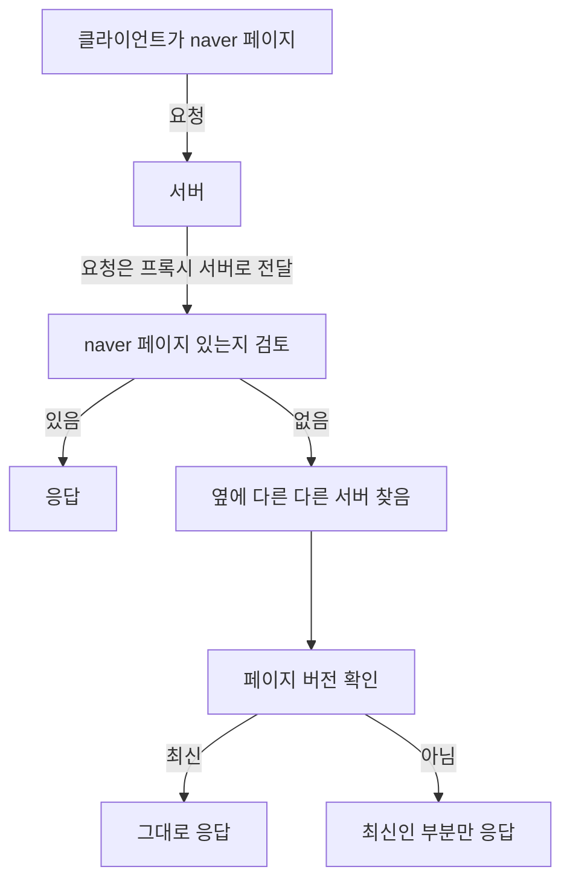

# 29주차

<!--truncate-->

## Laravel은 문서화 주석이 신기합니다.

```php
/*
|--------------------------------------------------------------------------
| Broadcast Channels
|--------------------------------------------------------------------------
|
| Here you may register all of the event broadcasting channels that your
| application supports. The given channel authorization callbacks are
| used to check if an authenticated user can listen to the channel.
|
*/
```

## 07.18

## Proxy 서버

일단 Proxy가 대리인이라는 것은 알고 있습니다.

> 프록시 서버(영어: proxy server 프록시 서버[*])는 클라이언트가 자신을 통해서 다른 네트워크 서비스에 간접적으로 접속할 수 있게 해 주는 컴퓨터 시스템이나 응용 프로그램을 가리킨다. 서버와 클라이언트 사이에 중계기로서 대리로 통신을 수행하는 것을 가리켜 '프록시', 그 중계 기능을 하는 것을 프록시 서버라고 부른다.
>
> \- 위키피디아(wikipedia)

서버와 클라이언트 중간에 위치합니다. 클라이언트를 위한 대리인이라고 볼 수 있습니다.

레거시 시스템에서는 캐싱을 유지하지만 최근(2023년)에는 CDN이 역할을 대신합니다.



[Proxy vs Reverse Proxy (Real-world Examples)](https://www.youtube.com/watch?v=4NB0NDtOwIQ)

클라이언트를 위한 proxy를 보고 forward proxy라고 부릅니다. 클라이언트의 요청을 모두 받아 웹 서버로 요청을 보내주면서 클라이언트의 익명성을 확보할 수 있게 됩니다. 클라이언트 요청 ip 주서는 proxy에 남고 웹서버는 proxy 서버 ip 주소가 남기 때문입니다.

revers proxy는 서버를 위한 proxy 서버입니다. 웹서버가 단일 웹서버만 존재하지 않습니다. 여러개의 웹서버가 존재하는데 이 요청을 나누어주는 로드벨러 역할을 하는 서버입니다.

https://ko.vitejs.dev/config/server-options.html#server-proxy

vite에서 proxy 서버를 만드는 방법도 알려줬습니다.

## 07.19

[The BETH Stack: Build Hypermedia-Driven Web Apps with Great DX and Performance](https://www.youtube.com/watch?v=cpzowDDJj24)

## clsx

docusaurus가 내부적으로 clsx를 사용하는 것을 발견했습니다. 그래서 저도 활용하면 무슨 장점이 있는지 궁금해졌습니다.

[Clsx - What is and how to use it](https://stackoverflow.com/questions/57557271/clsx-what-is-and-how-to-use-it)

의외로 추천을 많이 받은 질문입니다.

> `clsx` is generally used to conditionally apply a given `className`

최고의 답입은 위에 해당합니다. 조건부 랜더링으로 클래스를 적용한다는 것입니다. 사실 스타일은 중복이 조금 발생해도 괜찮다고 생각하는 사람입니다. 상당히 해로운 생각이지만 여기는 중국이 아니고 당신은 마오쩌둥이 아닙니다.

사실 css가 발전한 것이 생각보다 많습니다. 이제 container query도 지원하고 nesting도 지원합니다.

[Getting started with CSS nesting](https://www.youtube.com/watch?v=YnWPeA6l5UE)

```ts
console.log(clsx(true, false, '', null, undefined, 0, NaN)); // ""
```

이렇게 보고 또 생각해보면 상당히 로직이 단순합니다.

```js title="Mobile/index.js"
import React from 'react';
import clsx from 'clsx';
// highlight-next-line
import { ThemeClassNames } from '@docusaurus/theme-common';
import { useDoc } from '@docusaurus/theme-common/internal';
import TOCCollapsible from '@theme/TOCCollapsible';
// highlight-next-line
import styles from './styles.module.css';
export default function DocItemTOCMobile() {
  const { toc, frontMatter } = useDoc();
  return (
    <TOCCollapsible
      toc={toc}
      minHeadingLevel={frontMatter.toc_min_heading_level}
      maxHeadingLevel={frontMatter.toc_max_heading_level}
      // highlight-next-line
      className={clsx(ThemeClassNames.docs.docTocMobile, styles.tocMobile)}
    />
  );
}
```

이렇게 사용할 수 있습니다.

`ThemeClassNames`는 문자열을 담은 객체입니다. 공용으로 다룰 클래스명을 상수처리한 것으로 보입니다.

## 안좋은 습관

dgx
dfs
foobar
foo
bar
baz
qux
quux
corge
grault
graply
waldo
fred
plugh
xyzzy
thud

위 이름을 활용해서 예시를 작성하는 사람들이 있습니다. 나쁜 습관입니다.

## 07.20.

https://www.youtube.com/watch?v=KzV0mTqBcZA

- mocking은 테스트에서 value가 낮습니다.
- 백엔드 분야에서 결합 테스트는 테스트 DB에 연결하는 것이 더 좋은 결합테스트입니다.
  - mocking을 위한 노력이 더 들어갑니다.

[React team celebrating the release of React 20](https://www.youtube.com/shorts/OOn8bnjfTOw)

## 07.21

https://inpa.tistory.com/entry/JEST-%F0%9F%93%9A-supertest-api-%EC%9A%94%EC%B2%AD%ED%85%8C%EC%8A%A4%ED%8A%B8

## 용어 줍줍

ETA: estimated time of arrival

## 07.22.

[The Science of Learning While You Sleep](https://www.youtube.com/watch?v=2hIhFlNMFxY)

- 4시간 간격으로 하루 2번 이상 보기
- 스트레스 X
- 정신적으로 안정 취하기

## TLD란 무엇인가?

### tl;dr

- TLD는 Top level domain을 의미합니다.
- 전통적이고 보수적인 선택을 하기 바랍니다. 이상한거 고르면 작은 섬나라한테 고소당할 수 있습니다.

[I lost my website for the dumbest reason possible - theo](https://www.youtube.com/watch?v=9Bg9XUEM82E)

[Everything You Need to Know About DNS: Crash Course System Design #4 - ByteByteGo](https://www.youtube.com/watch?v=27r4Bzuj5NQ)

IP를 찾을 때는 DNS 서버에서 조회를 하는데 그냥 DNS resolver에게 요청하고 응답하게 아닙니다. DNS hierarchy가 있고 그 순서대로 조회하고 응답하는 순서입니다.

DNS resolver

Root Name Server, TLD name server, authoritative name server

any cast

[TLD란? 최상위 도메인을 위한 입문 가이드](https://ko.wix.com/blog/post/what-is-tld)

## 배포 플랫폼 알아보기

백엔드를 배포하는데 deno deploy는 실망스러운 것이 너무 많아서 다른 배포 옵션을 고려하기 시작했습니다.

deno deploy에 해당하는 docker image도 못찾고 있습니다.

docker hub에서 deno deploy랑 동일한 docker image를 발견한 분이 있다면 제보부탁드립니다.

하지만 이미 점유율이 어느정도 있는 백엔드 프레임워크의 docker image를 쉽게 찾고 테스트 코드도 쉽게 작성할 수 있을 것 같습니다.

aws가 업계 표준이지만 저는 쫄보라 함부로 활용하고 싶지 않습니다.

어떤 가격을 넘으면 가동을 중단 시킬 google cloud run이 있습니다.

[google cloud run](https://cloud.google.com/run?hl=ko)

클라우드를 찾다가 유튜브 광고로 나왔습니다. 유튜브는 저를 디발자로 보고 있는 것 같습니다. 사실 이 광고를 엄청 많이 봤습니다.

[vultr](https://www.vultr.com/)

어제 발견한 블로그에서 힌트를 얻고자 했습니다.

[Run npm and Deno anywhere](https://deno.com/blog/npm-and-deno-anywhere#google-cloud-run)

[Digital Ocean](https://www.digitalocean.com/)

[AWS Lightsail](https://aws.amazon.com/ko/lightsail/)

[Cloudflare Workers](https://workers.cloudflare.com/)

참고로 Cloudflare는 무료 사용이 가능한 부분이 있습니다.

다른 서비스도 알고 있던 것도 추가하겠습니다.

[railway](https://railway.app/)

위는 최소한 가격이 고정되어 있습니다.

[fly.io](https://fly.io/)

위도 배포할 때 많이 활용합니다.

[deno deploy](https://deno.com/deploy)

탈출하려는 deno deploy이지만 무료인 것은 상당히 매력적입니다. 하지만 탈출하고 싶습니다.

회원가입할 때 신용카드 안 물어보는 곳에 가입하고 서버좀 무료로 사용하고 싶습니다.

[northflank](https://northflank.com/)

bun은 또 어떻게 배포하나 의문이 생겼었는데 스폰서 아티클을 발견하고 위 사이트를 발견했습니다.

[There ain't no such thing as a "free" tier](https://www.youtube.com/watch?v=ciF7WZXmpjU)

[heroku](https://www.heroku.com/)

위는 더이상 무료가 아닙니다.

[linode](https://www.linode.com/)

이쯤되면 그냘 라즈베리 파이쓰고 싶습니다.

## nest.js 읽을거리

node.js는 medium에서 읽을 것을 권장한다고 합니다. node.js 개발자가 되고 싶은 것은 아니지만 지식을 얻을 곳을 찾았습니다.

[Nest.js — Architectural Pattern, Controllers, Providers, and Modules.](https://medium.com/geekculture/nest-js-architectural-pattern-controllers-providers-and-modules-406d9b192a3a)

[Why I choose NestJS over other Node JS frameworks](https://medium.com/monstar-lab-bangladesh-engineering/why-i-choose-nestjs-over-other-node-js-frameworks-6cdbd083ae67)
