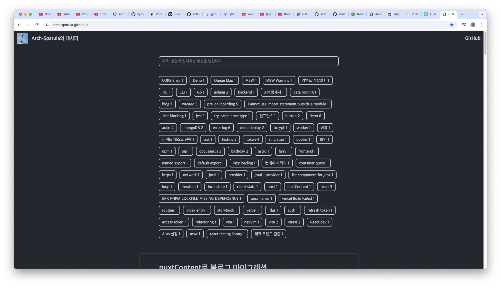

<!--

-->

# 2025년 블로그 재단장하기 1편

:::caution

이 글은 기술로 문제를 해결한 것보다 기술을 활용하면서 얻은 감회를 쓴 글입니다. 기술적인 내용은 다음편에 나옵니다.

:::

## 블로그를 다시 만들기로 시작한 이유

- 다시 만들기 시작한 이유는 많습니다.
- 막상 [nuxtContent](https://content.nuxt.com/)를 사용해도 만족스럽지 않았습니다.
  - nuxtContent는 여전히 빌드가 실패했습니다. 더 심각한 것은 무슨 마크다운 파일 때문에 깨진다고 터미널에 출력을 안해주고 그냥 빌드 실패만 출력합니다. 여전히 상대하기 어려운 피드백입니다.
    - 이것은 상당히 심각한 문제였습니다. 꽤 많은 글을 작성했는데 하루아침에 안 되는 것은 곤란하다고 봤습니다.
    - 매월 버전을 업데이트하는데 하루 아침에 피드백 없이 동작 안 하는 것은 너무 부조리하다는 느껴졌습니다.
    <!-- 이렇게 저는 원하는 것은 화려한 최신기술로 감싸진 것이 아니라 자급자족(self sufficient)을 흉내낼 수 있는 것을 바라기 시작했습니다. nuxtContent도 제가 원하지 않던 추상화가 되었습니다. 저는 다른 사람의 실수를 제가 감당하고 싶지 않았습니다. 다른 사람의 설계 변경결정에 영향을 받아 대응해주는 번거로움을 피하고 싶어졌습니다. -->
  - 아직 공개하지 않을 글을 다른 프레임워크들처럼 `draft`라고 하지 않고 `_draft`로 선언해야 하는 것도 마음에 안 들었습니다.
  - 순수하게 표현방식이 마음에 안든 것이 문제가 아닙니다. 이런 표현을 해줘야 한다고 공식문서에서 발견할 수 없었다는 점이 더 크게 작용했습니다.
  - 공식문서에 발견하지 못하고 stackoverflow에서 찾았습니다. 이것만 봐도 문서화가 얼마나 수준떨어지는지 알 수 있었습니다.
  - 저의 주장은 걸러서(take it with a grain of salt) 듣기바랍니다. nuxtContent가 적절한 유스케이스가 있을 것이지만 저의 경우 아닙니다. 저는 nuxtContent로 마이그레이션하고 많은 블로그 글을 작성하지 않았습니다. 잠시동안 방황했습니다~~잠시 개발 이외 취미를 갖고 있었습니다~~.
  <!-- 무엇을 어떤 생각을 사람들에게 공유하고 싶다는 생각을 안 했습니다. 새로운 기술을 공부하기 어려운 상황이었습니다. -->
- nuxtContent로 마이그레이션하면서 당시 제가 선택한 블로그의 디자인이 마음에 들지 않았습니다.
  - 이것은 저의 역량의 문제였습니다. 좋은 기준이 없었기 때문에 엉성한 결과가 나왔습니다.

<!--
- 개발자 블로그를 다시 만들어도 최대한 단순하게 다시 만들고 싶다는 생각이 들었습니다.
- 어떻게 하면 최대한 저에게 숨겨진 제어흐름을 제거하고 모든 부분을 잘 설계된 코드로 이해하며 만들고 싶었습니다.
-->
<!--
- 블로그 자체도 결국 소프트웨어라고 생각한다면 코드의 수명을 40년 단위로 길게 봐야할 필요가 있다는 생각이 들었습니다.
- 40년을 제가 생각하는 저의 개발자 커리어 기간입니다.
-->

---

<!--
- 제가 원하는 것은 엉성하고 수준떨어지는 추상화가 아닙니다.
  - 제가 실수하더라고 다른 사람의 실수가 아닌 저의 실수만 감당하고 싶습니다.
- 사실 nuxt만으로 만족을 할 수 없었습니다.
  - 결국 빌드는 깨졌습니다. 일부 블로그 글은 올릴 수 없었습니다.
  - 빌드가 깨지면 무슨 이유로 깨졌는지 알려줘야 하는데 nuxtContent도 결국 안 알려줬습니다.
  - 제가 원하는 것은 매직이 아니라 이해가 되었습니다.
    - 빌드가 실패한다면 무슨 이유로 실패하고 어떻게 고쳐야 하는지 알고 싶습니다.
    - 숨겨진 제어흐름이 편리하지 않고 오히려 혼란을 가져왔습니다.

 -->

## 고민한 것들

- 일생동안 약 4000개가 안 될 블로그 글을 작성하는데 모두 메모리에 올려서 처리하지 않으려고 고민하고 있습니다.
- 실제 존재하지 않는 문제를 해결하려고 고민하는 것인지 의문입니다.
- 마크다운 파일 1개 읽는데 그렇게 크지 않습니다.
- 다시 생각해도 디스크에서 같은 파일을 2번 읽어서 메모리 사용량을 줄이는 것이 더 안정적일 것 같습니다.
- 중간에 설계를 변경하는 것이 더 적절할 것 같습니다.
  - 메타정보를 읽고 처리하는 단계가 있어야 합니다.
  - 그 후에 파일 쓰기를 처리하는 단계가 있어야 합니다.
  - 각각의 블로그 글 별로 검색 기능이 지원되기 위해서는 이렇게 처리해야 합니다.

## 개발 전에 실험

- 이전에 [new-blog-2025](https://github.com/arch-spatula/new-blog-2025) 에서 개발자 블로그를 다시만든다면 어떻게 다시 만들지 실험을 했습니다.
  - vite를 사용했었는데 이 부분은 직접 블로그에서 수정을 시도하면서 실수였다는 생각이 들었습니다.
  - github pages에 공개할 것이면 높은 수준의 빌드 최적화가 필요한 것이 아닙니다.
  - 단순한 MPA로 처리해도 되었습니다.
  - vite로 MPA 스타일로 빌드를 처리하고자 했습니다. 이 부분은 올바른 선택이었습니다.
- 이 실험을 하기 위해서 neovim 에디터로 작업을 했습니다. ChatGPT에게 질문을 안 한 것은 아닙니다. 하지만 여전히 생산성은 낮았습니다.
  - 엄청 오래걸려야 할 작업이라고 생각해본다면 아닙니다.

### 맞춘 것

- 디자인을 다시했는데 다시 한 디자인이 올바른 것이었습니다.
  - nuxt로 마이그레이션 하면서 넣은 디자인은 상당히 마음에 안 들었습니다.
  - 새롭게 시도해보고자 하는 블로그는 [기계인간 John Grib](https://johngrib.github.io/) 의 레이아웃을 더욱더 적극적으로 표절[^3]했습니다.
    - 컬러 자체는 github 테마를 최대한 활용했습니다. 일관된 컬러는 적은 컬러이기 때문에 그렇습니다.
    - 의외로 콘텐츠 너비는 그렇게 까지 넓을 필요는 없었습니다.
    - 개발자 블로그를 많이 만들 때는 자주 참고하면서 생각을 바꾼 부분도 있습니다.
      - 경력이 있으면 본인의 업무랑 무관한 기술을 블로그 글에 작성해도 된다입니다. 누가 생각하기에는 당연하다고 보겠지만 전문성이라는 문제를 생각해보면 어느정도 자제해야 하는 것들이 맞습니다.
    - 블로그의 기능적인 것도 참고를 했습니다. 블로그를 더 편하게 사용하기 위해서는 단축키가 필요합니다.
    - [VitePress](https://vitepress.dev/)랑 같이 보고 저도 VitePress를 표절해서 검색 기능을 넣어주기로 했습니다.
- 의존성을 가능하면 많이 줄이는 것입니다.
- 검색은 `ctrl` + `k`로 숨겼다가 보여주는 것이 적절합니다.
  - nuxt로 만들었을 때는 상단에 항상 보였습니다. 태그가 생각보다 많은데 글 목록을 보기 위해 아래로 스크롤을 상당히 많이 내려줘야 했습니다.
- 상태 관리는 url에서 처리하는 것이 적절합니다.

- 여기서 태그가 더 많아지면 스크롤을 추가해야 합니다. 이중 스크롤 구조는 추할 것입니다.
- 모든 요소가 너무 넓습니다. 각 글마다 차지하는 공간이 너무 넓어 보입니다. 오히려 더 컴팩트해도 가독성을 유지할 수 있을 것입니다.

### 틀린 것

- vite를 사용해서 MPA를 빌드하려고 시도했습니다.
  - vite의 hook을 이해하고 빌드처리를 했어야 합니다. 없어도 될 복잡성이 었습니다.
  - vite의 hook을 이해해볼 수 있다는 것이 남기는 했습니다.
  - 개발이 되는 동안 이미지를 어떻게 처리할지 애매했습니다.
- 작업을 상당히 빠르게 끝냈 수 있을 것이라고 생각했습니다.
  - 모든 로직을 직접 만들면서 오히려 오래걸렸습니다.
- url로 상태를 표현 할 때는 클라이언트에서만 사용하기 때문에 쿼리 파라미터[^1]말고 해시[^2]를 사용했어야 합니다.
  - 쿼리 파라미터를 사용하면 url 객체를 사용할 때 [set 객체](https://developer.mozilla.org/ko/docs/Web/JavaScript/Reference/Global_Objects/Set)처럼 사용할 수 있다는 장점이 있었습니다.
- MPA를 지향했다고 해도 DOM 처리를 SPA처럼 동적으로 DOM 요소를 생성하고 제거하려고 했습니다.
  - 올바른 방법은 css와 클래스 정도 변경해서 `display: none`을 활용했어야 할 것 같습니다.
  - 프로젝트를 작업하고나서 지금 레포를 다시봐도 어떤 html 구조를 갖고 있었어야 하는지 단번에 파악이 안 됩니다.
- main 페이지(`/`)에서 블로그 글 목록을 표시할 때 이것을 `meta.json`의 데이터를 받아서 SPA처럼 처리해서 보여주도록 했습니다.
  - 이런 것도 결국에는 빌드타임으로 옮기는 것이 충분히 가능한데 굳이 클라이언트에게 보내고 처리하도록 했습니다.

## neovim에서 cursor로 변경

- 이부분은 생각이 많아지는 부분이었습니다. 먼저 취미의 목적은 여가시간을 즐겁게 보내는 것이지만 저에게 주어지는 여가시간보다 만들어보고 싶은 프로젝트가 더 많아지면서 개인적으로 cursor 구독을 결정하게 되었습니다. cli 기반의 AI를 사용할 수 있었지만 회사와 동일한 툴로 맞추고 싶어서 cursor를 사용하기로 했습니다. 상당히 합리적인 요금제와 커맨드라인에서 제어하기 쉬우면 neovim을 다시 설정하러 돌아갈 것입니다.
- 작업을 해보면서든 생각은 원래 회사에서 느껴야 했지만 AI에게 로직의 외주확 가능하겠다는 것입니다. 소프트웨어 엔지니어링이라는 부분에서 프로그래밍이라는 부분을 외주화를 하게 됩니다. 프로그래밍을 외주화하는 소프트웨어 엔지니어링에서는 무엇이 남는가? 이 부분을 고민이 들었습니다.
  - 소프트웨어 엔지니어링과 직접적으로 관련 된 부분은 요구사항 분석, 설계, 테스트, 인프라, 소스관리(git), 코드 리뷰, 디버깅, 작업관리 등... 이런 부분들이 남습니다.
    - 실제 소스에 문제가 있고 ai를 신뢰할 수 없다면 개발자가 직접 코드를 확인해야 합니다.
    - 기능을 추가하면서 코드베이스에 엔트로피가 증가하는데 이를 최대한 줄일 수 있는 방향으로 끌고가야 합니다.
  - 소프트웨어 엔지니어링이 아닌 비즈니스에 더 집중해야 한다는 생각이 듭니다. 1인 개발자 시대가 맞다고 봅니다. 개발자가 PM이 되는가? 아니면 PM이 개발자가 되는가? 모호해진다는 생각이 들정도로 AI가 유용했습니다.

<!--
- 회사에서 핵심적이지 않은 로직 작성을 AI에게 외주화가 가능해졌으면 로직을 고민하는 것보다 설계와 테스트를 잘하는 것이 더 이팩티브하지 않을까? 라는 피드백을 받았습니다.
- AI가 작성할 로직은 최대한 격리하고 테스트 가능한 방식으로 설계해서 작업한다면 원하는 결과를 빠르게 얻어내는 것이 가능하다는 생각이 들었습니다.
- 어느정도 생산성이 기반이 되어야 합니다.
  - 원래 사용하던 neovim을 버려야 했습니다.
  - 직장에서 cursor를 사용했습니다. 처음에는 부정적이었는데 사용하면서 생각이 바뀌었습니다.
  - 꽤 적절한 피드백입니다. MVP를 빨리 뽑기 위해 이팩티브한 방법이 맞습니다.
- AI가 모든 로직으 올바르게 작성할 것이라고 가정할 수 없습니다.
  - 로직이 틀렸다면 어떻게 로직이 틀릴 수 있는지 검증하는 것이더 효과적입니다.
- 직장을 다니고 취미도 생기면서 시간이 많이 없어졌습니다.
  - 정말 필요하다면 이직 준비를 위해 취미를 포기할 수 있습니다. ~~정말 그만두는 것은 아니고 오랫동안 쉴 가능성이 높습니다.~~
- 블로그를 만들기 위해 돈을 발라서 해결한 경우에 해당합니다. 이 블로그는 대략 26달러 정도 들었습니다. 크몽 외주를 생각해보면 저는 결과를 만족할 수 있었습니다.
- 요청 하나당 몇 백원단위라고 생각하면 상당한 신중함이 필요합니다. 물론 엄청난 프롬프트 퀄리티가 필요해야 이런 결과를 갖는 것은 아닙니다. 하지만 해결하고자 하는 것이 얼마나 좋은 비즈니스 가치를 갖는지 생각해야 합니다.
- 오늘 저는 26달러로 블로그를 만들었지만 이 블로그를 계속 유지하고 저의 생각을 표현하는 도구를 스스로 만들어 얻었다고 생각하면 저렴한 편입니다.
  - 투자 자금이라고 생각한다면 더욱더 적극적으로 블로그 글을 작성해야 할 이유가 생깁니다.
- 질문당 정말 비싸면 2달러 정도 합니다.
  - 여기서 2달러를 지불하고 정답지를 당장 확인할 수 있습니다. 물론 정답지는 다양하지만 당장 얻은 정답지입니다.
  - 2달러를 내고 하루를 아낄 수 있다고 생각하면 코딩은 저렴한데 제품개발은 비싼 취미라는 생각이 듭니다.
- 매달 16일이 되는 것을 기다려야 한다는 것이 아쉬워야 하는 것인지 아닌지 잘 모르겠습니다.
  - 토큰을 다 쓰면 DSA를 공부하고 토큰이 풍족하면 사이드 프로젝트를 진전시키면 될 것이라는 생각이 듭니다.
 -->

## 개발을 진행하면서 사용하기 시작한 툴

- [lazygit](https://github.com/jesseduffield/lazygit)은 터미널에서 작업할 때 많이 사용했는데 cursor 터미널에서도 사용하고 있습니다.
  - cursor의 커밋 관련 기능은 단축키로 킬 수 있지만 결국 무엇을 추가하고 삭제할지 마우스로 제어가 필요했습니다.
  - github 데스크탑은 회사에서 사용하지만 기능이 너무 제한적이었습니다. 또 마우스를 클릭하기 위한 노력이 필요했습니다.
  - 마우스를 사용하지 않으면서 무엇을 커밋에 올리고 말고 또 github 데스크탑보다 기능이 많은 lazygit이 편리했습니다.
- [yazi](https://yazi-rs.github.io/)를 사용하기 시작했습니다.
  - 개발자 블로그에서 이미지를 넣었을 때 전에는 그냥 링크를 활용했었습니다. 하지만 어느날 github의 정책 변경 시점 이후로 url 주소가 계속 바뀌었습니다.
  - github 이슈 자체가 이미지 스토리지로 사용하기 어려워졌습니다. 이런 이유로 이미지를 커밋에 올리기로 했습니다.
  - 이미지를 커밋으로 관리하면 무슨 폴더에 속해야 하는지 관리가 필요하고 이를 이동시키는 작업에 yazi가 적절했습니다.
  - 파일을 드래그앤 드롭하기에는 너무 글과 이미지가 너무 많아졌습니다.

## 블로그 프로젝트 설계

- 코드베이스를 파악하기 위해 이 레포를 clone하고 LLM에게 질문을 해야 한다고 하면 최대한 `app/build.ts`와 `app/client/index.ts` 2개를 설명해달라고 하기 바랍니다. 이 2개의 파일이 node.js에서 빌드를 처리하는 로직과 클라이언트에서 이벤트를 등록하는 부분 2가지라고 생각할 수 있습니다.
  - 개발의존성은 늘어나도 클라이언트에게 전달하고자 하는 의존성은 제거하는 것이 의도입니다. 정적페이지인데 당연합니다.
  - 가능하면 모든 것을 빌드시점으로 옮기고자 했습니다. 정적페이지를 만드는데 당연합니다. 제가 이런 결정을 내리도록 하는데 영감을 준 것은 2가지입니다. 하나는 소프트웨어는 단순함을 추구해야 한다는 [Tom Delalande](https://www.youtube.com/@tom-delalande)의 생각입니다. 다른 하나는 zig라는 언어로 breaking changes가 상당히 많은 언어라 비판을 많이 받지만 최소한 많은 로직을 컴파일타임에 처리하도록 요구하는 언어입니다. 언어 자체부터 극도로 단순함을 추가하고자 했습니다. 저는 이런 점을 본받아보고 싶었습니다. node.js로 정적사이트를 만들어줘도 마크다운 파일 입출력에 불과하기 때문입니다.
  - `app/build.ts`에서는 빌드 시점에 마크다운 파일들의 목록을 나열, 읽기, 메타정보처리, html로 변환처리, html 파일 저장 등 로직을 처리합니다.
  - `app/client/index.ts`은 클라이언트가 사용할 기능의 이벤트를 등록하는 정도의 기능입니다.
- 가능하면 최대한 적은 의존성으로 해결하고자 했습니다.
  - 의존성을 줄이고 직접 구현할 때마다 cursor의 토큰을 많이 사용해야 합니다. 각각의 엣지케이스를 본인이든 AI든 둘 중 하나가 처리해야 합니다.
  - 추가를 해도 괜찮았을 것 같지만 안 한 라이브러리가 있다면 [handlebars.js](https://handlebarsjs.com/)입니다. 미래에 단순한 node.js http 서버에 템플릿으로 활용했을 것 같습니다. ejs를 사용해야 하나 고민했었는데 필요 없어졌습니다.

<!--
- 이 프로젝트는 가능하면 테스트 코드를 넣고자 했습니다. 모든 것을 테스트하지는 않고 로직 위주로 테스트 했습니다. 지금은 vitest를 테스트 러너로 사용하고 있습니다. 테스트의 가정은 데이터를 만약에 받는다면 올바르게 처리하는지 정도만 테스트합니다. 실제 브라우저에서 동작방식을 확인하는 테스트는 아직 안 넣었습니다.
- 파일 입출력은 테스트할 필요가 없습니다.
  - 입출력을 할 것인데 무슨 파일 이름으로 저장할지는 테스트할 가치가 있습니다.
  - 파일의 내용을 읽으면 어떻게 처리하는지 이 처리를 가장 많이 테스트해야 합니다.
    - 템플릿처리를 해주는 패키지를 설치할 수 있었지만 AI에게 시켰는데 알아서 잘 해주었습니다. 이 템플릿처리를 어떻게 할지 AI 보고 로직을 작성하게 만들고 테스트 코드도 작성하게 시켰습니다.
- 여기까지는 철학의 문제입니다. 실제 작업을 하면서 설계는 꽤 많이 바뀌었습니다.
  - 가장 먼저 레이어드 아키텍쳐처럼 마크다운을 입력부라고 생각하고 파일내용을 처리하고 html파일을 저장만 하면 된다고 생각했습니다. 이 로직자체는 본질은 맞지만 몇개의 겹으로 쌓였습니다.
- 클라이언트는 화려한 기능이 필요한 것이 아니라 내용을 찾기 쉬워야 합니다.

- 회사에서 모든 것을 테스트하겠다는 생각을 갖고 있던 사람이 있었습니다.
  - 얻은 교훈들이 있습니다. 모든 것을 테스트하자고 요구한 사람은 테스트를 잘 모르는 사람입니다.
    - 모든것을 E2E 테스트로 처리하고자 했습니다. 실제 http 컨넥션가까디 다 테스트가 되어야 한다고 봤습니다. 기본 데이터베이스를 그대로 연결하려고 시도했습니다.

 -->

## 블로그를 다시 만들면서 배운 것

- AI 회의론이 강했던 저의 생각을 바꿀 수 있었습니다.
- 초기 프로젝트는 어려운 로직을 아주 잘 짜는 것보다 설계를 잘 하는 것이 더 이팩티브합니다.
- 리뷰하는 스킬이 중요해 보입니다.
  - AI로 로직 작성을 하면서 여전히 처리부에 있어야할 로직이 마지막 쓰기에 위치하는 경우가 많았습니다. 원하는 결과는 얻어도 유지보수를 위해 테스트하기 쉬운 구조로 수정해달라고 요구해야 합니다.
- 회사랑 동일하게 git을 효과적으로 사용할 줄 알아야 합니다.
  - 마음에 드는 기능 일부는 커밋으로 남기고 마음에 안드는 부분을 다시 작성해달라고 해야 합니다.
  - lazygit을 활용해서 브라우저 접속을 제외하고 마우스 없는 개발을 지향할 수 있고 지향해야 합니다.
- 확실히 지금 개발자 블로그 프로젝트는 그린필드 프로젝트라서 LLM 성능이 상당히 좋습니다.
- AI가 작성해준 코드인데 코드 퀄리티가 평균이라고 보면 이 평균이라는 것 허들은 상당히 높습니다.
  - 물론 코드 퀄리티에서 기능과 관련된 퀄리티입니다. 설계와 디버깅은 휴먼인더 루프를 반드시 의존할 수 밖에 없었습니다.

<!--
- AI로 작성된 로직을 테스트하기 쉬운 코드인가?
  - 파일 읽기, 파일 쓰기를 테스트할 범위에서 제외하고 처리 로직에 최대한 몰아버릴 수 없는가?

- 글을 쓰면서 이런 생각도 들었습니다. 제가 이렇게 로직을 다시 이해하기 위해 정리하고 공유하는 것이 진정으로 의미가 있는가? 그리고 코드가 의미가 있는가? 물론 코드는 의미가 없고 해결하는 문제가 의미 있다는 것을 알고 있고 또 컴퓨터의 동작방식인 지식이 의미가 있다는 것을 알고 있습니다.
- 이 글을 진정으로 완성하고 싶다면 매일 1시간 글 작성을 위해 노력이 필요할 것 같습니다.

 -->

## 앞으로 해볼 작업

- fuse.js로 클라이언트에서 검색 퀄리티 높이기
  - 지금까지 모두 개발의존성(devDependencies)인데 런타임에 필요한 의존성(dependencies)을 처음으로 추가해야 한다는 것이 고민입니다.
  - 아마 런타임에 사용할 패키지를 추가하지 않고 직접 로직을 넣어야 할 것 같습니다.
- webp로 변환처리
  - 이미지를 더 경량화 시킬 수 있을 것입니다. 새로고침 혹은 태그를 누를 때마다 새로고침이 발생하는데 이미지가 느려서 깜빡이는 현상을 막고 싶습니다.
- e2e 테스트로 깨진 이미지를 발견
  - 이 부분은 CI 까지 연결되어야 가치가 클 것 같습니다.
- 클라이언트 의존성 없이 차트 표시하기
  - 이 부분은 어떻게 빌드시점으로 처리하게 만들 수 있는지 고민입니다.
  - 각 의존하고 있는 페이지 단위로 의존성이 있어야 한다고 봅니다.

[^1]: 예 - `/users?id=123`

[^2]: 예 - `#foo`

[^3]: 표절이 적절하다 싶을 정도로 배끼고자 했습니다. 이것으로 피해를 본 사람이 있는지 궁금합니다.
