<!--
@todo: mermaid 다이어그램 빌드 스탭에 처리하도록 만들기
@todo: 다이어그램을 2025-11-23-new-blog.md에 정리하기
@todo: 이미지를 마크다운 폴더에 같이 넣어둔 로직 작성하기
-->

## 프로젝트 템플릿 처리 방식

### 1. 전체 빌드 흐름

```mermaid
flowchart TB
    subgraph Init["초기화 단계"]
        A[build.ts 시작] --> B[템플릿 파일 로드]
        B --> B1[app.html]
        B --> B2[post.html]
        B --> B3[main.html]
        B --> B4[search.html]
    end

    subgraph Prepare["준비 단계"]
        C[마크다운 파일 목록화] --> D[dist 폴더 초기화]
        D --> E[asset 폴더 복사]
        E --> F[이미지 파일 복사]
        F --> G[client TS → JS 빌드]
    end

    subgraph Meta["메타데이터 처리"]
        H[마크다운 파일 읽기] --> I[메타데이터 추출]
        I --> J{draft 여부}
        J -->|draft: true| K[스킵]
        J -->|draft: false| L[metaJson에 추가]
        L --> M[태그 정보 수집]
    end

    subgraph Render["렌더링 단계"]
        N[search 템플릿 렌더링] --> O[각 포스트 처리]
        O --> P[main 페이지 생성]
        P --> Q[404 페이지 생성]
    end

    Init --> Prepare
    Prepare --> Meta
    Meta --> Render
```



### 2. 템플릿 엔진 처리 순서

```mermaid
flowchart LR
    subgraph Input["입력"]
        T[템플릿 문자열]
        D[데이터 객체]
    end

    subgraph Process["render 함수 처리 순서"]
        A["1️⃣ renderConditional<br/>조건문 처리"] --> B["2️⃣ renderEach<br/>반복문 처리"]
        B --> C["3️⃣ renderTemplate<br/>플레이스홀더 치환"]
    end

    subgraph Syntax["지원 문법"]
        S1["{{#if KEY}}...{{/if}}"]
        S2["{{#each ARRAY}}...{{/each}}"]
        S3["{{PLACEHOLDER}}"]
    end

    T --> A
    D --> A
    C --> R[렌더링된 HTML]

    A -.-> S1
    B -.-> S2
    C -.-> S3
```



### 3. 템플릿 조합 구조

```mermaid
flowchart TB
    subgraph Templates["템플릿 파일들"]
        APP["app.html<br/>(기본 레이아웃)"]
        POST["post.html<br/>(포스트 내용)"]
        MAIN["main.html<br/>(블로그 목록)"]
        SEARCH["search.html<br/>(검색 팝업)"]
    end

    subgraph PostPage["포스트 페이지 생성"]
        MD[마크다운 파일] --> HTML[HTML 변환]
        HTML --> POST_RENDER["post 템플릿 렌더링<br/>{{content}}, {{tags}}, {{toc}}"]
        POST_RENDER --> APP_RENDER["app 템플릿 렌더링<br/>{{body}}, {{search}}"]
    end

    subgraph MainPage["메인 페이지 생성"]
        META[metaJson] --> MAIN_RENDER["main 템플릿 렌더링<br/>{{#each posts}}"]
        MAIN_RENDER --> APP_MAIN["app 템플릿 렌더링<br/>{{body}}, {{search}}"]
    end

    POST --> POST_RENDER
    APP --> APP_RENDER
    APP --> APP_MAIN
    MAIN --> MAIN_RENDER
    SEARCH --> APP_RENDER
    SEARCH --> APP_MAIN

    APP_RENDER --> DIST1[dist/*.html]
    APP_MAIN --> DIST2[dist/index.html]
```



### 4. 마크다운 → HTML 변환 파이프라인

```mermaid
flowchart TB
    subgraph Remark["Remark 파싱"]
        A[마크다운 원본] --> B[remark-parse]
        B --> C[remark-gfm]
        C --> D[remark-directive]
        D --> E[remarkCallout]
    end

    subgraph Rehype["Rehype 변환"]
        E --> F[remark2rehype]
        F --> G[rehype-slug]
        G --> H[rehypeExtractToc]
        H --> I[rehype-shiki]
        I --> J[rehype-stringify]
    end

    J --> K[HTML + TOC]
    K --> L[escapeTemplateSyntax]
    L --> M[최종 HTML]
```



### 5. 데이터 플로우 상세

```mermaid
flowchart TB
    subgraph Source["소스 파일"]
        MD[blogs/*.md]
        TPL[app/templates/*.html]
    end

    subgraph Processing["처리 과정"]
        READ[readMarkdownFile] --> SPLIT[splitMetadataAndContent]
        SPLIT --> META_PROC[processMetaData]
        SPLIT --> MD_PROC[processMarkdownFile]

        META_PROC --> |metadata| METAJSON[(metaJson)]
        MD_PROC --> |html| TEMPLATE[템플릿 엔진]
    end

    subgraph Output["출력"]
        TEMPLATE --> HTML_FILE[dist/*.html]
        METAJSON --> JSON_FILE[dist/meta.json]
    end

    MD --> READ
    TPL --> TEMPLATE
    METAJSON --> TEMPLATE
```



### 주요 템플릿 플레이스홀더 정리

| 템플릿        | 플레이스홀더                   | 설명               |
| ------------- | ------------------------------ | ------------------ |
| `app.html`    | `{{body}}`                     | 메인 콘텐츠 영역   |
|               | `{{search}}`                   | 검색 팝업 HTML     |
|               | `{{title}}`, `{{description}}` | SEO 메타 정보      |
| `post.html`   | `{{content}}`                  | 마크다운 변환 HTML |
|               | `{{#each tags}}`               | 태그 목록 반복     |
|               | `{{#each toc}}`                | 목차 반복          |
|               | `{{#if previousPost}}`         | 이전 글 조건부     |
| `main.html`   | `{{#each posts}}`              | 블로그 목록 반복   |
| `search.html` | `{{#each tags}}`               | 태그 필터 목록     |
|               | `{{#each posts}}`              | 검색 결과 목록     |

이 다이어그램들이 프로젝트의 템플릿 처리 방식을 이해하는 데 도움이 되셨으면 좋겠습니다! 🎨

<!--
## 세이브 원고
## 초기화 시점에 실행할 로직들

```ts
const metaJson: Metadata[] = [];

const appTemplate = await readFile(join(process.cwd(), 'app', 'templates', 'app.html'), 'utf8');
const postTemplate = await readFile(join(process.cwd(), 'app', 'templates', 'post.html'), 'utf8');
const mainTemplate = await readFile(join(process.cwd(), 'app', 'templates', 'main.html'), 'utf8');
const searchTemplate = await readFile(join(process.cwd(), 'app', 'templates', 'search.html'), 'utf8');

// /blogs의 모든 마크다운 파일 가져오기
const blogsDir = join(process.cwd(), 'blogs');

// dist 폴더 내용 초기화하기
await rm(join(process.cwd(), 'dist'), { recursive: true, force: true });
mkdirSync(join(process.cwd(), 'dist'), { recursive: true });

// asset 폴더 내용 복사하기
await cp(join(process.cwd(), 'app', 'asset'), join(process.cwd(), 'dist'), { recursive: true });

// client TypeScript를 JavaScript로 빌드하기
await esbuild.build({
  entryPoints: [join(process.cwd(), 'app', 'client', 'index.ts')],
  bundle: true,
  minify: true,
  outfile: join(process.cwd(), 'dist', 'script.js'),
  target: 'es2020',
  platform: 'browser',
});

// 메타 정보와 마크다운 콘텐츠를 저장할 맵 (파일 경로 기준)
const contentMap = new Map<string, string>();

// 깨진 이미지 링크 수집용 배열
const allBrokenImageLinks: BrokenImageLink[] = [];
const assetDir = join(process.cwd(), 'app', 'asset');
```

- 초기화는 극도로 단순합니다.
- 변수는 메타정보를 담을 배열 `metaJson`, 마크다운 문자열을 파일 경로랑 맵핑할 `contentMap`, 깨진 링크를 저장할 배열 `allBrokenImageLinks`를 선언합니다. 이 변수들은 데이터를 처리하면서 담기 위한 용도입니다.
- 빌드를 처리하면서 읽기만을 위해 템플릿으로 활용할 html 파일을 읽고 마크다운과 `asset` 경로에 해당하는 문자열을 초기화 합니다.
- 처리하는 행위는 `dist` 폴더를 비워버리고 `asset` 폴더의 이미지를 복사하고 클라이언트 런타임에서 실행할 로직을 타입스크립트에서 자바스크립트로 변환하고 `script.js`로 저장합니다.
- 여기서는 모두 node.js에서 제공하는 함수와 설차힌 esbuild 라이브러리 정도 활용했습니다.

## 마크다운과 이미지 경로 리스트업

```ts
// /blogs의 모든 마크다운 파일 가져오기
const blogsDir = join(process.cwd(), 'blogs');
const markdownfiles = await listUpMarkdownFiles(blogsDir);

// blogs 폴더의 이미지 파일들을 dist로 복사 (폴더 구조 유지)
const imageFiles = await listUpImageFiles(blogsDir);
for (const imagePath of imageFiles) {
  // blogs/ 기준 상대 경로 유지
  const relativePath = imagePath.replace(`${blogsDir}/`, '');
  const destPath = join(process.cwd(), 'dist', relativePath);
  mkdirSync(dirname(destPath), { recursive: true });
  await cp(imagePath, destPath);
}
```

- 처리할 리스트업은 2가지입니다. 마크다운의 목록과 처리할 이미지 목록 정도 가져오고 처리하면 됩니다.
- 이미지 복사는 단순해서 바로 작성했습니다.
- 더 높은 수준을 갖게 만들고자 했으면 webp로 변환처리하는 로직을 넣는 것이지만 지금 굳이 하고 싶지 않습니다.

### 폴더 구조

- 여기서 알아둘 점은 마크다운이 있는 폴더에 같이 활용할 이미지를 같이 넣었습니다. 빌드할 때 같은 폴더 구조를 유지하게 만들었습니다.
- 이것은 의도를 갖고 있습니다. 기존 프레임워크들은 마크다운과 이미지를 서로 다른 폴더에 넣어서 관리하도록 강제했습니다. 개발하면서 마음에 안 든 것은 이미지추가를 할 때 폴더를 별도로 관리해야 한다는 것이 불필요한 복잡성을 줬다고 생각이 들었습니다.

```
/root
  /content
    /blogs
      /2025-12-14
        /foo.md

  ...(생략)

  /public
    /asset
    /blogs
      /2025-12-14
        /bar.png
```

- `content/blogs/2025-12-14/foo.md`에 마크다운 글이 있고 `public/blogs/2025-12-14/bar.png`가 있다는 것이 서로 동떨어졌습니다.

```
/root
  /blogs
    /2025-12-14
      /foo.md
      /bar.png
```

- `blogs/2025-12-14/foo.md`와 `blog/2025-12-14/bar.png`로 보면 더 편할 것입니다. 저는 실제로 이 글에서만 해당하는 이미지인데 굳이 다른 파일에서 관리하는 것이 번거롭습니다.
  - 저는 위와 같은 형태의 폴더링이 더 자연스럽다고 봅니다.

### 리스트업 로직

```ts
/**
 * @param dirPath 디렉토리 경로
 * @param baseDir 기본 디렉토리 경로
 * @returns 마크다운 파일 목록을 반환함
 */
const listUpMarkdownFiles = async (dirPath: string, baseDir: string = dirPath) => {
  const posts: { filePath: string; isProcessed: boolean }[] = [];

  const entries = await readdir(dirPath, { withFileTypes: true });

  for (const entry of entries) {
    const fullPath = join(dirPath, entry.name);

    if (entry.isDirectory()) {
      // 재귀적으로 하위 디렉토리 탐색
      const subPosts = await listUpMarkdownFiles(fullPath, baseDir);
      posts.push(...subPosts);
    } else if (entry.isFile() && path.extname(entry.name) === '.md') {
      posts.push({
        filePath: fullPath,
        isProcessed: false,
      });
    }
  }
  return posts;
};
```

- 마크다운 목록을 리스트업할 때는 DFS로 탐색을 합니다. stack 역할을 해주는 `post`도 있지만 `isDirectory` 메서드가 현재 본인이 경로라면 1 depth더 들어가라고 하는 로직이기 때문입니다.
- 하지만 파일이면 탐색을 중단하도록 만든겁니다.

```ts
// 이미지 확장자 목록
const IMAGE_EXTENSIONS = ['.png', '.jpg', '.jpeg', '.gif', '.svg', '.webp'];

/**
 * 지정된 디렉토리에서 이미지 파일을 재귀적으로 찾는 함수
 * @param dirPath 탐색할 디렉토리 경로
 * @returns 이미지 파일 경로 목록
 */
const listUpImageFiles = async (dirPath: string): Promise<string[]> => {
  const images: string[] = [];
  const entries = await readdir(dirPath, { withFileTypes: true });

  for (const entry of entries) {
    const fullPath = join(dirPath, entry.name);
    if (entry.isDirectory()) {
      images.push(...(await listUpImageFiles(fullPath)));
    } else if (IMAGE_EXTENSIONS.includes(extname(entry.name).toLowerCase())) {
      images.push(fullPath);
    }
  }
  return images;
};
```

- 이미지도 마크다운과 처리가 동일합니다.
- 물론 이미지 파일 이름을 이상하게 작성하면 push하지 말아야 할 것을 push하게 될 것입니다. 이런 버그는 상대할 가치가 없는 버그입니다.
  - 일반적이지 않은 행동 모두 대응해주는 것은 적절하지 않다고 봅니다.

## 메타 정보 처리

- 실험용으로 만들었던 레포에는 메타정보를 가져올 수 있는 `json`을 만들도록 했습니다.
  - 검색보다 더 많은 용도를 갖게 되었습니다.
- 제가 메타정보를 처리하는 이유는 모든 글에 동일하게 랜더링이 되어야 하는 검색 팝업 때문입니다.
  - `json`을 만들어서 검색에 찾도록 한 목적이 아닙니다. 지금은 제공은 하지만 용도가 특별히 없습니다.
- 메타정보를 처리할 때 깨진 이미지 링크도 알아내도록 하고 있습니다.

```ts
// 메타 정보와 마크다운 콘텐츠를 저장할 맵 (파일 경로 기준)
const contentMap = new Map<string, string>();

// 깨진 이미지 링크 수집용 배열
const allBrokenImageLinks: BrokenImageLink[] = [];
const assetDir = join(process.cwd(), 'app', 'asset');

// 메타 정보 처리하기
for (const file of markdownfiles) {
  const content = await readMarkdownFile(file.filePath);
  const { metadata } = processMetaData(content, file.filePath, blogsDir);
  if (metadata.draft) {
    file.isProcessed = true;
    continue;
  }
  // 마크다운 콘텐츠도 함께 저장
  const { markdownContent } = splitMetadataAndContent(content);
  contentMap.set(file.filePath, markdownContent);
  metaJson.push(metadata);

  // 이미지 유효성 검사 (빌드 후 dist에 복사될 이미지 기준)
  const brokenLinks = findBrokenImageLinks(markdownContent, file.filePath, blogsDir, assetDir);
  allBrokenImageLinks.push(...brokenLinks);
}

// 깨진 이미지 링크 출력
reportBrokenImageLinks(allBrokenImageLinks);

// 태그 정보 수집 (태그별 개수 포함)
const tagMap = new Map<string, number>();
metaJson.forEach((meta) => {
  if (meta.tags) {
    meta.tags.forEach((tag) => {
      tagMap.set(tag, (tagMap.get(tag) || 0) + 1);
    });
  }
});

// 태그를 배열로 변환 (count 포함)
const tags = Array.from(tagMap.entries())
  .map(([tag, count]) => ({ name: tag, count }))
  .sort((a, b) => a.name.localeCompare(b.name)); // 알파벳 순으로 정렬

// dist/meta.json 파일로 쓰기
writeFileSync(join(process.cwd(), 'dist', 'meta.json'), JSON.stringify(metaJson.reverse(), null, 2), 'utf8');

// 검색 템플릿 렌더링
const SearchHtml = render(searchTemplate, { tags, posts: metaJson });
```

- 최종적으로 루트에 해당하는 주소부터 각 하위 주소까지 `SearchHtml`을 문자열로 전달해줘야 합니다. 이 문자열을 만들기 위한 일렬의 과정입니다.
- 마크다운 파일 목록은 `markdownfiles` 변수에 담겨있습니다.
- `readMarkdownFile`은 마크다운 주소를 주면 해당파일을 읽고 문자열을 반환해주는 함수에 불과합니다.
- `processMetaData` 마크다운 상단의 yml 문법의 메타데이터를 읽고 처리하는 함수입니다. 이 로직은 의외로 복잡했습니다.

```ts
/**
 * metadata 파싱
 * 허용하지 않은 키가 있으면 에러를 발생시킴
 * 필수키가 없으면 에러를 발생시킴
 */
export const parseMetadata = (metadata: string) => {
  const metadataObject: Metadata = {};
  const metadataLines = metadata.split('\n');

  let i = 0;
  while (i < metadataLines.length) {
    const line = metadataLines[i].trim();

    // 빈 줄 스킵
    if (!line) {
      i++;
      continue;
    }

    const colonIndex = line.indexOf(':');
    if (colonIndex === -1) {
      i++;
      continue;
    }

    const key = line.slice(0, colonIndex).trim();
    let value = line.slice(colonIndex + 1).trim();

    // 배열 처리
    // 1. value가 빈 문자열이고 다음 줄이 [로 시작하는 경우
    if (value === '' && i + 1 < metadataLines.length) {
      const nextLine = metadataLines[i + 1].trim();
      if (nextLine.startsWith('[')) {
        i++; // 다음 줄로 이동
        value = nextLine;
      }
    }

    if (value.startsWith('[')) {
      // 한 줄에 배열이 완성된 경우
      if (value.endsWith(']')) {
        const arrayString = value.slice(1, -1); // [ ] 제거
        const items = arrayString.split(',').map((item) => {
          const trimmed = item.trim();
          // 작은따옴표 제거
          if (trimmed.startsWith("'") && trimmed.endsWith("'")) {
            return trimmed.slice(1, -1);
          }
          return trimmed;
        });
        metadataObject[key] = items;
        i++;
        continue;
      }

      // 여러 줄에 걸쳐 있는 배열
      let arrayString = value.slice(1); // [ 제거
      i++;
      while (i < metadataLines.length) {
        const nextLine = metadataLines[i].trim();
        arrayString += ` ${nextLine}`;
        if (nextLine.includes(']')) {
          break;
        }
        i++;
      }

      // 배열 파싱
      const closingBracketIndex = arrayString.indexOf(']');
      if (closingBracketIndex !== -1) {
        const arrayContent = arrayString.slice(0, closingBracketIndex);
        const items = arrayContent
          .split(',')
          .map((item) => {
            const trimmed = item.trim();
            // 작은따옴표 제거
            if (trimmed.startsWith("'") && trimmed.endsWith("'")) {
              return trimmed.slice(1, -1);
            }
            return trimmed;
          })
          .filter((item) => item !== '');
        metadataObject[key] = items;
      }
      i++;
      continue;
    }

    // 일반 문자열 값
    // 따옴표로 감싸진 경우 제거
    if ((value.startsWith('"') && value.endsWith('"')) || (value.startsWith("'") && value.endsWith("'"))) {
      metadataObject[key] = value.slice(1, -1);
    } else {
      metadataObject[key] = value;
    }
    i++;
  }

  return metadataObject;
};
```

- 여기서 중요한 부분은 테스트 케이스 같습니다.
- 테스트 케이스를 확인해야 코드를 이해할 수 있다면 그것은 나쁜 코드가 될 것입니다.
- 복잡한 코드에 테스트가 없었다면 더 나쁜 코드가 되었을 것입니다.

```ts
  it('should return the metadata object with multiple tags', () => {
    const metadata = `title: 원티드 프리온보딩 과제 - 6일차
authors: [arch-spatula]
tags:
  [
    'blog',
    'wanted',
    'pre-on-boarding',
    'Cannot use import statement outside a module',
    'Jest Mocking',
    'jest',
    'try-catch error type',
  ]
description: 원티드 과제 진행과정
date: 2023-04-15`;
    const metadataObject = parseMetadata(metadata);
    expect(metadataObject).toEqual({
      title: '원티드 프리온보딩 과제 - 6일차',
      authors: ['arch-spatula'],
      tags: [
        'blog',
        'wanted',
        'pre-on-boarding',
        'Cannot use import statement outside a module',
        'Jest Mocking',
        'jest',
        'try-catch error type',
      ],
      description: '원티드 과제 진행과정',
      date: '2023-04-15',
    });
  });
});
```

- 위가 가장 핵심적인 테스트 케이스입니다. 제가 원하는 메타정보가 위의 형태를 가져야 하기 때문입니다.
- 각각의 입력값을 가지고 디버거를 실행해보면 납득이 될 것입니다.

### 검색 템플린 랜더링

```html
<div id="search-popup">
  <div id="popup-container">
    <form id="search-form">
      <input
        id="search-input"
        type="search"
        name="search-input"
        placeholder="Search"
        autocomplete="off"
      />
      <div></div>
    </form>
    <ul id="search-tag-list">
      {{#each tags}}
      <li class="search-tag-item">
        <a class="tag-link" href="#" data-tag="{{name}}">#{{name}} - {{count}}</a>
      </li>
      {{/each}}
    </ul>
    <ul id="search-blog-list">
      {{#each posts}}
      <li class="search-item">
        <a href="{{filePath}}" class="search-item-link">{{title}}</a>
      </li>
      {{/each}}
    </ul>
  </div>
</div>
<div id="overlay"></div>
```

- 위 템플릿은 모든 html 파일별로 붙어있어야 합니다.

## 파일 읽기

- 초안에는 단 한번의 디스크 io로 처리 가능할 것이라고 생각했습니다. 검색 기능을 넣기 위해 각 글의 메타 정보를 모두 받고 메타정보를 모두 공유하게 해주려면 결국 디스크 io를 두번 할 수 밖에 없었습니다.
- 작업처리를 할 때 어느정도 계층 구조를 갖게 만들고자 했습니다.
  - 가장 먼저 처리하는 단계는 초기화 단계입니다. 실질적인 단계라고 치기에 애매합니다.
    - 메타정보를 담을 배열을 선언합니다.
    - 템플릿으로 활용할 html 파일을 읽습니다.
    - dist를 한번 비워버립니다.
    - 모든 html 파일들이 사용할 스크립트를 빌드합니다. `index.ts`가 해당합니다.
  - 첫번째는 처리해야할 작업들을 목록으로 정리해주는 작업입니다. 이것은 파일의 내용이 아니라 파일들의 주소를 알아내는 단계입니다.
    - 여기서 `listUpMarkdownFiles.ts`를 호출하고 처리합니다.
  - 두번째는 각 파일의 주소를 활용해 메티정보를 얻고 콘텐츠를 얻어 처리합니다.
    - 파일을 읽고 처리하고 쓰기만하면 될 것이라고 생각했습니다.
    - 실제로 한 것은 파일을 읽고 메타정보를 저장합니다. 마크다운 문자열도 이때 저장합니다. 나중에 Map의 사이즈가 너무 커져서 문제가 된다면 저장 안 하고 파일 읽기를 1번더 할 것입니다.
- blogs 폴더 내에서 모든 마크다운 파일들과 파일이 속한 폴더 주소를 알아내는 것이 1단계입니다.
  - 여기서는 모든 마크다운 파일 목록들을 알아내야 합니다.
  - 템플릿들을 모두 가져와야 합니다.
- 2단계는 파일과 폴더 주소를 활용해서 3단계 과정을 거칩니다.
  - 마크다운 파일을 읽습니다.
  - 마크다운 파일을 처리합니다.
    - 가장 많은 테스트 코드는 여기에 배치해야 합니다.
    - 템플릿들을 읽고 처리를 해줘야 합니다.
  - 마크다운 파일을 HTML로 저장합니다.
    - 처리가 완료된 html은 파일로 저장합니다.
      - 메타정보도 html의 header로 활용합니다.
    - 메타정보를 활용해서 json으로 저장합니다.
- 소프트웨어를 설계할 때 경계를 나누는 것이 중요한 활동이 됩니다.

### 클라이언트에게 전달할 로직

- 페이지를 로딩하고 이벤트를 등록하는 방식으로 처리했습니다.
- 이번에는 상태를 최대한 url에 넣었습니다.

## 빌드 시점에 처리하는 특수한 로직

### 깨인 이미지 알아내기

- 이미지 링크가 깨질 수 있습니다. 이것을 테스트로도 알아낼 수 있지만 빌드 시점에 먼저 알아내는 것이 더 좋다고 보고 넣었습니다.
- 지금 마크다운파일과 이미지를 같은 폴더 내에 넣는 구조면 이런 실수할 여지가 상당히 낮습니다. 하지만 만약에 발생한다면 방지를 하는 것이 필요하다고 봤습니다.
- 이 글을 쓰는 시점에서는 오히려 필요없는 기능을 추가한 것 같습니다.

```ts
/**
 * 마크다운 콘텐츠에서 깨진 이미지 링크를 찾는 함수
 *
 * @param markdownContent - 마크다운 콘텐츠
 * @param markdownFilePath - 마크다운 파일의 절대 경로
 * @param blogsDir - blogs 디렉토리 경로
 * @param assetDir - app/asset 디렉토리 경로
 * @returns 깨진 이미지 링크 배열
 *
 * @example
 * const brokenLinks = findBrokenImageLinks(content, '/path/to/blog.md', '/path/to/blogs', '/path/to/app/asset');
 */
export const findBrokenImageLinks = (
  markdownContent: string,
  markdownFilePath: string,
  blogsDir: string,
  assetDir: string,
): BrokenImageLink[] => {
  const images = extractImageLinks(markdownContent);
  const brokenLinks: BrokenImageLink[] = [];

  for (const { alt, src } of images) {
    if (!checkImageExists(src, markdownFilePath, blogsDir, assetDir)) {
      brokenLinks.push({
        alt,
        src,
        markdownFilePath,
      });
    }
  }

  return brokenLinks;
};
```

- 코드를 하이레벨로 보면 극도로 단순합니다.

### code block syntax highlighting

- 코드 블럭을 실제로 보고 읽고 이해를 합니다. 하지만 변수, 함수, 클래스, 연산자 등 눈으로 보고 구별이 안 되면 가독성을 떨어지는 문제가 있습니다.
- 코드 블럭을 그냥 보여주면 상당히 간지가 안 납니다.
- 가능하면 최대한 빌드 시점에 처리되게 만들고 싶습니다.
  - 유저는 최대한 의존성이 없는 순수한 html 위주로 전달받아야 한다고 보고 있습니다.
- https://shiki.style/
  - nuxt content가 사용하는 것으로 보입니다.
  - 이 라이브러리를 그대로 도입하기로 했습니다. 처음 생각에는 클라이언트에게 전달해줘야 하는 의존성인가? 했는데 빌드 시점으로 개발 의존서으로 사용해도 충분했습니다.

## 바뀐 github action

- 이전에 nuxt로 작성했던 yml을 다시 작성해야 합니다. ~~트래픽도 없는 블로그 주제에 한번에 잘 작성하고 싶습니다.~~
- https://ko.vite.dev/guide/static-deploy 도 참고하기는 했습니다.
- ChatGPT에게 초안 작성을 요구했지만 RAG 모델이 아니라서 신뢰할 수 없었습니다. 하지만 좋은 초안은 맞는 것 같습니다.
- 이짓 거리를 할 때 쯤에 Opus에 빠른 요청을 보낼 수 있는 토큰을 소진했습니다. 한편으로 다행입니다. 돈을 더 쓰고 싶다는 생각이 들때가 있습니다.

```yml
# https://github.com/actions/deploy-pages#usage
name: Deploy to GitHub Pages
on:
  workflow_dispatch:
  push:
    branches:
      - main
jobs:
  build:
    runs-on: ubuntu-latest
    steps:
      - uses: actions/checkout@v4
      - run: corepack enable
      - uses: actions/setup-node@v4
        with:
          node-version: '20'
      # Pick your own package manager and build script
      - run: pnpm install
      - run: pnpm generate --preset github_pages
      - run: touch .output/public/.nojekyll
      - name: Upload artifact
        uses: actions/upload-pages-artifact@v3
        with:
          path: ./.output/public
  # Deployment job
  deploy:
    # Add a dependency to the build job
    needs: build
    # Grant GITHUB_TOKEN the permissions required to make a Pages deployment
    permissions:
      pages: write # to deploy to Pages
      id-token: write # to verify the deployment originates from an appropriate source
    # Deploy to the github_pages environment
    environment:
      name: github_pages
      url: ${{ steps.deployment.outputs.page_url }}
    # Specify runner + deployment step
    runs-on: ubuntu-latest
    steps:
      - name: Deploy to GitHub Pages
        id: deployment
        uses: actions/deploy-pages@v4
```

- 이게 기존에 작성되어 있던 배포 yml입니다.
- nuxt와 관련된 내용을 제거하고 순수하게 node.js 정도만 남겨야 합니다.
- 작년에 작업하고 내용을 너무 많이 까먹어서 다시 찾아 봐야 합니다.

```yml
name: Deploy to GitHub Pages

on:
  push:
    branches:
      - main

permissions:
  contents: read
  pages: write
  id-token: write

concurrency:
  group: pages
  cancel-in-progress: true

jobs:
  build:
    runs-on: ubuntu-latest

    steps:
      - name: Checkout repository
        uses: actions/checkout@v4

      - name: Setup Node.js
        uses: actions/setup-node@v4
        with:
          node-version: 24
          cache: pnpm

      - name: Setup pnpm
        uses: pnpm/action-setup@v4
        with:
          version: 9

      - name: Install dependencies
        run: pnpm install --frozen-lockfile

      - name: Build
        run: pnpm run build

      - name: Upload Pages artifact
        uses: actions/upload-pages-artifact@v3
        with:
          path: dist

  deploy:
    runs-on: ubuntu-latest
    needs: build
    environment:
      name: github-pages
      url: ${{ steps.deployment.outputs.page_url }}

    steps:
      - name: Deploy to GitHub Pages
        id: deployment
        uses: actions/deploy-pages@v4
```

- 이번에 해볼 활동은 라인바이 라인으로 해석하는 것을 시도할 것입니다.

### actions/checkout은 무엇인가?

- `actions/checkout@v4`이 무슨 의미인지 몰라 검색했습니다.
- https://www.daleseo.com/github-actions-checkout/

```sh
git init # 명령어를 통해 작업 디렉토리를 로컬 저장소로 만든다.
git config # 명령어를 통해 각종 인증 관련 정보를 설정한다
git fetch # 명령어를 통해 원격 저장소로 부터 코드를 받아온다.
git checkout # 명령어를 통해 주(main) 브랜치로 전환한다.
git log # 명령어로 마지막 커밋(commit)의 해시값을 확인한다.
```

- 위에 해당하는 명령들을 실행한다고 합니다. 지금 보여주는 것은 간략한 버전일 것입니다.
- `actions/setup-node@v4`인데 이것이 검색을 하면서 다음 내용들을 알아냈습니다.
  - https://github.com/marketplace/actions/setup-node-js-environment
  - https://github.com/actions/setup-node

```yml
- uses: actions/checkout@v5
- uses: actions/setup-node@v6
  with:
    node-version: 24
```

- `READMD.md`에 확인한 시점에는 위를 예시로 보여주고 있습니다.
- 위처럼 하면 일단 node.js와 npm이 설치 됩니다.

```yml
on:
  - push
  - pull_request

jobs:
  cache-and-install:
    runs-on: ubuntu-latest

    steps:
      - name: Checkout
        uses: actions/checkout@v4

      - uses: pnpm/action-setup@v4
        name: Install pnpm
        with:
          version: 10
          cache: true

      - name: Install dependencies
        run: pnpm install
```

- https://github.com/pnpm/action-setup
- https://github.com/marketplace/actions/setup-pnpm
- 위에 알려준 버전을 사용하면 pnpm 10 버전을 사용할 수 있습니다.

 -->
