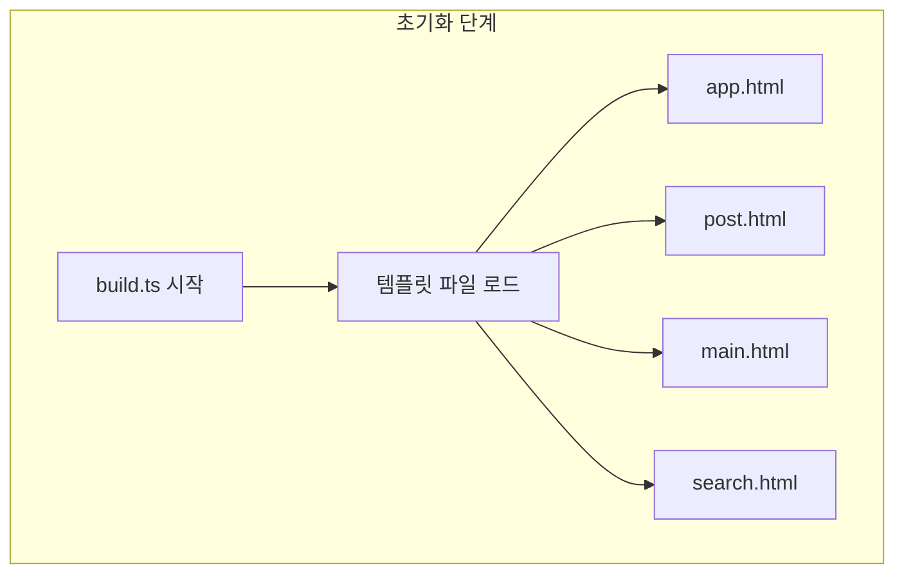

# mermaid 설치하기

:::info

굳이 따지면 뻘글입니다. node.js 컨텍스트에서는 랜더링 못해서 브라우저를 잠시 띄우고 활용하겠다는 것입니다.

:::

## 비즈니스 컨텍스트

- 아주 고급스러운 용어입니다. 사실 별거 없고 그냥 블로그에 다이어그램을 붙이고 싶었던 것이 전부입니다.
- 하지만 여기서 문제가 조금 있었습니다.
- 저의 블로그는 클라이언트에게 빌드가 다 처리된 파일만 전송한다는 것이 원칙입니다.
- 여기서 mermaid가 문제되는 이유는 빌드하는 번들에도 포함하지 않으려고 했고 설치도 안하게 만들려고 했습니다.
  - 저의 씽킹프로세스에서 클라이언트가 데이터를 받고 그 데이터를 또 랜더링하는 것을 빌드 타임에 처리해서 처리된 결과만 보내줄 수 있는데 굳이 번들링해서 보내고 싶지 않았습니다.
  - 이것도 개발의존성만 설치하고 런타임의존성 없이 해결하고 싶었습니다.
- 원래 생각하던 것은 이것도 node.js에서 그냥 실행하고 call it a day가 가능할 것이라고 생각했는데 아니었습니다.
  - D3.js에 의존하고 있어서 브라우저 컨텍스트에서 빌드가 처리되어야 한다는 것이었습니다.

원래 단순하게 mermaid를 설치하고 node.js 환경에서 알아서 빌드해달라고 하면 간단하게 끝날 것이라고 예상했습니다. 저의 멘탈 모델은 안일 했습니다. 물론 이런 안일함이 저의 블로그 소재를 줬습니다.

저보다 코딩잘하는 클로드 Opus 4.6 형님에게 물어보니까

> Playwright 필요함 ㅇㅇ

이라고 답변해줬습니다. ~~진짜 이렇게 답변한 것은 아닙니다.~~

Playwright 브라우저가 필요하다고 합니다. mermaid는 내부적으로 D3.js를 사용한다고 합니다. mermaid 팀은 왜 이런 결정을 내렸는가? 그건 저도 모릅니다. 개발자 블로그를 찾아봐야 할 것 같습니다.

D3.js로 실제 랜더링 작업을 처리하기 때문에 브라우저가 필요하다고 합니다. DOM API를 사용해서 요소를 선택하고 생성하기 때문에 그렇습니다. 제가 코드를 실행하는 맥락이 문제가 된다는 것입니다. node.js에서는 브라우저 API 들이 없으니까 문제가 됩니다. 브라우저 API를 활용하기 위해 Playwright를 실행하는 것입니다.

```ts
const htmlText = await unified()
  .use(markdown)
  .use(remarkGfm)
  .use(remarkDirective)
  .use(remarkCallout)
  .use(remark2rehype)
  .use(rehypeSlug)
  .use(rehypeExtractToc, { toc })
  .use(rehypeMermaid, {
    strategy: 'inline-svg', // 빌드 타임에 SVG로 인라인 렌더링
  })
  .use(rehypeShiki, {
    theme: 'catppuccin-mocha',
  })
  .use(html)
  .process(markdownSource);
```

`rehypeMermaid`이 실제로 필요하다고 합니다.

여기서 `strategy`를 키로 활용했는데 이것이 무엇인지 궁금해집니다.

- 여기서 생기는 의문은 만약에 SSR로 랜더링을 지원해야 한다면 결국 클라이언트에서 남은 다이어그램 랜더링을 해야 하는 것 아닌가?
- SSR을 한다면 클라이언트에게 번들을 결국 줘야 하는 것 아닌가? 이런 생각이 듭니다. 요청마다 서버보고 브라우저를 띄우라고 시키는 것은 정신나간 짓입니다.
- 뭐 어떻게 해결하든 저는 빌드타임에서 해결하면 됩니다.

## 왜 mermaid 팀은 D3.js를 선택했는가?

공식 문서의 [감사 인사](https://mermaid.ai/open-source/intro/index.html#appreciation)를 보면 D3를 사용한다고 명시되어있습니다.

> Many thanks to the d3 and dagre-d3 projects for providing the graphical layout and drawing libraries!
>
> Thanks also to the js-sequence-diagram project for usage of the grammar for the sequence diagrams. Thanks to Jessica Peter for inspiration and starting point for gantt rendering.
>
> Thank you to Tyler Long who has been a collaborator since April 2017.
>
> Thank you to the ever-growing list of contributors that brought the project this far!

내용이 뭐 이렇습니다.

기술선택의 배경을 직접 알 수 있으면 좋을 것 같습니다.

블로그가 2개나 있습니다. 직접 찾기는 귀찮았습니다.

- https://mermaid.ai/open-source/news/blog.html
- https://mermaid.ai/blog/posts/page/1

## 다이어그램 예시



- 아주 뽀대가 납니다. ~~뭐 그정도는 아니지만 뭐 어째든 만족스럽게 보입니다.~~

<!--

mermaid를 설치해서 블로그에서 그린 다이어그램을 보여주고자 했습니다. 블로그를 단장하면서 빌드가 무슨 순서로 어떻게 실행되는지 알 필요가 있다고 봤습니다.
-->
