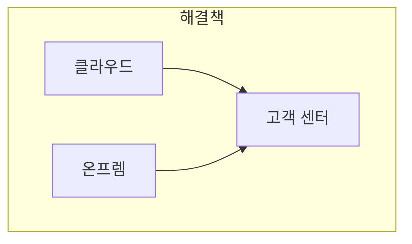

<!--
- [ ] hmac 정의 다루기
- [ ] hash 개념 다루기
- [ ] 보안 키 종류별로 다루기
- [ ] hmac으로 온프렘과 클라우드 CRM 접근 mermaid 다이어그램
-->

# 고객센터 만들기

회사에서 고객센터를 만들어야 할 일이 생기면서 이런 저런 기록들입니다. 더 정확히는 고객센터 자체는 만들어져 있는데 2개의 별도 시스템에서 1개의 시스템으로 마이그레이션하는 작업이었습니다. 긴 글 읽기 싫을 가능성이 높기 때문에 그냥 hmac을 사용했던 내용으로 [스킵](#hmac-인증)해도 됩니다.

프로젝트의 실질적인 개발기간은 1달 정도였습니다. 개발 이후 운영팀의 작은 개선 요구(팝업 너비 조정 같은 성격입니다.)는 2주 정도 다른 업무 보면서 중간중간 반영했습니다. 실제 기간을 더 짧게 가져가고 싶다면 더 짧게도 가능했습니다. 하지만 회사에서 AI 토큰을 저혼자 사용하는게 아니라서 자잘한 대기 시간 때문에 1달 정도 걸렸습니다. 또 인프라팀 허가가 나오고 배포하는 과정도 필요했습니다.

이 시기에 회사에서 AI는 활용해도 그 툴링은 무엇이 어떻게 적절한지는 같은 팀 안에서도 일원화가 안 되어 있었습니다. 저의 경우 이당시 그냥 프롬프트만 연달아 하면서 작업을 했었습니다. 이런 저런 유용했던 작은 툴링들 [여기](#유용했던-툴링) 다루겠습니다.

## 비즈니스 맥락

> tl;dr - 온프렘에서도 고객센터에 글 올릴 수 있게 해주세요.

이런 비즈니스 맥락과 요구사항 정리는 제가 직접 발견한 이슈는 아니었습니다. 제가 discovery와 거기에 대응되는 delivery를 정의한 것은 아닙니다. 하지만 이런 것은 사후 묘수 풀이라도 공유하는게 가치가 있다고 보고 올리는 것입니다.

discovery 과정은 고객 문의였습니다. 제품에 고객센터를 접근할 수 있는 링크가 사이드바로 있습니다. 이 과정이 액션코스트가 상당히 낮게 해주는 요소입니다. 하지만 온프렘 고객은 이거를 못 쓰고 바로 이메일로 문의했어야 합니다. 이것도 다른 문제인데 만약에 해당 운영담당자가 이메일을 볼 수 없으면 고객은 문제를 해결할 수 없었을 것입니다.

<!--
거창하지 않은 이미지 예시

사이드바 클릭. 작은 창에서 고객 센터로 글올릴 수 있는 에디터 UI
-->

제품의 히스토리를 약간 이해해야 합니다. 원래 제품은 순수 클라우드 방식을 사용하고자 했습니다. 이것은 의외로 문제였습니다. 나중에 클라우드를 사용하려는 고객은 있었지만 보안규제 때문에 온프렘을 선호하는 고객이 꽤 있었습니다. 하지만 제품을 만들었을 당시에는 CRM을 제품 안에 종속 시켜서 만들었습니다. 별도의 도메인을 갖지 않았습니다. 이 별도의 도메인이 없다는 것이 기술적인 문제의 원흉이라고 봐도 됩니다.

온프렘에서 제품을 이용하는 고객은 같은 도메인으로 고객문의를 올리기 때문에 운영팀이 VPN으로 고객의 제품에 접속에서 확인하지 않는 이상 확인할 방법이 없었습니다. 운영팀이 문의를 확인하기 위해 VPN 정기적으로 연결을 요구할 수 있는데 이것은 비효율적입니다. 일단 고객 데이터베이스에 남는 다는 것은 우리회사의 시스템에 전달이 안되고 전달이 안 된다면 운영팀원이 인지하는데 한참걸릴 것입니다. 회사 기록에 남으면 뭐 회사 메신저에 연결하는 것도 가능해서 더 선호해야 할 이유가 있다고 봤습니다. 운영팀이 대기하는 동안 고객마다 순환하면서 VPN을 연결하고 해제하는 것을 반복하는 것은 단순하게 말하자면 이상합니다. 기술로 해결할 수 있는 문제를 굳이 의지로 해결하려고 하는 것입니다.

## HMAC 인증

???



## 유용했던 툴링

???

---

단순하게는 별도의 도메인에 hmac을 활용해사용자 인증했던 것이 중요합니다.

- 고객센터 만들면서 이런 저런 이슈를 해결해야 했단 일이 있었습니다.
- 회사에서 제품을 하나 만들면서 발생한 일입니다.
- 편의상 고객센터, 클라우드 제품, 온프렘 제품 이렇게 부르겠습니다. 실제로 이렇다는 것은 아닙니다.
- 비즈니스 맥락은 이렇습니다. 클라우드 제품을 활용하는 고객들은 클라우드 제품 안에 고객 센터를 바로 접근할 수 있습니다. 온프렘 고객은 이 고객센터가 제품 안에 들어 있어서 운영팀이 이것을 이메일을 받거나 전화를 통해서 전달 받아야 했습니다. 고객센터가 제품에 종속되어 있는 시스템으로 있어서 온프렘 고객은 문의를 다른 방법으로 보내야 했습니다.

- 여기서 제가 면접질문을 비즈니스적으로 해본다고 한다면 이 시스템이 만들어지기 전에는 문의가 얼마나 고객 센터가 아닌 곳을 통해 들어왓고 이 시스템이 만들어진 후에는 고객센터를 통해 얼마나 많이 들어오기 시작했는가?
  - 일단 이거 미리 준비했을 때 운영팀원이 메일로 얼마나 왔는지는 잘 모르겠다고 합니다.
  - 만들어진 이후 온프렘 고객이 얼마나 많은 문의를 하는지 측정해보고 있습니다.

- 클라우드 시스템과 온프렘 시스템에서 모두 접근할 수 있어야 합니다. 하지만 이미 온프렘 시스템이든 클라우드 시스템이든 로그인에 성공했으면 고객 센터를 접근할 수 있어야 합니다.
- 하나는 클라우드 환경에서 공개된 인터넷에서 모두 접근가능한 주소에서 다른 시스템을 접근

- 온프렘 제품에서 인증된 고객도 원래 클라우드 제품을 사용하던 고객도 모두 새 주소로 접근할 수 있게 되었습니다.

- 기술적인 방법
  - 로그인된 고객이 고객 센터를 접근하는 버튼을 누르면 클라이언트에서 서버로 요청을 보냅니다. 온프렘 제품은 온프렘 서버로 클라우드 제품은 클라우드 서버로 요청이 갑니다. 이 응답을 들고 새 탭에서 고객 샌터에 전달해주면 됩니다.
  - 여기서 단순하게 전달만하고 끝나는 것이 아닙니다.
  - 실제로 내부적으로는 클라우드 제품과 온프렘 제품 동일한 환경변수로 관리하고 있습니다.
  - 실행하는 서버는 달라도 요청의 결과는 결국에는 같을 것입니다.
- 어려운 것은 인프라팀에게 환경변수를 추가해야 하는 이유를 설명하는 것입니다.
  - 환경변수를 왜 사용해야 하는 이유는 기술적인 상황을 설명해야 합니다.
  - 환경변수여야 하는 이유도 코드로 관리하면 커밋하고 Docker 이미지를 새롭게 만들고 교체해야 하는 이유가 있습니다.
  - 환경변수교체도 결국에는 배포를 다시 해줘야 하는 이슈가 여전히 있습니다.
  - 인프라는 최소 환경변수, 인프라 최소 권한으로 운영하는 원칙이 있습니다. 개발자가 실험적으로 EC2에 올리는 이런 작업을 원하지 않습니다.
  - 평문 코드로 저장하면 당연히 보안이슈랑 누락문제도 있습니다. 정기적으로 배포할 때마다 새로운 hash 값을 받도록 만들어줘야 합니다. 이 변수가 보안 때문에 정기적으로 관리 된다는 것이 이치에 뭔가 안 맞는데 왜 안 맞는지 뭔가 말하기 어렵습니다. 관심사랑 비슷한 문제인 것 같습니다.

## 후기

- 사실 그냥 하고 싶은 말들입니다.
- 원래 꽤 오래 걸려야 할 고객센터를 1달 정도 만들었습니다. 굳이 따지면 더 짧아질 수 있었겠지만 이것은 현재 모델 기준입니다.
- 이미 운영팀이 활용하는 회사내 자체 시스템이 있습니다.
  - 고객의 문의를 처리하는 시스템은 이미 정의가 다 되어 있었습니다.
- 2026년 1분기 클로드 모델로 거의 대부분의 기능을 포팅한 것입니다.
  - 고객이 문의를 더 구체적이게 할 수 있도록 사소한 편의 기능을 더 적용한 것 말고 거의 유사합니다.
- 클로드가 시키지 않은 뻘짓거리하다가 버그를 만들어내는 경우가 상당히 많았습니다.
- 제출 버튼의 div를 갑자기 form 태그로 바꾸고서 제출이 실패하거나 브라우저가 새로고침 되는 등 지딴에는 표준지킨다고 만드는 경우가 꽤 있었습니다.

```md
# AGENTS.md

LLM의 흔한 코딩 실수를 줄이기 위한 행동 지침입니다. 프로젝트별 지침과 병합하여 사용하세요.

**트레이드오프:** 이 지침은 속도보다 신중함을 우선합니다. 간단한 작업은 판단에 따라 조정하세요.

## 1. 코딩 전에 먼저 생각하기

**가정하지 말고, 혼란을 숨기지 말고, 트레이드오프를 드러내세요.**

구현 전에:

- 가정을 명시적으로 밝히세요. 불확실하면 물어보세요.
- 해석이 여러 가지라면 제시하세요 — 조용히 하나를 고르지 마세요.
- 더 단순한 방법이 있다면 말하세요. 필요하면 반박하세요.
- 불명확한 부분이 있으면 멈추세요. 무엇이 혼란스러운지 말하고 질문하세요.

## 2. 단순함 우선

**문제를 해결하는 최소한의 코드만 작성하세요. 추측성 코드는 금지입니다.**

- 요청받지 않은 기능은 추가하지 마세요.
- 단일 사용 코드에 추상화를 넣지 마세요.
- 요청하지 않은 "유연성"이나 "설정 가능성"을 추가하지 마세요.
- 불가능한 시나리오에 대한 에러 처리를 하지 마세요.
- 200줄로 작성했는데 50줄로 될 수 있다면, 다시 작성하세요.

스스로에게 물어보세요: "시니어 엔지니어가 이걸 보면 과하다고 할까?" 그렇다면 단순하게 만드세요.

## 3. 외과적 변경

**반드시 필요한 부분만 건드세요. 자신이 만든 코드만 정리하세요.**

기존 코드를 수정할 때:

- 인접한 코드, 주석, 포맷을 "개선"하지 마세요.
- 망가지지 않은 것을 리팩터링하지 마세요.
- 본인이 다르게 했을지라도 기존 스타일을 맞추세요.
- 관련 없는 죽은 코드를 발견하면 언급하되, 삭제하지 마세요.

변경으로 인해 고아가 생긴 경우:

- 자신의 변경으로 사용되지 않게 된 import/변수/함수는 제거하세요.
- 기존에 있던 죽은 코드는 요청이 없으면 건드리지 마세요.

기준: 변경된 모든 줄이 사용자의 요청으로 직접 연결되어야 합니다.

## 4. 목표 기반 실행

**성공 기준을 정의하고, 검증될 때까지 반복하세요.**

작업을 검증 가능한 목표로 변환하세요:

- "유효성 검사 추가" → "잘못된 입력에 대한 테스트를 작성하고, 통과시키기"
- "버그 수정" → "버그를 재현하는 테스트를 작성하고, 통과시키기"
- "X 리팩터링" → "전후로 테스트가 통과하는지 확인하기"

여러 단계 작업은 간략한 계획을 먼저 제시하세요:
```

1. [단계] → 검증: [확인 방법]
2. [단계] → 검증: [확인 방법]
3. [단계] → 검증: [확인 방법]

```

명확한 성공 기준은 독립적인 반복을 가능하게 합니다. 모호한 기준("작동하게 만들기")은 계속 확인이 필요합니다.

---

**이 지침이 잘 작동하고 있다면:** diff에 불필요한 변경이 줄고, 과도한 복잡성으로 인한 재작성이 줄고, 실수 후가 아닌 구현 전에 명확화 질문이 나옵니다.
```

- 시키지 않은 짓을 방지하기 위해 위 프롬프트를 넣기 바랍니다.
- 이 프로젝트를 진행하면서 넣고 그 뒤로 항상 프로젝트를 시작할 때마다 넣었습니다.
- 권장사항을 알려주는 것이랑 그 권장사항을 나도 모르는 사이에 바로 적용하고서 버그를 만드는 짓거리를 막으려는게 의도입니다.

---

- [ ] 다이어그램을 활용해서 설명하기
- [ ] hmac이 무엇인지 설명하기
- [ ] 글 리뷰받기
