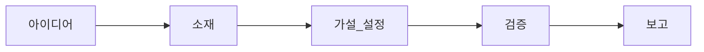
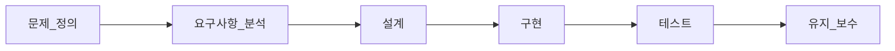

# 고객 서비스 말고 컴퓨터 과학 시작하기

컴퓨터과학의 다양한 측면을 다루어보겠습니다.

<!-- 대학교 과정에서는 학습하는 순서가 있습니다. -->

<!-- https://github.com/arch-spatula/DIY-CS -->

<!-- https://github.com/arch-spatula/technical-interview-for-FE -->

<!-- https://terms.naver.com/list.naver?cid=51173&categoryId=51173&so=st4.asc -->

<!-- https://www.youtube.com/playlist?list=PL8dPuuaLjXtNlUrzyH5r6jN9ulIgZBpdo -->

최대한 다양한 분야의 컴퓨터공학 지식을 다룰 것입니다. 네트워크, 운영체제는 당연히 다룰 것이고 컴파일러 이론, 이산 수학 같은 분야도 다루어보고자 합니다.

비전공자라는 마인드 보다는 늦게 전공한다는 마인드로 접근하는 것이 더 좋은 태도인 것 같습니다.

~~물론 우리나라는 늦었다고 생각했을 때가 제일 늦었다가 국룰이지만~~

## 컴퓨터 과학의 지도

<iframe className="codepen" src="https://www.youtube.com/embed/SzJ46YA_RaA" title="컴퓨터과학 지도: 어떤 것들을 다루는가?" frameBorder="0" allow="accelerometer; autoplay; clipboard-write; encrypted-media; gyroscope; picture-in-picture; web-share" allowFullScreen></iframe>

- Theoretical Computer Science
  - Turing Machine
  - Lambda Calculus
  - Halting Problem
  - Computational Complexity
  - Algorithm
  - Order of complexity of algorithm
  - Information Theory - application : Compression
  - Other branches of Theoretical Computer Science
- Computer Engineering
  - Scheduling
  - Multi-Processing
  - Computer Architecture
  - Levels of Instructions & Prog Languages
  - Machine Code & Compilers/Interpreters
  - Operating System
- Software Engineering
  - Endeavors of Software Engineering
  - Helping Techniques

## 컴퓨터과학, 컴퓨터공학, 소프트웨어 공학 커리큘럼

:::info

본격적으로 시작하기 전에 초등학교, 중학교, 고등학교(이과 수학II, 기하학과 벡터, 물리I, 물리II) 정도는 명문대학 장학생으로 입학할 기초적인 수준의 능력을 갖기바랍니다.

:::

위는 이화여대 커리큘럼입니다. 굳이 활용하려는 이유는 인터넷에 널리 돌아다니기 때문입니다. 대부분 사람들이 보편적으로 알고 보편적으로 기대할 수 있다는 생각 때문에 활용합니다.

약간 아쉬운 부분도 당연히 있습니다. 1학년 1학기에 C언어부터 가르칠 것입니다. 사실 방학 때 예습하는 경우가 많아 더 일찍 다루는 것이 적절했을 것입니다.

네트워크를 3학년에 가르치는 것도 의외입니다. 2학년에 가르치고 3학년에 상세 스펙으로 가르칠 것이라는 생각을 했습니다.

트렌디하게 AI 쪽도 커리큘럼에 포함했습니다. 어설프게 하면 독이지만 현업에서 일하던 사람을 초빙했다면 거금을 들였을 것입니다.

컴파일러가 3학년 1학기 과목이라고 생각하고 있었습니다.

자료구조 알고리즘은 2학년 1학기에 가르칠 것이라는 생각이 들었습니다. 사실 대학교 다니자는 결심부터 들면 코테부터 준비하기 때문에 백준 플래 찍고 많이 놀았으면 백준 실버 찍고 수강한다고 들었습니다.

Java는 1학년 2학기에 가르칠 것이라는 생각도 들었습니다. 2학년 1학기 자료구조 알고리즘이랑 객체지향 프로그래밍을 동시에 같이 배울 것이라는 생각도 들었습니다. 객체지향 프로그래밍은 C++로 가르치고 자료구조 알고리즘은 순수 C 언어로 가르치는 경우가 일반적입니다.

또 알아야 할 점은 본인이 하고자 하는 일에 대해서 확신의 문제도 있는 것 같습니다. 확신이 강하면 커리큘럼이 땅겨질 것 같고 아니라면 느려질 수 있다는 생각도 있습니다. 대학생으로서 사실 넓고 얕게 다양한 경험이 좋을 것입니다. 본인이 하고자 하는 일이 본인에게 맞는지 얕고 다양하게 탐구하고자 하려는 성향도 있을 것입니다.

<!--대학교를 다니면서는 이해를 위해 현업에서 응용하고 있는 기반 기술들을 구현을 많이 합니다. git을 현업에서 많이 사용하는데 학교에서는 버전 컨트롤 과목이 있다면 높은 확률로 직접 버전컨트롤 소프트웨어를 구현할 것입니다. 대학교를 다시면서 가장 큰 행운은 컴퓨터 조립과 회로 실험일 것입니다. 실리콘,  트렌지스터의 전기 흐름부터 학습하게 될 것입니다. 이산 수학을 학습하고 자료구조 알고리즘의 시간복잡성을 학술적으로 엄밀하게 정의하는 방법을 배우게 될 것입니다. 학교에서 운영체제는 높은 확률로 하드웨어를 주고 부트로더를 바닥부터 구현하는 수업을 할 것입니다. 네트워크 수업이 있다면 방화벽과 프로토콜을 직접 구현할 것입니다. 보안 수업이 있으면 보안을 위한 암호화 알고리즘을 직접 구현하고 모의침투 혹은 방어가 수업 내용이 될 것입니다. 학교에서는 반드시 컴파일러를 직접 구현하고 C 언어를 바닥부터 구현해볼 것입니다. 데이터 베이스 수업이라고 하면 데이터 베이스를 표현하는 다이어그램도 배우지만 데이터베이스를 순수 C 언어로 구현하는 방법도 배우게 될 것입니다. 만약에 학교 수업에 클라우드 수업이 있다면 클라우트 컴퓨터를 활용하는 수업이 절대 아니고 안전한 네트워크를 확보하고 클라우트 컴퓨터 인프라를 제공하는 서비스업처럼 어떻게 제공할 수 있는지 학습할 것입니다.-->

<!--대다수의 컴퓨터공학과 학교는 학생이 취업을 못하거나 전공과 무관하거나 컴퓨터 혹은 소프트웨어랑 무관한 취업을 할 수록 좋아합니다. 왜냐하면 교수님에게 IT 기업을 다니는 사람들은 코드 몽키에 불과하기 때문입니다.-->

## 활용하고자 하는 자료

- 활용하고자 하는 자료는 실제도 이보다 더 많습니다.

[Computer Science - Crash Course](https://www.youtube.com/playlist?list=PL8dPuuaLjXtNlUrzyH5r6jN9ulIgZBpdo)

미국 고등학교 수준의 컴퓨터과학 수업과정이라고 생각하면 됩니다. 대학교 컴퓨터 과학 개론 과정수준이라고 합니다. 우리나라에서는 중학교 수준이라고 간주해야 합니다.

- 오늘날 컴퓨터의 설계 배경과 역사를 논할 수 있어야 합니다.
- 프로그래밍 소프트웨어의 기본 요소를 논할 수 있어야 합니다.
- 컴퓨터 하드웨어의 요소를 역할을 구분할 수 있어야 합니다.
- 컴퓨터가 어떻게 사용되고 어떻게 발전해왔는지 논할 수 있어야 합니다.
- 컴퓨터가 얼마나 발전했는지 그리고 얼만큼 더 발전할지 감사할 수 있어야 합니다.

[컴퓨터 개론 - 네이버 지식백과](https://terms.naver.com/list.naver?cid=51173&categoryId=51173&so=st4.asc)

- 13년도 발행했습니다. 그래서 오래되었습니다.

> 컴퓨터의 전반적인 개론에 대해 살펴보는 책이다. 간결하면서도 명확한 원리 설명과 사고력을 향상시킬 수 있는 간단한 예제를 수록한다. 풍부한 그림과 이를 바탕으로 컴퓨터 과학에 대한 전반적인 내용을 다루고 있으며, 타 도서에서 쉽게 간과하고 있는 실제 시스템에 대한 내용을 소개하고 있다.

[CS50x 2023 Lectures - 하버드 대학교 CS50](https://www.youtube.com/playlist?list=PLhQjrBD2T380F_inVRXMIHCqLaNUd7bN4)

- 매년 하버드 대학교에서 컴퓨터 과학 개론 수업을 유튜브에 재생목록을 올립니다. ~~내년에 또 나오면 링크를 교체할 것입니다.~~
- 이미 어느정도 주제를 알고 있는 입장에서는 난이도가 낮아질 수 밖에 없습니다. 하지만 복습할 리소스로 활용하기 바랍니다.

면접질문으로 CS를 공부하기 시작할 것이기 때문에 다른 레포들을 활용할 것입니다.

- [prepare_frontend_interview](https://github.com/junh0328/prepare_frontend_interview)
- [Interview_Question_for_Beginner](https://github.com/JaeYeopHan/Interview_Question_for_Beginner)
- [CSE-Summary](https://github.com/Prev/CSE-Summary)

하지만 CS지식은 어느것으로 시작해도 서로 연결되는 성향을 갖습니다. 네트워크를 이해할 때 여러계층에 캐싱한다는 것이 중요한 것처럼 하나의 개념을 알면 다른 개념에서 다시 보는 경우가 많습니다.

[Computer Science - roadmap](https://roadmap.sh/computer-science)

- roadmap에서 알려주는 CS 지식 학습 순서도입니다.

[널널할 개발자](https://www.youtube.com/@nullnull_not_eq_null)

- 임베디드 개발자로 로우레벨 지식을 많이 소개해주고 있습니다.
- [독하게 시작하는 C 프로그래밍](https://www.yes24.com/Product/Goods/18732021)을 저술했습니다.

### 기타 자료

[Learn X in Y minutes](https://learnxinyminutes.com/)

초 단기 학습자료를 제공합니다.

## 과학과 공학의 차이?

컴퓨터 과학 혹은 컴퓨터 공학을 정공하고 일을 한다면 자주 해야하는 질문은 3가지입니다.

첫번째는 왜입니다.  왜 이 업무를 수행해야 하는가?  이 업무가 왜 사용자에게 도움 될 것인가? 왜 이 업무가 동료들의 생산성에 도움을 줄 것인가?  다음은 순서는 무관하지만 무엇과 어떻게입니다. 엔지니어는 어떻게를 자주 질문하고 과학자는 무엇을 자주 질문할 것입니다. 하지만 해커는 모두 질문할 것입니다. 되어야 하는 것은 해커입니다. 컴퓨터 시스템과 제품만 해킹하지말고 사용자의 마음을 해킹하기 바랍니다.

디버깅하는 상황이 아니고 회사에서 대부분의 상황에서는 컴퓨터 공학적으로 접근해야 합니다. 당신은 돈을 받아 컴퓨터 관련된 문제를 해결하는 사람입니다. 만약에 학교, 연구소에 있다면 컴퓨터 과학을 더 많이 할 것입니다.

과학적 방법론은 위와 같은 순서를 갖습니다. 그나마 소프트웨어를 만들 때 디버깅과 성능 최적화는 과학적으로 접근합니다.

컴퓨터 공학은 컴퓨터를 활용해 공학적으로 문제를 해결합니다. 문제 정의,

워터폴 애자일을 지금 논의하기에는 부적합니다. 가능하면 다른 석유화학, 전기 및 전자, 바이오 등 다른 공학분야의 일반적인 방법론을 올리고 싶었지만 모릅니다.

<!--https://www.youtube.com/watch?v=btGYcizV0iI-->

공학의 어원은 영리함 또는 설계 및 계획함을 의미합니다.

공학입장에서 과학은 도구에 불과합니다. 수학과 과학을 활용해서 달성할 임무에 활용합니다. 공학의 기반은 수학입니다. 하지만 아이디어와 적용이 더 중요합니다.

과학적으로 문제를 이해 하기 위해 접근합니다. 과학자는 탐구에 끝납니다. 답은 얻습니다.

엔지니어는 답을 문제해결에 활용하고자 합니다.

컴퓨터를 전공했다고 하면 공학적방법론과 과학적 방법론 모두 활용할 줄 알아야 합니다.

당신이 데이터 사이언티스트 혹은 데이터 분석가(가짜개발자) 과학적 방법을 일상에서 많이 사용합니다.

당신이 AI를 구현하는 ML 엔지니어거나 데이터를 적재하는 데이터 엔지니어라면 공학적 방법을 일상에서 많이 사용합니다.

제품을 개발하는 관점에서 개발자는 구현은 애매하게 과학과 공학을 모두 사용합니다. 테스트, 리팩토링할 때는 공학자이고 디버깅과 최적화할 때는 과학자입니다. 하지만 대부분의 경우 당신은 엔지니어입니다.

석유 화학, 바이오, 제조, 심지어 건축회사를 재직하는 대다수 엔지니어는 당신을 엔지니어라고 생각하지 않습니다. 당신은 가짜엔지니업니다. 그냥 사무직과 똑같다고 봅니다. 정보처리기사가 전공제한이 없고 상업용 소프트웨어 개발에 자격증 미보유자가 작업하면 형사처벌이 아닌 것을 보면 소프트웨어 엔지니어링은 엔지니어링이 아닙니다.

