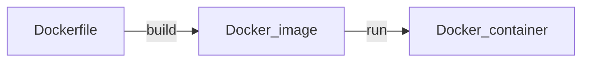

# Docker 시작하기



위 순서를 암기하기 바랍니다. 이전 작업에 의존합니다. docker를 사용할 때 CLI로 컨테이너를 바로 띄울 수 있습니다. 하지만 띄우는 명령을 매번 입력하기는 귀찮은 것이 많습니다. 다른 사람과 공유하려면 image를 공유할 수 있습니다. 회사 혹은 프로젝트가 갖고 있는 특별한 니즈가 있으면 Dockerfile로 만들어서 커스터마이징이 필요할 것입니다. 우리는 커스터마이징 아랫 단계부터 시작하겠습니다.

이미지를 빌드 할 때 서버를 실행하도록 만들 수 있습니다. 규모 있는 프로젝트에서 백엔드와 전문적으로 협업할 때 프론트엔드는 백엔드가 만든 컨테이이너를 띄우고 작업합니다.

<!-- docker를 사용할 때 관건은 Dockerfile을 만들고 Docker 파일로 이미지를 만들고 이미지로 Docker 컨테이너를 만드는 것입니다. -->

<!-- Docker를 어느정도 이해해야 Docker를 사용해서 개발환경을 설정할 수 있습니다. 도커라이징을 하는 것입니다. -->

<iframe class="codepen" src="https://www.youtube.com/embed/Gjnup-PuquQ" title="Docker in 100 Seconds - Fireship" frameborder="0" allow="accelerometer; autoplay; clipboard-write; encrypted-media; gyroscope; picture-in-picture; web-share" allowfullscreen></iframe>

## Docker CLI 실습

docker 설치는 알아서 하시고 진행해 주시기 바랍니다. 그냥 알아서 설치하라고 하면 불친절한 것 같아서 [여기 링크](https://docs.docker.com/get-docker/)는 남겨드리겠습니다.

뭐 설치가 끝났으면 이제 공식 문서 링크들을 남겨드리겠습니다. 2가지 관점이 있는데 이론관점하고 실습관점입니다. 저는 비전공에 머리가 나빠서 핸즈온으로 실습을 먼저 뭐 해보고 다음에 다시 이론을 보면 이해가 더 잘 됐던 것 같습니다. ~~역시 스킬 이슈~~ [래퍼런스 공식문서](https://docs.docker.com/reference/)의 목차부터 잘 보기 바랍니다. 특히 [docker run 커맨드](https://docs.docker.com/engine/reference/commandline/run/)를 자세히 확인하기 바랍니다.

```sh
docker run --rm -it ubuntu:16.04 /bin/bash
```

알아서 설치하셨으면 위 명령을 시도해보기 바랍니다.

`--rm`은 종료 후 삭제를 의미합니다. `exit` 커맨드를 하면 docker 컨테이너를 바로 삭제하는 옵션입니다.

`-it`은 컨테이너 내부로 접근해서 커맨드라인 명령을 실행하겠다는 플래그입니다. `-i`, `-t` 플래그 2개를 합친 것입니다. `-i`은 Interactive를 의미합니다. `-t`은 TTY이고 본딧말은 전신타자기(TeleTYpewriter)을 의미합니다. 원격에 표준 입력이 가능하도록 연결했다고 생각하면 됩니다.

<!-- @todo: 2개의 플래그를 같이 사용해야 하는 이유 설명  -->

`/bin/bash`은 우분투(리눅스의 종류)를 예시로 사용하는데 리눅스의 특징입니다. 리눅스 컨테이너 내에서 bash 쉘을 활성화한 것입니다.

위 명령을 하면 터미널에 본인이 설정했던 하이라이팅이 사라졌다는 것을 보게 될 것입니다. 컨테이너 내부에 있기 때문에 격리되었다는 것입니다. 호스트 운영체제에 설정해놨던 것들을 가져오지 않습니다. 이것은 `-it` 플래그로 컨테이너가 활성화 되었을 때 컨테이너 내부로 접근할 수 있게 해줍니다.

```sh
ls # bin  boot  dev  etc  home  lib  media  mnt  opt  proc  root  run  sbin  srv  sys  tmp  usr  var
```

`ls` 명령을 하면 주석과 비슷한 결과를 보게 될 것입니다. 우분투 컨테이너에서 설치하면서 같이 받은 것입니다. 이렇게 되면 컴퓨터는 하나지만 운영체제는 2개를 사용하는 것과 같아집니다.

```sh
exit
```

위 명령을 하고 docker 데스크탑을 한번 확인하기 바랍니다. 돌고 있던 컨테이너가 자동적으로 꺼졌을 것입니다.

## 학습 리소스

컴퓨터 구조론, 네트워크, 운영체제 이 3가지 지식을 보유하기 바랍니다. 이 3가지 지식과 함께 가상화라는 개념을 이해하고 임하기 바랍니다.

[도커(Docker) 입문편 - Daegwon Nacyot Kim](https://www.44bits.io/ko/post/easy-deploy-with-docker)

[이재홍의 언제나 최신 Docker](https://pyrasis.com/jHLsAlwaysUpToDateDocker)

- 저는 저작권을 존중하기 때문에 위 링크까지만 공유하겠습니다.
- 학습을 위해 자료를 활용하기 바랍니다.

---

## 이론 줍줍

docker는 가상화를 해줍니다. 컨테이너라고 운영체제와 독립적인 프로세스를 만들고 네트워크도 가상화를 시켜줍니다. 위에서 볼 것은 포트번호입니다. 컨테이너 내부에서 통신하기 위한 포트번호라고 생각하면 됩니다.

<!-- 오른쪽은 컨테이너 내부 포트번호이고 왼쪽은 우리가 접근할 포트번호입니다. -->

<!-- http는 기본적으로 80번이면 숨겨줍니다. https는 443번이면 숨겨줍니다. 왜 이 번호인지 찾아보니까 남는 거 줬다고 했습니다. -->

## docker search

Base image를 pul하고 필요한 설정과 명령을 추가로 작성합니다.

Docker image를 찾는 다는 것은 컨테이너의 설계도를 찾는 것과 비슷합니다.

```sh
docker search python
```

Docker를 사용해야 한다면 가장 먼저할 행위는 관련된 공식 이미지를 찾는 것입니다. 공식 이미지가 없다면 작업을 중단할 것을 권장합니다. 보안 취약점을 만들게 됩니다. 지금은 개발환경에서만 사용하려는 베이스 이미지를 찾습니다.

<!-- ~~데이터 사이언티스트가 사용할 개발환경 배포는 스킬 이슈로 생략하겠습니다.~~ -->

```
docker search python
NAME                               DESCRIPTION                                     STARS     OFFICIAL   AUTOMATED
python                             Python is an interpreted, interactive, objec…   9313      [OK]
pypy                               PyPy is a fast, compliant alternative implem…   385       [OK]
hylang                             Hy is a Lisp dialect that translates express…   59        [OK]
cimg/python                                                                        11
bitnami/python                     Bitnami Python Docker Image                     27                   [OK]
okteto/python                                                                      0
```

터미널에 위랑 비슷한 결과를 출력하게 될 것입니다. 위에서 `OFFICIAL`이 있는지 꼭 확인하기 바랍니다. python은 생태계가 거대한 편이라 당연히 있었습니다. python과 관련된 base 이미지를 이제 고르기만 하면 됩니다.

## RUN vs CMD

```Dockerfile
# 파이썬 최신 버전을 런타임으로 활용
FROM python:3.11

# 컨테이너 디렉토리 명명 호스트 디렉토리랑 크게 상관없음
WORKDIR /root

# ./requirements.txt을 복사하고 컨테이너 속에 붙여넣기
COPY ./requirements.txt /root/requirements.txt

# requirements.txt을 참고해서 최신버전 패키지로 설치하기
RUN pip install --no-cache-dir --upgrade -r /root/requirements.txt

CMD ["jupyter", "lab", "--ip=0.0.0.0", "--port=8888", "--allow-root"]
```

<!-- Dockerfile의 내용을 모두 이해해봅시다. 제일먼저 FROM 명령입니다. 이 명령은 베이스 이미지를 지정하는 명령입니다. -->

위처럼 docker 파일을 작성하면 image를 위한 설계도가 만들어진 것입니다. 여기서 RUN은 이미지를 만드는 시점에 실행하고 CMD는 컨테이너를 띄울 때 실행하는 명령입니다.

## build

```sh
docker build -t 이미지_이름 .
```

위는 이미지를 만드는 명령입니다.

## Run

```sh
docker run --rm -it -p 8888:8888 이미지_이름 # 터미널에서 서버를 종료하면 컨테이너도 같이 사라짐
```

Docker image가 있으면 이 이미지를 실행해서 컨테이너를 만들 수 있습니다.

<!--
https://www.yes24.com/Product/Goods/115457586

읽고 있는 책

https://www.yes24.com/Product/Goods/108431011

앞으로 읽을 책 -->

<!--
https://namu.wiki/w/Docker

https://pyrasis.com/jHLsAlwaysUpToDateDocker

https://www.44bits.io/ko/post/why-should-i-use-docker-container

[Docker? 그 전에 Process](https://www.youtube.com/watch?v=xewZYX1e5R8)

[20분 만에 전공자처럼 도커, 가상화 이해하기!](https://www.youtube.com/watch?v=zh0OMXg2Kog)

[10분 테코톡 - ☂️ 검프의 Docker ](https://www.youtube.com/watch?v=IiNI6XAYtrs)

[docker 이해하기](https://tecoble.techcourse.co.kr/post/2021-08-14-docker/) -->

<!-- 이 명령을 설명해보세요.

작업을 내부에서 처리하려면 볼륨 설정을 해줘야 합니다.

How to create a great dev environment with Docker

https://www.youtube.com/watch?v=0H2miBK_gAk

https://kwon-eb.tistory.com/81 -->

<!-- -v 플래그는 무엇인가? -->

<!-- -t 플래그는 무엇을 의미하는가? -->
