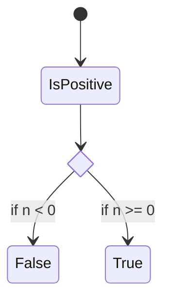

# docusaurus 다루기

## 설치

### 낙서장 레포에 설치

공식문서를 보면 상당히 불친절하게 npx로 설치하도록 강요하고 있습니다.

하지만 우리는 pnpm 혹은 yarn으로 설치하는 방법을 배울 것입니다.

```sh
yarn create docusaurus
```

```sh
pnpm create docusaurus
```

일단 설치부터 시작합니다.

`website` > `classic (recommended)` > `y` 순서로 선택합니다.

참고로 타입스크립트는 반드시 선택해줍시다.

그리고 `open .`으로 폴더를 열어봅니다.


그리고 파일을 선택하고 밖으로 드래그해서 뽑습니다.

기존에 있는 website 폴더는 삭제합니다.

이렇게 하는 이유는 docusaurus 설치할 때 이름이 필요합니다. 하지만 루트 즉 현재 `.`을 주면 Error: `Directory already exists at ...`라고 피드백을 줍니다.

[Can't create project inside existing dir #1768](https://github.com/facebook/docusaurus/issues/1768)

### 백지 레포 설치

```sh
yarn create docusaurus (폴더이름)
```

```sh
pnpm create docusaurus (폴더이름)
```

그 뒤 `classic (recommended)` > `y`은 똑같습니다.

## 플러그인 설치

### mermaid

mermaid는 마크다운에 생각보다 자주 사용합니다. 어떤 관계 혹은 다이어그램을 디자인 툴로 만들기 귀찮을 때 많이 활용합니다.

[mermaid 공식 문서](https://mermaid.js.org/)



개발하면서 성숙한 제품은 이런 다이어그램을 자주 활용합니다. 변경사항이 극단적이지 않기 때문에 작성하면서 만듭니다.

[📦 theme-mermaid - docusaurus](https://docusaurus.io/docs/next/api/themes/@docusaurus/theme-mermaid)

위는 docusaurus 공식 문서에서 설치법을 알려줍니다. 상당히 단순합니다.

```sh
yarn add @docusaurus/theme-mermaid
```

```js title="docusaurus.config.js"
/** @type {import('@docusaurus/types').Config} */
const config = {
  // 생략...
  themes: ['@docusaurus/theme-mermaid'],
  markdown: {
    mermaid: true,
  },
  // 생략...
};

module.exports = config;
```

객체라 순서를 별로 안 중요합니다.

### Latex 설치

$$
O(1)
$$

프그래머가 가장 추구해야할 시간복잡성입니다. 위처럼 수식표현은 문서에 자주하게 될 가능성이 높습니다. 비즈니스 도메인에 어느정도 통계와 ML이 필요하다면 당연히 필요할 것입니다.

[Math Equations](https://docusaurus.io/docs/next/markdown-features/math-equations)

```sh
yarn add remark-math@3 rehype-katex@5 hast-util-is-element@1.1.0
```

```js title="docusaurus.config.js"
const math = require('remark-math');
const katex = require('rehype-katex');

/** @type {import('@docusaurus/types').Config} */
const config = {
  // 생략...
  docs: {
    // 생략...
    remarkPlugins: [math],
    rehypePlugins: [katex],
    // 생략...
  },
  blog: {
    // 생략...
    remarkPlugins: [math],
    rehypePlugins: [katex],
    // 생략...
  },
  // 생략...
};

module.exports = config;
```

`import` 해서 활용할 부분에 연결해주면 됩니다.

latex를 활용하는 방법은 위키피디아를 잘 활용하면 됩니다. 개발자 입장에서 아주 짧은 문서를 보고 작성하면 됩니다.

[위키백과:TeX 문법](https://ko.wikipedia.org/wiki/%EC%9C%84%ED%82%A4%EB%B0%B1%EA%B3%BC:TeX_%EB%AC%B8%EB%B2%95)

## 댓글추가

:::caution 주의

2023년 06월에 작성했습니다. 시점에 따라 docusaurus에서 바뀔 가능성이 있습니다. 예전에 참고했던 자료도 갱신이 필요했었습니다.

:::

개발자 블로그라면 댓글이 필요합니다. 잘못된 지식을 정정해주는 훌륭한 사람이 필요합니다. ~~올바른 지식을 보고 틀렸다고 하는 빌런말고요~~

[Docusaurus로 문서 관리하기 - 2 - younho9](https://younho9.dev/docusaurus-manage-docs-2)

위 문서의 부분을 참고했습니다. 하지만 일부 적용이 안 된부분을 제가 보완했습니다.

### 🔮 utterances

먼저 utterances를 설정해야 합니다.

[utterances](https://utteranc.es/)

```html
<script
  src="https://utteranc.es/client.js"
  repo="[ENTER REPO HERE]"
  issue-term="pathname"
  crossorigin="anonymous"
  async
></script>
```

위 비슷하게 script를 가져와야 합니다. 중요한 것은 속성값입니다.

### 💎 giscus

저는 giscus로 설정했습니다. ~~이유는 더 간지나기 때문입니다.~~ 댓글을 달면 저는 이슈보단 discussions에 추가되었으면 좋겠습니다. 제가 생각 중인 글들은 이슈에서 관리하기 때문에 관심사를 분리하기 좋았습니다.

[giscus](https://giscus.app/ko)

```html
<script
  src="https://giscus.app/client.js"
  data-repo="[ENTER REPO HERE]"
  data-repo-id="[ENTER REPO ID HERE]"
  data-category="[ENTER CATEGORY NAME HERE]"
  data-category-id="[ENTER CATEGORY ID HERE]"
  data-mapping="pathname"
  data-strict="0"
  data-reactions-enabled="1"
  data-emit-metadata="0"
  data-input-position="bottom"
  data-theme="preferred_color_scheme"
  data-lang="ko"
  crossorigin="anonymous"
  async
></script>
```

위 비슷하게 설정하고 가져오면 됩니다.

### Comment 컴포넌트

이제 comment 컴포넌트를 만들어야 합니다. `src/Comment/index.tsx`로 만들면 됩니다.

```jsx
import React, { useEffect, useRef } from 'react';
import { useColorMode } from '@docusaurus/theme-common';

const utterancesSelector = 'iframe.utterances-frame';

function Comment() {
  const containerRef = useRef(null);
  const { isDarkTheme } = useColorMode();
  const utterancesTheme = isDarkTheme ? 'dark' : 'light';

  useEffect(() => {
    const utterancesEl = containerRef.current.querySelector(utterancesSelector);

    const createUtterancesEl = () => {
      const script = document.createElement('script');
      script.src = 'https://giscus.app/client.js';
      script.setAttribute('data-repo', 'arch-spatula/arch-spatula.github.io');
      script.setAttribute('data-repo-id', '비밀');
      script.setAttribute('data-category', 'General');
      script.setAttribute('data-category-id', '비밀');
      script.setAttribute('data-mapping', 'pathname');
      script.setAttribute('data-strict', '0');
      script.setAttribute('data-reactions-enabled', '1');
      script.setAttribute('data-emit-metadata', '0');
      script.setAttribute('data-input-position', 'bottom');
      script.setAttribute('data-lang', 'ko');
      script.setAttribute('crossorigin', 'anonymous');
      script.setAttribute('data-theme', utterancesTheme);
      script.setAttribute('data-loading', 'lazy');

      script.async = true;
      containerRef.current.appendChild(script);
    };

    const postThemeMessage = () => {
      const message = {
        type: 'set-theme',
        theme: utterancesTheme,
      };
      utterancesEl.contentWindow.postMessage(message, 'https://utteranc.es');
    };

    utterancesEl ? postThemeMessage() : createUtterancesEl();
  }, [isDarkTheme]);

  return <div ref={containerRef} style={{ marginTop: '3rem' }} />;
}

export default Comment;
```

이 comment를 컴포넌트로 만들 때 주의해야 할점이 있습니다. 바로 컬러 모드입니다.

[useColorMode - docusaurus](https://docusaurus.io/docs/next/api/themes/configuration#use-color-mode)

위 공식 문서에서 `useColorMode` hook으로 설정해줘야 합니다.

그리고 `useEffect`는 colorMode state를 참조하고 재실행해야 합니다. 또 `useRef`를 사용해야 하는 이유는 virtual dom이 아니고 직접 DOM을 제어하기 때문에 적용해야 합니다.

이제 컴포넌트를 정의했으면 다음은 사용할 곳에 호출해주면 됩니다.

### Doc과 BlogPost

2개의 페이지에 일단 적용해주면 됩니다. swizzle로 컴포넌트를 접근하면 됩니다.

```sh
yarn swizzle @docusaurus/theme-classic DocItem --danger
yarn swizzle @docusaurus/theme-classic BlogPostPage --danger
```

위 명령을 하면 주의해야 할점이 미래에 해당 컴포넌트를 다시 설정해야 할 수 있다는 점입니다. docusaurus에 활용할 컴포넌트가 업데이트될 수 있다고 합니다.

하지만 간지나는 댓글을 위해서라면 이정도 위험은 충분히 감수할 수 있습니다. 참고로 정확하게 저명령으로 할 필요는 없습니다.

위 명령을 하면 `src/pages/theme`에 폴더 2개(BlogPostPage, DocItem)가 보일 것입니다. 이 폴더는 삭제해도 괜찮습니다. 우리가 덮어쓰기한다는 개념으로 생각하면 됩니다. ~~저도 그렇게 생각하고 있습니다.~~

저는 `DocItem`의 `Layout`에 넣었고 `BlogPost`는 `index`에 그대로 넣었습니다.

이제 즐거운 Cookbook 많이 만들면 됩니다.

<!-- TODO: github pages 설정 방법 -->

## Docusaurus Blog 및 Doc 추가

사이드바에 주제별로 몰아 넣으면 한계가 많습니다. 실제 개발자는 엄청나게 많고 더 다양한 도구와 기술을 많이 활용합니다.

상단 tab을 추가하고 싶었는데 tab이라고 부르는 것은 틀린 용어입니다. multi instance라는 것이 올바른 용어입니다.

[Multiple blogs - Docusaurus](https://docusaurus.io/docs/blog#advanced-topics)

[Docs Multi-instance - Docusaurus](https://docusaurus.io/docs/docs-multi-instance)
