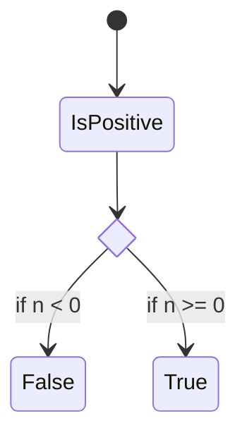

# docusaurus 다루기

## 설치

### 낙서장 레포에 설치

공식문서를 보면 상당히 불친절하게 npx로 설치하도록 강요하고 있습니다.

하지만 우리는 pnpm 혹은 yarn으로 설치하는 방법을 배울 것입니다.

```sh
yarn create docusaurus
```

```sh
pnpm create docusaurus
```

일단 설치부터 시작합니다.

`website` > `classic (recommended)` > `y` 순서로 선택합니다.

참고로 타입스크립트는 반드시 선택해줍시다.

그리고 `open .`으로 폴더를 열어봅니다.


그리고 파일을 선택하고 밖으로 드래그해서 뽑습니다.

기존에 있는 website 폴더는 삭제합니다.

이렇게 하는 이유는 docusaurus 설치할 때 이름이 필요합니다. 하지만 루트 즉 현재 `.`을 주면 Error: `Directory already exists at ...`라고 피드백을 줍니다.

[Can't create project inside existing dir #1768](https://github.com/facebook/docusaurus/issues/1768)

### 백지 레포 설치

```sh
yarn create docusaurus (폴더이름)
```

```sh
pnpm create docusaurus (폴더이름)
```

그 뒤 `classic (recommended)` > `y`은 똑같습니다.

## 플러그인 설치

### mermaid

mermaid는 마크다운에 생각보다 자주 사용합니다. 어떤 관계 혹은 다이어그램을 디자인 툴로 만들기 귀찮을 때 많이 활용합니다.

[mermaid 공식 문서](https://mermaid.js.org/)



개발하면서 성숙한 제품은 이런 다이어그램을 자주 활용합니다. 변경사항이 극단적이지 않기 때문에 작성하면서 만듭니다.

[📦 theme-mermaid - docusaurus](https://docusaurus.io/docs/next/api/themes/@docusaurus/theme-mermaid)

위는 docusaurus 공식 문서에서 설치법을 알려줍니다. 상당히 단순합니다.

```sh
yarn add @docusaurus/theme-mermaid
```

```js title="docusaurus.config.js"
/** @type {import('@docusaurus/types').Config} */
const config = {
  // 생략...
  themes: ['@docusaurus/theme-mermaid'],
  markdown: {
    mermaid: true,
  },
  // 생략...
};

module.exports = config;
```

객체라 순서를 별로 안 중요합니다.

### Latex 설치

```sh

```

## 댓글추가
