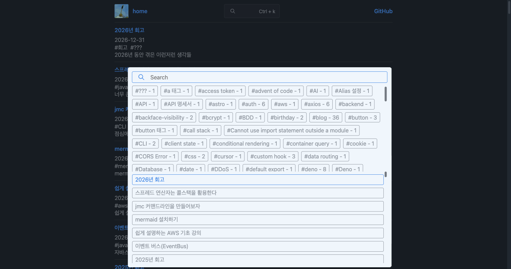
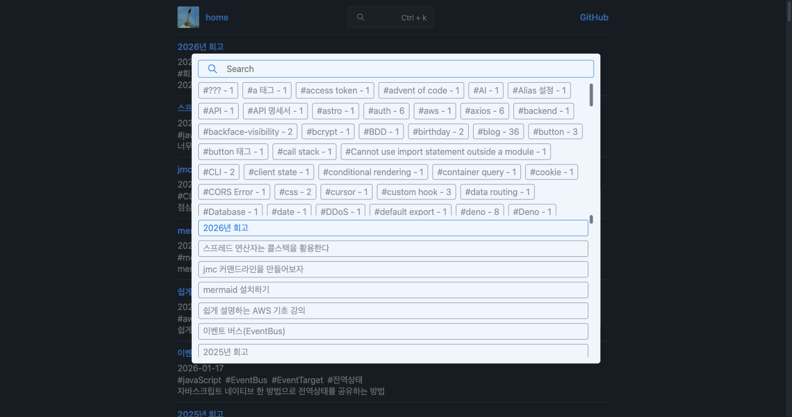
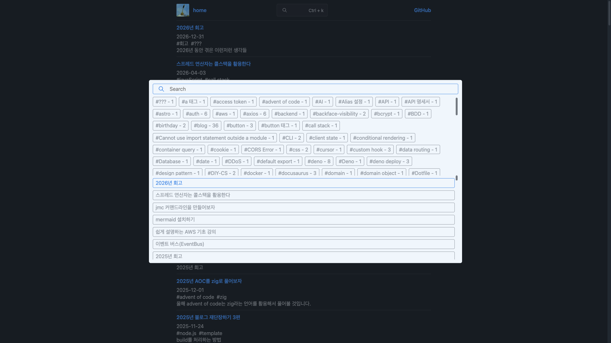
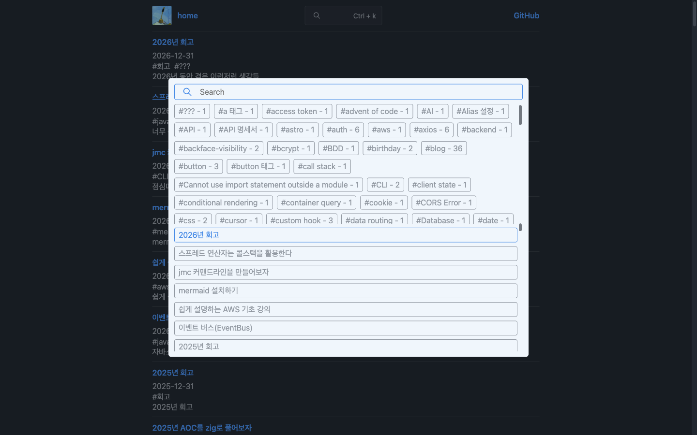
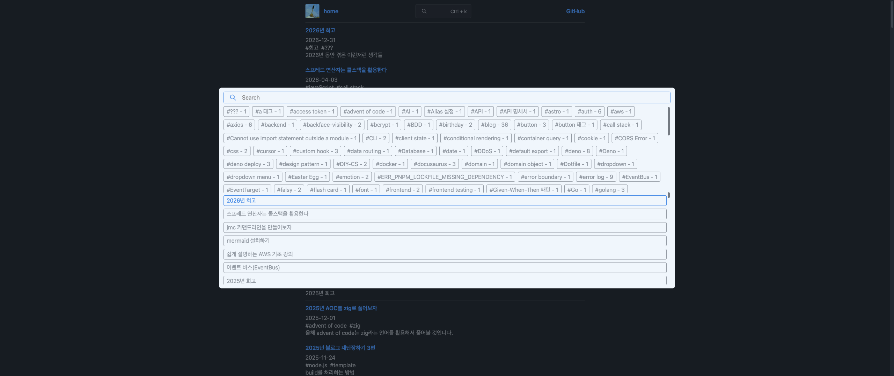
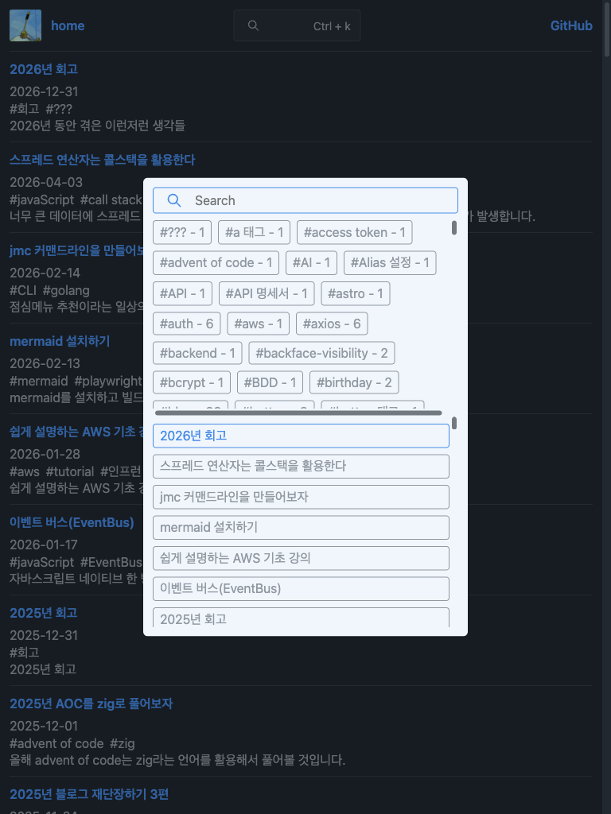
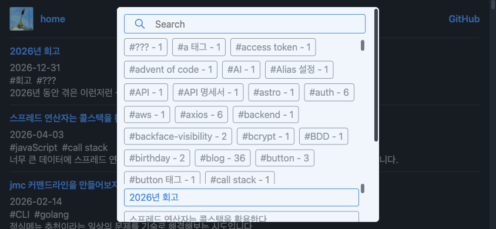

# 검색 팝업 중앙 정렬 검증

Playwright MCP Chromium에서 `http://localhost:3000/#search=open`을 촬영했습니다.
크기는 CSS 픽셀 기준 뷰포트이며, 실제 모바일 기기의 키보드/브라우저 UI 검증은 포함하지 않습니다.

기존 `top: 25vh`, `left: 25vw`는 팝업의 실제 크기와 패딩을 반영하지 않았습니다.
화면 중심에 배치하고 `translate(-50%, -50%)`로 실제 크기의 절반만큼 이동하도록 수정했습니다.
작은 높이에서는 팝업 높이를 제한하고 내부 스크롤로 내용을 확인할 수 있습니다.

## 수정 전 — 1470 × 776

화면 중심 대비 오른쪽 12px, 아래쪽 94.5px 치우쳤습니다.



## 수정 후

모든 화면에서 가로·세로 중심 오차는 0px이며, 팝업 전체가 뷰포트 안에 있습니다.
모바일 가로 화면에서는 상하 여백이 각각 12px입니다.

| 뷰포트    | 용도 / 비율         | 가로 오차 | 세로 오차 | 스크린샷                    |
| --------- | ------------------- | --------- | --------- | --------------------------- |
| 1470x776  | 기존 문제 재현 화면 | 0px       | 0px       | [보기](after-1470x776.png)  |
| 1920x1080 | 데스크톱 16:9       | 0px       | 0px       | [보기](after-1920x1080.png) |
| 1440x900  | 노트북 16:10        | 0px       | 0px       | [보기](after-1440x900.png)  |
| 2560x1080 | 울트라와이드 64:27  | 0px       | 0px       | [보기](after-2560x1080.png) |
| 768x1024  | 태블릿 3:4          | 0px       | 0px       | [보기](after-768x1024.png)  |
| 390x844   | 모바일 세로         | 0px       | 0px       | [보기](after-390x844.png)   |
| 844x390   | 모바일 가로         | 0px       | 0px       | [보기](after-844x390.png)   |

### 기존 문제 재현 화면 — 1470x776



### 데스크톱 16:9 — 1920x1080



### 노트북 16:10 — 1440x900



### 울트라와이드 64:27 — 2560x1080



### 태블릿 3:4 — 768x1024



### 모바일 세로 — 390x844


### 모바일 가로 — 844x390



## 회귀 테스트

개발 서버를 `pnpm dev`로 실행한 후:

```sh
pnpm exec playwright test tests/search-popup.spec.ts --project=chromium --reporter=line
```

수정 전 1470 × 776 테스트는 가로 오차 12px로 실패했고, 수정 후 7개 테스트가 모두 통과했습니다.
각 테스트는 중심 오차 1px 이내 및 뷰포트 안에 팝업 전체가 들어오는지 확인합니다.
개발 서버는 CSS 변경을 자동 반영하지 않으므로, CSS 수정 후 서버를 재시작하거나 `cp app/asset/style.css dist/style.css`로 반영합니다.
