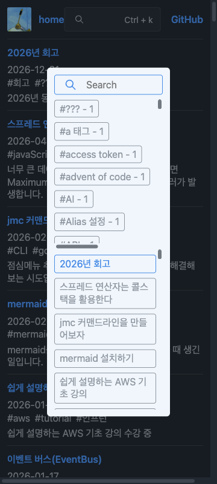

# 검색 팝업 명세

- 상태: 초안 — 중앙 정렬 요구를 기록하고, 나머지 정책은 검토 대기
- 작성일: 2026-09-05
- 관련 변경: [중앙 정렬 PR #362](https://github.com/arch-spatula/arch-spatula.github.io/pull/362)

## 목적과 범위

블로그 검색 팝업의 기대 동작과 검증 기준을 대화 밖에서도 확인할 수 있도록 기록한다.
이번 명세의 출발점은 검색 팝업의 중앙 정렬이다. 검색과 키보드 조작은 현재 동작을 참고 기록하며, 전체 기능의 요구사항으로 확정하지 않는다.

이 문서는 중앙 정렬 구현 후 작성한 명세 초안이다. 아래에서 합의된 요구, 구현 과정의 선택, 미결정 사항을 구분한다. 현재 코드가 동작한다는 이유만으로 요구사항이 승인된 것으로 취급하지 않는다.

## 합의된 요구

| ID     | 요구                                                                       |
| ------ | -------------------------------------------------------------------------- |
| POP-01 | `/#search=open`에서 열린 검색 팝업을 화면 중앙에 배치한다.                 |
| POP-02 | 대표적인 화면 해상도와 비율에서 중앙 정렬을 확인하고 스크린샷을 남긴다.    |
| POP-03 | 기존 문제 화면과 수정 결과를 저장소에 기록하고 PR에서 확인할 수 있게 한다. |

## 수용 기준 초안과 기존 검증

중앙은 우선 브라우저 뷰포트의 가로·세로 중심으로 해석한다. 팝업의 패딩을 포함한 외곽 사각형을 기준으로 측정한다. 허용 오차와 화면 목록은 기존 구현에서 선택한 검증 기준이며, 명세 검토 시 확정한다.

| 연결 요구 | 수용 기준 초안                                                                | 기존 증거                                                                                                                                                                                                                                                                    |
| --------- | ----------------------------------------------------------------------------- | ---------------------------------------------------------------------------------------------------------------------------------------------------------------------------------------------------------------------------------------------------------------------------- |
| POP-01    | URL로 팝업을 열면 팝업 중심과 뷰포트 중심의 차이가 각 축에서 1 CSS px 이내다. | [Playwright 테스트](https://github.com/arch-spatula/arch-spatula.github.io/blob/d5d60c05/tests/search-popup.spec.ts)                                                                                                                                                         |
| POP-02    | 아래 7개 뷰포트에서 각각 중앙 정렬을 확인하고 화면 전체를 촬영한다.           | [스크린샷 및 측정 기록](https://github.com/arch-spatula/arch-spatula.github.io/blob/d5d60c05/docs/screenshots/center-popup/README.md)                                                                                                                                        |
| POP-03    | 수정 전·후 동일한 1470 × 776 화면을 비교할 수 있다.                           | [수정 전](https://github.com/arch-spatula/arch-spatula.github.io/blob/d5d60c05/docs/screenshots/center-popup/before-1470x776.png), [수정 후](https://github.com/arch-spatula/arch-spatula.github.io/blob/d5d60c05/docs/screenshots/center-popup/after-1470x776.png), PR #362 |

| 뷰포트 (CSS px) | 용도 / 비율        |
| --------------- | ------------------ |
| 1470 × 776      | 최초 문제 재현     |
| 1920 × 1080     | 데스크톱 16:9      |
| 1440 × 900      | 노트북 16:10       |
| 2560 × 1080     | 울트라와이드 64:27 |
| 768 × 1024      | 태블릿 3:4         |
| 390 × 844       | 모바일 세로        |
| 844 × 390       | 모바일 가로        |

기존 기록에서 수정 전 오차는 오른쪽 12px, 아래쪽 94.5px였고, 수정 후 위 7개 화면의 오차는 각 축에서 0px였다. 이는 당시 Chromium 검증 결과이며 다른 브라우저나 실제 모바일 기기의 결과를 의미하지 않는다.

## 구현 과정에서 선택한 사항 — 정책 검토 필요

- 팝업의 실제 크기를 기준으로 중앙에 배치하도록 CSS 좌표와 변환을 사용했다. 특정 CSS 기법 자체는 요구사항이 아니다.
- 낮은 화면에서도 팝업 외곽이 뷰포트를 벗어나지 않도록 높이를 제한하고 팝업 내부 스크롤을 추가했다. 기존 테스트는 외곽의 화면 내 배치까지 확인한다.
- 844 × 390 화면에서 위아래 여백은 각각 12px다. 12px을 모든 화면의 여백 정책으로 합의한 것은 아니다.
- 기존 팝업 너비 설정은 유지했다. 모바일에 적절한 검색창 너비인지 여부는 별도 결정이 필요하다.

## 현재 검색·조작 동작 — 참고 기록

[SearchPopup 구현](../../app/client/search/SearchPopup.ts)을 읽어 확인한 동작이다. 아래 전체를 브라우저에서 검증한 것은 아니다.

- 검색 버튼과 `Ctrl+K` / `Cmd+K`로 열 수 있으며, 단축키는 열림 상태를 토글한다.
- `#search=open` 상태에서 열리고 검색 입력에 포커스를 준다.
- Escape 또는 오버레이 클릭으로 닫으며, 닫을 때 검색어와 검색 결과 상태를 초기화한다.
- 검색어의 앞뒤 공백을 제거하고 대소문자를 구분하지 않는 부분 일치로 제목과 태그를 필터링한다. 일치 텍스트를 강조한다.
- 위아래 방향키로 보이는 글을 순환 선택하고 Enter로 선택한 글에 이동한다.

[기존 Vitest 테스트](../../app/client/search/SearchPopup.test.ts)는 검색 필터·강조, 선택 이동·순환, 초기화, 해시에 따른 열림·닫힘 등을 검증한다. 버튼·단축키·포커스 복귀 등 전체 사용자 흐름의 E2E 검증을 대신하지 않는다.

## 모바일 사용성 문제

관련 이슈: [모바일 검색 팝업 사용성 개선 #364](https://github.com/arch-spatula/arch-spatula.github.io/issues/364)

360 × 800 CSS px 뷰포트에서 `http://localhost:3000/#search=open`을 Playwright로 촬영했다.

팝업은 중앙에 있지만, 현재 너비 설정인 `50vw`에 좌우 패딩 24px이 더해져 외곽 너비가 204px이다. 화면 양쪽에 각각 78px이 남는 동안 검색 입력과 결과 영역은 좁다. 태그가 여러 행을 차지하고 긴 글 제목이 줄바꿈되어 한 화면에서 결과를 훑어보기 어렵다. 태그 영역에는 가로 스크롤바도 보인다.

중앙 정렬 여부만으로 모바일 사용성을 판단하기 어렵다는 문제를 개선 대상으로 기록한다. 너비·최소 여백·스크롤 정책과 검증 가능한 수용 기준을 먼저 결정해야 한다. 이 스크린샷은 뷰포트 크기를 조절한 결과이며 실제 터치 조작이나 가상 키보드가 열린 상태의 검증은 포함하지 않는다.

모바일 개선 검토 항목:

- 360px 화면에서 검색 입력과 글 목록에 충분한 너비를 제공할 정책을 정한다.
- 긴 태그·제목과 빈 검색 결과의 표시 및 스크롤 방식을 정한다.
- 터치 환경의 닫기 동작과 가상 키보드가 열린 상태의 배치를 검토한다.
- 합의한 기준을 테스트로 연결하고 동일한 360 × 800 화면의 수정 전후를 비교한다.

## 다음 구현 전에 결정할 사항

| 주제      | 결정할 내용                                                                             |
| --------- | --------------------------------------------------------------------------------------- |
| 중앙 기준 | 모바일 키보드가 올라오거나 브라우저 UI가 변할 때 실제 보이는 영역을 기준으로 재배치할지 |
| 내용 변화 | 검색 결과가 줄거나 없어져 높이가 변해도 중앙을 유지할지, 입력창 위치를 유지할지         |
| 작은 화면 | 최소 여백과 팝업 너비를 얼마로 할지, 팝업 전체와 결과 목록 중 어디를 스크롤할지         |
| 열림·닫힘 | 현재 URL·버튼·단축키 동작과 닫을 때 초기화 정책을 유지할지                              |
| 접근성    | 다이얼로그 의미, Tab 포커스 범위, 닫은 후 포커스 복귀 위치를 어떻게 정할지              |
| 지원 범위 | Chromium 외 브라우저와 실제 모바일 기기에서 어떤 시나리오를 필수 검증할지               |

이 항목들은 미결정 사항이며 이번 문서 작성으로 구현 범위에 추가하지 않는다.

## 명세를 사용하는 순서

1. 변경할 동작과 관련된 미결정 사항을 논의하고 이 문서의 요구·수용 기준에 반영한다.
2. 합의된 수용 기준을 테스트로 연결하고, 버그 수정이라면 변경 전 실패를 확인한다.
3. 구현 후 해당 테스트를 통과시키고, 화면 변화가 있으면 스크린샷 증거를 기록한다.
4. PR에서 명세 변경, 코드, 검증 결과를 함께 검토한다. 검증하지 못한 범위는 명시한다.

명세에는 기대 동작을, 테스트와 스크린샷 기록에는 그 동작을 확인한 증거를 남긴다. 변경 이력은 Git과 관련 PR로 추적한다.
