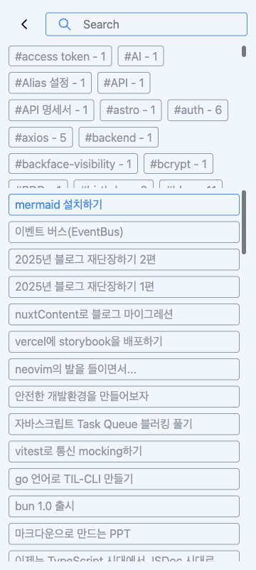
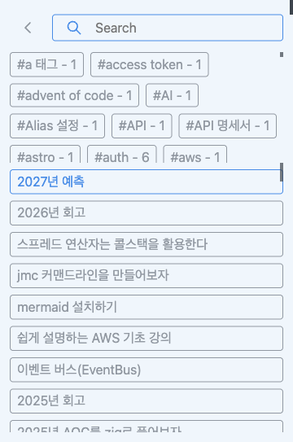

# 검색 팝업 명세

- 상태: 좁은 화면 대응 구현 및 Chromium 검증 반영, 잔여 정책 검토 중
- 갱신일: 2026-09-05
- 관련 이슈: [모바일 검색 팝업 사용성 개선 #364](https://github.com/arch-spatula/arch-spatula.github.io/issues/364)
- 관련 PR: [모바일 검색 명세·개선 #365](https://github.com/arch-spatula/arch-spatula.github.io/pull/365), [중앙 정렬 #362](https://github.com/arch-spatula/arch-spatula.github.io/pull/362)

## 목적과 범위

블로그 검색의 기대 동작, 구현 기준, 검증 증거를 기록한다. 좁은 화면에서는 검색을 별도 전체 화면으로 제공하여 검색 입력과 결과를 읽을 공간을 확보한다. 기기 종류나 마우스 유무로 모바일을 판별하지 않는다.

사용자와 합의한 동작과 구현 과정에서 선택한 수치를 구분한다. 과거 스크린샷이나 테스트 통과 기록을 현재 구현 전체의 검증으로 취급하지 않는다.

## 요구사항

| ID     | 요구                                                                                                    |
| ------ | ------------------------------------------------------------------------------------------------------- |
| POP-01 | 팝업 방식에서는 검색을 화면 중앙에 배치한다. 좁은 화면의 전체 화면 방식은 아래 POP-04를 따른다.         |
| POP-02 | 대표 화면 크기와 전환 경계에서 배치를 검증하고 스크린샷을 남긴다.                                       |
| POP-03 | 수정 전후 증거를 저장소에 기록하고 PR에서 연결한다.                                                     |
| POP-04 | 팝업 사용이 어려운 좁은 화면에서는 검색이 화면을 채운다.                                                |
| POP-05 | 검색창과 같은 상단 행의 왼쪽에 `<` 돌아가기 버튼을 배치한다.                                            |
| POP-06 | 돌아가기 아이콘의 기본·호버 색상을 검색창의 색상 정책과 맞춘다. 좁은 화면에서도 마우스 호버를 지원한다. |
| POP-07 | 배경 콘텐츠의 가로 넘침으로 전체 화면 검색 밖에 배경이 드러나지 않아야 한다.                            |
| POP-08 | 돌아가기 버튼으로 검색을 종료하면 검색 버튼으로 포커스를 돌리고 기존 스크롤 위치를 유지한다.            |

## 화면과 레이아웃

현재 전환 기준은 **뷰포트 너비 600 CSS px 이하**다. 기존 `50vw` 팝업에서 내용 너비가 300px 이하가 되는 구간을 기준으로 선택한 구현값이며, 태블릿이나 입력 장치를 판별하는 기준이 아니다.

| 조건            | 표시 방식                               |
| --------------- | --------------------------------------- |
| 너비 600px 이하 | 전체 화면 검색, 왼쪽 돌아가기 버튼 표시 |
| 너비 600px 초과 | 기존 팝업 방식, 돌아가기 버튼 숨김      |

전체 화면의 구현 기준:

- 외곽은 화면을 채우고 바깥 여백과 모서리 둥글기를 제거한다. 내부 여백은 12px이다.
- 돌아가기 버튼은 44 × 44px의 클릭 영역을 가진다.
- 버튼과 검색창은 같은 행에서 세로 중심을 맞추고 8px 간격을 둔다. 검색창은 남은 가로 공간을 사용한다.
- 검색 헤더는 유지하고, 태그 목록은 화면 높이의 최대 25%를 사용하며 내부에서 스크롤한다. 글 목록은 남은 높이에서 스크롤한다.
- 긴 태그는 줄바꿈한다. 태그와 글 목록에 가로 스크롤이 생기지 않아야 한다.
- 검색이 열렸을 때 문서 루트와 body의 넘침을 제한한다. 닫으면 이 제한을 해제한다.

12px 여백, 44px 버튼, 8px 간격과 태그 영역 25%는 현재 구현에서 선택한 수치다. 실제 기기의 가상 키보드가 열린 상태는 아직 검증하지 않았다.

## 돌아가기 버튼과 색상

전체 화면 검색을 기존 블로그에서 검색 화면으로 들어간 것으로 표현한다. 사용자가 요청한 Tabler `chevron-left` SVG를 [chevron-left.svg](../../app/asset/chevron-left.svg)에 저장하고 기존 아이콘처럼 이미지로 사용한다. X 아이콘은 표시하지 않는다.

- 접근성 이름은 **“검색에서 돌아가기”**다.
- 클릭·탭·Enter·Space로 검색을 종료할 수 있어야 한다.
- 기존 해시 닫기 방식으로 검색을 종료하고 검색 버튼으로 포커스를 복귀시킨다. 포커스 이동 때문에 페이지를 맨 위로 스크롤하지 않는다.
- `#search=open`으로 직접 방문한 경우에도 검색을 종료할 수 있다. 브라우저의 이전 URL로 이동하는 버튼은 아니며, 브라우저 뒤로가기 이력 정책은 별도 검토한다.

| 아이콘 상태   | 색상 기준           | 적용                                                             |
| ------------- | ------------------- | ---------------------------------------------------------------- |
| 기본          | 회색 `#9198a1`      | 검색 아이콘과 동일한 SVG 필터                                    |
| 호버          | 연한 파랑 `#6cb6ff` | 검색창 호버와 동일한 SVG 필터, 화면 너비에 따라 호버를 막지 않음 |
| 키보드 포커스 | 파랑 `#478be6`      | 검색창 포커스와 동일한 SVG 필터, `:focus-visible` 적용           |

색상은 기존 CSS 필터를 공유하므로 위 HEX 값은 디자인 기준이다. 기존 글 목록의 호버는 `#478be6`, 태그 목록의 호버는 `#6cb6ff`이며 이번 아이콘 변경은 검색창·태그의 호버 기준을 따른다. 목록 전체의 호버 정책을 바꾼 것은 아니다.

배치 참고 자료: [Pinterest 이미지 1](https://kr.pinterest.com/pin/1083326885401011405/), [Pinterest 이미지 2](https://kr.pinterest.com/pin/433119689188847264/). 작성 시 접근 오류로 이미지를 직접 확인하지 못했으며, “검색창 왼쪽에 `<` 버튼이 붙어 있다”는 사용자 설명을 반영했다.

## 기존 검색 동작

[SearchPopup 구현](../../app/client/search/SearchPopup.ts)을 기준으로 유지하는 동작이다.

- 검색 버튼과 `Ctrl+K` / `Cmd+K`로 열며 단축키는 열림 상태를 토글한다.
- `#search=open`이면 검색을 열고 입력에 포커스를 준다.
- Escape·오버레이 클릭으로도 닫는다. 닫을 때 검색어와 검색 결과 상태를 초기화한다.
- 앞뒤 공백을 제거하고 대소문자를 구분하지 않는 부분 일치로 제목과 태그를 필터링하며 일치 텍스트를 강조한다.
- 방향키로 보이는 글을 순환 선택하고 Enter로 이동한다. 돌아가기 버튼의 Enter 동작은 글 이동으로 처리하지 않는다.

## 수용 기준과 검증 상태

| 연결 요구      | 수용 기준                                                                                                                    | 검증 상태                                                    |
| -------------- | ---------------------------------------------------------------------------------------------------------------------------- | ------------------------------------------------------------ |
| POP-04         | 360·390·600px에서 검색 외곽이 뷰포트를 채운다. 601px에서는 팝업을 유지한다.                                                  | Playwright 통과                                              |
| POP-05         | 버튼은 왼쪽 12px, 위쪽 12px에 위치하고 검색창과 중심 오차 1px 이내로 정렬된다. 간격은 8px이고 검색창은 남은 너비를 사용한다. | Playwright 통과                                              |
| POP-05, POP-08 | 돌아가기 버튼이 올바른 접근성 이름을 갖고 아이콘이 로드된다. 클릭·Enter로 닫히고 검색 버튼으로 포커스가 복귀한다.            | Playwright 통과, Space는 별도 자동 검증 미추가               |
| POP-06         | 360px에서 돌아가기 아이콘과 검색 아이콘의 기본·호버·키보드 포커스 필터가 상태별로 일치한다.                                  | Playwright MCP 확인                                          |
| POP-07         | 모바일 에뮬레이션 360 × 543에서 배경에 넓은 콘텐츠가 있어도 `innerWidth/innerHeight` 및 팝업 외곽이 360 × 543이다.           | Playwright 통과                                              |
| POP-08         | 스크롤한 상태에서 검색을 열고 돌아가기 버튼을 탭하면 닫힌 뒤 위치가 유지되고 스크롤을 재개할 수 있다.                        | Playwright 통과                                              |
| POP-04         | 좁은 화면의 태그·글 목록에 가로 스크롤이 없다.                                                                               | 360·390·600px Playwright 통과                                |
| POP-01         | 팝업 중심과 화면 중심의 각 축 오차가 1px 이내다.                                                                             | 중앙 정렬 PR의 과거 검증이며 현재 브랜치에서 재검증하지 않음 |

[현재 Playwright 테스트](../../tests/mobile-search-popup.spec.ts) 총 5개와 [검색 Vitest 테스트](../../app/client/search/SearchPopup.test.ts) 16개가 통과했다. 모바일 회귀 테스트는 `isMobile: true`, `hasTouch: true`로 실행한다. 뷰포트 너비만 줄인 데스크톱 검증을 모바일 검증으로 대신하지 않는다.

재실행 시 로컬 서버와 최신 생성 파일이 필요하다.

```sh
pnpm exec playwright test tests/mobile-search-popup.spec.ts --project=chromium --reporter=line
pnpm exec vitest run app/client/search/SearchPopup.test.ts
```

개발 서버는 CSS·템플릿 변경을 자동 반영하지 않는다. 마지막 검증에서는 CSS를 `dist`에 반영하고 클라이언트를 esbuild로 다시 번들링했다. 앞선 전체 사이트 빌드는 Mermaid 브라우저 컨텍스트 종료 오류로 실패했으며, 이후 전체 빌드는 재실행하지 않았다. Chromium 외 브라우저 및 실제 모바일 가상 키보드는 미검증이다.

## 문제와 변경 증거

최초 360 × 800 화면에서는 팝업 너비가 204px에 불과하여 제목 줄바꿈이 많고 태그 영역에 가로 스크롤이 보였다.


전체 화면 전환 후 X 버튼을 입력창 위에 두었던 [중간 구현 기록](../screenshots/mobile-popup/after-360x800.png)은 현재 요구가 아니다. 이후 돌아가기 버튼과 검색창을 같은 행에 배치했다.



모바일 에뮬레이션에서는 배경의 긴 콘텐츠 때문에 화면 크기가 늘어나는 문제가 추가로 발견됐다. 회귀 테스트에서 수정 전 374 × 565로 늘어나는 실패를 확인했고, 수정 후 360 × 543을 유지했다.



중앙 정렬 PR의 [과거 7개 해상도 검증 기록](https://github.com/arch-spatula/arch-spatula.github.io/blob/d5d60c05/docs/screenshots/center-popup/README.md)은 당시 구현의 증거로 보존한다. 현재 전체 화면 정책의 검증과 구분한다.

## 남은 결정과 검증

- 실제 모바일 키보드 및 브라우저 UI 변화에 따른 검색창·결과 영역 배치
- 빈 결과 표시와 검색 결과 변화 시 높이·스크롤 정책
- 다이얼로그 의미와 Tab 포커스 범위
- 브라우저 뒤로가기와 직접 URL 진입의 이력 정책
- Chromium 외 브라우저 및 넓은 화면 중앙 정렬의 현재 브랜치 검증

이 항목들은 이번 문서 갱신으로 구현 범위에 추가하지 않는다. 후속 변경은 요구와 수용 기준을 먼저 갱신하고 테스트·구현·스크린샷을 PR에서 함께 검토한다.
