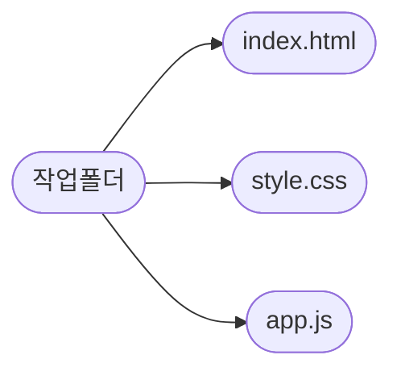

# 컴포넌트

리액트에서 컴포넌트는 레고랑 비슷합니다. 앱은 레고를 조립하는 방식으로 구현합니다.

누군가 컴포넌트를 만들라고 하먄 html을 `return`하는 부분만 조작하면 됩니다.

컴포넌트는 자바스크립트를 사용해야 할 때가 있습니다.

컴포넌트는 재사용할 수 있습니다. 재사용하려면 `export`, `import`가 필요합니다. 이 부분은 자바스크립트 문법에 해당합니다. `return`은 html처럼 생긴 JSX를 작성하는 영역입니다. 그 위는 자바스크립트로 로직을 처리합니다.

컴포넌트를 만들 때는 항상 파스칼케이스라는 것으 잊지말도록 합니다. 폴더는 카멜케이스로 작성합니다. 이름으로 컴포넌트, 폴더 등을 읽으면서 바로 추론할 수 있어야 합니다.

```jsx
import './App.css';

function App() {
  const handleClick = () => {
    alert('클릭!');
  };
  return (
    <div
      className="App"
      style={{
        height: '100vh',
        display: ' flex',
        flexDirection: 'column',
        justifyContent: 'center',
        alignItems: 'center',
      }}
    >
      <p>이것은 내가 만든 App 컴포넌트입니다.</p>
      <button onClick={handleClick}>클릭!</button>
    </div>
  );
}

export default App;
```

이렇게 html처럼 생긴 자바스크립트로 화면을 구현할 수 있습니다.

컴포넌트를 부모 자식관계로 만들 수 있습니다. html은 부모자식 관계를 들었을 것입니다. 포함관계로 속해있으면 자식에 해당합니다.

화면에 보여지게 하는 것을 보고 랜더링이라고 부릅니다. return에 작성하는 코드들을 보고 JSX라고 합니다.

```jsx
import './App.css';

const Child = () => {
  return (
    <div>
      <span>Child</span>
    </div>
  );
};

const Parent = () => {
  return (
    <div>
      <h2>Parent</h2>
      <Child></Child>
    </div>
  );
};

function App() {
  return (
    <div>
      <h1>Grand Parent</h1>
      <Parent></Parent>
    </div>
  );
}

export default App;
```

부모자식, 자매, 손주, 증조 관계를 만들 수 있습니다.

## JSX

JSX 문법입니다. 컴포넌트의 생김새를 정의하고 DOM 객체의 위치를 표현할 때 사용합니다.

놀랍게도 바벨이라는 라이브러리가 변환해주는 것입니다. 그래서 자바스크립트입니다. html에 없는 문법 규칙이 있습니다. 무엇이 있는지 알아야 합니다.

오류 메시지를 잘 보도록 합니다.

태그는 짝을 맞추어야 합니다.

```jsx
// input 태그를 닫지 않고 넣어볼거예요!
function App() {
  return (
    <div className="App">
      <input type='text'>
    </div>
  );
}
```

참고로 홀태그는 `<tagName />`이렇게 작성합니다.

```jsx
return (
    <p>안녕하세요! 리액트 반입니다 :)</p>

    <div className="App">
      <input type='text'/>
    </div>
);
```

모든 태그는 하나의 태그 안에 있어야 합니다. `div` 혹은 Fragments(`<></>`)로 감싸야 합니다.

모든 속성은 카멜케이스로 변환해서 작성합니다.

```jsx
return (
  <div className="App">
    <p>안녕하세요! 리액트 반입니다 :)</p>
    <input type="text" />
  </div>
);
```

`class`는 `className`으로 작성합니다. 자바스크립트 예약어랑 충돌합니다. 그리고 대부분의 html 속성은 카멜 케이스로 작성합니다.

```jsx
// 중괄호를 두 번 쓰는 이유? 딕셔너리도 자바스크립트니까요!
// 이렇게 쓰거나,
<p style={{ color: 'orange', fontSize: '20px' }}>orange</p>;

//혹은 스타일 딕셔너리를 변수로 만들고 쓸 수 있어요!
function App() {
  const styles = {
    color: 'orange',
    fontSize: '20px',
  };

  return (
    <div className="App">
      <p style={styles}>orange</p>
    </div>
  );
}
```

html 태그에 스타일을 넣는 방법이 조금 다릅니다. 객체로 넣어야 합니다.

```jsx
import React from 'react';
import logo from './logo.svg';
import './App.css';

function App() {
  const number = 1;

  return (
    <div className="App">
      <p>안녕하세요! 리액트 반입니다 :)</p>
      {/* JSX 내에서 코드 주석은 이렇게 씁니다 :) */}
      {/* 삼항 연산자를 사용했어요 */}
      <p>
        {number > 10 ? number + '은 10보다 크다' : number + '은 10보다 작다'}
      </p>
    </div>
  );
}

export default App;
```

자바스크립트 코드는 중괄호속에 작성합니다.

## props

컴포넌트를 잘 다루기 위해서는 2가지를 잘 다루어야 합니다. state와 props입니다.

props는 부모컴포넌트로 가져온 데이터입니다. props는 컴포넌트가 부모에서 자식으로 전달하는 데이터입니다. 속성값으로 전달해주면 됩니다.

```jsx
// src/App.js

import React from 'react';

function App() {
  return <GrandFather />;
}

function GrandFather() {
  return <Mother />;
}

function Mother() {
  const name = '홍부인';
  return <Child />;
}

function Child() {
  return <div>연결 성공</div>;
}

export default App;
```

props는 부모로 부터 받은 모든 데이터입니다. 부모에서 입력한 속성값으로 접근할 수 있습니다.

```js
import React from 'react';

// div안에서 { } 를 쓰고 props.motherName을 넣어보세요.
function Child(props) {
  return <div>{props.motherName}</div>;
}

function Mother() {
  const name = '홍부인';
  return <Child motherName={name} />;
}

function GrandFather() {
  return <Mother />;
}

function App() {
  return <GrandFather />;
}

export default App;
```

이런 식으로 데이터를 전달할 수 있습니다. props의 데이터 전달은 일방적입니다. 부모에서 자식에게만 전달할 수 있습니다.

```jsx
import React from 'react';

// div안에서 { } 를 쓰고 props.motherName을 넣어보세요.
function Child({ GrandFatherName }) {
  return <div>{GrandFatherName}</div>;
}

function Mother({ GrandFatherName }) {
  return <Child GrandFatherName={GrandFatherName}></Child>;
}

function GrandFather(props) {
  const name = 'ATF is ';
  return <Mother GrandFatherName={name}></Mother>;
}

function App() {
  return <GrandFather />;
}

export default App;
```

이런식으로 자식에게 전달할 수 있습니다. 관례적으로 매개변수는 props로 보냅니다.

많은 경우 객체구조분해할당으로 전달하는 경우도 많습니다.

props drilling은 그 자체가 문제는 전혀 아닙니다. 하면 복잡해질 수 있어서 문제인 것 뿐입니다. 그래서 state를 잘 설계하고 라이프러리와 상태관리 프레임워크를 활용합니다.

prop types는 props에 종류들이 존재합니다. props는 사용하는 쪽에서 정의하는 경우가 있습니다. props의 타입을 미리 지정하지 않으면 여러 문제가 발생할 수 있습니다. 의도하지 않은 형변환으로 버그를 유발할 수 있습니다.

[PropTypes와 함께 하는 타입 검사](https://ko.reactjs.org/docs/typechecking-with-proptypes.html#gatsby-focus-wrapper)

다른 방법으로 자식에게 데이터를 전달할 수 있습니다.

`children`으로 전달할 수 있습니다. 자식에서 데이터를 받아 처리하는 것이 아닙니다. 태그 사이 존재하는 콘텐츠로 전달하는 방법이 `children`입니다.

```jsx
import React from 'react';

function User(props) {
  return <div>{props.children}</div>;
}

function App() {
  return <User>안녕하세요</User>;
}

export default App;
```

이렇게 하면 콘텐츠 영역의 내용으로 전달할 수 있습니다.

보통 레이아웃에 많이 활용합니다. 레이아웃 컴포넌트의 `children`으로 스타일을 한번에 적용할 수 있습니다.

구조 분해할당으로 더욱더 가독성 높은 코드를 작성할 수 있습니다. props 키워드를 줄이고 객체의 key를 입력하는 것으로 접근할 수 있습니다.

```jsx
function Todo({ title, body, isDone, id }) {
  return <div>{title}</div>;
}
```

지정안해도 기본값을 갖도록 만들 수 있습니다.

```jsx
// components/Child.js

import React from 'react';

function Child({ name }) {
  return <div>내 이름은 {name} 입니다. </div>;
}

// 이렇게 설정합니다.
Child.defaultProps = {
  name: '기본 이름',
};

export default Child;
```

객체 구조분해할당으로 정의하고 속성값의 객체에 지정하면 됩니다.

예를 들어 비로그은 마이페이처럼 유저정보가 없을 때 기본으로 제공해야 하는 props를 바로 넣을 수 있습니다.

PropTypes는 타임스크립트를 활용하기 전에 사용할 수 있는 전략입니다.

```js
import PropTypes from 'prop-types';

function HelloWorldComponent({ name }) {
  return <div>Hello, {name}</div>;
}

HelloWorldComponent.propTypes = {
  name: PropTypes.string,
};

export default HelloWorldComponent;
```

위는 클래스형 컴포넌트이지만 함수형컴포넌트도 위처럼 사용할 수 있습니다.

[PropTypes와 함께 하는 타입 검사](https://ko.reactjs.org/docs/typechecking-with-proptypes.html#gatsby-focus-wrapper) 공식 문서를 잘 읽기 바랍니다.

# React 입문

## State

State랑 props만 알아도 리액트의 상당부분을 알게되는 것입니다.

state를 사용할 때는 useState 훅을 사용합니다. state를 통해 데이터를 변형하는 이유입니다. 컴포넌트에는 라이프 사이클이 있습니다. 화면의 변화된 값을 업데이트하기 위해서 이렇게 합니다. state에 따라 랜더링 여부를 반영하고 판단합니다. 리액트라 변화를 감지하고 즉시 랜더링하게 만들기 위해서 state를 활용합니다.

state는 리액트에서만 제공하고 존재합니다. 이것은 hook이라고 부릅니다.

```js
import React, { useState } from 'react';

function GrandFather() {
  const [name, setName] = useState('김할아'); // 이것이 state!
  return <Mother grandFatherName={name} />;
}

// .. 중략
```

`name`은 state값입니다. `setName`은 Setter함수입니다. 이 함수로 `name`값을 업데이트할 수 있습니다.

```js
// src/App.js

import React, { useState } from 'react';

function Child(props) {
  return (
    <div>
      <button
        onClick={() => {
          props.setName('박할아');
        }}
      >
        할아버지 이름 바꾸기
      </button>
      <div>{props.grandFatherName}</div>
    </div>
  );
}

function Mother(props) {
  return (
    <Child grandFatherName={props.grandFatherName} setName={props.setName} />
  );
}

function GrandFather() {
  const [name, setName] = useState('김할아');
  return <Mother grandFatherName={name} setName={setName} />;
}

function App() {
  return <GrandFather />;
}

export default App;
```

화면에서 바뀐 값만 반영합니다. 서버랑 통신해야 바뀐 값을 저장할 수 있습니다.

위 코드는 `setter`함수도 `props`로 같이 전달합니다.

컴포넌트의 라이프 사이클과 리랜더링 조건을 알아내도록 합니다.

웹사이트에서 사용자가 상호작용해서 데이터를 변형하는 경우입니다.

```js
import React, { useState } from 'react';

function App() {
  const [name, setName] = useState('춉춉이');
  const onClickHandler = () => {
    setName('루랑이');
  };
  return (
    <div>
      <button onClick={onClickHandler}>{name}</button>
    </div>
  );
}

export default App;
```

버튼을 클릭하면 state가 업데이트 됩니다.

```js
import React, { useState } from 'react';

function App() {
  const [text, setText] = useState('');
  const handleTyping = (event) => {
    setText(event.target.value);
  };
  return (
    <div>
      <input type="text" onChange={handleTyping} value={text} />
    </div>
  );
}

export default App;
```

input에 state를 설정하는 방법입니다.

이벤트 객체는 DOM의 개념입니다.

리액트를 사용할 때는 불변성을 주의해야 합니다. 자바스크립트 데이터 중에 원시형은 불변성이 있고 참조형은 불변성이 없습니다. 메모리의 동작 방식의 문제입니다. 원시형을 비교할 때 엄밀비교하고 동일하면 true를 반환하는 이유는 주소가 동일하기 때문입니다.

참조형은 불변성이 없습니다.

```js
let obj1 = { name: 'kim' };
let obj2 = { name: 'kim' };
console.log(obj1 === obj2); // false
```

각다 다른 주소를 갖고 있기 때문에 동일하게 보여도 주소가 다릅니다.

리액트에서는 데이터의 불변성을 지켜주는 것이 중요합니다. 리랜더링 기준은 state가 변하고 안 변하고가 기준입니다. state 변화 전후를 비교합니다. state의 변화를 알아내기 위해서는 메모리 주소를 비교하는 전략을 활용합니다. 리액트에서 state value만 새로 할당하는 것은 리랜더링이 발생하지 않습니다(`state = "valeu"`). setter함수를 통해 변경해야지만 리랜더링이 발생합니다. setter함수를 통해 변경해야 이전 이후 메모리 차이가 나게 말들 수 있기 때문입니다(`setState("new value")`). 리액트는 내부에서 참조형비교의 `false`가 발생하는지 확인하고 변경여부를 판단하는 방식으로 동작합니다.

직접 수정하지 않습니다. 기존의 값을 복사하고 그 이후의 값을 추가하고 삭제하는 방식으로 구현합니다.

## 컴포넌트와 랜더링

이번에는 이론입니다.

리액트의 모든 UI들은 컴포넌트로 만듭니다. 컴포넌트 기반 라이브러리의 장점을 배웁니다.

컴포넌트는 UI의 최소 단위 선언체입니다. 리액트 컴포넌트가 선언체라는 것은 중요한 개념입니다. 이전까지는 직업 DOM을 조작하는 명령형 프로그래밍이었습니다.

명령형: 어떻게(How)를 중요시여겨서 프로그램의 제어의 흐름과 같은 방법을 제시하고 목표를 명시하지 않는 형태입니다.
선언형: 무엇(What)을 중요시 여겨서 제어의 흐름보다는 원하는 목적을 중요시 여기는 형태입니다.

```js
// Hello, World! 화면에 출력하기
// 순수 javaScript 명령형 코드
const root = document.getElementById('root');
const header = document.createElement('h1');
const headerContent = document.createTextNode('Hello, World!');

header.appendChild(headerContent);
root.appendChild(header);
```

위 코드는 명령형입니다. 처음 작게 프로토타입 정도 만들 때는 적당합니다. 하지만 대규모 앱을 만들면 관리하고 변경하기 상당히 어렵습니다.

```js
// React 코드 (선언적인)
const header = <h1>Hello World</h1>; // jsx
ReactDOM.render(header, document.getElementById('root'));
```

위 코드는 선언형입니다. 번들사이즈가 크기 때문에 바로 사용하지 않습니다. 하지만 어느정도 규모가 있으면 비교적 변경하기 쉬운습니다. 관리하기도 용이합니다.

트리거링(triggering): 랜더링이 발생하게 만드는 것

렌더링(rendering): UI 컴포넌트를 html로 변환시키는 것

커밋(commit): 실제 DOM에 UI를 반형하는 것

1. 렌더링 트리거

   - 첫 리액트 앱을 실행했을 때
   - 래액트 내부의 state가 변경되었을 때
     - 컴포넌트 내부 state가 변경되었을 때
     - 컴포넌트에 새로운 props가 변경되었을 때
     - 부모 컴포넌트가 state, props변경으로 랜더링이 발생할 때

2. 리랜더링

   - 리랜더링 트리거는 state를 변경하면 됩니다. 리랜더링을 유발하는 트리거는 더 많이 있습니다. 하지만 지금은 생략합니다.
   - state변화가 발생하면 리랜더링이 됩니다. 여러 state가 바뀌면 큐 자료구조로 처리합니다. 변경이 가해진 순서대로 처리합니다.

3. 브라우저 렌더링

   - 브라우저의 랜더링과 리액트의 랜더링은 당연히 다른 것입니다. 혼동을 피하기 위해서 브라우저 랜더링을 페인팅이라고 부르기도 합니다. 리액트는 렌더링을 완료하면 DOM에 업데이트 하고 브라우저에 화면을 그립니다.

[브라우저는 어떻게 동작하는가?](https://d2.naver.com/helloworld/59361)

## Counter App

```js
import React, { useState } from 'react';

function App() {
  const [count, setCount] = useState(0);
  const handleCountUp = () => {
    setCount((count) => ++count);
  };
  const handleCountDown = () => {
    setCount((count) => --count);
  };
  return (
    <div>
      <h1>{count}</h1>
      <button onClick={handleCountUp}>+ 1</button>
      <button onClick={handleCountDown}>- 1</button>
    </div>
  );
}

export default App;
```

이렇게 작성해도 괜찮지만 1번 쓸거면 익명함수가 좋은 해결책이 됩니다.

## 컴포넌트 꾸미기

```js
import './App.css';

const Card = ({ props }) => {
  const style = {
    width: `120px`,
    height: `120px`,
    border: `solid 1px springgreen`,
    borderRadius: `8px`,
    display: `flex`,
    justifyContent: `center`,
    alignItems: `center`,
  };
  const card = props.map((food, idx) => {
    return (
      <div style={style} key={idx}>
        {food}
      </div>
    );
  });
  return <div style={{ display: `flex`, gap: `24px` }}>{card}</div>;
};

function App() {
  const food = ['감자', '고구마', '오이', '가지', '옥수수'];
  return (
    <div
      className="App"
      style={{
        display: `flex`,
        justifyContent: `center`,
        alignItems: `center`,
        height: `100vh`,
      }}
    >
      <Card props={food}></Card>
    </div>
  );
}

export default App;
```

## 반복되는 컴포넌트 처리하기

`map` 고차함수로 동적으로 UI를 만들 수 있습니다.

```js
import './App.css';
import React, { useState } from 'react';

const CustomButton = ({ children, onClick }) => {
  return <button onClick={onClick}>{children}</button>;
};

const User = ({ props, deleteUserHandler }) => {
  const { id, age, name } = props;
  return (
    <div>
      {age}살 - {name}
      <CustomButton onClick={() => deleteUserHandler(id)}>삭제</CustomButton>
    </div>
  );
};

function App() {
  const [users, setUsers] = useState([
    { id: 1, age: 30, name: '송중기' },
    { id: 2, age: 24, name: '송강' },
    { id: 3, age: 21, name: '김유정' },
    { id: 4, age: 29, name: '구교환' },
  ]);
  const [name, setName] = useState('');
  const [age, setAge] = useState('');
  const addUserHandler = () => {
    const newUser = { id: users.length + 1, age, name };
    setUsers((users) => [...users, newUser]);
  };
  const deleteUserHandler = (id) => {
    // const newUserList = users.filter((user) => user.id !== id);
    setUsers((users) => users.filter((user) => user.id !== id));
  };
  return (
    <div className="App">
      {users.map((user, idx) => (
        <User deleteUserHandler={deleteUserHandler} props={user} key={idx} />
      ))}
      <input
        type="text"
        placeholder="이름을 입력해주세요"
        onChange={(event) => {
          setName(event.target.value);
        }}
        value={name}
      />
      <input
        type="text"
        placeholder="나이를 입력해주세요"
        onChange={(event) => {
          setAge(event.target.value);
        }}
        value={age}
      />
      <CustomButton onClick={addUserHandler}>추가</CustomButton>
    </div>
  );
}

export default App;
```

컴포넌트를 분리하는 것으로 스타일링도 디커플링할 수 있습니다. props를 넣고 선언할 때 컬러 같은 스타일 설정하면 됩니다.

key값이 있어야 리액트는 컴포넌트의 차이를 참조할 수 있습니다. key는 props처럼 보이지만 고차함수의 2번째 인자인 idx를 활용하는 것은 자제해야 합니다. 공식 문서에서 제외하도로록 합니다.

하지만 key는 형제관계에서만 고유하면 괜찮습니다. 전체에 모두 고유할 필요은 없습니다.

[리스트와 Key](https://ko.reactjs.org/docs/lists-and-keys.html)

TL;DR

```js
import { nanoid } from 'nanoid';
const createNewTodo = (text) => ({
  completed: false,
  id: nanoid(),
  text
}
```

나노 아이디를 활용합니다.

```js
const User = ({ props, deleteUserHandler }) => {
  const { id, age, name } = props;
  return (
    <div>
      {age < 25 ? (
        <div>
          {age}살 - {name}{' '}
          <CustomButton onClick={() => deleteUserHandler(id)}>
            삭제
          </CustomButton>{' '}
        </div>
      ) : null}
    </div>
  );
};
```

25세 미만만 출력하게 만든 조건부 렌더링입니다. `filter`를 사용해도 큰 문제는 아니지만 배열 메서드를 체이닝하면 시간복잡도를 증가시킵니다. 고차함수 배열 메소드가 하나의 반복문이고 이것을 체이닝(반복문 중첩)하기 때문입니다.

## 컴포넌트 분리하기

재사용성이 높은 컴포넌트는 파일 분리를 권장합니다. 컴포넌트는 파일단위로 연관성 기준으로 분류하기를 권장합니다.

특정한 관심사에 따라 기능을 나누고, 각 기능을 독립적으로 개발한 뒤 이를 조합하는 방식으로 복잡한 소프트웨어를 구성해보자는 아이디어를 관심사의 분리(Separation of concerns, SoC)

```js
// App.js
import './App.css';
import React, { useState } from 'react';
import CustomButton from './components/CustomButton';
import User from './components/User';

function App() {
  const [users, setUsers] = useState([
    { id: 1, age: 30, name: '송중기' },
    { id: 2, age: 24, name: '송강' },
    { id: 3, age: 21, name: '김유정' },
    { id: 4, age: 29, name: '구교환' },
  ]);
  const [name, setName] = useState('');
  const [age, setAge] = useState('');
  const addUserHandler = () => {
    const newUser = { id: users.length + 1, age, name };
    setUsers((users) => [...users, newUser]);
  };
  const deleteUserHandler = (id) => {
    // const newUserList = users.filter((user) => user.id !== id);
    setUsers((users) => users.filter((user) => user.id !== id));
  };
  return (
    <div className="App">
      {users.map((user, idx) => (
        <User deleteUserHandler={deleteUserHandler} props={user} key={idx} />
      ))}
      <input
        type="text"
        placeholder="이름을 입력해주세요"
        onChange={(event) => {
          setName(event.target.value);
        }}
        value={name}
      />
      <input
        type="text"
        placeholder="나이를 입력해주세요"
        onChange={(event) => {
          setAge(event.target.value);
        }}
        value={age}
      />
      <CustomButton onClick={addUserHandler}>추가</CustomButton>
    </div>
  );
}

export default App;
```

```js
// User.js
import CustomButton from './CustomButton';

const User = ({ props, deleteUserHandler }) => {
  const { id, age, name } = props;
  return (
    <div>
      {age < 25 ? (
        <div>
          {age}살 - {name}{' '}
          <CustomButton onClick={() => deleteUserHandler(id)}>
            삭제
          </CustomButton>{' '}
        </div>
      ) : null}
    </div>
  );
};

export default User;
```

```js
// CustomButton.js
const CustomButton = ({ children, onClick }) => {
  return <button onClick={onClick}>{children}</button>;
};

export default CustomButton;
```

## 리액트 배포하기 (vercel)

배포하는 방법은 2가지입니다.

배포를 도와주는 서비스
웹 서버를 직접 구축하고 서버를 통해 배포하는 방법

Vercel를 통해 배포할 수 있습니다. 많은 회사는 Vercel은 거의 사용할 가능성이 없습니다.

Vercel을 활용하면 `git push`로 배포한 사이트를 업데이트할 수 있습니다.

Styled-Component, ReactHook, Redux를 예습하도록 합니다.

[How do I add environment variables to my Vercel project?](https://vercel.com/guides/how-to-add-vercel-environment-variables)

위 아티클은 환경 변수를 설정하는 법을 알려줍니다.

---

# 숙련 주차

[react-homework](react-homework-bk6tik4no-arch-spatula.vercel.app)

배포까지 끝났습니다. 숙련주차 강의 수강 시작했습니다.

리덕스는 다른 자료를 활용해서 추가 공부를 할 것입니다. 강의자료만으로는 당연히 부족합니다. 간단한 체험에 가깝습니다.

https://react-homework-bk6tik4no-arch-spatula.vercel.app/

---

## sidebar_position: 1

# 리덕스(Redux)

리덕스는 리액트의 상태관리 라이브러리 중 하나로 reducer와 ducks pattern을 결합한 의미를 갖습니다.

리덕스의 몇가지 장점은 중 하나는 하나의 state가 다른 state와 서로 강하게 결합관계를 갖을 수 밖에 없을 때 reducer로 비교적 처리가 수월하게 할 수 있습니다. 다른 하나는 데이터의 흐름이 단방향이라는 장점을 갖습니다.

하지만 단점도 있습니다. 불필요하게 복잡한 state를 만들어 낼 수 있다는 것입니다. ducks pattern으로 하나의 store에서 모든 state를 접근해야 합니다.

이것은 문화권마다 다르지만 미국권에서는 리덕스는 코드 작성량이 많은 것(verbose)도 단점이라고 지적합니다.

## Redux part 1

리덕스의 장점 중 하나는 전역으로 State를 관리할 수 있습니다. 훨씬더 복잡한 앱을 만들 수 있습니다.

리덕스는 state와 props에 대해서 학습의존성을 갖고 있습니다. 리덕스는 상태관리 라이브러리입니다.

기존 리액트는 prop drilling을 했어야 합니다. 실제 프로그램을 만들 때는 부모에서 자식에게 전달할 수 있는 경우는 많지 않습니다. 전역 state로 만들어서 관리하는 라이브러리가 리덕스입니다. 리덕스를 사용하면 중간에 불필요하게 건너가야하는 컴포넌트를 피할 수 있습니다.

리덕스를 사용하는 다른 장점은 전달하기 위해 불필요하게 전달했어야 합니다. 리덕스는 글로벌 state랑 로컬 state로 구분해서 사용할 수 있습니다.

store는 글로벌 state를 보관합니다.

## Redux part 2

설치하는 방법입니다. 리액트를 설치하고 난뒤에 다음 명령을 하도록 합니다.

```sh
yarn add redux react-redux
```

```sh
# yarn add redux react-redux 과 같은 의미
yarn add redux
yarn add react-redux
```

`react-redux`는 리액트에서 사용가능하게 서로 연결해주는 패키지입니다.

설치하고 후 `config`, `modules` 폴더를 추가합니다.

```txt
├── src/
│   └── redux/
│       ├── config/
│       │   └── configStore.js
│       └── modules/
│           └── ???.js
├── App.js
└── index.js
```

디렉토리 구조는 이렇게 생겼습니다.

configStore.js는 설정 파일입니다. 전역 상태로 받을 수 있게 해주는 설정 파일입니다.

```js
import { createStore } from 'redux';
import { combineReducers } from 'redux';

/*
1. createStore()
리덕스의 가장 핵심이 되는 스토어를 만드는 메소드(함수) 입니다. 
리덕스는 단일 스토어로 모든 상태 트리를 관리한다고 설명해 드렸죠? 
리덕스를 사용할 시 creatorStore를 호출할 일은 한 번밖에 없을 거예요.
*/

/*
2. combineReducers()
리덕스는 action —> dispatch —> reducer 순으로 동작한다고 말씀드렸죠? 
이때 애플리케이션이 복잡해지게 되면 reducer 부분을 여러 개로 나눠야 하는 경우가 발생합니다. 
combineReducers은 여러 개의 독립적인 reducer의 반환 값을 하나의 상태 객체로 만들어줍니다.
*/

const rootReducer = combineReducers({});
const store = createStore(rootReducer);

export default store;
```

modules은 만든 state의 묶음입니다. 모듈을 저장하는 파일입니다.

index.js에서 작성할 코드입니다.

```js
// 원래부터 있던 코드
import React from 'react';
import ReactDOM from 'react-dom/client';
import App from './App';
import reportWebVitals from './reportWebVitals';

// 우리가 추가할 코드
import store from './redux/config/configStore';
import { Provider } from 'react-redux';

const root = ReactDOM.createRoot(document.getElementById('root'));
root.render(
  //App을 Provider로 감싸주고, configStore에서 export default 한 store를 넣어줍니다.
  <Provider store={store}>
    <App />
  </Provider>
);

// If you want to start measuring performance in your app, pass a function
// to log results (for example: reportWebVitals(console.log))
// or send to an analytics endpoint. Learn more: https://bit.ly/CRA-vitals
reportWebVitals();
```

공부하는 방법에 따라다르지만 지금은 사용법을 먼저 공부하고 다음에 원리를 이해한다고 가정하면 내부의 동작원리는 설명은 잠시 보류하겠습니다.

## Redux part 3

이번에 만들어볼 예제는 카운터 app입니다.

```js
// src/modules/counter.js

// 초기 상태값
const initialState = {
  number: 0,
};

// 리듀서
const counter = (state = initialState, action) => {
  switch (action.type) {
    default:
      return state;
  }
};

// 모듈파일에서는 리듀서를 export default 한다.
export default counter;
```

```txt
├── src/
│   └── redux/
│       ├── config/
│       │   └── configStore.js
│       └── modules/
│           └── counter.js
│   ├── App.js
│   └── index.js
```

디렉토리 구조는 이렇게 됩니다.

```js
// 초기 상태값
const initialState = {
  number: 0,
};
```

코드 중이 부분은 `useState(0)`의 인자 `0`을 넣은 것과 유사합니다.

참고로 초깃값은 반드시 객체일 필요가 없습니다. 참조형, 원시형 무관합니다.

```js
// 리듀서
const counter = (state = initialState, action) => {
  switch (action.type) {
    default:
      return state;
  }
};
```

리듀서입니다. 리듀서란 변화를 일으키는 함수입니다.

```js
// 예시 코드

const onClickHandler = () => {
  setNumber(number + 1); // setState를 이용해서 state 변경
};
```

useState만 활용하면 위처럼 코드를 작성해서 state를 업데이트했습니다.

state는 초깃값 할당이 필요합니다. 그리고 action 매개 변수가 필요합니다.

Redux 속에 Store가 있고 Store 속에는 Reducer가 있습니다. Store 상태를 저장하는 곳입니다.

어떤 액션을 실행하는 것을 보고 디스패치(dispatch)라고 합니다. reducer가 자동실행되고 액션에 해당하는 방식으로 데이터를 수정합니다.

모듈과 store를 연결하는 방법입니다.

```js
import { createStore } from 'redux';
import { combineReducers } from 'redux';
import counter from '../modules/counter';

const rootReducer = combineReducers({
  counter: counter,
});
const store = createStore(rootReducer);

export default store;
```

연결여부를 판단할 때는 컴포넌트에서 store를 조회하면 됩니다. redux의 `useSelector` hook을 사용하면 조회할 수 있습니다.

```js
import './App.css';
import React from 'react';
import { useSelector } from 'react-redux';

function App() {
  const countStore = useSelector((state) => state);
  console.log(countStore);
  return <div className="App"></div>;
}

export default App;
```

```js
{
  counter: {
    number: 0,
  }
}
```

console.log를 확인하면 이렇게 피드백 주는 것을 확인할 수 있습니다.

데이터가 흐르는 방향입니다.

modules은 기능의 이름을 참고해서 파일을 생성합니다. modules의 데이터를 configStore.js에 전달합니다. configStore.js에서 호출할 때 redux의 `useSelector` hook으로 접근합니다. state는 모든 모듈의 데이터를 접근할 수 있습니다.

모듈의 구성요소는 initialState, reducer 2가지가 있습니다. 생성하면 store에 연결해야 합니다. `useSelector`로 사용할 컴포넌트에 전달합니다.

## Redux part 4

[리덕스 흐름 도식화](https://user-images.githubusercontent.com/84452145/205887636-7bf7044a-72e3-4cae-ada6-81e2b05a06f5.gif)

1. 사용자는 ui와 어떤 상호작용을 합니다.
2. dispatch에서 action이 일어나게 됩니다.
3. action에 의한 reducer 함수가 실행되기 전에 middleware가 동작합니다.
4. middleware에서 요청한 수행 이후 reducer함수를 실행합니다.
5. reducer의 실행결과 store에 새로운 값을 저장합니다.
6. store의 state에 subscribe하고 있던 ui에 변경된 값을 줍니다.

이 순서에서 3, 4는 나중에 배웁니다.

리덕스에는 dispatch, reducer 같은 다양한 중간단계가 있습니다. 중요한 개념들입니다.

다시 말하지만 setter 함수처럼 값을 업데이트하는 부분은 reducer에서 진행합니다.

글로벌 state는 어디서나 접근할 수 있기 때문에 접근하기 쉬운 만큼 변경도 쉽습니다.

글로벌 state를 변경하는 함수는 reducer함수이고 그리고 이 함수를 실행하는 것을 보고 action입니다. action 객체를 통해 접근하고 실행합니다.

action객체를 사용할 때는 지켜야할 규칙이 있습니다. `{type: 명령}`처럼 생긴 것이 액션 객체입니다. 이 액션객체는 반드시 `type`이라는 명령할 때는 `key`를 가져야 합니다.

```js
const counter = (state = initialState, action) => {
  switch (action.type) {
    default:
      return state;
  }
};
```

그 이유는 이렇게 생긴 reducer를 보면 바로 알 수 있습니다.

`useDispatch` redux hook으로 제어할 수 있습니다.

```js
// App.js
import './App.css';
import React from 'react';
import { useSelector, useDispatch } from 'react-redux';

function App() {
  const dispatch = useDispatch();
  return (
    <div className="App">
      <button
        onClick={() => {
          dispatch({ type: 'plusOne' });
        }}
      >
        +1
      </button>
    </div>
  );
}

export default App;
```

```js
// src/modules/counter.js

// 초기 상태값
const initialState = {
  number: 0,
};

// 리듀서
const counter = (state = initialState, action) => {
  console.log(action, state);
  switch (action.type) {
    case 'plusOne':
      return { number: state.number + 1 };
    default:
      return state;
  }
};

// 모듈파일에서는 리듀서를 export default 한다.
export default counter;
```

이렇게 state를 업데이트할 수 있습니다.

```js
import './App.css';
import React from 'react';
import { useSelector, useDispatch } from 'react-redux';

function App() {
  const dispatch = useDispatch();
  const countStore = useSelector((state) => state.counter.number);
  return (
    <div className="App">
      <h2>{countStore}</h2>
      <button
        onClick={() => {
          dispatch({ type: 'plusOne' });
        }}
      >
        +1
      </button>
    </div>
  );
}

export default App;
```

UI에는 반영을 이렇게 보여줄 수 있습니다.

useState처럼 useSelector가 참조하고 있는 컴포넌트도 모두 리랜더링됩니다.

```js
// src/modules/counter.js

// 초기 상태값
const initialState = {
  number: 0,
};

// 리듀서
const counter = (state = initialState, action) => {
  console.log(action, state);
  switch (action.type) {
    case 'plusOne':
      return { number: state.number + 1 };
    case 'minusOne':
      return { number: state.number - 1 };
    default:
      return state;
  }
};

// 모듈파일에서는 리듀서를 export default 한다.
export default counter;
```

```js
import './App.css';
import React from 'react';
import { useSelector, useDispatch } from 'react-redux';

function App() {
  const dispatch = useDispatch();
  const countStore = useSelector((state) => state.counter.number);
  return (
    <div className="App">
      <h2>{countStore}</h2>
      <button
        onClick={() => {
          dispatch({ type: 'plusOne' });
        }}
      >
        +1
      </button>
      <button
        onClick={() => {
          dispatch({ type: 'minusOne' });
        }}
      >
        -1
      </button>
    </div>
  );
}

export default App;
```

- 액션객체란, 반드시 `type`이란 `key`를 가져야 하는 객체입니다. 또한 reducer로 보낼 `명령`입니다.
- 디스패치란, 액션객체를 리듀서로 보내는 `전달자` 함수입니다.
- 리듀서란, 디스패치를 통해 전달받은 액션객체를 검사하고, 조건이 일치했을 때 `state`를 업데이트하는 함수입니다.
- 디스패치(dispatch)를 사용하기위해서는 `useDispatch()` 라는 훅을 이용해야 합니다.
  - 디스패치는 스토어의 내장함수 중 하나입니다.
  - 우선, 디스패치는 액션을 발생 시키는 것 정도로 이해하시면 됩니다.
  - `dispatch` 라는 함수에는 액션을 파라미터로 전달합니다(예: `dispatch(action)`).
- 액션객체 `type`의 `value`는 상수의 식별자로 작성합니다(예: `{type: "PLUS_ONE"}`). 따라서 위 코드의 카멜케이스에서 어퍼스네이크 케이스로 작성해야 올바릅니다.

## Redux part 5

Action Creator입니다. action 객체를 지금까지 하드코딩을 많이 했습니다. 액션 객체를 여러곳에 만들었지만 만약에 수정해야 한다면 큰일날 수 있습니다. 현실에서는 더욱더 복잡한 프로젝트에서 다룰 것이기 때문에 알아야합니다.

액션객체를 한곳에서 관리할 것입니다. 함수와 action value 상수를 이용해서 만듭니다.

action 객체를 만드는 것이 함수의 기능입니다.

```js
// src/modules/counter.js

// 추가된 코드 👇 - 액션 value를 상수들로 만들어 줍니다. 보통 이렇게 한곳에 모여있습니다.
const PLUS_ONE = 'PLUS_ONE';
const MINUS_ONE = 'MINUS_ONE';

// 추가된 코드 👇 - Action Creator를 만들어 줍니다.
export const plusOne = () => {
  return {
    type: PLUS_ONE,
  };
};

export const minusOne = () => {
  return {
    type: MINUS_ONE,
  };
};

// 초기 상태값
const initialState = {
  number: 0,
};

// 리듀서
const counter = (state = initialState, action) => {
  switch (action.type) {
    case PLUS_ONE: // case에서도 문자열이 아닌, 위에서 선언한 상수를 넣어줍니다.
      return {
        number: state.number + 1,
      };
    case MINUS_ONE: // case에서도 문자열이 아닌, 위에서 선언한 상수를 넣어줍니다.
      return {
        number: state.number - 1,
      };
    default:
      return state;
  }
};

export default counter;
```

컴포넌트에서 사용하는 방법은 간단합니다.

먼저 액션함수는 export되어 있어야 합니다. 반대로 사용할 때는 import하면 됩니다.

```js
// src/App.js

import React from 'react';
import { useDispatch, useSelector } from 'react-redux';

// 사용할 Action creator를 import 합니다.
import { minusOne, plusOne } from './redux/modules/counter';

const App = () => {
  const dispatch = useDispatch();
  const number = useSelector((state) => state.counter.number);

  return (
    <div>
      {number}
      <button
        onClick={() => {
          dispatch(plusOne()); // 액션객체를 Action creator로 변경합니다.
        }}
      >
        + 1
      </button>
      {/* 빼기 버튼 추가 */}
      <button
        onClick={() => {
          dispatch(minusOne()); // 액션객체를 Action creator로 변경합니다.
        }}
      >
        - 1
      </button>
    </div>
  );
};

export default App;
```

위 코드를 보면 이전 `dispatch`의 인자로 함수를 넣었습니다. 당연히 함수의 반환값인 객체를 대입하게 된 것입니다.

Action creator를 사용하면 상당히 큰 장점이 있습니다.

1. 오타확인하기 좋습니다. 자동완성으로 사용했던 액션의 이름을 볼 수 있습니다.
2. 유지보수하기도 좋습니다. 하나의 추상화로 전역으로 수정하기 용이합니다.
3. 문서의 역할도 합니다. 어떤 액션을 수행하게 될지 알 수 있습니다.

## Redux part 6

Payload입니다. 액션객체에 담아 보내는 데이터를 보고 Payload라고 합니다. 주로 사용자가 조금더 복잡한 액션을 취할 때 사용합니다. 예를 들어 이전 카운터는 1단위로 더하고 빼고를 제어했지만 이제는 사용자가 단위를 정할 수 있게 해줍니다.

```js
// payload가 추가된 액션객체

{type: "ADD_NUMBER", payload: 10} // type뿐만 아니라 payload라는 key와 value를 같이 담는다.
```

리덕스는 유연한 라이브러리라 `payload`이외 용어로도 보낼 수 있습니다. 그래서 `type` 이외는 원하는 키를 사용해도 됩니다. `payload`를 사용하는 이유는 컨벤션 때문입니다.

나중에 혼자 한번에 진행해보도록 합니다.

```js
import { createStore } from 'redux';
import { combineReducers } from 'redux';
import counter from '../modules/counter';

const rootReducer = combineReducers({
  counter: counter,
});
const store = createStore(rootReducer);

export default store;
```

```js
// src/redux/modules/counter.js

// Action Value
const ADD_NUMBER = 'ADD_NUMBER';
const SUBTRACT_NUMBER = 'SUBTRACT_NUMBER';
// Action Creator
export const addNumber = (payload) => {
  return { type: ADD_NUMBER, payload };
};

export const subtractNumber = (payload) => {
  return { type: SUBTRACT_NUMBER, payload };
};

// Initial State
const initialState = {
  number: 0,
};

// Reducer
const counter = (state = initialState, action) => {
  switch (action.type) {
    case ADD_NUMBER:
      return { number: state.number + action.payload };
    case SUBTRACT_NUMBER:
      return { number: state.number - action.payload };
    default:
      return state;
  }
};

// export default reducer
export default counter;
```

```js
import React, { useState } from 'react';
import { addNumber, subtractNumber } from './redux/modules/counter';
import { useSelector, useDispatch } from 'react-redux';

function App() {
  const [num, setNum] = useState(0);
  const globalNumber = useSelector((state) => state.counter.number);
  const dispatch = useDispatch();
  const handleChangeText = (event) => {
    const { value } = event.target;
    setNum(+value);
  };
  const onClickAddNumberHandler = () => {
    dispatch(addNumber(num));
  };
  const onClickSubtractNumberHandler = () => {
    dispatch(subtractNumber(num));
  };
  return (
    <div className="App">
      <h2>{globalNumber}</h2>
      <button onClick={onClickSubtractNumberHandler}>-</button>
      <input
        type="number"
        onChange={(event) => handleChangeText(event)}
        value={num}
      />
      <button onClick={onClickAddNumberHandler}>+</button>
    </div>
  );
}

export default App;
```

리덕스를 사용하기 위해서는 모든 구성요소를 만들어야 합니다. 구성요소를 만드는 패턴이 존재합니다. 이 강의는 Ducks 패턴으로 작성한 것입니다.

1. Reducer 함수를 `export default` 합니다.

2. Action creator 함수들을 `export` 합니다.

3. Action type은 `app/reducer/ACTION_TYPE` 형태로 작성합니다.

리덕스 작성 패턴의 고전이라고 많이 알고 있습니다.

[덕스 패턴 소개 리포](https://github.com/erikras/ducks-modular-redux)

이외 flux 패턴이라는 것도 존재합니다.

## 리액트 라우터

react-router-dom입니다. 버전별로 문법차이가 큽니다.

여러 페이지를 만들 수 있습니다.

```sh
yarn add react-router-dom
```

위처럼 리액트 설치이후 추가하면 됩니다.

```txt
├── src/
│   ├── pages/
│   │   ├── Home.jsx
│   │   ├── About.jsx
│   │   ├── Contact.jsx
│   │   └── Works.jsx
│   ├── shared/
│   │   └── Router.js
│   ├── App.js
│   └── index.js
```

url을 입력하면 페이지 컴포넌트를 접근할 수 있게 해줍니다.

라우터 파일은 주로 따로 분리해서 작성합니다.

```js
// shared/Router.js
import React from 'react';
// 1. react-router-dom을 사용하기 위해서 아래 API들을 import 합니다.
import { BrowserRouter, Route, Routes } from 'react-router-dom';

// 2. Router 라는 함수를 만들고 아래와 같이 작성합니다.
//BrowserRouter를 Router로 감싸는 이유는,
//SPA의 장점인 브라우저가 깜빡이지 않고 다른 페이지로 이동할 수 있게 만들어줍니다!
const Router = () => {
  return (
    <BrowserRouter>
      <Routes></Routes>
    </BrowserRouter>
  );
};

export default Router;
```

위 코드로 작성하는 것이 출발입니다.

```js
import React from 'react';
// 1. react-router-dom을 사용하기 위해서 아래 API들을 import 합니다.
import { BrowserRouter, Route, Routes } from 'react-router-dom';
import Home from '../pages/Home';
import Contact from '../pages/Contact';
import About from '../pages/About';
import Works from '../pages/Works';

// 2. Router 라는 함수를 만들고 아래와 같이 작성합니다.
//BrowserRouter를 Router로 감싸는 이유는,
//SPA의 장점인 브라우저가 깜빡이지 않고 다른 페이지로 이동할 수 있게 만들어줍니다!
const Router = () => {
  return (
    <BrowserRouter>
      <Routes>
        <Route path="/" element={<Home />} />
        <Route path="about" element={<About />} />
        <Route path="contact" element={<Contact />} />
        <Route path="works" element={<Works />} />
      </Routes>
    </BrowserRouter>
  );
};

export default Router;
```

라우팅할 때마다 접근할 페이지를 이렇게 맵핑할 수 있습니다.

```js
import './App.css';
import Router from './shared/Router';

function App() {
  return <Router />;
}

export default App;
```

모든 라우트는 App을 통해 거처가야 합니다. 개념적으로 라우트는 앱에 포함된 개념입니다.

react-router-dom가 제공하는 hook들이 존재합니다.

`useNavigate`는 어떤 페이지로 이동시킬 때 사용합니다.

[https://reactrouter.com/en/6.4.4/hooks/use-navigate](useNavigate - 공식 문서링크)

```js
// src/pages/home.js
import React from 'react';
import { useNavigate } from 'react-router-dom';

const Home = () => {
  const navigate = useNavigate();

  return (
    <button
      onClick={() => {
        navigate('/works');
      }}
    >
      works로 이동
    </button>
  );
};

export default Home;
```

`useLocation`현재 url 정보를 얻을 수 있습니다. 조건부 랜더링에 활용할 수 있습니다.

[https://reactrouter.com/en/6.4.4/hooks/use-location](useLocation - 공식 문서링크)

```js
// src/pages/works.js
import React from 'react';
import { useLocation } from 'react-router-dom';

const Works = () => {
  const location = useLocation();
  console.log('location :>> ', location);
  return (
    <div>
      <div>{`현재 페이지 : ${location.pathname.slice(1)}`}</div>
    </div>
  );
};

export default Works;
```

`<Link></Link>`는 JSX에서 a태그랑 동일한 기능을 지원해줍니다.

[Link 태그 - 공식 문서링크](https://reactrouter.com/en/6.4.4/components/link)

```js
import { Link, useLocation } from 'react-router-dom';

const Works = () => {
  const location = useLocation();
  console.log('location :>> ', location);
  return (
    <div>
      <div>{`현재 페이지 : ${location.pathname.slice(1)}`}</div>
      <Link to="/contact">contact 페이지로 이동하기</Link>
    </div>
  );
};

export default Works;
```

`useParams`은 URL의 query를 접근할 수 있습니다.

[useParams - 공식 문서링크](https://reactrouter.com/en/6.4.4/hooks/use-params)

```js
import * as React from 'react';
import { Routes, Route, useParams } from 'react-router-dom';

function ProfilePage() {
  // Get the userId param from the URL.
  let { userId } = useParams();
  // ...
}

function App() {
  return (
    <Routes>
      <Route path="users">
        <Route path=":userId" element={<ProfilePage />} />
        <Route path="me" element={...} />
      </Route>
    </Routes>
  );
}
```

어떤 컴포넌트들은 어떤 자식 엘리먼트가 들어올지 미리 예상할 수 없는 경우가 있습니다. 범용적으로 사용하는 컴포넌트들이 있습니다. Sidebar, Header, Footer, Dialog같은 컴포넌트들이 존재합니다. 이런 컴포넌트들을 라우팅과 무관하게 접근할 수 있게 해줍니다.

컴포지션은 합성이라는 의미를 가졌습니다.

```js
// src/shared/Layout.js

import React from 'react';

const HeaderStyles = {
  width: '100%',
  background: 'black',
  height: '50px',
  display: 'flex',
  alignItems: 'center',
  paddingLeft: '20px',
  color: 'white',
  fontWeight: '600',
};
const FooterStyles = {
  width: '100%',
  height: '50px',
  display: 'flex',
  background: 'black',
  color: 'white',
  alignItems: 'center',
  justifyContent: 'center',
  fontSize: '12px',
};

const layoutStyles = {
  display: 'flex',
  flexDirection: 'column',
  justifyContent: 'center',
  alignItems: 'center',
  minHeight: '90vh',
};

function Header() {
  return (
    <div style={{ ...HeaderStyles }}>
      <span>Sparta Coding Club - Let's learn React</span>
    </div>
  );
}

function Footer() {
  return (
    <div style={{ ...FooterStyles }}>
      <span>copyright @SCC</span>
    </div>
  );
}

function Layout({ children }) {
  return (
    <div>
      <Header />
      <div style={{ ...layoutStyles }}>{children}</div>
      <Footer />
    </div>
  );
}

export default Layout;
```

`children props`를 활용해서 적용하는 개념입니다. 어떤 자식 태그가 들어와도 범용적으로 적용할 수 있게 됩니다.

```js
import React from 'react';
// 1. react-router-dom을 사용하기 위해서 아래 API들을 import 합니다.
import { BrowserRouter, Route, Routes } from 'react-router-dom';
import Home from '../pages/Home';
import Contact from '../pages/Contact';
import About from '../pages/About';
import Works from '../pages/Works';
import Layout from './Layout';

// 2. Router 라는 함수를 만들고 아래와 같이 작성합니다.
//BrowserRouter를 Router로 감싸는 이유는,
//SPA의 장점인 브라우저가 깜빡이지 않고 다른 페이지로 이동할 수 있게 만들어줍니다!
const Router = () => {
  return (
    <BrowserRouter>
      <Layout>
        <Routes>
          <Route path="/" element={<Home />} />
          <Route path="about" element={<About />} />
          <Route path="contact" element={<Contact />} />
          <Route path="works" element={<Works />} />
        </Routes>
      </Layout>
    </BrowserRouter>
  );
};

export default Router;
```

`Layout`컴포넌트가 감싸야 공통 컴포넌트를 적용할 수 있습니다.

이제 동적 라우팅입니다. url에 특정 데이터를 넣어 동적으로 이동하는 것입니다. 주로 커머스에서 레이아웃은 동일합니다. 같은 컴포넌트의 같은 레이아웃을 활용합니다. 하지만 Content만 다릅니다. url에 따라 동적으로 데이터를 연결하고 제공합니다.

```js
import React from 'react';
import { BrowserRouter, Route, Routes } from 'react-router-dom';
import Home from '../pages/Home';
import Contact from '../pages/Contact';
import About from '../pages/About';
import Works from '../pages/Works';
import Layout from './Layout';

const Router = () => {
  return (
    <BrowserRouter>
      <Layout>
        <Routes>
          <Route path="/" element={<Home />} />
          <Route path="about" element={<About />} />
          <Route path="contact" element={<Contact />} />
          <Route path="works" element={<Works />} />
          <Route path="works/:id" element={<Works />} />
        </Routes>
      </Layout>
    </BrowserRouter>
  );
};

export default Router;
```

여기서 id가 동적인 부분에 해당합니다. `useParams` hook으로 접근할 수 있습니다.

```url
http://localhost:3000/works/100
```

이렇게 입력해도 정상작동하는 것을 확인할 수 있습니다.

동적 라우팅의 url path의 데이터를 가져오는 방법입니다. 동적 라우팅을 하면 페이지에 동일하게 랜더링합니다. 컴포넌트는 모두 같지 content만 달라야 합니다.

```js
// src/pages/Works.js

import React from 'react';
import { Link, useParams } from 'react-router-dom';

const data = [
  { id: 1, todo: '리액트 배우기' },
  { id: 2, todo: '노드 배우기' },
  { id: 3, todo: '자바스크립트 배우기' },
  { id: 4, todo: '파이어 베이스 배우기' },
  { id: 5, todo: '넥스트 배우기' },
  { id: 6, todo: 'HTTP 프로토콜 배우기' },
];

function Works() {
  return (
    <div>
      {data.map((work) => {
        return (
          <div key={work.id}>
            <div>할일: {work.id}</div>
            <Link to={`/works/${work.id}`}>
              <span style={{ cursor: 'pointer' }}>➡️ Go to: {work.todo}</span>
            </Link>
          </div>
        );
      })}
    </div>
  );
}

export default Works;
```

커머스가 홈에서 상세페이지 접근하기 전에 중간 상품 목록페이지랑 유사합니다. `<Link>`태그를 활용해서 상세페이지를 접근하게 해줍니다.

```js
// src/pages/Work.js

import React from 'react';
import { useParams } from 'react-router-dom';

const data = [
  { id: 1, todo: '리액트 배우기' },
  { id: 2, todo: '노드 배우기' },
  { id: 3, todo: '자바스크립트 배우기' },
  { id: 4, todo: '파이어 베이스 배우기' },
  { id: 5, todo: '넥스트 배우기' },
  { id: 6, todo: 'HTTP 프로토콜 배우기' },
];

function Work() {
  const param = useParams();

  const work = data.find((work) => work.id === parseInt(param.id));

  return <div>{work.todo}</div>;
}

export default Work;
```

접근하게 될 상세 페이지입니다.

고유한 id를 활용하는 것이 전략입니다. 각 url의 고유한 id를 활용하는 전략입니다.

리액트 라우터 DOM으로 동적 라우팅 설정이 가능합니다. id는 각 컴포넌트에서 조회할 수 있습니다.

```js
import React from 'react';
import { BrowserRouter, Route, Routes } from 'react-router-dom';
import Home from '../pages/Home';
import Contact from '../pages/Contact';
import About from '../pages/About';
import Works from '../pages/Works';
import Work from '../pages/Work';
import Layout from './Layout';

const Router = () => {
  return (
    <BrowserRouter>
      <Layout>
        <Routes>
          <Route path="/" element={<Home />} />
          <Route path="about" element={<About />} />
          <Route path="contact" element={<Contact />} />
          <Route path="works" element={<Works />} />
          <Route path="works/:id" element={<Work />} />
        </Routes>
      </Layout>
    </BrowserRouter>
  );
};

export default Router;
```

이렇게 접근가능하도록 Route 설정을 하면 끝납니다.

## 예습 키워드

redux-toolkit, JSON server, axios, thunk, optimizing custom hook

## React Redux Full Course for Beginners | Redux Toolkit Complete Tutorial

[React Redux Full Course for Beginners | Redux Toolkit Complete Tutorial](https://www.youtube.com/watch?v=NqzdVN2tyvQ)

리덕스 제작자는 RTK를 사용하기를 권장합니다. 불필요한 복잡성이 늘어난다고 합니다.

```sh
npm install redux react-redux @reduxjs/toolkit
```

리덕스랑 리덕스 store는 혼용해서 사용하는 용어입니다. 자바스크립트의 불변 객체 트리 컨테이너입니다. 복수의 store는 가능하지만 권장하지 않습니다.

```js
// store.js 설정
import { configureStore } from '@reduxjs/toolkit';

export const store = configureStore({
  reducer: {},
});
```

```jsx
import React from 'react';
import ReactDOM from 'react-dom/client';
import App from './App';
import './index.css';
import { store } from './app/store';
import { Provider } from 'react-redux';

ReactDOM.createRoot(document.getElementById('root')).render(
  <React.StrictMode>
    <Provider store={store}>
      <App />
    </Provider>
  </React.StrictMode>
);
```

index.jsx를 이렇게 작성하면 전역으로 state를 주고 받을 수 있습니다. useContext랑 유사합니다.

슬라이스는 리덕스 state 객체를 여러 객체로 쪼갠다는 개념에서 부릅니다. 이런 로직은 각자 다르게 처리하기 때문에 각자 슬라이스를 갖습니다.

```js
// features/counter/counterSlice.js
import { createSlice } from '@reduxjs/toolkit';

const initialState = {
  count: 0,
};

export const counterSlice = createSlice({
  name: 'counter',
  initialState,
  reducers: {
    increment: (state) => (state.count += 1),
    decrement: (state) => (state.count -= 1),
  },
});

export const { increment, decrement } = counterSlice.actions;

export default counterSlice.reducer;
```

```js
import { configureStore } from '@reduxjs/toolkit';

import counterReducer from '../features/counter/counterSlice';

export const store = configureStore({
  reducer: {
    counter: counterReducer,
  },
});
```

store에 이렇게 연결합니다.

컴포넌트와 기능 단위로 폴더를 정리합니다.

```jsx
import { useState } from 'react';
import { useSelector, useDispatch } from 'react-redux';
import {
  increment,
  decrement,
  reset,
  incrementByAmount,
} from './counter/counterSlice';

const Counter = () => {
  const count = useSelector((state) => state.counter.count);
  const dispatch = useDispatch();
  const [incrementAmount, setIncrementAmount] = useState(0);
  const addValue = Number(incrementAmount) || 0;
  const resetAll = () => {
    dispatch(reset());
    setIncrementAmount(0);
  };

  return (
    <div>
      <p>{count}</p>
      <button onClick={() => dispatch(increment())}>-</button>
      <button onClick={() => dispatch(decrement())}>+</button>
      <input
        type="number"
        value={incrementAmount}
        onChange={(event) => setIncrementAmount(event.target.value)}
      />
      <button onClick={() => resetAll()}>Reset</button>
      <button onClick={() => dispatch(incrementByAmount(addValue))}>
        Add Amount
      </button>
    </div>
  );
};

export default Counter;
```

```js
import { createSlice } from '@reduxjs/toolkit';

const initialState = {
  count: 0,
};

export const counterSlice = createSlice({
  name: 'counter',
  initialState,
  reducers: {
    increment: (state) => {
      state.count += 1;
    },
    decrement: (state) => {
      state.count -= 1;
    },
    reset: (state) => {
      state.count = 0;
    },
    incrementByAmount: (state, action) => {
      state.count += action.payload;
    },
  },
});

export const { increment, decrement, incrementByAmount, reset } =
  counterSlice.actions;

export default counterSlice.reducer;
```

[react_redux_toolkit / 01_lesson/](https://github.com/gitdagray/react_redux_toolkit/tree/main/01_lesson)

# useCallBack

useCallBack은 함수를 메모리제이션 하기 위한 hook입니다. 다이나믹 프로그래밍의 메모리제이션 개념과 상통합니다. 이미 한번 계산한 것을 다시 계산할 필요없게 저장합니다.

재랜더링할 때마다 모든 값이 바뀌는 것은 아닙니다. 리액트 컴포넌트가 동작하는 원리의 문제인데 모든 함수를 꼭 저장한 것은 아닙니다. 리액트 앱이 어떤 이벤트가 발생해서 리렌더링할 때 이미 있던 함수를 재사용하는 것이 아니라 처음부터 다시 정의하고 다시 사용하는 함수들이 존재합니다. 그래서 다시 정의할 필요없이 메모리에 저장시키고 접근하게 만는 hook입니다.

useCallBack은 의존성배열을 통해서 값의 변화에 따라 다시 실행할지 말지 결정합니다.

보통 단독컴포넌트보단 자식 컴포넌트로 전달할 때 많이 사용합니다.

```jsx
import React, { useState, useCallback } from 'react';

export const One = () => {
  const [value, setValue] = useState('123456');
  const logger = useCallback(() => {
    console.log('업데이트');
  }, []);
  return (
    <div>
      <p>{value}</p>
      <button onClick={() => setValue('789')}>업데이트</button>
      <Two logger={logger} />
    </div>
  );
};

export const Two = ({ logger }) => {
  return <button onClick={logger}>콜솔 보기</button>;
};
```

부모 컴포넌트에서 자식컴포넌트로 함수를 넘깁니다.

성능개선을 위해 사용하지만 작은 프로젝트에서는 성능을 체감하기 어렵습니다. 보통 규모가 큰 프로젝트에서 체감하기 쉽습니다.

useMemo hook과 함께 많이 사용합니다. 하지만 무분별한 사용이 무조건 좋은 것은 아닙니다. 무조건 사용한다고 랜더링이 줄어드는 것은 아닙니다.

# DIY React

```js
// webpack.config.js
const path = require('path');
const MiniCssExtractPlugin = require('mini-css-extract-plugin');
const HtmlWebpackPlugin = require('html-webpack-plugin');
const { CleanWebpackPlugin } = require('clean-webpack-plugin');
const webpack = require('webpack');

module.exports = {
  mode: 'development',
  entry: {
    main: './src/index.js',
  },
  output: {
    filename: '[name].bundle.js',
    path: path.resolve(__dirname, 'build'),
  },
  resolve: { extensions: ['*', '.js', '.jsx'] },
  stats: { children: true },
  module: {
    rules: [
      {
        test: /\.(sa|sc|c)ss$/,
        use: [
          {
            loader: MiniCssExtractPlugin.loader,
            options: {
              hmr: true,
              reloadAll: true,
            },
          },
          'css-loader',
          'sass-loader',
        ],
      },
      {
        test: /\.(png|jpg|svg|gif)/,
        use: ['file-loader'],
      },
      {
        test: /\.(js|jsx)$/,
        exclude: /node_modules/,
        use: {
          loader: 'babel-loader',
        },
      },
    ],
  },
  plugins: [
    new CleanWebpackPlugin(),
    new HtmlWebpackPlugin({
      title: 'webpack-react-start-kit',
      template: './public/index.html',
    }),
    new MiniCssExtractPlugin({
      filename: '[name].css',
      chunkFilename: '[id].css',
    }),
    new webpack.HotModuleReplacementPlugin(),
  ],
  devtool: 'inline-source-map',
  devServer: {
    static: {
      directory: path.join(__dirname, 'public'),
    },
    compress: true,
    port: 9000,
  },
};
```

```js
{
  "name": "webpack-n-babel",
  "version": "1.0.0",
  "main": "index.js",
  "license": "MIT",
  "scripts": {
    "build": "webpack --mode production",
    "start": "webpack-dev-server"
  },
  "devDependencies": {
    "@babel/core": "^7.20.5",
    "@babel/preset-env": "^7.20.2",
    "@babel/preset-react": "^7.18.6",
    "babel-loader": "^9.1.0",
    "clean-webpack-plugin": "^4.0.0",
    "css-loader": "^6.7.2",
    "file-loader": "^6.2.0",
    "html-webpack-plugin": "^5.5.0",
    "mini-css-extract-plugin": "^2.7.2",
    "sass-loader": "^13.2.0",
    "webpack": "^5.75.0",
    "webpack-cli": "^5.0.1"
  },
  "dependencies": {
    "react": "^18.2.0",
    "react-dom": "^18.2.0",
    "webpack-dev-server": "^4.11.1"
  }
}
```

```js
import React from 'react';
import ReactDOM from 'react-dom';

const root = ReactDOM.createRoot(document.getElementById('root'));

root.render(<div>안녕 여러분! :)</div>);
```

```html
<!DOCTYPE html>
<html lang="en">
  <head>
    <meta charset="utf-8" />
    <meta name="viewport" content="width=device-width, initial-scale=1" />
    <meta name="theme-color" content="#000000" />
    <meta
      name="description"
      content="Web site created using create-react-app"
    />

    <title>React App</title>
  </head>
  <body>
    <noscript>You need to enable JavaScript to run this app.</noscript>
    <div id="root"></div>
  </body>
</html>
```

DIY로 리액트를 설치하는 방법입니다. CRA, Vite를 애용합시다.

webpack 자체를 하나의 큰 주제로 공부를 해야겠습니다.

# 아주 간단하게 리액트를 셋팅하는 방법

```zsh
touch index.html style.css app.js
```

```HTML
<!DOCTYPE html>
<html lang="ko">
<head>
    <meta charset="UTF-8">
    <meta http-equiv="X-UA-Compatible" content="IE=edge">
    <meta name="viewport" content="width=device-width, initial-scale=1.0">
    <title>Document</title>
    <script crossorigin src="https://unpkg.com/react@18/umd/react.development.js"></script>
    <script crossorigin src="https://unpkg.com/react-dom@18/umd/react-dom.development.js"></script>
    <script src="https://unpkg.com/babel-standalone@6/babel.min.js"></script>
    <link rel="stylesheet" href="style.css">
</head>
<body>
    <div id="root"></div>
    <script src="app.js" type="text/babel"></script>
    <!-- index.html입니다. -->
</body>
</html>
```

```JavaScript
// app.js
ReactDOM.render(
    <p>Hello, every one!</p>,
    document.getElementById("root")
);
```

## 간단한 설명

`<script crossorigin src="https://unpkg.com/react@18/umd/react.development.js"></script>`과 `<script crossorigin src="https://unpkg.com/react-dom@18/umd/react-dom.development.js"></script>`은 CDN 링크로 얻었습니다.

https://ko.reactjs.org/docs/cdn-links.html

`<script src="https://unpkg.com/babel-standalone@6/babel.min.js"></script>`과 `<script src="app.js" type="text/babel"></script>`에서 어트리뷰트로 `type="text/babel"`을 넣은 것도 아래 링크에서 얻었습니다.

https://reactjs.org/docs/add-react-to-a-website.html



# 왜 리액트를 사용해야 하나요?

> react is composable!
> 리액트는 작은 요소들을 합쳐서 하나의 거대한 앱들을 만들 수 있습니다. 라떼이야기를 하면 부스트랩으로 html파일 하나로 해결했던 시절 코드량이 엄청났습니다.

> react is declarative!
> 리액트는 선언형입니다. 자바스크립트는 암시형이었습니다. 모든 절차를 작성해주었어야 했습니다.

## 암시형으로 똑같은 일하기

```JavaScript
// 암시형 프로그래밍으로 DOM을 조작하는 방법입니다.
// innerHTML은 사용금지입니다. 실무적으로 보안문제를 만들지것입니다.
let root = document.getElementById("root");
const h1 = document.createElement("h1");
h1.textContent = "Hello, React!";
root.appendChild(h1);
```

```JavaScript
// 선언형
ReactDOM.render(
    <p>Hello, every one!</p>,
    document.getElementById("root")
);
```

코드를 보면 리액트를 쓰는게 더 편리합니다.

# React의 JSX

리액트는 JavaScript파일 속에서 HTML을 작성하는 개념입니다.

아주 약간 로우 레벨로 접근해보겠습니다.

```JavaScript
const element = <h1 className="header">This is JSX</h1>;
console.log(element);
ReactDOM.render(element, document.getElementById("root"));
```

```JavaScript
// console.log(element);의 결과
{
    $$typeof: Symbol(react.element)
    key: null
    props:{className: 'header', children: 'This is JSX'}
    ref:null,
    type: "h1"
    _owner:null,
    _store:{validated: false}
}
```

JSX는 결국 자바스크립트입니다. JSX를 넣어서 바닐라 JavaScript로 표시합니다.

리액트를 전에 공부해봤다면 최상위 부모 태그(시조태그)는 한짝만 존재할 수 있습니다.

```JavaScript
ReactDOM.render(
  <div>
    {/* 여기서 부터는 자매태그가 마음대로 난립해도 됩니다. */}
  </div>
);
```

JSX 자체를 변수처럼 저장하고 붙여넣는 것도 리액트의 편리한 점입니다.

```JavaScript
const element = <h1 className="header">This is JSX</h1>;
```

리액트는 자바스크립트 Object를 활용합니다. RenderDOM의 인자로 JSX가 Object로 들어가 화면에 표시해주는 방식입니다.

```JavaScript
const page = (
    <nav>
        <h1>hello</h1>
        <ul>
            <li>HTML</li>
            <li>CSS</li>
            <li>JavaScript</li>
        </ul>
    </nav>
);

document.getElementById("root").append(page);
```

그래서 이런 코드는 화면에 표시되지 않을 것입니다.

```JavaScript
import { React } from "react"
import { ReactDOM } from "react-dom"
```

로컬 환경에서 실무적으로는 이런 코드를 상단에 작성해야 합니다. 이런 코드가 필요한 이유는 JSX는 `JavaScript import { React } from "react"`에서 `React`로 정의하기 때문입니다.

``처럼 HTML 내에 CSS작성하는 방식을 잊지 말도록 하세요.

리액트에서 `<></>`은 fragment라고 합니다.

선언형(declarative) vs 명령형(imperative)이 존재합니다. React는 선언형으로 코드를 작성합니다. 명령형은 일일이 절차를 작성해주어야 합니다. 하지만 리액트는 선언형은 명령형의 절차적인 부분을 덜 작성할 수 있게 해줍니다.

# 자체 컴포넌트

프로그래밍에서 함수라는 개념은 함수를 호출하는 것으로 같은 실행을 원하느대로 여러번 할 수 있다.

```JavaScript
const TemporaryName = () => {
    return(
    <div>
        
        <h1>Fun facts about react</h1>
        <ul>
            <li>Was first released in 2013</li>
            <li>Was originally created by Jordan Walker</li>
            <li>Has well over 100k stars on GitHub</li>
            <li>Is maintained by facebook</li>
            <li>Powers thousands of enterprise apps, including mobile apps</li>
        </ul>
    </div>
    )
};


ReactDOM.render(
    <TemporaryName></TemporaryName>,
    document.getElementById("root")
);
```

본래 함수명은 캐멀케이스로 작성해야 합니다. 하지만 리액트에서 컴포넌트를 정의하는 함수는 파스칼 케이스로 작성해야 합니다.

참고로 홀태그는 `<Page />`처럼 작성합니다. 중간에 spacing 잊지마세요.

리액트에서 컴포넌트란 엔지니어가 커스텀으로 만든 태그입니다. React component는 React Element를 반환하는 함수입니다. 즉 정의한 것은 Component이고 호출한 것은 Element 또 다른 말로 instance 입니다.

```JavaScript
const ComponentName = () => {} // React Component

<ComponentName /> // React Element instance
```

# 코드 쪼개기

일부 거대해진 컴포넌트는 ES6 문법인 export, import 문법을 활용합니다.

```JavaScript
// app.js
import { Header } from "./Header";

```

```JavaScript
// Header.js
import { React } from "react"

export default Header = () => {
    return (
        <header>
            <nav className="nav">
                
                <ul className="nav-items">
                    <li className="item">Pricing</li>
                    <li className="item">About</li>
                    <li className="item">Contact</li>
                </ul>
            </nav>
        </header>
    )
};
```

외부 모듈에 Header.js를 app.js로 가져오는 방식입니다.

```JavaScript
// app.js
import { React } from "react";
import { ReactDOM } from "react-dom";
import { Header } from "./Header.js";
import { Footer } from "./Footer.js";
import { MainContent } from "./MainContent.js";


ReactDOM.render(
    <div>
        <Header />
        <MainContent></MainContent>
        <Footer />
    </div>,
    document.getElementById("root")
);
```

코드를 쪼개는 것으로 코드의 줄수를 엄청 줄일 수 있습니다.

# React 설치

번들러 시스템을 구축하는 것이 실무적으로 당연히 해야합니다. Babel, Webpack을 실무적으로 그리고 수동으로 설치해야 합니다. 참고로 래거시를 위해서 Babel, Webpack, Rollup, esbuild, Parcel을 사용할 줄 알야합니다. 사이드 프로젝트는 편하게 Vite를 사용하면 됩니다.
하지만 리액트팀이 교육을 위해 설치를 간단하게 만들어주었습니다. Create-React-app으로 진행합니다.

`node -v`, `npm -v`로 node.js, npm 버전을 확인하는 명령입니다.

`npx create-react-app (폴더 이름)`으로 만드는 방법이 있습니다. 이미 폴더 이름을 정해 안에 있다면 `npx create-react-app .`이 좋습니다.

설치를 편하고 빠르고 개인 사이드 혹은 토이 프로젝트로는 Vite을 통한 설치입니다.

```bash
npm create vite@latest
```

y -> react -> JavaScript -> npm build -> npm run dev

순서로 명령하면 됩니다. 설치속도가 상당히 빠릅니다.

# image 가져오기

```JavaScript
import Logo from './React-icon.svg';  // image 가져오기

export function Header() {
    return (
        <nav className="nav">
            
        </nav>
    )
};
```

리액트에서 이미지를 가져오는 방법입니다.

관례적으로 소스는 src에서 이미지를 하나로 모읍니다. 상대적인 디렉토리를 표시하기보단 항상 통일하는 것이 좋습니다.

공식 문서는 public 폴더를 권장하지만 무조건 public에만 넣을 필요는 없습니다.

`export default`에서 `default` 없이 `export`만 쓰는 것도 동작했습니다.

Webpack은 하나의 파일로 모두 묶어낼 것입니다.

# 리액트랑 무관한 CSS 부분

padding-block은 상하만 padding을 적용할 수 있습니다.

::marker로 li의 불릿들을 제어할 수 있습니다.
https://developer.mozilla.org/en-US/docs/Web/CSS/::marker
https://web.dev/i18n/en/css-marker-pseudo-element/

불릿 포인트 padding 꼼수로 제어하는 법입니다.
https://stackoverflow.com/questions/4373046/css-control-space-between-bullet-and-li

https://youtu.be/bMknfKXIFA8?t=8200

# backgroundPosition

`background-position-x`, `background-position-y`를 각각 먼저 입력하고 `background-position` 하나로 합치는 방법이 처음에는 더 직관적일 수 있습니다. 커밋하지 말고 바로 리팩토링하도록 합니다.

리액트에서 배경이미지를 활용하는 법은 조금 특이합니다.
https://www.freecodecamp.org/news/react-background-image-tutorial-how-to-set-backgroundimage-with-inline-css-style/

# 데이터 기반 UI

리액트에 하드코딩하는 방법은 상당히 비효율적입니다.

현실은 DB에서 데이터를 가져와 UI가 업데이트 됩니다. 상핟이 효율적입니다.

## Props

2가지를 개념적으로 이해해야 합니다. HTML은 속성값을 전달하는 것으로 추가 기능을 실행할 수 있습니다. JavaScript는 인자로 받아 함수를 동적으로 활용할 수 있습니다.

```HTML
<input type="button" />
```

```JS
function add(a, b) {
    return a + b
}
```

React는 {} 꺽새를 넣는 것으로 HTML 중간에 자바스크립트 코드를 넣어줄 수 있게 해줍니다.

```JS
function App() {
  const firstName = "Sanghyun";
  const lastName = "Kim";
  return (
    <div className="App">
    hello {firstName} {lastName}
    </div>
  )
};
```

```JS
function App() {
  const date = new Date();
  const hours = date.getHours() % 12;
  return (
    <div className="App">
    It's {hours} o'clock!
    </div>
  )
};
```

이 코드를 UI로 보여주는 코드랑 처리하는 코드로 분할할 수 있다는 것을 알 수 있습니다.

```JS
function App() {
    const date = new Date()
    const hours = date.getHours()
    let timeOfDay

    if (hours < 12) {
        timeOfDay = "morning"
    } else if (hours >= 12 && hours < 17) {
        timeOfDay = "afternoon"
    } else {
        timeOfDay = "night"
    }

    return (
        <h1>Good {timeOfDay}!</h1>
    )
}
```

더 복잡한 로직도 이렇게 처리할 수 있습니다.

컴포넌트의 같은 부분과 매번 다른 부분이 있다는 것은 자각하고 있을 것입니다.

HTML에서는 attribute이지만 JSX에서는 property이고 관례적으로 여러 값들이 존재해서 props라고 부릅니다. 서로 메서드를 연결하는 것으로 코드 재사용성을 높이는 것이 전략입니다.

```JS
// App.jsx
<Contact
    img="./assets/mr-whiskerson.png"
    name="Mr. Whiskerson"
    phone="(212) 555-1234"
    email="mr.whiskaz@catnap.meow"
/>
```

```JS
// Contact.jsx
export function Contact(props) {
    console.log(props)
    return (
        <div>hello</div>
    )
}

// {
//     email : "mr.whiskaz@catnap.meow",
//     img : "./assets/mr-whiskerson.png",
//     name : "Mr. Whiskerson",
//     phone : "(212) 555-1234"
// }
```

props는 object 자료형을 반환합니다.

### React에 이미지 추가하기

기본적으로 `public` 디렉토리에 있으면 간단하게 ``방식으로 가져올 수 있습니다. 하지만 `asset` 디렉토리에 있으면 `import` 방식으로 가져와야 합니다.

### Prop Quiz

1. What do props help us accomplish?
   함수가 인자를 넣는 것처럼 코드의 재사용성을 높여줍니다.

2. How do you pass a prop into a component?

```JS
// App.jsx
import Component from "./Component"
<Component propertyName="value" />
```

```JS
// Component.jsx
export function Component(props) {
    return (<div>{props.propertyName}</div>)
}
```

3. Can I pass a custom prop (e.g. `blahblahblah={true}`) to a native
   DOM element? (e.g. <div blahblahblah={true}>) Why or why not?

전달할 수 없습니다. props는 JSX로 object로 전달하는 것뿐입니다. 네이티브 DOM은 JSX로 조작하는 것입니다. 중간과정을 건너뛰려는 개념적 논리적 오류입니다.

4. How do I receive props in a component?
   function Navbar(props) {
   return (
   <header>
   {props.propsMethod}
   </header>
   )
   }

5. What data type is `props` when the component receives it?
   오브젝트(Object) 자료입니다.

### prop 다루기 Destructuring

Destructuring은 props를 다루는 방법 중 하나입니다.

```JS
const person = {
    img: "./images/mr-whiskerson.png",
    name: "Mr. Whiskerson",
    phone: "(800) 555-1234",
    email: "mr.whiskaz@catnap.meow"
}
```

위와 같은 Object가 있습니다. 그대로 사용해도 괜찮지만 더 직관적이게 변수로 할당할 수 있습니다.

```JS
const {name, phone} = person.name, person.phone
```

이개념을 활용하면 파라미터부터 destructure할 수 있을 것 같습니다.

```JS
function component(img, name, phone, email){}
```

참고로 이름이 일치해야 합니다. 하지만 `prop.method` 방식이 더 관례적입니다. 어느쪽을 선택해도 중요한 것은 일관성입니다.

### 조건부 랜더링

```JS
// App.jsx

// 일반적인 컴포넌트
<Joke
    setups="존재하는 내용"
    punchline="존재하는 내용"
/>

// 조건부 랜더링 시킬 컴포넌트
<Joke
    {/* setups="존재하는 내용" // 주석 처리된 영역 */}
    punchline="존재하는 내용"
/>
```

```JS
// Joke.jsx
export function Joke(props) {
    return (
        <div>
            {props.setups && <h3>{props.setups}</h3>} {/* 조건부 랜더링할 영역 props.setups의 값이 존재하면(truthy) 뒤에 있는 JSX를 랜더링합니다. 비어있으면(falsy) 뒤에 있는 JSX를 랜더링하지 않습니다. */}
            <h3>{props.punchline}</h3>
            <hr/>
        </div>
    )
}
```

자바스크립트의 `truthy`와 `falsy` 개념을 활용하는 순간입니다. 또 약간의 리액트 예습이기도 합니다.

```JS
// Joke.jsx
export function Joke(props) {
    return (
        <div>
            <h3 style={{display: props.setups ? "block" : "none"}} >{props.setups}</h3>
            <h3>{props.punchline}</h3>
            <hr/>
        </div>
    )
}
```

실무적으로 활용 논란이 있는 삼항연산자도 활용할 수 있습니다. 면접을 위해서는 삼항연산자를 외워두도록 합니다.

https://developer.mozilla.org/en-US/docs/Web/JavaScript/Reference/Operators/Conditional_Operator

```JS
<Joke punchline={typeof [1, 2, 3, 4]} />
<Joke punchline={typeof 5} />
<Joke punchline={typeof true}/>
```

자바스크립트 자료형을 props로 전달할 수 있습니다.

참고로 저런 방식으로 데이터를 넣는 경우는 거의 없습니다. 그리고 넣으면 안 좋은 코드입니다.

## Array를 활용해 UI를 만들기

목록을 활용해 반복적인 UI를 만듭니다.

Array를 활용하는 고차함수를 기본적으로 이해하고 있다는 가정하에 다룹니다.

```JS
const nums = [1, 2, 3, 4, 5].map((val) => {
  return val * val;
});

console.log(nums); // [1, 4, 9, 16, 25]

const names = ["alice", "bob", "charlie", "danielle"].map((val) => {
  return val.charAt(0).toUpperCase() + val.slice(1);
});

console.log(names); // ["Alice", "Bob", "Charlie", "Danielle"]

const pokemon = ["Bulbasaur", "Charmander", "Squirtle"].map(val => { `<p>${val}</p>` });

console.log(pokemon); // ["<p>Bulbasaur</p>", "<p>Charmander</p>", "<p>Squirtle</p>"]
```

모두 고차함수 map으로 간단하게 풀 수 있는 문제입니다.

현실의 프로그래밍 중에는 Array 안에 Object를 넣은 형식이 많습니다. 현실의 데이터는 복잡성이 높기 때문입니다.

이번에는 MV를 디커플링하는 것을 보겠습니다.

```JS
// App.js
import Joke from "./Joke"
import jokesData from "./jokesData"

export default function App() {
    const jokeElements = jokesData.map(joke => {
        return <Joke setup={joke.setup} punchline={joke.punchline} />
    })
    return (
        <div>
            {jokeElements}
        </div>
    )
}
```

```JS
// jokesData.js
export default [
    {
        setup: "I got my daughter a fridge for her birthday.",
        punchline: "I can't wait to see her face light up when she opens it."
    },
    {
        setup: "How did the hacker escape the police?",
        punchline: "He just ransomware!"
    },
    {
        setup: "Why don't pirates travel on mountain roads?",
        punchline: "Scurvy."
    },
    {
        setup: "Why do bees stay in the hive in the winter?",
        punchline: "Swarm."
    },
    {
        setup: "What's the best thing about Switzerland?",
        punchline: "I don't know, but the flag is a big plus!"
    }
]
```

```JS
// Joke.js
export default function Joke(props) {
    return (
        <div>
            {props.setup && <h3>Setup: {props.setup}</h3>}
            <p>Punchline: {props.punchline}</p>
            <hr />
        </div>
    )
}
```

App.js를 중심으로 jokesData.js의 데이터를 Joke로 흘려보넵니다.

## Map 정리

1. What does the `.map()` array method do?
   자바스크립트 일반적으로 배열의 각 원소마다 원하는 방식으로 변형해서 업데이트합니다.

2. What do we usually use `.map()` for in React?
   리액트에서는 데이터를 받아 JSX로 변형해 화면에 표시하기 위해 사용합니다.

3. Why is using `.map()` better than just creating the components
   manually by typing them out?
   효율적이라서 활용합니다. 바뀌는 부분만 따로 업데이트하면 됩니다. 이런점에서 유지보수하기 효율적이라고 할 수 있습니다.

# 조건부 랜더링

리액트의 장점은 랜더링을 유연하게 원하는데로 할 수 있기 때문입니다.

```JS
// Card.jsx
{props.available === 0 && <div className='caption'>SOLD OUT</div>}
```

이러식으로 조건부랜더링을 합니다. 여기서 더 효율적인 코딩도 가능합니다.

```JS
let badgeText;
if (props.available === 0) {
    badgeText = "SOLD OUT"
} else if (props.country === "Online") {
    badgeText = "ONLINE"
}
{badgeText && <div className='caption'>{badgeText}</div>}
```

상태를 유지보수하기 좋고 더 동적이게 badge 컴포넌트를 추가할 수 있습니다.

이렇게 props를 입력하면 코드가 난잡합니다.

```JS
// App.js
<Card
    key={item.id}
    img={item.coverImg}
    available={item.openSpots} // 데이터에서 가져오는 구매할 수 있는 티켓 수입니다.
    rating={item.stats.rating}
    reviewCount={item.stats.reviewCount}
    country={item.location}
    title={item.title}
    price={item.price}
/>
```

위와 같은 코드는 아래처럼 리팩토링할 수 있습니다.

```JS
// App.js
<Card
    key={item.id}
    item={item}
/>
```

이런 코드면 `item`을 객체로 활용하면 됩니다. 이런 상황에 `console.log()`가 많이 도움됩니다.
기존 `props`는 `props.item`로 변형해 입력하면 됩니다. 그리고 호출한 컴포넌트의 props에 의존하지 않고 Data에서 직접 접근합니다.

```JS
<div>({props.reviewCount}) · {props.country}</div>
```

App.js에서 `reviewCount={item.stats.reviewCount}`, `country={item.location}` 으로 선언해서 위같은 코드가 됩니다.

```JS
<div>({props.item.stats.reviewCount}) · {props.item.location}</div>
```

하지만 `item={item}`으로 선언하면서 data.js의 key를 참조해서 위처럼 변경해야 합니다.

```JS
// data.js
{
    id: 1,
    stats: {
        rating: 5.0,
        reviewCount: 6
    },
    location: "Online",
}
```

### 객체 스프레드 연산자

```JS
// App.js
<Card
    key={item.id}
    item={item}
/>
```

기존의 props 전달하는 방식입니다.

```JS
// App.js
<Card
    key={item.id}
    {...item}
/>
```

객체 스프레드 연산자를 활용해서 넣는 방법입니다.

참고할 MDN입니다.
https://developer.mozilla.org/en-US/docs/Web/JavaScript/Reference/Operators/Spread_syntax#spread_in_object_literals

물론 무조건 이런식으로 할 필요는 없습니다. 이런 것은 코드 취향과 컨벤션 문제이기는 합니다.

# 동적인 리액트

Static 웹사이트는 Read-only입니다.

동적인 웹사이트는 CRUD 모두가능합니다. 사용자의 데이터를 보관하고 표현해주는 사이트가 동적인 웹사이트입니다.

이번 시간에는 eventListener를 다룹니다. State, 조건부랜더링, from, 사이드이펙트를 모두 다룹니다.

# React로 React하기

React는 addEventListener같은 방식은 안 사용합니다. onclick같은 방식을 주로 활용합니다.

인터랙션은 CRUD를 하기 때문에 React Form을 공부하도록 합니다. 또 Form에 대한 스타일링의 특수한 점도 다시 복습할 기회로 활용하도록 합니다.

https://ko.reactjs.org/docs/forms.html

```JS
<button onClick={()=>{alert("Hello JavaScript")}} />
```

위와 같은 방식으로 이벤트를 추가합니다. 이벤트를 element 위에 그대로 추가하는 방법입니다.

```JS
<엘리먼트 캐멀케이스로 작성한 이벤트={(실행할 익명함수 파라미터)=>{실행할 익명함수 내용}} />
```

이런 형식으로 이벤트를 처리합니다.

하지만 마크업과 이벤트를 디커플랑하는 스타일로 코드를 작성할 때가 많습니다.

```JS
const installGolang = () => {
    alert("u got Golang")
};

<button onClick={installGolang} />
```

이런식으로 작성합니다. `onClick={installGolang}`을 보면 함수의 인자를 사용하지 않고 있습니다. 함수를 값으로 전달하면 리액트는 이벤트가 발생했을 때 추가할 수 있게 해줄 수 있습니다.

https://reactjs.org/docs/events.html

리액트에서 이벤트 처리방식을 확인하기 위해 참고해야할 공식 문서입니다.

```JS
import './App.css'
import { Header } from './component/Header'
import { Meme } from './component/Meme'
import data from './memeData'
```

`import './App.css'`은 연결된 CSS 파일입니다. `import { Header } from './component/Header'`, `import { Meme } from './component/Meme'`은 리액트에서 활용할 컴포넌트입니다. `import data from './memeData'`은 서버랑 통신하는 것처럼 가져올 데이터를 선언할 때 작성해야 하는 방식입니다.

## 리액트 데이터 다루기

```JS
function App() {
    const thingsArray = ["Thing 1", "Thing 2"]
    const thingsElements = thingsArray.map(thing => <p key={thing}>{thing}</p>)
    function addItems() {
        console.log(thingsArray)
        thingsArray.push(`Thing ${thingsArray.length + 1}`)
    };

    return (
        <div>
            <button onClick={addItems}>Add Item</button>
            {thingsElements}
        </div>
    )
}
```

이런 코드에서 버튼을 누르면 `console.log`에 업데이트를 확인할 수 있습니다. 하지만 UI가 업데이트 되지 않았습니다. 리액트는 thingsArray를 처음 한번 실행하고 다시 업데이트를 하지 않습니다. 하지만 업데이트를 하려면 리액트만의 방법으로 해야합니다. 참고로 바닐라로 처리할 수 있지만 리액트의 특성인 선언형으로 작성한다는 점만 기억하면 됩니다. 즉 State를 선언형으로 변형하면 됩니다.

```JS
function App() {
    const [things, setThings] = React.useState(["Thing 1", "Thing 2"])

    function addItem() {
        const newThingText = `Thing ${things.length + 1}`
        setThings(prevState => [...prevState, newThingText])
    }

    const thingsElements = things.map(thing => <p key={thing}>{thing}</p>)

    return (
        <div>
            <button onClick={addItem}>Add Item</button>
            {thingsElements}
        </div>
    )
}
```

이 코드는 React의 State를 활용합니다. 훨씬 더 직관적으로 작성할 수 있습니다.

## State vs Props

리액트를 처음배울 때 State와 Props를 헷갈려하는 사람이 많습니다. Props는 컴포넌트에 정보를 전달하는 방법입니다. Props는 immutable입니다. 리액트가 의도적으로 데이터 mutation을 막는 것입니다.

```JS
function Navbar(props) {
    props.coverImage = "something else" // 여기는 immutable 영역입니다.
}

<Navbar coverImage="some-image2" /> // 전달하는 데이터는 mutation이 발생해도 무관합니다.
```

Sate는 컴포넌트 내부에서 변형해야 하는 데이터들입니다.

## state

1. How would you describe the concept of "state"?

고차원적으로 state는 국가를 의미하는 것이 아니라 상태를 의미합니다. 현재 어떠한가(the way things that they are)를 의미합니다.

조금 엄밀한 정의는 다음과 같습니다. 리액트에서 State는 컴포넌트가 랜더 사이클 사이 유지하는 유지하는 값입니다.

A way for React to remember saved values from within a component. This is similar to declaring variables from within a component, with a few added bonuses (which we'll get to later)

2. When would you want to use props instead of state?

props는 자바스크립트 함수처럼 다루는 것처럼 생각하면 편합니다.

Anytime you want to pass data into a component so that component can determine what will get displayed on the screen.

3. When would you want to use state instead of props?

State는 값을 유지하고자 할 때 사용합니다.

Anytime you want a component to maintain some values from within the component. (And "remember" those values even when React re-renders the component)

4. What does "immutable" mean? Are props immutable? Is state immutable?

immutable은 변경할 수 없다는 것(값)을 의미합니다. 실제로 props를 변형할 수 있습니다. 하지만 권장하지 않습니다.

Unchanging. Props are immutable. State is mutable.

## useState()

`useState()`는 `React` 라이브러리에서 가져옵니다.

```JS
import { useState } from 'react'

function App() {
    const [val, setVal] = useSate('some value');
    return <div>{val}</div>
}
```

이련 형식으로 React에서 useSate를 사용합니다. `setVal`를 `setVal()`함수로 변형합니다. 함수 인자로 `val`값을 업데이트하는 방식으로 State를 변형합니다.
여기서 알 수 있는 것은 `useState()`함수는 `Array`를 돌려준다는 것을 알 수 있습니다. 그리고 `useState()`함수의 인자가 `val`을 처음으로 정의합니다.

이 개념은 array destructuring이라고 부릅니다. [식별자, 식별자] = [값, 함수]

관례적으로 `set식별자`로 명명합니다.

```JS
export default function App() {
    const [count, setCount] = React.useState(0);
    const up = () => {
        setCount(count + 1)
    }
    const down = () => {
        setCount(count - 1)
    }
    return (
        <div className="counter">
            <button onClick={down} className="counter--minus">–</button>
            <div className="counter--count">
                <h1>{count}</h1>
            </div>
            <button onClick={up} className="counter--plus">+</button>
        </div>
    )
}
```

처음 리액트를 설치할 때 이런 예시를 줍니다.  
참고로 실행할 이벤트 관련된 함수는 컴포넌트 내부에서 정의하는 것을 권장합니다.

`count++`은 `count = count + 1`랑 동일한 표현입니다. 그래서 사용하면 오류가 발생할 것입니다. 그래서 단순하게 `count + 1`로만 작성해야 합니다.

```JS
const up = () => {
    setCount(count + 1)
}
const down = () => {
    setCount(count - 1)
}
```

지금 위와 같은 코드는 좋은 리액트 작성 관례은 아닙니다.

```JS
const up = () => {
    return setCount((oldVal) => {return oldVal + 1})
}
const down = () => {
    return setCount((oldVal) => {return oldVal - 1})
}
```

setter 함수의 인자로 콜백함수를 넣어 동작하는 것이 더 좋은 관례입니다. 가능하면 화살표함수로 표현하도록 합니다. 일반함수로 표현하면 이해하기 더 어렵습니다.

## 잠깐 퀴즈

1. You have 2 options for what you can pass in to a state setter function (e.g. `setCount`). What are they?
   콜백함수, 새로운 값 2가지를 넣을 수 있습니다.

a. New value of state (setCount(42))
b. Callback function - whatever the callback function returns === new value of state

2. When would you want to pass the first option (from answer above) to the state setter function?
   새로운 값은 이전 값을 알필요 없을 때 활용합니다.

Whenever you don't need the previous value of state to determine
what the new value of state should be.

3. When would you want to pass the second option (from answer above) to the state setter function?
   콜백함수는 이전 값을 알필요 있을 때 활용합니다.

Whenever you DO need the previous value to determine the new value

프로그래밍 관례 중 하나는 변수명 혹은 함수명 중에 is, has 같은 동사가 접두어로 붙으면 부울리안 값을 돌려주는 기능입니다.

## Array State

리액트에서 Array의 State를 변형하는 방법은 다릅니다.

```JS
function App() {

    const [thingsArray, setThingsArray] = React.useState(["Thing 1", "Thing 2"]);
    function addItem() {
        setThingsArray((oldVal) =>{ return [...oldVal, `Thing ${oldVal.length + 1}`] }); // 기존자료를 복사하고 뒤에 추가
    }

    const thingsElements = thingsArray.map(thing => <p key={thing}>{thing}</p>)

    return (
        <div>
            <button onClick={addItem}>Add Item</button>
            {thingsElements}
        </div>
    )
}
```

이 코드에서는 `push` 메서드를 사용할 수 없습니다. 원본 자료를 변형하는 것이기 때문입니다. 원 자료를 보존하기 위해 스프레드 연산자(`...`)를 활용하고 뒤에 템플릿 리터럴(\`\`)로 추가하는 방식을 사용했습니다. 리액트의 참조형 자료를 변형할 때는 더 신경쓸 부분이 많습니다.

리액트는 다양한 방식으로 일처리를 할 수 있어서 다른 방식으로 해결할 수 있습니다. 단지 이방법이 간략하기 때문에 활용합니다.

## Object Array

```JS
function toggleFavorite() {
    setContact((oldVal) => {
        return { ...oldVal, isFavorite: !oldVal.isFavorite}
    });
}
```

객체도 스프레드 연산자(`...`)로 배열(`[]`)과 동일하게 복사하고 업데이트할 `key`에 맞는 `value`를 작성하면 됩니다. 여기서는 `isFavorite`이 업데이트할 `key`입니다.

화살표 함수를 한줄로 작성해서 객체를 반환하게 만들고 싶으면 괄호(`()`)를 또 둘러싸면 됩니다.

```JS
() => ({})
```

## 랜더링

랜더링은 JSX로 작성한 마크업을 표현하는 작업입니다. 변경이 될 때마다 다시 랜더링을 할 것입니다. 상위컴포넌트부터 랜더링하고 하위컴포넌트를 랜더링합니다.

## 하위 컴포넌트에서 State 변경하기

상위컴포넌트의 State를 하위컴포넌트로 보내는 방법입니다. `<하위컴포넌트 onClick={함수}>`같은 방식으로 State를 업데이트할 수 없습니다. 리액트는 최종적으로 네이티브 DOM Element인 것을 실행할 수 있습니다. 하지만 onClick은 네이티브로 함수를 전달할 수 없습니다. 그저 실행합니다. 그래서 해야 하는 것은 props로 함수 자체를 전달해야 합니다. 그리고 전달받은 함수로 State변경을 실행해야 합니다.

```JS
<SubComponent onClick={otherFunction} /> // 안 먹히는 방법
```

```JS
<SubComponent handleClick={otherFunction} /> // 함수자체를 props로 전달하는 방법
```

함수를 props로 전달해야 하기 때문에 함수는 상위 컴포넌트에서 정의되어야 합니다.

```JS
// 하위 컴포넌트 정의
const Star = (props) => {
    let starIcon = props.isFavorite ? "star-filled.png" : "star-empty.png"
    return(
        <div>
            
        </div>
    )
}

<Star isFavorite={contact.isFavorite} handleClick={toggleFavorite} />  // 상위 컴포넌트
```

리액트의 문제 중 하나는 자매 컴포넌트에게 State 데이터를 전달할 수 없습니다.

```JS
<부모컴포넌트>
    <자식컴포넌트/>
    <자매컴포넌트/>
</부모컴포넌트>
```

`<자식컴포넌트/>`에서 `<자매컴포넌트/>`로 직접전달할 수 없습니다. 부모를 통해 전달해야 합니다.

컴포넌트의 복잡성이 높아지면서 이런 이유로 리덕스를 배워야 합니다. 리덕스 지옥은 나중에 다루고 ContextAPI 같은 방법도 있습니다.

State는 가능하면 해당 컴포넌트 가까이 local로 작성하기를 권장합니다.

# style prop

네이티브에서도 style 어트리뷰트를 접근할 수 있습니다.

```JS
function App() {
  return (
    <div className="App" style={{
      display: `flex`,
      justifyContent: `center`,
    }}>
    </div>
  )
}
```

이런식으로 JSX에 CSS를 입력할 수 있습니다. 이렇게 되면 장점은 동적인 스타일링이 가능하다는 것입니다.  
`style={{}}`은 2개의 중괄호를 활용한다는 것을 알 수 있습니다. 밖의 중괄호는 JSX에서 자바스크립트로 전환을 의미합니다. 안의 중괄호는 object 자료형을 입력한다는 의미입니다.  
참고로 object 내부의 자료형은 케멀케이스로 입력해야 합니다.

```JS
function App() {
  const styles = {
    display: `flex`,
    justifyContent: `center`,
  }
  return (
    <div className="App" style={styles}>
    </div>
  )
}
```

스타일링 자체는 디커플링하는 패턴을 권장합니다.

```JS
// index.js
ReactDOM.render(<App darkMode={false} />, document.getElementById("root"))
```

```JS
// App.js
const styles = {
        backgroundColor: props.darkMode ? "#222222" : "#cccccc", // You code here
    };
```

삼항연산자를 활용해서 다크모드 전환을 간단하게 할 수 있습니다.

# State

여기는 초보랑 중급 중간 내용입니다. 부모컴포넌트에서 데이터를 자식컴포넌트에서 전달하고 자식컴포넌트에서 State를 업데이트하는 것입니다.


이런 방식은 처음에는 직관적일 수 있지만 SOT가 2개가 됩니다.

State를 자식컴포넌트가 아니라 `App` 컴포넌트에 넣어서 해결하는 것이 좋습니다. 물론 복잡성이 높습니다. 자식컴포넌트에게는 메서드만 전달하고 State은 부모컴포넌트에서 관리합니다.


이런 방식으로 접근하면 문제는 몇번째 컴포넌트를 클린한 것인지 알아내기 어려울 수 있습니다. 물론 알아낼 수 있습니다. `key`가 필요한 컴포넌트면 `props`로 값을 조회할 수 있습니다.

`props`에서 `key`에 넣은 동일한 값을 `id`에 넣어서 확인하는 것입니다. 참고로 `key`는 지금 상황과 전혀 다르게 이용합니다.

```JS
function Box(props) {
    return (
        <div
            style={styles}
            className="box"
            onClick={()=>props.toggle(props.id)} // onClick에 콜백함수를 넣고 콜백함수는 props로 가져온 메서드를 반환하도록 합니다. 여기서 괄호를 추가해서 인자를 받을 수 있게 합니다.
        >
        </div>
    )
}

function App() {
    const [squares, setSquares] = React.useState(boxes)

    function toggle(id) { // 가장 가독성이 높은 [Object]를 순회해서 State를 업데이트하는 방식
        setSquares(oldVal => {  // 배열을 업데이트
            return oldVal.map((val)=>{  // 객체를 업데이트
                return val.id === id ? { ...val, on: !val.on} :  val;  // 조건이 해당하면 업데이트
            })
        })
    }

    const squareElements = squares.map(square => (
        <Box
            key={square.id}
            id={square.id}
            on={square.on}
            toggle={toggle}
        />
    ))

    return (
        <main>
            {squareElements}
        </main>
    )
}
```

위 코드에서 toggle을 클로저로 더 간략한 코드 작성을 할 수 있습니다.

```JS
function Box(props) {
    return (
        <div
            style={styles}
            className="box"
            onClick={props.toggle}
        >
        </div>
    )
}

function App() {
    const [squares, setSquares] = React.useState(boxes)

    const toggle = (id) => {
        setSquares((oldArray) => {
            return oldArray.map((oldObj)=>{
                return oldObj.id === id ? {...oldObj, on: !oldObj.on} : oldObj;
            })
        })
    }

    const squareElements = squares.map(square => (
        <Box
            key={square.id}
            on={square.on}
            toggle={() => toggle(square.id)} // 클로저로 Id 전달하기
        />
    ))

    return (
        <main>
            {squareElements}
        </main>
    )
}
```

# 조건부 랜더링

```JS
<div>
    {props.setup && <h3>{props.setup}</h3>}
    <button onClick={showPunchline}>show me the punchline</button>
    {isShown && <p>{props.punchline}</p>}
    <hr />
</div>
```

조건부랜더링으로 && 논리 연산자를 활용하면 랜더링 처리가 상당히 쉬워집니다.

놀랍게도 비어있는 배열(`[]`)은 truthy입니다.

```JS
export default function App() {
    const [messages, setMessages] = React.useState(["a", "b"])
    return (
        <div>
            {messages.length > 0 && <h1>You have {messages.length} unread messages!</h1>}
        </div>
    )
}
```

`messages.length > 0`으로 비어있는 경우로 판별합니다. 자바스크립트에서 전용 메서드를 제공하지 않습니다.

당연하지만 2가지 이상 상태를 가질 수 있으면 전통적인 조건문을 사용하기를 권장합니다. 2가지만 표시하면 삼항연산자는 가독성에 좋을 것입니다.

가능하면 중첩삼항연산자는 작성을 자제합니다.

# 조건부 랜더링 퀴즈

1. What is "conditional rendering"?
   조건부 랜더링은 논리연산을 활용해 화면에 랜더링을 명령하는 것입니다.

When we want to only sometimes display something on the page
based on a condition of some sort

2. When would you use &&?
   true에 해당하면 보여주고 false에 해당하면 가리기 위해 사용합니다.

When you want to either display something or NOT display it

3. When would you use a ternary?
   삼항연산자는 2가지 조건만 있을 때 사용합니다.

When you need to decide which thing among 2 options to display

4. What if you need to decide between > 2 options on
   what to display?
   전통적인 if 조건문을 활용합니다.

Use an `if...else if... else` conditional or a `switch` statement

function App() {
let someVar
if () {
someVar = <SomeJSX />
} else if() {

    } else {

    }
    return (
        <div>{someV}</div>
    )

}

JSX내부에서 if 조건문을 바로 작성할 수 없습니다.

# Form

리액트의 최대 약점은 Form입니다. 당연히 아주 중요하게 학습해야 하는 것입니다.

```HTML
<input method="POST" type="text" name="firstName" />
```

웹 원시시대부터 Form으로 서버랑 통신했습니다. 물론 지금도 합니다.

리액트가 가지는 특수성은 Form의 사용자가 입력할 때마다 State를 업데이트합니다.

https://ko.reactjs.org/docs/forms.html

리액트 Form에 대해서 미리 읽고 참여하는 것을 권합니다.

최소한 Skimming을 할 것을 권합니다. perusing은 나중에 실천해도 됩니다.

Skimming is reading rapidly in order to get a general overview of the material.

Perusing is read (something), typically in a thorough or careful way.

input의 업데이트에 따라 이벤트가 실행되어야 합니다. 이때는 네이티브인 onChange={}를 props로 넣으면 됩니다.

```JS
<form>
    <input
    type="text"
    placeholder="First Name"
    onChange={handleChange}
    />
</form>
```

```JS
function Form() {
    const [firstName, setFirstName] = React.useState("")
    function handleChange(event) {
        setFirstName(event.target.value);
    }
    return (
        <form>
            <input
                type="text"
                placeholder="First Name"
                onChange={handleChange}
            />
        </form>
    )
}
```

`setFirstName` 속에 콜백 화살표함수를 넣을 필요가 없습니다. 이전 값을 참조할 필요가 없기 때문입니다.

여기까지는 꽤 직관적입니다. 어려운 것은 여러가지 form을 입력해야 할 때입니다.

```JS
function Form() {
    const [firstName, setFirstName] = React.useState("")
    const [lastName, setLastName] = React.useState("")
    function handleFirstNameChange(event) {
        setFirstName(event.target.value)
    }
    function handleLastNameChange(event) {
        setLastName(event.target.value)
    }
    return (
        <form>
            <input
                type="text"
                placeholder="First Name"
                onChange={handleFirstNameChange}
            />
            <input
                type="text"
                placeholder="Last Name"
                onChange={handleLastNameChange}
            />
        </form>
    )
}
```

이렇게 무식한 방법도 존재합니다. 당연히 좋지 않습니다. form이 2개일 때 코드량도 2배가 되었습니다. 3~4개까지는 괜찮을지 몰라도 그 이상은 더 효율적인 방법을 찾아야 합니다.

props로 네이티브인 name을 추가하고 State은 object자료형으로 디커플링하고 object의 key별로 개별 업데이트하는 방식으로 해결할 수 있습니다.

```JS
function Form() {
    const [formData, setFormData] = React.useState(
        {firstName: "", lastName: ""}
    )
    function handleChange(event) {
        setFormData(oldObj => ({
            ... oldObj,
            [event.target.name]: event.target.value
        }))
    }
    return (
        <form>
            <input
                type="text"
                placeholder="First Name"
                onChange={handleChange}
                name="firstName"
            />
            <input
                type="text"
                placeholder="Last Name"
                onChange={handleChange}
                name="lastName"
            />
        </form>
    )
}
```

위 코드를 이해하려면 ES6 문법인 computed property를 알아야 합니다. computed는 계산된 property는 속성값이라고 직역할 수 있습니다. object자료형을 key값을 계산되게 즉 동적으로 넣을 수 있는 방법입니다. `[event.target.name]`도 동적으로 key를 넣은 경우 입니다. 이렇게 되면 input에 name을 계속 정의해주면서 복잡성은 낮출 수 있습니다.

여기까지는 비제어 컴포넌트입니다. 이제부터는 비제어 컴포넌트를 다루겠습니다.

컴포넌트 속에서 State를 다룰 때는 데이터가 SOT여야 합니다. 예전에 컴포넌트 내부에서 데이터를 변형하고 부모에게 전달하는 방식은 안티패턴이라고 했던 것의 연장선이라고 보면 됩니다.

제어된 컴포넌트 패턴은 `value`랑 `name`을 attribute를 넣는 방식입니다. 이렇게 하면 제어는 React가 합니다.

```JS
function Form() {
    const [formData, setFormData] = React.useState(
        {firstName: "", lastName: "", email: ""}
    )
    function handleChange(event) {
        setFormData(prevFormData => {
            return {
                ...prevFormData,
                [event.target.name]: event.target.value
            }
        })
    }
    return (
        <form>
            <input
                type="text"
                placeholder="First Name"
                onChange={handleChange}
                name="firstName"
                value={formData.firstName}  // name의 속성 값을 object의 key로 연결하고 value에 넣습니다.
            />
            <input
                type="text"
                placeholder="Last Name"
                onChange={handleChange}
                name="lastName"
                value={formData.lastName}
            />
            <input
                type="email"
                placeholder="Email"
                onChange={handleChange}
                name="email"
                value={formData.email}
            />
        </form>
    )
}
```

위와 같은 패턴이 제어된 컴포넌트 패턴입니다.

## textarea

현실의 `form`은 다양합니다. 단순히 `<input type=text />`만 입력하지 않습니다. 네이티브 `textarea`는 본래 짝태그입니다. 하지만 react에서는 홀태그로 지원해줍니다. 그래서 input처럼 동일하게 다룰 수 있습니다.

## checkbox

체크박스는 `input`에서 `type="checkbox"`로 표시합니다.

```JS
<input type="checkbox" id="linkLabel" />
<label htmlFor="linkLabel"></label>
```

JSX에서는 `htmlFor=""`로 작성합니다. 네이티브 html에서는 `for=""`로 작성합니다. 또 `label`을 디커플링할지 말지는 컨벤션으로 정해야 합니다.

```JS
<input
    type="checkbox"
    id="linkLabel"
    checked={formData.linkLabel} // formData.linkLabel은 true입니다.
/>
<label htmlFor="linkLabel"></label>
```

체크박스는 `checked={}`로 데이터를 입력합니다. 그리고 이 데이터는 부울리안 값을 갖습니다.

```JS
function handleChange(event) {
    setFormData(prevFormData => {
        return {
            ...prevFormData,
            [event.target.name]: event.target.value
        }
    })
}
```

`event.target`하고 `value` 혹은 `name`을 통으로 넣는 것은 안티패턴입니다. 안티패턴인 이유는 나중에 알게 될 것입니다.object destructuring을 통해 처리하는 것이 해결책입니다.

```JS
function handleChange(event) {
    const { name, value } = event.target
    setFormData(prevFormData => {
        return {
            ...prevFormData,
            [name]: value
        }
    })
}
```

위와 같은 방식으로 destructuring할 수 있습니다. type의 종류가 다양해지면서 object destructuring을 해야합니다.

아래 코드는 input, textarea, checkbox처럼 다양한 form element가 들어온 경우 입니다. checked같은 속성도 필요합니다. checked는 부울리안값이 들어가야 합니다.

```JS
function Form() {
    const [formData, setFormData] = React.useState(
        {
            firstName: "",
            lastName: "",
            email: "",
            comments: "",
            isFriendly: true
        }
    )
    function handleChange(event) {
        const {name, value, type, checked} = event.target
        setFormData(prevFormData => {
            return {
                ...prevFormData,
                [name]: type === "checkbox" ? checked : value
            }
        })
    }
    return (
        <form>
            <input
                type="text"
                placeholder="First Name"
                onChange={handleChange}
                name="firstName"
                value={formData.firstName}
            />
            <input
                type="text"
                placeholder="Last Name"
                onChange={handleChange}
                name="lastName"
                value={formData.lastName}
            />
            <input
                type="email"
                placeholder="Email"
                onChange={handleChange}
                name="email"
                value={formData.email}
            />
            <textarea
                value={formData.comments}
                placeholder="Comments"
                onChange={handleChange}
                name="comments"
            />
            <input
                type="checkbox"
                name="isFriendly"
                checked={formData.isFriendly}
                onChange={handleChange}
                id="isFriendly"
            />
            <label htmlFor="isFriendly">Are you friendly?</label>
            <br />
        </form>
    )
}
```

## Radio button

라디오버튼은 <fieldset></fieldset>태그를 활용합니다.
라디오버튼은 체크박스랑 다르게 제어된 컴포넌트 방식을 활용하기 어렵습니다. 물론 아래 `checked={formData.employment === "unemployed"}` 처럼 제어된 컴포넌트처럼 처리하게 만들 수 있습니다.

라디오버튼의 state는 다중일택입니다. `value={}` 중괄 동적이게 넣지 않고 `value=""`으로 정적인 정보를 전달합니다.

리액트 form에서 가장 혼란스러운 부분이기 때문에 복습할 것을 권합니다.

```JS
<fieldset>
<legend>Current employment status</legend>

<input
    type="radio"
    id="unemployed"
    name="employment"
    value="unemployed"
    checked={formData.employment === "unemployed"}
    onChange={handleChange}
/>
<label htmlFor="unemployed">Unemployed</label>
<br />

<input
    type="radio"
    id="part-time"
    name="employment"
    value="part-time"
    checked={formData.employment === "part-time"}
    onChange={handleChange}
/>
<label htmlFor="part-time">Part-time</label>
<br />

<input
    type="radio"
    id="full-time"
    name="employment"
    value="full-time"
    checked={formData.employment === "full-time"}
    onChange={handleChange}
/>
<label htmlFor="full-time">Full-time</label>
<br />

</fieldset>
```

## select box

```JS
<label htmlFor="favColor">What is your favorite color?</label>
<br />
<select
    id="favColor"
    value={formData.favColor}
    onChange={handleChange}
    name="favColor"
>
    <option value="">-- Choose --</option>
    <option value="red">Red</option>
    <option value="orange">Orange</option>
    <option value="yellow">Yellow</option>
    <option value="green">Green</option>
    <option value="blue">Blue</option>
    <option value="indigo">Indigo</option>
    <option value="violet">Violet</option>
</select>
```

`-- Choose --`가 초깃값이 됩니다.

## submit

```JS
<input type="submit" value=""/>
```

위와 같은 방식은 조금 원시적입니다.

```JS
const handleSubmit = (event) => {
    event.preventDefault() // 초기화 정지
    postAPI(formData)
}
<form onSubmit={handleSubmit}>
<button>제출</button>
</form>
```

html5부터 `button`이 `form` 속에 있으면 기본값으로 `type=submit`으로 취급합니다.

`onSubmit`에서 실행할 메서드가 서버로 데이터를 보내게 만들 수 있습니다.

`event.preventDefault()`는 바닐라 자바스크립트에서 DOM 조작하는 것처럼 초기화를 막는 것은 똑같습니다.

## form 퀴즈

1. In a vanilla JS app, at what point in the form submission
   process do you gather all the data from the filled-out form?

   제출 직전에 데이터를 모읍니다.

   Right before the form is submitted.

2. In a React app, when do you gather all the data from the filled-out form?

   사용자가 입력하고 상호작용할 때마다 `State`에 저장합니다. `form` 속 `input`같은 `element`에서 데이터를 저장하지 않고 담고있는 컴포넌트에서 저장합니다.

   As the form is being filled out. The data is all held in local state.

3. Which attribute in the form elements (value, name, onChange, etc.)
   should match the property name being held in state for that input?

   name 속성이 필요합니다.

4. What's different about saving the data from a checkbox element
   vs. other form elements?

   A checkbox uses the `checked` property to determine what should
   be saved in state. Other form elements use the `value` property instead.

5. How do you watch for a form submit? How can you trigger
   a form submit?

   - Can watch for the submit with an onSubmit handler on the `form` element.
   - Can trigger the form submit with a button click.

# useEffect

리액트에서 자주하는 행동 중 하나는 App외부의 API랑 상호작용하는 것입니다. 데이터를 요청하거나 받는 경우입니다.

API는 2단계입니다. 가져오기(Fetch), State로 저장하기(Save)입니다.

```JS
function App() {
  const [starWarsData, setStarWarsData] = useState({});
  console.log("see render")
  fetch("https://swapi.dev/api/people/1")
        .then(res => res.json())
        .then(data => setStarWarsData(data))

  return (
    <div className="App">
    </div>
  )
}
```

이렇게 코드를 작성하면 순환참조가 발생합니다. `fetch` -> `setStarWarsData()` -> 다시랜더링 -> `fetch` 무한 루프입니다.

## 사이드 이펙트 관리하기

리액트의 책임

- 리액트의 책임은 DOM을 활용해서 클라이언트가 볼 UI를 그려주는 것입니다.
- 랜더 사이클동안 State 관리하기
- State가 변화할 때마다 UI를 업데이트하기

리액트가 책임질 수 없는 것(=처리할 수 없는 것)

- 사이드이펙트
- local Storage
- API/DB 상호작용
- webSockets(구독)
- 2개의 개별 State 싱크맞추기

사이드 이펙트를 관리하기 위해 등장한 것이 `useEffect`입니다.

https://ko.reactjs.org/docs/hooks-effect.html

위는 공식 문서입니다.

```JS
import { useState, useEffect } from 'react'
import './App.css'

function App() {
  const [starWarsData, setStarWarsData] = useState({});
  console.log("see render")
  useEffect(()=>{
      console.log("see render")
    // fetch("https://swapi.dev/api/people/1")
    //       .then(res => res.json())
    //       .then(data => setStarWarsData(data))
  }, []);
  return (
    <div className="App">
      {starWarsData}
    </div>
  )
}
```

useEffect는 콜백함수를 넣는 것으로 사용합니다. 두번째 인자는 의존성 배열을 넣습니다.

```JS
const [count, setCount] = React.useState(0);

useEffect(() => {
console.log("Effect function ran")
}, [count]);
```

useEffect의 두번째 인자는 배열을 넣습니다. 기존 배열과 set함수로 업데이트된 값을 비교하고 다르면 다시 랜더링하고 같으면 다시 랜더링하지 않습니다. 이런 방식으로 컴포넌트 전체를 랜더링 혹은 코드블럭을 실행하고 말고를 제어할 수 있습니다.

의존성 배열을 State의 값을 넣는 것도 의도적으로 실행할 때마다 업데이트하도록 하기 위해서입니다.

1. What is a "side effect" in React? What are some examples?

   의도하지 않은 State 변경입니다. 리액트에서는 리액트가 책임지지 않은 App외부의 활동입니다. 또 2개의 State를 통일하는 문제입니다.

- Any code that affects an outside system.
- local storage, API, websockets, two states to keep in sync

2. What is NOT a "side effect" in React? Examples?

   의도한 State 변경입니다.

- Anything that React is in charge of.
- Maintaining state, keeping the UI in sync with the data, render DOM elements

3. When does React run your useEffect function? When does it NOT run the effect function?

   의존성 배열이 setter함수로 변경되었는지 저장하고 일치하면 다시 랜더링을 하지 않습니다.

- As soon as the component loads (first render)
- On every re-render of the component (assuming no dependencies array)
- Will NOT run the effect when the values of the dependencies in the
  array stay the same between renders

4. How would you explain what the "dependecies array" is?

   의존성 배열은 useEffect의 두번째 인자입니다. 다시 랜더링할지 말지 결정 기준입니다.

- Second paramter to the useEffect function
- A way for React to know whether it should re-run the effect function

```JS
function App() {
  const [starWarsData, setStarWarsData] = useState({});
  const [count, setCount] = React.useState(0);

  useEffect(() => {
    fetch("https://swapi.dev/api/people/1")
            .then(res => res.json())
            .then(data => setStarWarsData(data))
  }, [count]);

  return (
    <div>
        <pre>{JSON.stringify(starWarsData, null, 2)}</pre>
        <h2>The count is {count}</h2>
        <button onClick={() => setCount(prevCount => prevCount + 1)}>Add</button>
    </div>
  )
}
```

이런 방식으로 `useEffect()`를 활용해서 무한 루프를 막을 수 있습니다. 만약 useEffect()의 두번째 인자 `[count]` 대신 `[starWarsData]`이면 무한 루프가 발생할 것입니다. 또 `[count]` 대신 `[]`처럼 비어있으면 처음 한번만 실행학 말 것입니다.

```JS
const [starWarsData, setStarWarsData] = useState({});
const [count, setCount] = React.useState(0);

useEffect(() => {
    fetch(`https://swapi.dev/api/people/${count}`)
        .then(res => res.json())
        .then(data => setStarWarsData(data))
}, [count])
```

이렇게 작성하면 N장의 페이지를 API로 요청해서 가져오는 것이랑 유사합니다. count가 업데이트될 때마다 다른 페이지를 계속 가져올 수 있게 합니다.

unmount, remount는 DOM으로 부터 값을 참조되어 화면에 표시되고 안 되고 컴포넌트 상태를 말합니다.

unmount 컴포넌트는 (화면에 없을 때) 업데이트(setter 함수 실행)할 수 없습니다. 이런 방식으로 시도하는 것은 메모리 누수입니다.

## clean up function

```JS
useEffect(() => {
    return () => {

    }
}, [count])
```

useEffect가 반환하는 값이 clean up function입니다. 값은 함수입니다. 정리(clean up) 함수로 메모리 누수를 막을 코드를 작성합니다.

컴포넌트가 mount 상태에서는 useEffect 함수를 실행합니다. 하지만 unmount가 된 컴포넌트가 실행하는 useEffect의 반환 값을 실행합니다. 리액트는 DOM으로 mount 여부만 압니다. 사이드이팩트를 처리하는 것은 개발자의 몫입니다.

모든 useEffect가 clean up 함수가 필요한 것은 아닙니다.

# 리액트 연습

여기까지만 알면 리액트 기초입니다.

보통 취업이 되면 이미 작성된 코드베이스를 보고 익숙해져야 합니다. 바닥부터 작성하는 경우는 많지 않습니다. 코드베이스를 읽고 수정하는 작업이 당연히 많습니다.

https://developer.mozilla.org/en-US/docs/Web/API/Window/localStorage

이 링크는 MDN 로컬 스토리지입니다.

```JS
localStorage.setItem('myCat', 'Tom');  // 자료를 저장하는 법
localStorage.getItem('myCat'); // 자료를 찾는 법 'Tom'을 돌려줍니다.
```

첫번째 인자는 ID에 해당합니다. 두번째 인자는 저장하는 자료에 해당합니다. 자료를 저장할 때 자료형은 무조건 문자열(string)이여야 합니다.

```JS
JSON.stringify();
```

`stringify`메서드는 JSON 자료를 문자열로 변환합니다.

## lazy state initialization

`localStorage`의 메서드(`getItem`, `setItem`)는 API로 호출하는 것보다 브라우저에게 작업이 더 많습니다.

State 초기화는 생각보다 복잡합니다.

```JS
const [state, setState] = useState(
    () => // codeToRun
);
```

`useState`의 인자로 콜백함수의 반환값을 넣습니다. 그러면 setter함수가 호출되기 전까지 재런더할 때마다 다시 실행하지 않습니다.

`nanoid()` 패키지로 연속된 컴포넌트의 key값 지정 문제를 해결할 수 있습니다.
https://www.npmjs.com/package/nanoid#other-programming-languages

```JS
import React from "react"

export default function Form() {
    const [formData, setFormData] = React.useState(
        {employment: ""}
    )
    console.log(formData.employment)
    function handleChange(event) {
        const {name, value, type} = event.target
        setFormData(prevFormData => {
            return {
                ...prevFormData,
                [name]: value
            }
        })
    }

    return (
        <form>
            <fieldset>
                <legend>Current employment status</legend>

                <input
                    type="radio"
                    id="unemployed"
                    name="employment"
                    value="unemployed"
                    onChange={handleChange}
                />
                <label htmlFor="unemployed">Unemployed</label>
                <br />

                <input
                    type="radio"
                    id="part-time"
                    name="employment"
                    value="part-time"
                    onChange={handleChange}
                />
                <label htmlFor="part-time">Part-time</label>
                <br />

                <input
                    type="radio"
                    id="full-time"
                    name="employment"
                    value="full-time"
                    onChange={handleChange}
                />
                <label htmlFor="full-time">Full-time</label>
                <br />

            </fieldset>
        </form>
    )
}

```

https://dirask.com/posts/Simple-way-to-use-multiple-radio-buttons-in-React-1xVY4p

여러 줄 Radio 버튼 참고하기

```JS
/**
 * 정답지
 * @see https://www.youtube.com/watch?v=QDdUG6gNyJg
 * @see https://github.com/minhvy828/Quizzical/tree/main/src
 */
```

---

# Redux Toolkit Tutorial

!youtube[bbkBuqC1rU4]

[Redux Toolkit Tutorial – JavaScript State Management Library](https://www.youtube.com/watch?v=bbkBuqC1rU4)

리덕스 툴킷은 베터리 포함 프레임워크입니다. 리덕스의 유용한 패키지를 포함합니다. 보일러 플레이트 셋업이 덜합니다.

store, slice, 비동기 thunk, 액션 생성자 등을 다룹니다.

[리포](https://github.com/john-smilga/redux-toolkit-tutorial)

CRA를 먼저 설치하고 `@reduxjs/toolkit`, `react-redux`, `axios`을 각각 추가하는 방식으로 설치합니다.

```sh
yarn create react-app
```

```sh
yarn add @reduxjs/toolkit react-redux axios
```

리덕스 툴킷을 설치하면 함께 설치되는 것들이 있습니다.

- redux (core library, state management)
- immer (allows to mutate state)
- redux-thunk (handles async actions)
- reselect (simplifies reducer functions)

지금 몰라도 괜찮습니다. 나중에 이해하게 됩니다.

- redux devtools
- combine reducers

위 2가지는 RTK를 설치하면서 생기는 혜택입니다.

리덕스는 다양한 프론트엔드 프레임워크를 사용할 수 있습니다. 하지만 리액트랑 사용하려면 `react-redux`를 설치해야 합니다.

Store까지 설정하는게 설치의 범위입니다. Store는 글로벌 state를 관리하는 곳입니다.

```js
// store.js
import { configureStore } from '@reduxjs/toolkit';

export const store = configureStore({
  reducer: {},
});
```

configureStore에는 객체를 대입합니다. 대입하는 객체의 reducer에 설정합니다.

```js
// index.js
import React from 'react';
import ReactDOM from 'react-dom';
import './index.css';
import App from './App';
// import store and provider
import { store } from './store';
import { Provider } from 'react-redux';

ReactDOM.render(
  <React.StrictMode>
    <Provider store={store}>
      <App />
    </Provider>
  </React.StrictMode>,
  document.getElementById('root')
);
```

`store`를 보면 src에서 접근하는 것을 알 수 있습니다.

slice는 작명이 이상합니다. 일반 리덕스는 기능단위로 설정합니다. RTK도 똑같이 파일링을 합니다. 기능명slice로 작명하는 경우가 많을 것입니다.

- application feature
- create features folder/cart
- create cartSlice.js

```js
// features/cart/cartSlice.js
import { createSlice } from '@reduxjs/toolkit';

const initialState = {
  cartItems: [],
  amount: 0,
  total: 0,
  isLoading: true,
};

const cartSlice = createSlice({
  name: 'cart',
  initialState,
});

console.log(cartSlice);

// 이름이 가변적이에 reducer 메서드만 유출합니다.
export default cartSlice.reducer;
```

이렇게 slice를 만듭니다. 그리고 store에 연결해주면 됩니다.

```js
import { configureStore } from '@reduxjs/toolkit';
import cartReducer from './features/cart/cartSlice'; // 가변적인 이름으로 reducer만 가져왔습니다.

export const store = configureStore({
  reducer: {
    cart: cartReducer,
  },
});
```

이전에 reducer의 값은 비어있는 객체였습니다. 이제는 reducer메서드를 갖은 객체가 되었습니다.

액션을 디스패치할 때마다 devtool에서 관찰하기 쉬워집니다.

useSelector는 store의 모든 state를 접근할 수 있습니다.

```js
import { CartIcon } from '../icons';
import { useSelector } from 'react-redux';

const Navbar = () => {
  const { amount } = useSelector((state) => state.cart);
  return (
    <nav>
      <div className="nav-center">
        <h3>redux toolkit</h3>
        <div className="nav-container">
          <CartIcon />
          <div className="amount-container">
            <p className="total-amount">{amount}</p>
          </div>
        </div>
      </div>
    </nav>
  );
};

export default Navbar;
```

`useSelector` hook을 사용하고 `store`의 `reducer` 객체의 key로 접근합니다. store는 모든 글로벌 state를 접근할 수 있습니다. 하지만 key로 구체적인 slice만 결정하는 것입니다.

```js
export const store = configureStore({
  reducer: {
    cart: cartReducer,
  },
});
```

```js
import { useSelector } from 'react-redux';
import CartItem from './CartItem';

const CartContainer = () => {
  const { amount, total, cartItems } = useSelector((state) => state.cart);
  // 비어있는 경우
  if (amount < 1) {
    return (
      <section className="cart">
        <h2>your bag</h2>
        <h4 className="empty-cart">is currently empty</h4>
      </section>
    );
  }
  //
  return (
    <section className="cart">
      <header>
        <h2>your bag</h2>
      </header>
      <div>
        {cartItems.map((item) => {
          return <CartItem key={item.id} {...item} />;
        })}
      </div>
      <footer>
        <hr />
        <div className="cart-total">
          <h4>
            total <span>${total}</span>
          </h4>
          <button className="btn clear-btn">clear cart</button>
        </div>
      </footer>
    </section>
  );
};

export default CartContainer;
```

Immer 라이브러리는 state 뮤테이션을 할 수 있습니다.

```js
const cartSlice = createSlice({
  name: 'cart',
  initialState,
  // 아래는 앞으로 리듀서를 작성하는 패턴
  reducers: {
    clearCart: (state) => {
      state.cartItems = [];
    },
  },
});

export const { clearCart } = cartSlice.actions;
```

액션 creator 함수도 필요없어집니다.

```js
// 더이상 필요없는 패턴
const ACTION_TYPE = 'ACTION_TYPE';

const actionCreator = (payload) => {
  return { type: ACTION_TYPE, payload: payload };
};
```

```js
import { createSlice } from '@reduxjs/toolkit';
import cartItems from '../../cartItems';

const initialState = {
  cartItems: cartItems,
  amount: 1,
  total: 0,
  isLoading: true,
};

const cartSlice = createSlice({
  name: 'cart',
  initialState,
  reducers: {
    clearCart: (state) => {
      state.cartItems = [];
    },
  },
});

// 사용할 리듀서만 유출합니다.
export const { clearCart } = cartSlice.actions;

export default cartSlice.reducer;
```

```js
import { useSelector, useDispatch } from 'react-redux';
import CartItem from './CartItem';
import { clearCart } from '../features/cart/cartSlice';

const CartContainer = () => {
  const { amount, total, cartItems } = useSelector((state) => state.cart);
  const dispatch = useDispatch();
  // 비어있는 경우
  if (amount < 1) {
    return (
      <section className="cart">
        <h2>your bag</h2>
        <h4 className="empty-cart">is currently empty</h4>
      </section>
    );
  }
  //
  return (
    <section className="cart">
      <header>
        <h2>your bag</h2>
      </header>
      <div>
        {cartItems.map((item) => {
          return <CartItem key={item.id} {...item} />;
        })}
      </div>
      <footer>
        <hr />
        <div className="cart-total">
          <h4>
            total <span>${total}</span>
          </h4>
          <button
            className="btn clear-btn"
            // dispatch에는 리듀서함수를 불러와 대입합니다.
            onClick={() => dispatch(clearCart())}
          >
            clear cart
          </button>
        </div>
      </footer>
    </section>
  );
};

export default CartContainer;
```

```js
const cartSlice = createSlice({
  name: 'cart',
  initialState,
  reducers: {
    clearCart: (state) => {
      state.cartItems = [];
    },
    removeItem: (state, actions) => {},
  },
});
```

payload를 전달하는 방법입니다. 기존 리덕스랑 동일하게 action의 프로퍼티로 제공하면 됩니다.

여러개의 리듀서를 아래처럼 담을 수 있습니다.

```js
import { createSlice } from '@reduxjs/toolkit';
import cartItems from '../../cartItems';

const initialState = {
  cartItems: cartItems,
  amount: 1,
  total: 0,
  isLoading: true,
};

const cartSlice = createSlice({
  name: 'cart',
  initialState,
  reducers: {
    clearCart: (state) => {
      state.cartItems = [];
    },
    removeItem: (state, actions) => {
      const itemId = actions.payload;
      state.cartItems = state.cartItems.filter((item) => item.id !== itemId);
    },
    // action도 객체이기 때문에 구조분해할당이 가능합니다.
    increase: (state, { payload }) => {
      const cartItem = state.cartItems.find((item) => item.id === payload.id);
      cartItem.amount = cartItem.amount + 1;
    },
    decrease: (state, { payload }) => {
      const cartItem = state.cartItems.find((item) => item.id === payload.id);
      cartItem.amount = cartItem.amount - 1;
    },
  },
});

export const { clearCart, removeItem, increase, decrease } = cartSlice.actions;

export default cartSlice.reducer;
```

어떤 기능의 유효성은 로컬에서 먼저 제어하는 것이 좋습니다.

```js
import { ChevronUp, ChevronDown } from '../icons';
import { useDispatch } from 'react-redux';
import { removeItem, increase, decrease } from '../features/cart/cartSlice';

const CartItem = ({ id, img, title, price, amount }) => {
  const dispatch = useDispatch();
  return (
    <article className="cart-item">
      
      <div>
        <h4>{title}</h4>
        <h4 className="item-price">${price}</h4>
        <button className="remove-btn" onClick={() => dispatch(removeItem(id))}>
          remove
        </button>
      </div>
      <div>
        <button
          className="amount-btn"
          onClick={() => dispatch(increase({ id }))}
        >
          <ChevronUp />
        </button>
        <p className="amount">{amount}</p>
        <button
          className="amount-btn"
          onClick={() => {
            // 1미만의 수량을 보유한다는 것은 논리적으로 불가능합니다.
            if (amount === 1) {
              dispatch(removeItem(id));
              return;
            }
            dispatch(decrease({ id }));
          }}
        >
          <ChevronDown />
        </button>
      </div>
    </article>
  );
};

export default CartItem;
```

```js
import { createSlice } from '@reduxjs/toolkit';
import cartItems from '../../cartItems';

const initialState = {
  cartItems: cartItems,
  amount: 0,
  total: 0,
  isLoading: true,
};

const cartSlice = createSlice({
  name: 'cart',
  initialState,
  reducers: {
    clearCart: (state) => {
      state.cartItems = [];
    },
    removeItem: (state, actions) => {
      const itemId = actions.payload;
      state.cartItems = state.cartItems.filter((item) => item.id !== itemId);
    },
    increase: (state, { payload }) => {
      const cartItem = state.cartItems.find((item) => item.id === payload.id);
      cartItem.amount = cartItem.amount + 1;
    },
    decrease: (state, { payload }) => {
      const cartItem = state.cartItems.find((item) => item.id === payload.id);
      cartItem.amount = cartItem.amount - 1;
    },
    // 전체를 반영하는 리듀서입니다.
    calculateTotals: (state) => {
      let amount = 0;
      let total = 0;
      state.cartItems.forEach((item) => {
        amount += item.amount;
        total += item.amount * item.price;
      });
      state.amount = amount;
      state.total = total;
    },
  },
});

export const { clearCart, removeItem, increase, decrease, calculateTotals } =
  cartSlice.actions;

export default cartSlice.reducer;
```

```js
// App.js
import Navbar from './components/Navbar';
import CartContainer from './components/CartContainer';
import { useDispatch, useSelector } from 'react-redux';
import { useEffect } from 'react';
import { calculateTotals } from './features/cart/cartSlice';

function App() {
  const { cartItems } = useSelector((state) => state.cart);
  const dispatch = useDispatch();
  useEffect(() => {
    dispatch(calculateTotals());
  }, [cartItems]);
  return (
    <main>
      <Navbar />
      <CartContainer />
    </main>
  );
}
export default App;
```

```js
import { useDispatch } from 'react-redux';
import { closeModal } from '../features/modal/modalSlice';
import { clearCart } from '../features/cart/cartSlice';

const Modal = () => {
  const dispatch = useDispatch();
  return (
    <aside className="modal-container">
      <div className="modal">
        <h4>Remove all items from your shopping cart?</h4>
        <div className="btn-container">
          <button
            type="button"
            className="btn confirm-btn"
            onClick={() => {
              dispatch(clearCart());
              dispatch(closeModal());
            }}
          >
            confirm
          </button>
          <button
            type="button"
            className="btn clear-btn"
            onClick={() => dispatch(closeModal())}
          >
            cancel
          </button>
        </div>
      </div>
    </aside>
  );
};

export default Modal;
```

dispatch는 1개만 사용해야 하는 것은 아닙니다. 하나의 동작에 2가지 이상 dispatch를 해도 됩니다.

```js
import { createSlice } from '@reduxjs/toolkit';

const initialState = {
  isOpen: false,
};

const modalState = createSlice({
  name: 'modal',
  initialState,
  reducers: {
    openModal: (state) => {
      state.isOpen = true;
    },
    closeModal: (state) => {
      state.isOpen = false;
    },
  },
});

export const { openModal, closeModal } = modalState.actions;

export default modalState.reducer;
```

모달를 VM(view-model)방식으로 제어할 수 있습니다.

https://course-api.com/react-useReducer-cart-project

강의용 API입니다. 그냥사용하면 사용이 불가능합니다. 그래서 redux thunk가 필요합니다.

```js
import { createSlice, createAsyncThunk } from '@reduxjs/toolkit';

const url = 'https://course-api.com/react-useReducer-cart-project';

export const getCartItems = createAsyncThunk('cart/getCartItems', () => {
  // 이 콜백함수는 Promise를 반환해야 합니다.
  return fetch(url)
    .then((resp) => resp.json())
    .catch((err) => console.log(error));
});

// 라이프사이클 액션을 활용합니다.
const cartSlice = createSlice({
  name: 'cart',
  initialState,
  extraReducers: {
    [getCartItems.pending]: (state) => {
      state.isLoading = true;
    },
    [getCartItems.fulfilled]: (state, action) => {
      console.log(action);
      state.isLoading = false;
      state.cartItems = action.payload;
    },
    [getCartItems.rejected]: (state) => {
      state.isLoading = false;
    },
  },
});
```

```js
import { calculateTotals, getCartItems } from './features/cart/cartSlice';

function App() {
  const { cartItems, isLoading } = useSelector((state) => state.cart);

  useEffect(() => {
    dispatch(getCartItems());
  }, []);

  if (isLoading) {
    return (
      <div className="loading">
        <h1>Loading...</h1>
      </div>
    );
  }

  return (
    <main>
      {isOpen && <Modal />}
      <Navbar />
      <CartContainer />
    </main>
  );
}

export default App;
```

```js
import { createSlice, createAsyncThunk } from '@reduxjs/toolkit';

const initialState = {
  cartItems: [],
  amount: 0,
  total: 0,
  isLoading: true,
};

const url = 'https://course-api.com/react-useReducer-cart-project';

const getCartItems = createAsyncThunk('cart/getCartItems', () => {
  return (
    fetch(url)
      // 통신에 성공하면 json()형식으로 저장합니다.
      .then((res) => res.json())
      .catch((err) => console.log(err))
  );
});

const cartSlice = createSlice({
  name: 'cart',
  initialState,
  reducers: {
    clearCart: (state) => {
      state.cartItems = [];
    },
    removeItem: (state, actions) => {
      const itemId = actions.payload;
      state.cartItems = state.cartItems.filter((item) => item.id !== itemId);
    },
    increase: (state, { payload }) => {
      const cartItem = state.cartItems.find((item) => item.id === payload.id);
      cartItem.amount = cartItem.amount + 1;
    },
    decrease: (state, { payload }) => {
      const cartItem = state.cartItems.find((item) => item.id === payload.id);
      cartItem.amount = cartItem.amount - 1;
    },
    calculateTotals: (state) => {
      let amount = 0;
      let total = 0;
      state.cartItems.forEach((item) => {
        amount += item.amount;
        total += item.amount * item.price;
      });
      state.amount = amount;
      state.total = total;
    },
  },
  extraReducers: {
    [getCartItems.pending]: (state) => {
      state.isLoading = true;
    },
    [getCartItems.fulfilled]: (state, action) => {
      state.isLoading = false;
      //cartItems에 서버데이터를 할당합니다.
      state.cartItems = action.payload;
    },
    [getCartItems.rejected]: (state) => {
      state.isLoading = false;
    },
  },
});

export { getCartItems };

export const { clearCart, removeItem, increase, decrease, calculateTotals } =
  cartSlice.actions;

export default cartSlice.reducer;
```

redux로 이렇게 비동기 통신이 가능합니다.

```js
import Navbar from './components/Navbar';
import Modal from './components/Modal';
import CartContainer from './components/CartContainer';
import { useDispatch, useSelector } from 'react-redux';
import { useEffect } from 'react';
import { calculateTotals, getCartItems } from './features/cart/cartSlice';

function App() {
  const { cartItems, isLoading } = useSelector((state) => state.cart);
  const { isOpen } = useSelector((state) => state.modal);
  const dispatch = useDispatch();
  useEffect(() => {
    dispatch(calculateTotals());
  }, [cartItems]);
  useEffect(() => {
    dispatch(getCartItems());
  }, []);
  if (isLoading) {
    return (
      <div className="loading">
        <h1>Loading...</h1>
      </div>
    );
  }

  return (
    <main>
      {isOpen && <Modal />}
      <Navbar />
      <CartContainer />
    </main>
  );
}
export default App;
```

액션 dispatch로 서버에서 데이터를 가져오는 방식입니다.

fetch의 한계는 404 대응이 안됩니다. 하지만 axios는 대응하기 쉽습니다.

```js
export const getCartItems = createAsyncThunk(
  'cart/getCartItems',
  async (name, thunkAPI) => {
    try {
      // console.log(name);
      // console.log(thunkAPI);
      // console.log(thunkAPI.getState());
      // thunkAPI.dispatch(openModal());
      const resp = await axios(url);

      return resp.data;
    } catch (error) {
      return thunkAPI.rejectWithValue('something went wrong');
    }
  }
);
```

thunkAPI로 다양한 기능을 만들 수 있습니다. 또 액션함수에 payload를 name으로 가져올 수 있습니다.

thunkAPI는 다른 slice에 있는 액션도 접근할 수 있습니다.
